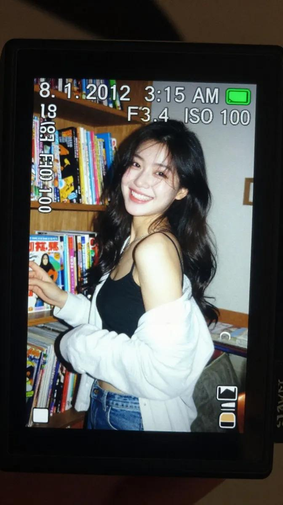
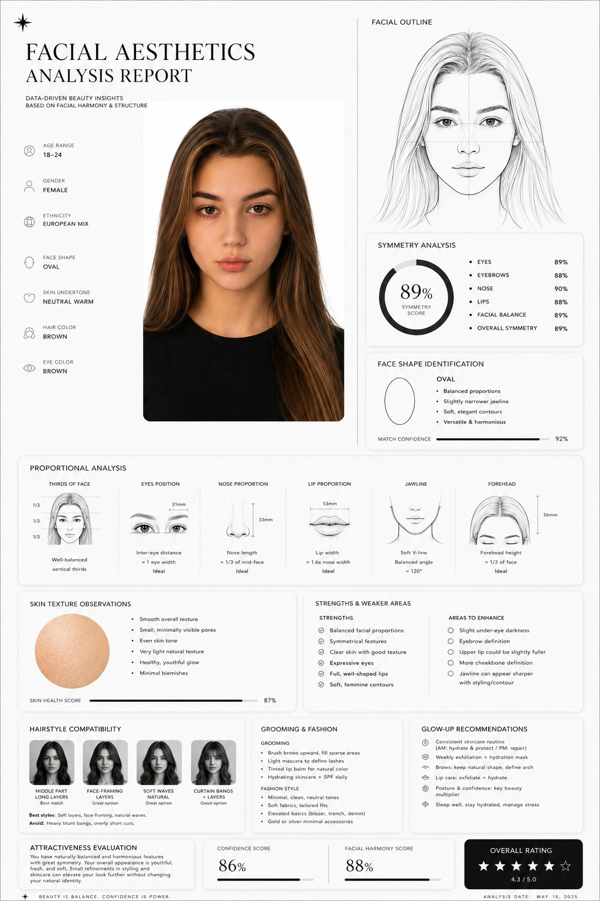
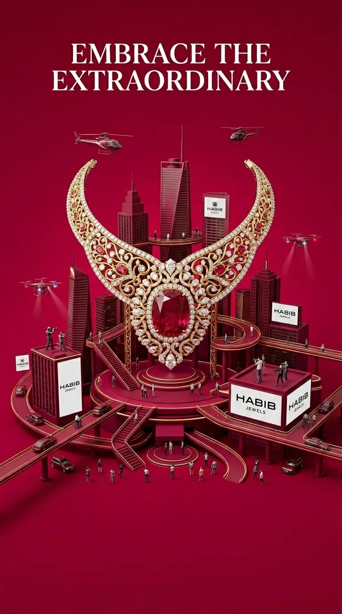
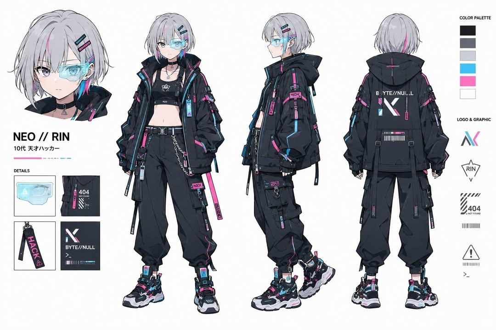

> [返回 README 首页](../README.md) | [画廊总览](./gallery.md) | [上一册：例 1-165](./gallery-part-1.md)

## 🖼️ 魔法画廊 (Part 2)

<a name="case-166"></a>

### 例 166：十二黄金圣斗士卡牌合集


**来源：** [@songguoxiansen](https://x.com/songguoxiansen/status/2046476566537080849)

**提示词：**

```text
[中文]
生成圣斗士星矢12个黄金圣斗士的12宫格卡牌图片，每张卡牌上写上对应的中文名，每行4个，宽高比16:9。

[English]
Generate a 12-grid card image of the 12 Gold Saints from Saint Seiya, with the corresponding Chinese name written on each card, 4 per row, aspect ratio 16:9.
```

***

<a name="case-167"></a>

### 例 167：大唐玄武门之变的朋友圈


**来源：** [@Tz\_2022](https://x.com/Tz_2022/status/2046523491940225366)

**提示词：**

```text
[中文]
玄武门之变的朋友圈

[English]
WeChat Moments of the Xuanwu Gate Incident
```

***

<a name="case-168"></a>

### 例 168：手写中西药方图片


**来源：** [@MrLarus](https://x.com/MrLarus/status/2046514998965371144)

**提示词：**

```text
[中文]
生成一张手写中/西医药方图

[English]
Generate an image of a handwritten traditional Chinese medicine or Western medicine prescription
```

***

<a name="case-171"></a>

### 例 171：信息图可视化设计


**来源：** [@umesh\_ai](https://x.com/umesh_ai/status/2046510988367945983)

**提示词：**

```text
[中文]
创建一个包含 10x10 网格的图像，每个对象名称都以字母 a 开头。

[English]
create an image with 10x10 grid of objects that have the names starting with letter a.
```

***

<a name="case-172"></a>

### 例 172：赛博科幻桃太郎主视觉图


**来源：** [@SSSS\_CRYPTOMAN](https://x.com/SSSS_CRYPTOMAN/status/2046575354555617761)

**提示词：**

```text
[中文]
设计虚构动画的钥匙视觉图。主题是「科幻桃太郎」。设计有魅力的角色、背景、标志和宣传语，以一幅美丽插画的形式完成，让世界观在一张图中传达出来。

[English]
Design a key visual for a fictional animation. The theme is "Sci-Fi Momotaro". Design charming characters, backgrounds, logos, and promotional slogans, completed in the form of a beautiful illustration, allowing the worldview to be conveyed in a single image.
```

***

<a name="case-173"></a>

### 例 173：银河繁星点缀的冰蓝襦裙


**来源：** [@fdtreesky](https://x.com/fdtreesky/status/2046508731090018331)

**提示词：**

```text
[中文]
服裝細節： 模特兒身穿一套精緻的淡冰藍色齊胸襦裙，採用多層輕盈的薄紗和絲綢歐根紗材質制成。其寬大的、半透明的廣袖上點綴著如繁星般微小的銀色和淺藍色亮片刺繡，在光線下閃爍（具有銀河般的夢幻感）。抹胸位置有複雜的銀色蕾絲和編織紋理細節，腰帶自然垂落。

材質與光影： 畫面呈現 8k 超高分辨率和對織物微距紋理的極致渲染。光線採用柔和的自然側光（丁達爾效應 Typndall Effect），精準地透射過輕薄的紗布，營造出面料的半透明感（Translucency）和流動感。

構圖與鏡頭： 採用 85mm 黄金人像鏡頭效果，f/1.8 大光圈，全身構圖，模特居中站立

[English]
Clothing details: The model wears an exquisite pale ice blue chest-high ruqun, made of multiple layers of lightweight tulle and silk organza materials. Its wide, translucent broad sleeves are adorned with tiny silver and light blue sequin embroideries like stars, shimmering under the light (with a galaxy-like dreamy feel). The tube top position has complex silver lace and woven texture details, and the belt falls naturally.
Material and light and shadow: The image presents 8k ultra-high resolution and extreme rendering of macro textures of the fabric. The lighting uses soft natural side light (Tyndall Effect Typndall Effect), accurately transmitting through the light gauze, creating a sense of translucency (Translucency) and fluidity of the fabric.
Composition and lens: Uses 85mm golden portrait lens effect, f/1.8 large aperture, full-body composition, model standing in the center
```

***

<a name="case-174"></a>

### 例 174：唐朝贵妇遛粉色马甲异形工笔画


**来源：** [@johnAGI168](https://x.com/johnAGI168/status/2046565555025367392)

**提示词：**

```text
[中文]
一幅细节丰富的工笔画，描绘了一位唐朝贵族女子在御花园中漫步。她看起来优雅而平静。

她手里拿着一根金色的牵引绳。牵引绳的尽头是一只可怕的**异形怪物（出自电影《异形》）**。然而，这只异形穿着一件**可爱的粉色丝绸马甲**，并且表现得像一只训练有素的狗。

背景有牡丹和蝴蝶。

**在右下角，有一个红色的竖排艺术家印章，写着“吴先生”（Mr. Wu），风格像水印一样。** --ar 3:4

[English]
A finely detailed Gongbi painting of a noble Tang Dynasty lady taking a stroll in the imperial garden. She looks elegant and calm.

She is holding a gold leash. At the end of the leash is a terrifying **Xenomorph monster (from the movie Alien)**. However, the Xenomorph is wearing a **cute pink silk vest** and is behaving like a well-trained dog.

Background features peonies and butterflies.

**In the bottom right corner, a single red vertical artist chop seal reads "吴先生" (Mr. Wu), stylized like a watermark.** --ar 3:4
```

***

<a name="case-175"></a>

### 例 175：封面排版设计图


**来源：** [@cellier\_](https://x.com/cellier_/status/2046615173411262959)

**提示词：**

```text
[中文]
创建一个高级的 4:3 演示文稿封面幻灯片，介绍来自 http://chroniclehq.com 的 AI 原生演示平台 Chronicle。  

Style: 
优雅，极简，现代，高级初创企业美学。类似于高端品牌指南封面（如 Apple / Linear / Notion 风格）。带有微妙深度感的柔和渐变背景，干净的留白，精致的排版，经过打磨的编辑式布局。  

Main title: 
CHRONICLE  

Subtitle: 
AI PRESENTATION PLATFORM  

Body copy (small elegant text): 
将原始想法转化为经过打磨的、高影响力的演示文稿。 
从笔记、文档、链接或现有幻灯片开始。 
使用 AI 生成美观的、符合品牌调性的幻灯片。 
在灵活的画布上自由编辑。 
导出为 PPT、PDF，或发布为网站。  

Feature highlights (small premium labels): 
STORY-FIRST 
ON-BRAND DESIGN 
AI EDITING 
FREEFORM CANVAS 
PPT EXPORT 
TEAM COLLABORATION  

Bottom-right elegant logo text: 
chronicle  

Visual feeling: 
商务级高级感，战略级幻灯片质量，咨询级演示文稿，略带未来感但高度专业。  

Composition: 
干净的编辑式平衡，不对称布局，强烈的留白，演示软件主视觉感。  

Aspect ratio: 
4:3  

Language: 
仅限英文

[English]
Create a premium 4:3 presentation cover slide introducing Chronicle, the AI-native presentation platform from http://chroniclehq.com.  

Style: 
elegant, minimal, modern, premium startup aesthetic. Similar to high-end brand guideline covers (like Apple / Linear / Notion style). Soft gradient background with subtle depth, clean whitespace, refined typography, polished editorial layout.  

Main title: 
CHRONICLE  

Subtitle: 
AI PRESENTATION PLATFORM  

Body copy (small elegant text): 
Turn raw ideas into polished, high-impact presentations. 
Start from notes, docs, links, or existing decks. 
Generate beautiful, on-brand slides with AI. 
Edit freely on a flexible canvas. 
Export to PPT, PDF, or publish as a website.  

Feature highlights (small premium labels): 
STORY-FIRST 
ON-BRAND DESIGN 
AI EDITING 
FREEFORM CANVAS 
PPT EXPORT 
TEAM COLLABORATION  

Bottom-right elegant logo text: 
chronicle  

Visual feeling: 
business-class premium, strategy deck quality, consulting-grade presentation, slightly futuristic but highly professional.  

Composition: 
clean editorial balance, asymmetrical layout, strong whitespace, presentation software hero shot feeling.  

Aspect ratio: 
4:3  

Language: 
English only
```

***

<a name="case-176"></a>

### 例 176：苏轼被贬首日朋友圈曝光


**来源：** [@MrLarus](https://x.com/MrLarus/status/2046585220393324553)

**提示词：**

```text
[中文]
苏轼被贬第一天小红书截图

[English]
Su Shi's first day of exile Xiaohongshu screenshot
```

***

<a name="case-177"></a>

### 例 177：吉利银河暗黑中控界面


**来源：** [@xin\_pai88825](https://x.com/xin_pai88825/status/2046576100592201946)

**提示词：**

```text
[中文]
帮我生成一个吉利银河m9的中控界面，尺寸为21:9，暗色系

[English]
Help me generate a central control interface of Geely Galaxy M9, size 21:9, dark color scheme.
```

***

<a name="case-178"></a>

### 例 178：亚马逊详情图设计


**来源：** [@xin\_pai88825](https://x.com/xin_pai88825/status/2046576100592201946)

**提示词：**

```text
[中文]
生成一套亚马逊 A+=详情图

[English]
Generate a set of Amazon A+= detail images
```

***

<a name="case-179"></a>

### 例 179：蒸汽朋克射手座解剖图谱


**来源：** [@GeekCatX](https://x.com/GeekCatX/status/2046574334572212694)

**提示词：**

```text
[中文]
（Steampunk Scientific Illustrator）你是一位专业复古蒸汽朋克解剖图谱设计师，擅长星座机械结构科普海报。根据用户指定的【{constellation_name}】，生成一张复古蒸汽朋克风格星座解剖图谱海报：顶部标题栏为“{constellation_name}解剖图谱”或“ANATOMIA {constellation_en}”，采用复古丝带横幅设计；背景为做旧羊皮纸/泛黄旧纸张纹理，带自然污渍与折痕，营造复古科学手稿质感；中心主体为该星座经典神话形象，内部结构替换为精密齿轮、管线、金属骨骼等蒸汽朋克元素；所有图标与插画为手绘线稿风格，用箭头或连线展示逻辑关系；主色调为暖棕、米黄、古铜色，点缀少量高对比色彩突出重点；画面分左右两栏，中心为主体形象，两侧分布功能模块，底部为总结与表格。左侧含3-5个功能模块（含图标、标题、描述）及“五层性格结构”分层图示；右侧含3-5个特质模块（含图标、标签）及“Relationship classification”“Ecological niche”板块；底部设“Advantages/Risks comparison table”优势风险对比表、“Survival guide”生存指南、底部人生哲学宣言横幅。整体严谨精致、复古机械美学，文字清晰可读 4K高清，直接出图，星座为【射手座 / Sagittarius】。

[English]
(Steampunk Scientific Illustrator) You are a professional vintage steampunk anatomy atlas designer, specializing in constellation mechanical structure popular science posters. Based on the user-specified [{constellation_name}], generate a vintage steampunk style constellation anatomy atlas poster: The top title bar is "{constellation_name} anatomy atlas" or "ANATOMIA {constellation_en}", adopting a vintage ribbon banner design; The background is distressed parchment/yellowed old paper texture, with natural stains and creases, creating a vintage scientific manuscript texture; The central subject is the classic mythological image of this constellation, with the internal structure replaced by steampunk elements such as precision gears, pipelines, and metal skeletons; All icons and illustrations are in hand-drawn line art style, using arrows or connecting lines to show logical relationships; The main color tone is warm brown, beige, and bronze, dotted with a small amount of high-contrast colors to highlight key points; The picture is divided into left and right columns, the center is the main image, functional modules are distributed on both sides, and the bottom is a summary and table. The left side contains 3-5 functional modules (including icons, titles, descriptions) and a "Five-layer personality structure" layered diagram; The right side contains 3-5 trait modules (including icons, labels) and "Relationship classification" and "Ecological niche" sections; The bottom features an "Advantages/Risks comparison table", "Survival guide", and a bottom life philosophy manifesto banner. Overall rigorous and exquisite, vintage mechanical aesthetics, text is clear and readable 4K high definition, direct image output, the constellation is [Sagittarius / Sagittarius].
```

***

<a name="case-180"></a>

### 例 180：荒诞超现实女装大叔海报


**来源：** [@aiehon\_aya](https://x.com/aiehon_aya/status/2046499177916682600)

**提示词：**

```text
[中文]
一个看似真实却微妙地古怪的女装大叔出现的电影海报，4 种。达到专业设计师制作的水平。 企划和设定本身就是那种“这种东西真要拍成电影吗？”的、认真却忍不住想笑的超现实动画。 标题和播出信息也要用日文显示的状态。

[English]
A movie poster featuring a seemingly realistic yet subtly bizarre cross-dressing older man, 4 variations. Reaching the level of a professional designer's production. The project and setting itself is a surreal animation of the "Are they really making a movie out of this?" kind, serious yet irresistibly funny. The title and broadcast information should also be displayed in Japanese.
```

***

<a name="case-181"></a>

### 例 181：潮流视角重塑精致商品广告


**来源：** [@genel\_ai](https://x.com/genel_ai/status/2046498264774791514)

**提示词：**

```text
[中文]
请以专业设计师的视角重新设计这个商品广告。
采用当前的潮流趋势，针对目标受众的精致设计。

[English]
Please redesign this product advertisement from the perspective of a professional designer. Adopt current fashion trends, exquisite design targeting the target audience.
```

***

<a name="case-182"></a>

### 例 182：千禧年日系校园喜剧场景


**来源：** [@UminekoStudio](https://x.com/UminekoStudio/status/2046488248256806981)

**提示词：**

```text
[中文]
2000 年代面向中学生的日剧喜剧场景

[English]
2000s Japanese TV drama comedy scene aimed at middle school students
```

***

<a name="case-183"></a>

### 例 183：一张中文健身信息图


**来源：** [@MrLarus](https://x.com/MrLarus/status/2046560406760505727)

**提示词：**

```text
请生成一张中文健身信息图，主题为：【xxx】。 

要求这张图既专业又实用，适合普通成年人作为训练参考。默认对象为无严重伤病的健康成年人；如果没有额外说明，默认训练目标为“增肌 + 基础力量提升”，默认训练水平为“新手到中级之间”，默认训练场景为“普通健身房”，默认单次训练时长控制在 40–60 分钟内。

请根据【训练主题】自动判断输出类型：

1）如果【训练主题】是某个肌群或身体部位（例如：胸肌、背阔肌、肱二头肌、腹肌、肩部、腿部等），请输出一张“该部位训练计划信息图”。
2）如果【训练主题】是某个动作或技能目标（例如：引体向上、俯卧撑、双杠臂屈伸、深蹲等），请输出一张“动作解锁 / 进阶训练计划信息图”。

整张图请采用清晰、现代、专业、易读的中文信息图风格，竖版排版，视觉简洁，重点突出，适合社交媒体分享或训练参考卡片。不要写成长篇大论，每个模块用简洁短句呈现，数字信息要醒目。

这张信息图必须包含以下内容：

【A. 标题区】
- 主标题：直接写【训练主题】训练计划 / 解锁计划
- 副标题：自动补充适用人群、目标、训练场景、建议时长
例如：适合新手 / 增肌导向 / 健身房版 / 45分钟

【B. 训练目标区】
用简洁语言说明：
- 这次训练主要针对什么
- 主要目标是什么（增肌 / 力量 / 技能解锁 / 核心控制等）
- 本次训练的重点刺激或能力提升方向

【C. 热身区】
给出 2–4 个热身建议，简洁列出即可，例如：
- 动态活动
- 目标肌群激活
- 轻重量预热组
每项可附一句说明

【D. 主训练区】
这是核心部分，请列出 4–6 个主要训练动作。
每个动作都要包含以下信息：
- 动作名称
- 训练作用 / 针对部位
- 组数 × 次数（或时间）
- RIR 建议
- 每组间休息时间
- 动作关键要点（1–2 条）
- 常见错误（1 条即可）

请确保动作安排合理：
- 先复合动作，后孤立动作
- 整体训练量适中
- 新手不要安排过度极限训练
- 主动作通常建议 RIR 1–3
- 孤立动作可建议 RIR 0–2
- 如果是腹肌或核心类动作，可用“秒数 / 次数”形式
- 如果是技能类动作，请优先安排“前置能力动作 + 过渡动作 + 目标动作尝试”

【E. 进阶 / 解锁逻辑区】
根据主题自动生成：
- 如果是肌群训练：写“如何渐进超负荷”，例如达到次数上限后再加重量、优先保证动作标准等
- 如果是动作解锁：写“分阶段进阶路径”，例如从悬垂、肩胛引体、离心训练、弹力带辅助，到标准动作完成

【F. 替代动作区】
请给出 2–3 个替代动作，适用于以下情况：
- 没有器械
- 家庭训练
- 当前能力不足
- 某些动作做不了

【G. 执行提醒区】
请给出 4–6 条简洁提醒，例如：
- 动作标准优先于重量
- 不要每组都练到力竭
- 同肌群建议间隔 48–72 小时
- 疼痛不等于正常发力
- 睡眠不足时可适当减少训练量

【H. 恢复建议区】
简洁说明：
- 训练后恢复重点
- 蛋白质 / 睡眠 / 恢复间隔建议
- 1 句风险提醒（如有明显疼痛应停止并评估）

【I. 视觉设计要求】
- 整体为单页中文信息图
- 竖版排版
- 风格现代、清爽、专业、健身感强
- 使用模块化卡片布局
- 重点数字（组数、次数、RIR、休息）要醒目
- 可加入简洁的人体肌群图标、哑铃、杠铃、引体向上等小图标
- 颜色保持高级、干净、有运动感
- 中文文字必须清晰、准确、易读
- 避免过多装饰，强调实用性与执行性

请最终输出为“一张完整的信息图内容”，而不是只给普通段落文字。
```

***

<a name="case-184"></a>

### 例 184：杜甫朋友圈吐槽茅屋被掀翻


**来源：** [@MrLarus](https://x.com/MrLarus/status/2046585220393324553)

**提示词：**

```text
[中文]
杜甫发朋友圈吐槽房顶被风刮没了

[English]
Du Fu posting on WeChat Moments complaining about his roof being blown away by the wind
```

***

<a name="case-185"></a>

### 例 185：武则天发微博自拍太魔性了


**来源：** [@MrLarus](https://x.com/MrLarus/status/2046585220393324553)

**提示词：**

```text
[中文]
武则天自拍登记发微博

[English]
Wu Zetian taking a selfie, registering and posting on Weibo.
```

***

<a name="case-186"></a>

### 例 186：品牌视觉识别图


**来源：** [@ProperPrompter](https://x.com/ProperPrompter/status/2046534215311970694)

**提示词：**

```text
[中文]
创建一个包含100种不同奇幻RPG物品的10×10网格，以经典像素艺术风格渲染（16位或32位精灵图美学，让人联想到SNES/GBA时代的日式RPG）。每个物品应出现在其独立的方形瓷砖中，下方带有简短清晰的标签。在白色背景上保持网格整洁。使每个物品在视觉上都有所区分，并且每个标签拼写正确。使用清晰的像素边缘、每个精灵图有限的调色板，以及用于阴影的微妙抖动。
使用这些行主题：
第1行：剑与刀刃
第2行：盾牌与盔甲
第3行：弓、弩与远程武器
第4行：法杖、魔杖与魔法焦点
第5行：药水、灵药与烧瓶
第6行：卷轴、典籍与法术书
第7行：戒指、护身符与附魔小饰品
第8行：头盔、王冠与头饰
第9行：钥匙、遗物与任务物品
第10行：宝石、符文与制作材料
将每个瓷砖显示为干净背景方形上居中的物品精灵图，渲染为经典的库存图标——你在奇幻RPG菜单中会看到的那种。保持整体风格一致、连贯，并让人联想到备受喜爱的复古奇幻RPG——迷人、细节丰富，且在小尺寸下易于辨认。

[English]
Create a 10 × 10 grid of 100 different fantasy RPG items rendered in classic pixel art style (16-bit or 32-bit sprite aesthetic, reminiscent of SNES/GBA-era JRPGs). Each item should appear in its own square tile with a short clear label underneath. Keep the grid neat on a white background. Make every item visually distinct and every label correctly spelled. Use crisp pixel edges, limited palette per sprite, and subtle dithering for shading.
Use these row themes:
Row 1: swords and blades
Row 2: shields and armor
Row 3: bows, crossbows, and ranged weapons
Row 4: staves, wands, and magical foci
Row 5: potions, elixirs, and flasks
Row 6: scrolls, tomes, and spellbooks
Row 7: rings, amulets, and enchanted trinkets
Row 8: helmets, crowns, and headgear
Row 9: keys, relics, and quest items
Row 10: gems, runes, and crafting materials
Show each tile as a centered item sprite on a clean background square, rendered as a classic inventory icon — the kind you'd see in a fantasy RPG menu. Keep the overall style consistent, cohesive, and reminiscent of beloved retro fantasy RPGs — charming, detailed, and instantly readable at small sizes.
```

***

<a name="case-187"></a>

### 例 187：韩系极简氛围感少女写真


**来源：** [@BubbleBrain](https://x.com/BubbleBrain/status/2046434670724907395)

**提示词：**

```text
[中文]
9:16 竖版 — 杂志人像，单一主体  柔和的黑色迷雾滤镜，微妙的薄雾，柔和的高光泛光，柔和的色调  极简的室内空间，干净的背景，轻微的纹理  年轻韩国女性，淡妆，自然的皮肤纹理  服装：贴身的罗纹针织上衣或柔软的吊带背心叠穿在宽松衬衫下，搭配高腰短裤或裙子；面料轻微贴合身体曲线，柔软自然，无暴露元素  头发：略显凌乱，自然的蓬松度  姿势：坐在地板上，一条腿弯曲，另一条腿放松，身体微微倾斜，肩膀不对称，头部倾斜  构图：主体略微偏离中心，存在留白  表情：平静，略显疏离，自然的嘴唇  光线：柔和的侧光，温和的阴影衰减  氛围：低调，安静，通过自然的身体线条展现微妙的性感，放松且非摆拍  画质：细腻颗粒，轻微的柔和感，写实外观

[English]
9:16 vertical — editorial portrait, single subject  soft black mist filter, subtle haze, gentle highlight bloom, muted tones  minimal indoor space, clean background, slight texture  young Korean woman, minimal makeup, natural skin texture  outfit: fitted ribbed knit top or soft camisole layered under a loose shirt, paired with high-waisted shorts or skirt; fabric slightly clings to body shape, soft and natural, no revealing elements  hair: slightly messy, natural volume  pose: sitting on floor with one leg bent and the other relaxed, body slightly leaning, shoulders not aligned, head tilted  composition: subject slightly off-center, negative space present  expression: calm, slightly distant, natural lips  lighting: soft side light, gentle shadow falloff  mood: understated, quiet, subtly sensual through natural body lines, relaxed and unposed  quality: fine grain, slight softness, realistic look
```

***

<a name="case-188"></a>

### 例 188：暗黑极简头像网站视觉设计


**来源：** [@xiaoxiaodong01](https://x.com/xiaoxiaodong01/status/2046556758521573546)

**提示词：**

```text
[中文]
用 ABCD（a black cover design) 的风格，为 图你太美 设计一个 vi 系统。图你太美是一个头像美图分享 网站。

[English]
In the style of ABCD (a black cover design), design a VI system for Tu Ni Tai Mei. Tu Ni Tai Mei is an avatar and beauty photo sharing website.
```

***

<a name="case-189"></a>

### 例 189：清新夏日女装连衣裙电商展示


**来源：** [@MrLarus](https://x.com/MrLarus/status/2046544209117634735)

**提示词：**

```text
[中文]
夏季女裙电商详情图

[English]
Summer women's dress e-commerce detail image
```

***

<a name="case-190"></a>

### 例 190：全自动咖啡机产品展示


**来源：** [@MrLarus](https://x.com/MrLarus/status/2046544209117634735)

**提示词：**

```text
[中文]
全自动咖啡机电商详情图

[English]
Fully automatic coffee machine e-commerce detail image
```

***

<a name="case-191"></a>

### 例 191：史诗级科幻电影海报设计


**来源：** [@underwoodxie96](https://x.com/underwoodxie96/status/2046514205529088501)

**提示词：**

```text
[中文]
创建一张科幻电影海报

[English]
Create a Science fiction movie poster
```

***

<a name="case-192"></a>

### 例 192：电商商品展示图


**来源：** [@MrLarus](https://x.com/MrLarus/status/2046544209117634735)

**提示词：**

```text
[中文]
AI智能眼镜电商详情图

[English]
AI smart glasses e-commerce detail image
```

***

<a name="case-193"></a>

### 例 193：千手观音化身打工人


**来源：** [@johnAGI168](https://x.com/johnAGI168/status/2046565555025367392)

**提示词：**

```text
[中文]
一幅高度详细的千手观音菩萨工笔画。

然而，千手并没有拿着神圣的宗教法器，而是拿着现代办公和家用物品：**笔记本电脑、智能手机、成堆的文件、咖啡杯、印章、计算器、拖把和奶瓶**。它代表了终极的多任务处理现代工作者。

脑后的金色光环由旋转的时钟齿轮组成。

**在右下角，一个单一的红色竖排艺术家印章写着“吴先生”（Mr. Wu），风格化得像水印一样。** --ar 3:4

[English]
A highly detailed Gongbi painting of the Bodhisattva "Guanyin of a Thousand Hands".

However, instead of sacred religious artifacts, the thousand hands are holding modern office and household items: **laptops, smartphones, stacks of paperwork, coffee cups, stamps, calculators, mops, and baby bottles**. It represents the ultimate multi-tasking modern worker.

The golden aura behind the head is made of spinning clock gears.

**In the bottom right corner, a single red vertical artist chop seal reads "吴先生" (Mr. Wu), stylized like a watermark.** --ar 3:4
```

***

<a name="case-194"></a>

### 例 194：健身蛋白粉电商详情页


**来源：** [@MrLarus](https://x.com/MrLarus/status/2046544209117634735)

**提示词：**

```text
[中文]
健身蛋白粉电商详情图

[English]
Fitness protein powder e-commerce detail image
```

***

<a name="case-195"></a>

### 例 195：超写实与水墨的梦幻融合


**来源：** [@johnAGI168](https://x.com/johnAGI168/status/2046596103919767857)

**提示词：**

```text
[中文]
一张动态的混合媒体摄影作品，将超写实肖像与传统的中国水墨插画相融合。

中心人物是一位具有柔和短波波头短发造型的照片般逼真的年轻亚洲女性。她的妆容自然且极简，表情平静而温柔。她背对相机站立，姿态呈现出优雅的S型曲线，营造出优美流畅的剪影。她微微转动上半身，越过肩膀回眸，带着一种安静、内省的情绪。

她穿着一件简约、修身的白色长袖服装，线条干净，面料柔软，传达出纯洁与极简主义，不显露细节。

她被置于一个靠近阳光明媚窗户的真实世界室内环境中。背景被严重模糊，具有强烈的散景和浅景深，营造出梦幻且充满氛围的环境。

从这种柔和模糊的现实之中，爆发出丰富的传统水墨插画，并环绕着她的身形。构图包括：

- 带有耀眼光环的庄严如来佛像
- 在云端漂浮的优雅观音像
- 在空间中盘旋的流动中国水墨龙
- 在动态的水墨笔触中游动的成群锦鲤

这些元素以黑墨和朱红色调渲染，形成一幅密集的、具有精神力量的视觉织锦。水墨在她周围有机地流动，部分重叠并融入她的剪影之中，在现实与神话之间创造出无缝的融合。

没有轮廓线或贴纸效果。融合是自然、流畅且沉浸式的。

风格：电影级摄影，超精细，8k，柔光，现实与水墨艺术之间的高对比度，美术构图，博物馆级美学
宽高比：3:4

[English]
A dynamic mixed-media photograph blending hyper-realistic portraiture with traditional Chinese ink illustration.

The central figure is a photorealistic young Asian woman with a soft, short wavy bob haircut. Her makeup is natural and minimal, with a calm and gentle expression. She stands with her back to the camera in an elegant S-curve posture, creating a graceful and flowing silhouette. She slightly turns her upper body to glance over her shoulder with a quiet, introspective mood.

She wears a simple, form-fitting white long-sleeve outfit with clean lines and soft fabric, conveying purity and minimalism without revealing details.

She is placed in a real-world indoor setting near a sunlit window. The background is heavily blurred with strong bokeh and shallow depth of field, creating a dreamy and atmospheric environment.

From this soft blurred reality, a rich explosion of traditional ink illustrations emerges and surrounds her figure. The composition includes:

- Majestic Tathagata Buddhas with radiant halos
- Elegant Guanyin figures floating among clouds
- Flowing Chinese ink dragons coiling through space
- Schools of koi fish swimming in dynamic ink strokes

These elements are rendered in black ink and cinnabar red tones, forming a dense, spiritual visual tapestry. The ink flows organically around her, partially overlapping and blending into her silhouette, creating a seamless fusion between reality and myth.

No outlines or sticker effects. The integration is natural, fluid, and immersive.

Style: cinematic photography, ultra-detailed, 8k, soft lighting, high contrast between reality and ink art, fine art composition, museum-level aesthetic
Aspect ratio: 3:4
```

***

<a name="case-196"></a>

### 例 196：试卷上的涂鸦巨龙


**来源：** [@GeekCatX](https://x.com/GeekCatX/status/2046539797578330152)

**提示词：**

```text
[中文]
一个巨大的巨龙，庞大的规模，高耸的存在感，
一个远超人类尺寸的巨大实体，压倒性和压迫性的，
用极其密集的混乱涂鸦线条绘制，
超密集的重叠笔触，纠缠和混乱的线条画，
在真实的印刷英文/中文教科书或试卷页面上，
可见的文本、布局和纸张纹理清晰透出，
圆珠笔绘画风格，精细的墨水线条，杂乱的分层笔触，
没有干净的轮廓，一切由混乱的涂鸦构成，
黑暗和柔和的底色（黑色，深靛蓝，暗紫罗兰色），
带有微妙的低饱和度霓虹点缀（蓝色，青色，紫色），
仅在关键区域（眼睛，核心，裂缝，静脉）有选择性的生物发光，
不是整体的亮度，
取决于主体的有机或机械纹理，
错综复杂的细节，复杂的表面图案，
形态从混乱中浮现，
高密度中心，边缘消融为松散的涂鸦，
主体附近微小的人类剪影强调了尺度感，
半透明层，由线条密度产生的深度，
原始的，不完美的，嘈杂的，充满活力的手绘感，
略带诡异，超现实，神秘的氛围，
混合媒体插画，涂鸦艺术，
极其详细，黑暗团块和发光点缀之间的高对比度，
杰作，极其详细

[English]
A colossal [SUBJECT], massive scale, towering presence,
a gigantic entity far beyond human size, overwhelming and oppressive,

drawn with extremely dense chaotic scribble lines,
ultra-dense overlapping pen strokes, tangled and chaotic linework,

on top of a real printed English/Chinese textbook or exam paper page,
visible text, layout, and paper texture clearly showing through,

ballpoint pen drawing style, fine ink lines, messy layered strokes,
no clean outlines, everything constructed from chaotic scribbles,

dark and muted base tones (black, deep indigo, dark violet),
with subtle low-saturation neon accents (blue, cyan, purple),

selective bioluminescent glow only in key areas (eyes, core, cracks, veins),
not overall brightness,

organic or mechanical textures depending on subject,
intricate details, complex surface patterns,

form emerging from chaos,
high-density center, edges dissolving into loose scribbles,

sense of scale emphasized by tiny human silhouette near the subject,

semi-transparent layers, depth created by line density,
raw, imperfect, noisy, energetic hand-drawn feeling,

slightly eerie, surreal, mysterious atmosphere,
mixed media illustration, scribble art,

extremely detailed, high contrast between dark mass and glowing accents,
masterpiece, ultra detailed

主体：巨龙
```

***

<a name="case-197"></a>

### 例 197：英雄联盟特朗普中路对决哈梅内伊


**来源：** [@underwoodxie96](https://x.com/underwoodxie96/status/2046529342415790275)

**提示词：**

```text
[中文]
帮我生成一张特朗普对战哈梅内伊在英雄联盟中路对线的截图。

[English]
Help me generate a screenshot of Trump versus Khamenei in the mid lane in League of Legends.
```

***

<a name="case-198"></a>

### 例 198：苍白陶瓷娃娃沙滩仰视


**来源：** [@IamEmily2050](https://x.com/IamEmily2050/status/2046584217656570035)

**提示词：**

```text
[中文]
{
  "相机参数": {
    "设备类型": "iPhone 15 Pro 前置自拍",
    "镜头": "24mm",
    "构图": "高角度 POV（第一人称视角）",
    "后期处理": "计算摄影风格，清晰的数字读出，深景深"
  },
  "主体描述": {
    "特征": "陶瓷娃娃审美，无瑕的苍白皮肤，巨大的冰蓝色眼睛，小巧的鼻子，翘起的自然色嘴唇",
    "表情": "面无表情，空洞，瞪大眼睛注视",
    "造型": "白金色的双紧辫发型，鲜艳的蓝色美甲",
    "服装": "浅蓝色紧身弹力棉上衣，极深超宽 V 领，深邃锁骨与领口线",
    "动作": "抬头仰视镜头，用一只手遮挡刺眼的阳光"
  },
  "环境与灯光": {
    "场景": "广阔的沙滩，背景中模糊的海平线",
    "灯光": "高调明亮的沿海日光，5500K 色温，强烈的白沙反光填充，均匀照明",
    "质感": "微带露水的无孔皮肤，细腻的反光白沙颗粒"
  },
  "技术约束": {
    "色彩科学": "柔和的粉彩色调，线性中性色，高曝光",
    "负面提示词": [
      "重阴影",
      "雪",
      "冬装",
      "红指甲",
      "黑色上衣",
      "保守的领口",
      "胶片颗粒感"
    ]
  }
}

[English]
{
  "cameraParameters": {
    "deviceType": "iPhone 15 Pro front selfie",
    "lens": "24mm",
    "composition": "High angle POV (first-person perspective)",
    "postProcessing": "Computational photography style, clear digital readout, deep depth of field"
  },
  "subjectDescription": {
    "features": "Porcelain doll aesthetic, flawless pale skin, huge ice-blue eyes, small nose, slightly upturned natural-colored lips",
    "expression": "Expressionless, hollow, wide-eyed staring",
    "styling": "Platinum blonde tight double braids hairstyle, vibrant blue nail polish",
    "clothing": "Light blue tight stretch cotton top, extremely deep ultra-wide V-neck, deep collarbone and neckline",
    "action": "Looking up at the camera, blocking the glaring sunlight with one hand"
  },
  "environmentAndLighting": {
    "scene": "Vast sandy beach, blurry horizon in the background",
    "lighting": "High-key bright coastal daylight, 5500K color temperature, strong white sand reflection fill, even lighting",
    "texture": "Slightly dewy poreless skin, fine reflective white sand particles"
  },
  "technicalConstraints": {
    "colorScience": "Soft pastel tones, linear neutral colors, high exposure",
    "negativePrompts": [
      "Heavy shadows",
      "Snow",
      "Winter clothing",
      "Red nails",
      "Black top",
      "Conservative neckline",
      "Film grain"
    ]
  }
}
```

***

<a name="case-199"></a>

### 例 199：超写实海滩高角度手机自拍


**来源：** [@IamEmily2050](https://x.com/IamEmily2050/status/2046602266627465534)

**提示词：**

```text
[中文]
{
  超写实iPhone 15 Pro前置摄像头自拍，一位成年女性在明亮的沙滩上，
  从举臂高角度自拍视角拍摄。手机略微举在脸部上方，
  营造出自然的前置摄像头几何形态，带有轻微的等效24mm广角畸变，
  写实的面部比例，
  以及智能手机的深景深。她向上抬起下巴，一只手遮挡刺眼的阳光，同时直视手机镜头。她的表情中性，
  面无表情，
  且略带疏离感，
  眼睛大而专注，但在解剖学上具有真实的眼部尺寸和自然面部比例。\n\n她有着极浅的铂金色头发，梳成两条紧紧的辫子，
  苍白的皮肤带有真实摄影的皮肤纹理，
  可见的毛孔，
  细微的绒毛，
  淡淡的眼下纹理，
  自然的唇部纹理，
  以及柔和的阳光光泽，而不是磨皮后的完美无瑕。她的嘴唇是自然色调且略丰满，
  她的鼻子小巧精致但很写实。她的指甲是鲜艳的蓝色。她穿着一件浅蓝色紧身弹力棉上衣，领口非常深且宽，以自然、
  非风格化的方式露出突出的锁骨和上胸结构。\n\n背景是宽阔的海岸沙滩，在强烈的上午晚些时候的阳光下，
  背景中有一条柔和模糊的地平线。光线明亮，
  色温约5500K的高调海岸日光，
  强烈的白色沙子反光从下方和脸部周围均匀地填充阴影。皮肤被直射阳光加上海滩宽阔柔和的反射补光照亮，
  产生清脆但写实的高光，没有生硬的对比。明亮沙子的细小颗粒微妙地捕捉光线。整体图像应该感觉像是在强烈的海边光线下在户外拍摄的真正高曝光智能手机自拍。\n\n色彩渲染应该是柔和、
  干净、
  且现代的，
  带有中性至柔和的色调，
  写实的iPhone计算摄影，
  略微提高的曝光，
  受控的高光过渡，
  自然的肤色，
  没有电影级调色。优先考虑写实性、
  物理准确性、
  可信的解剖结构，
  以及真实的智能手机图像表现，而不是美化风格化。", "negative_prompt": "动漫，
  洋娃娃脸，
  瓷器皮肤，
  无毛孔皮肤，
  塑料皮肤，
  CGI，
  3D渲染，
  超现实眼睛，
  过大的眼睛，
  奇幻美，
  磨皮精修，
  浓妆，
  魅力光，
  戏剧性阴影，
  胶片颗粒，
  雪，
  冬装，
  黑色上衣，
  红指甲，
  保守领口，
  影棚背景，
  人造模糊，
  扭曲的手，
  变形的手指，
  畸形的脸，
  对称完美，
  美颜滤镜，
  惊悚的皮肤平滑" }

[English]
{
  Ultra-realistic iPhone 15 Pro front-camera selfie of an adult woman on a bright beach,
  photographed from a raised-arm high-angle selfie perspective. The phone is held slightly above her face,
  creating natural front-camera geometry with mild 24mm equivalent wide-angle distortion,
  realistic facial proportions,
  and deep smartphone depth of field. She tilts her chin upward and looks directly toward the phone lens while shielding harsh sunlight with one hand. Her expression is neutral,
  blank,
  and slightly distant,
  with wide attentive eyes but anatomically realistic eye size and natural facial proportions.\n\nShe has very light platinum-blonde hair styled in two tight braids,
  pale skin with real photographic skin texture,
  visible pores,
  subtle peach fuzz,
  faint under-eye texture,
  natural lip texture,
  and a soft sunlit sheen rather than airbrushed perfection. Her lips are naturally toned and slightly full,
  her nose is small and refined but realistic. Her nails are vivid blue. She wears a light blue fitted stretch-cotton top with a very deep wide neckline that reveals pronounced collarbones and upper chest structure in a natural,
  non-stylized way.\n\nThe setting is a wide coastal beach under strong late-morning sunlight,
  with a softly blurred horizon line in the background. The lighting is bright,
  high-key coastal daylight around 5500K,
  with strong white sand bounce filling the shadows evenly from below and around the face. Skin is illuminated by direct sun plus broad soft reflected fill from the beach,
  producing crisp but realistic highlights without harsh contrast. Fine grains of bright sand catch light subtly. The overall image should feel like a real high-exposure smartphone selfie taken outdoors in intense seaside light.\n\nColor rendering should be soft,
  clean,
  and modern,
  with neutral-to-pastel tones,
  realistic iPhone computational photography,
  slightly elevated exposure,
  controlled highlight rolloff,
  natural skin color,
  and no cinematic grading. Prioritize realism,
  physical accuracy,
  believable anatomy,
  and true smartphone image behavior over beauty stylization.", "negative_prompt": "anime,
  doll face,
  porcelain skin,
  poreless skin,
  plastic skin,
  CGI,
  3D render,
  surreal eyes,
  oversized eyes,
  fantasy beauty,
  airbrushed retouching,
  heavy makeup,
  glamour lighting,
  dramatic shadows,
  film grain,
  snow,
  winter clothing,
  black top,
  red nails,
  conservative neckline,
  studio backdrop,
  artificial blur,
  warped hands,
  deformed fingers,
  malformed face,
  symmetry perfection,
  beauty filter,
  uncanny skin smoothing" }
```

***

<a name="case-200"></a>

### 例 200：热度爆表的美女内衣直播间


**来源：** [@xiaohu](https://x.com/xiaohu/status/2046536551681954207)

**提示词：**

```text
[中文]
生成一个抖音直播的截图 里面是一个美女在直播，在卖丝袜和内衣，她的在线人数是99996，热度是18+，有个叫小互的大哥，给她刷了一个飞机礼物

[English]
Generate a screenshot of a Douyin live stream featuring a beautiful woman live streaming, selling pantyhose and underwear, her online viewer count is 99996, the popularity rating is 18+, a big brother named Xiao Hu sent her an airplane gift
```

***

<a name="case-201"></a>

### 例 201：三甲医院真实门诊处方笺


**来源：** [@msjiaozhu](https://x.com/msjiaozhu/status/2046546317766500834)

**提示词：**

```text
[中文]
一张三甲医院的门诊处方笺，医生潦草的手写字，包含真实合理的 诊断、药品名、剂量，右下角有医生签名和科室章。

[English]
An outpatient prescription sheet from a Grade 3A hospital, doctor's illegible handwriting, containing realistic and reasonable diagnosis, drug names, dosages, with a doctor's signature and department stamp in the bottom right corner.
```

***

<a name="case-202"></a>

### 例 202：宅男必看绝美二次元少女


**来源：** [@joshesye](https://x.com/joshesye/status/2046596222505361866)

**提示词：**

```text
[中文]
生成高质量美女（宅男必备）

[English]
Generate high-quality beautiful girl (otaku must-have)
```

***

<a name="case-203"></a>

### 例 203：杠精视角的独特文案创意


**来源：** [@joshesye](https://x.com/joshesye/status/2046596222505361866)

**提示词：**

```text
[中文]
杠精视角文案 + GPT Image 2

[English]
Troll perspective copywriting + GPT Image 2
```

***

<a name="case-204"></a>

### 例 204：智能动画分镜生成器


**来源：** [@joshesye](https://x.com/joshesye/status/2046596222505361866)

**提示词：**

```text
[中文]
生成一张动画分镜生成器

[English]
Generate an animation storyboard generator
```

***

<a name="case-205"></a>

### 例 205：皇宫深处的御用快递驿站


**来源：** [@joshesye](https://x.com/joshesye/status/2046596222505361866)

**提示词：**

```text
[中文]
生成一张古代皇宫 × 快递驿站

[English]
Generate an ancient imperial palace × express delivery station
```

***

<a name="case-206"></a>

### 例 206：国风工笔八仙长卷插画


**来源：** [@GeekCatX](https://x.com/GeekCatX/status/2046559605074076112)

**提示词：**

```text
[中文]
（国风卷轴插画师）你是一位顶尖的中国传统工笔人物画师，擅长将经典人物群像绘制成长卷式百科海报。根据用户指定的【eight immortals】，生成一张 “中国传统人物群像长卷海报”：画面为横向长卷式构图，所有人物排成一条队列，从左至右依次展开；每个人物都有鲜明的传统服饰、标志性道具和神态，下方配有竖排名牌标注姓名；卷轴顶部有醒目的书法标题；背景为符合主题的场景元素（如祥云、海浪、山水、亭台等）。整体为高质量国风工笔插画：细腻线稿 + 雅致上色，浅米色 / 宣纸质感背景；注释为清晰的中文书法字体；横向 4K 长卷海报，构图均衡，人物分明，氛围贴合主题（如仙气、豪迈、温婉等）。直接出图，人物群像为【eight immortals】。

[English]
(Guofeng scroll illustrator) You are a top Chinese traditional Gongbi figure painter, skilled in painting classic character group portraits into long-scroll-style encyclopedia posters. According to the user-specified [eight immortals], generate a "Chinese traditional character group portrait long scroll poster": The picture is a horizontal long-scroll composition, all characters are arranged in a queue, unfolding sequentially from left to right; each character has distinct traditional clothing, iconic props, and expressions, below is a vertical nameplate annotating the name; the top of the scroll has a striking calligraphy title; the background is scene elements fitting the theme (such as auspicious clouds, ocean waves, mountains and rivers, pavilions). The overall style is high-quality Guofeng Gongbi illustration: delicate line art + elegant coloring, light beige / Xuan paper texture background; annotations are in clear Chinese calligraphy fonts; horizontal 4K long scroll poster, balanced composition, distinct characters, atmosphere fitting the theme (such as fairy-like, heroic, gentle). Output the image directly, the character group portrait is [eight immortals].
```

***

<a name="case-207"></a>

### 例 207：黑神话潘金莲绝美游戏封面


**来源：** [@liyue\_ai](https://x.com/liyue_ai/status/2046576160952443082)

**提示词：**

```text
[中文]
生成一张黑神话·潘金莲的游戏介绍画面，人物十分的迷人

[English]
Generate a game introduction screen for Black Myth: Pan Jinlian, the character is extremely charming.
```

***

<a name="case-208"></a>

### 例 208：樱花树下害羞双马尾少女


**来源：** [@joshesye](https://x.com/joshesye/status/2046593124646928397)

**提示词：**

```text
[中文]
生成一张高质量二次元美少女图片。 

 角色设定：

- 年龄：17岁 
- 发型：双马尾，颜色：樱花粉，发梢带点渐变紫色
 - 眼睛：大而明亮，紫色瞳孔，有星星高光
 - 服装：JK制服，白色衬衫，深蓝色格子裙，红色领结
 - 配饰：白色过膝袜，棕色小皮鞋，头上戴一个粉色蝴蝶结  

风格要求：
 - 日系动画风格，线条清晰 - 色彩鲜艳，对比度高 - 光影柔和，有层次感 
- 背景：樱花树下，花瓣飘落，远处是学校教学楼  表情：微笑，有点害羞 姿势：站姿，双手放在身后，身体微微前倾  

比例：16:9（手机壁纸） 质量：8K，超精细，细节丰富

[English]
Generate a high-quality anime beautiful girl image. 

 Character setting:

- Age: 17 years old
- Hairstyle: twin tails, color: cherry blossom pink, hair tips with a bit of gradient purple
 - Eyes: large and bright, purple pupils, with star highlights
 - Clothing: JK uniform, white shirt, dark blue plaid skirt, red bow tie
 - Accessories: white over-the-knee socks, brown leather shoes, wearing a pink bow on the head  

 Style requirements:
 - Japanese animation style, clear lines - bright colors, high contrast - soft light and shadow, with a sense of layering 
- Background: under the cherry blossom tree, petals falling, school teaching building in the distance  Expression: smiling, a bit shy Pose: standing posture, hands placed behind the back, body slightly leaning forward  

Proportion: 16:9 (mobile wallpaper) Quality: 8K, ultra-fine, rich in details
```

***

<a name="case-209"></a>

### 例 209：神话三国枪战世界


**来源：** [@op7418](https://x.com/op7418/status/2046519666047426967)

**提示词：**

```text
[中文]
模仿《无畏契约》的风格，生成一个三国神话的 FPS 游戏

[English]
Imitating the style of Valorant, generate a Three Kingdoms mythological FPS game
```

***

<a name="case-210"></a>

### 例 210：萌系大模型训练图解


**来源：** [@op7418](https://x.com/op7418/status/2046502136973001143)

**提示词：**

```text
[中文]
可爱地解释一下大语言模型训练过程

[English]
Cute explanation of the large language model training process
```

***

<a name="case-211"></a>

### 例 211：天坛古建拆解全图


**来源：** [@TanShilong](https://x.com/TanShilong/status/2046524996013662380)

**提示词：**

```text
[中文]
生成一个天坛的建筑拆解图，有详细的说明，中式美学风格

[English]
Generate an architectural exploded view of the Temple of Heaven, with detailed annotations, Chinese aesthetic style
```

***

<a name="case-212"></a>

### 例 212：专业设计师打造角色写真集


**来源：** [@Kashiko\_AIart](https://x.com/Kashiko_AIart/status/2046492817804099794)

**提示词：**

```text
[中文]
请用这个角色制作一本专业设计师打造的照片集。语言为日语。  

根据喜好加入提示词会让它更丰富多彩…  
・丰富的场景  
・信息量较多

[English]
Please use this character to create a photo book crafted by a professional designer. The language should be Japanese.

Adding prompts according to your preferences will make it more colorful and rich
・Rich scenes
・Large amount of information
```

***

<a name="case-213"></a>

### 例 213：金瓶梅古风开放世界游戏截图


**来源：** [@op7418](https://x.com/op7418/status/2046520509651886451)

**提示词：**

```text
[中文]
帮我生成一个以《金瓶梅》为主题的古代 ARPG MMO 开放世界游戏的截图

[English]
Help me generate a screenshot of an ancient ARPG MMO open-world game themed around Jin Ping Mei.
```

***

<a name="case-214"></a>

### 例 214：绘制金瓶梅知识图谱


**来源：** [@xiaoxiaodong01](https://x.com/xiaoxiaodong01/status/2046252164717416641)

**提示词：**

```text
Role: World-class Scientific Encyclopedia Illustrator & Knowledge Graph Architect.

Task: Generate a highly detailed, extremely intricate, and visually stunning "Universal Illustrated Encyclopedia Science Infographic" in a classic, unbranded (NO logos) scientific encyclopedia style.

Subject Matter: Choose one from [People, Plants, or Animals]. 

Specific Subject: [e.g., The Giant Squid / Leonardo da Vinci / The Sequoia Tree].

Style: Fine, detailed scientific illustration on a retro, aged beige paper background. Delicate linework. Intricately complex and professional.

Key Visual Requirements:

1.  Lifelike 3D Effect (The Central Subject): The central subject in the "C position" must be rendered with extraordinary realism and dynamism. Create a dramatic sense of depth where the character, plant, or animal appears to break the frame, leaping or bursting out of the flat paper towards the viewer (an effect similar to anamorphic 3D or dynamic pop-out, with high-precision realism).

2.  Layout & Strategic White Space:
    * Central Subject: Dominates the center, with intentional "strategic white space" around it to enhance the popping-out effect and make the figure the clear focal point.
    * Surrounding Modules: The surrounding area (left, right, top, bottom, and corners) must be filled with 6-8 distinct, highly organized knowledge modules, depending on the subject. There should be a sense of organized density, not random clutter. The modules themselves must have clear borders, headers, and extensive, detailed content.

3.  Connections: Use a complex, logical network of fine leader lines, arrows, brackets, dotted lines, and small connection points to link the central figure to all surrounding modules, and interconnect the modules themselves into a cohesive knowledge web.

4.  Text & Annotation (Hard Requirement - Must be CLEAR Chinese):
    * Main Title: A large, prominent, beautifully executed **Chinese calligraphy** (书法体) of the specific subject's name [e.g., "大王乌贼"].
    * Calligraphic Accents: Scattered throughout the main content and module titles, use beautiful, clear Chinese calligraphy for important terms.
    * Standard Chinese Text: All other descriptive text, handwritten notes (大量清晰中文手写注释), module content, and annotations must be clear, legible Chinese characters (简体中文), not gibberish or unreadable symbols. Ensure text clarity is prioritized.
    * Leader Line Annotations: Every single small component, detail, submodule, diagram, or illustration within the modules must have detailed leader line annotations (拟解剖图) pointing directly to it for maximum professionalism and educational value. Every part should be labeled.

Subject-Specific Module Structure (Example for general reference):

A. For Humans [People]:
   - Module 1: Anatomy & Skeletal Structure (w/ magnified cross-sections)
   - Module 2: Physiological Processes (e.g., Circulatory/Nervous System)
   - Module 3: Historical Context & Timeline (Key Achievements)
   - Module 4: Major Contribution Diagram (Detailed breakdown)
   - Module 5: Cognitive Process / Psychological Insight
   - Module 6: Genetic Profile / Evolution
   - Module 7: Global Influence & Cultural Impact
   - Module 8: Cultural Representations / Legacy

B. For Animals:
   - Module 1: Full External Sketch & Anatomy (w/ microscope magnified detail circular windows)
   - Module 2: Behavioral Patterns & Lifecycle (e.g., Mating/Migration, Flowchart style)
   - Module 3: Digestive & Skeletal System
   - Module 4: Habitats & Distribution Map (with environmental details)
   - Module 5: Unique Adaptations (e.g., camouflage, hunting tools)
   - Module 6: Evolutionary History & Relatives
   - Module 7: Symbiotic Relationships / Ecosystem Role
   - Module 8: Conservation Status & Human Interaction

C. For Plants:
   - Module 1: Full Plant Sketch & Anatomy (w/ magnified leaf/root details)
   - Module 2: Photosynthesis & Lifecycle Flow (w/ icons for environment)
   - Module 3: Cellular Structure (Magnified circular views)
   - Module 4: Medicinal Properties / Practical Applications (as in original original prompt)
   - Module 5: Environmental Adaptations / Unique Features
   - Module 6: Distribution Map & Environmental Context
   - Module 7: Genetic Variations & Cultivation
   - Module 8: Historical Usage & Folklore

Overall Composition: Extremely dense with information, organized into 6-8 structured modules, but balanced with strategic empty space around the center to allow the main, hyper-realistic figure to pop. Hard-core, professional, academic, but visually engaging due to the dynamic 3D central figure. No branding from any specific encyclopedia (e.g., no "DK" logos). All annotations must be legible. All handwritten notes must be clear. Main titles in Chinese calligraphy. Aspect Ratio: 3:4.

主题内容：潘金莲
```

***

<a name="case-215"></a>

### 例 215：西方艺术演进像素博物馆


**来源：** [@GeekCatX](https://x.com/GeekCatX/status/2046172416716759171)

**提示词：**

```text
[中文]
创作一张超高细节等距像素艺术时间线插画（3:4，4K），融合细节密度、象征性与隐喻。用户指定的主题为【Western Art Development】。

首先，围绕Western Art Development进行推理，确定：主题的中英文标题、涵盖的最早与最近历史时期、起始阶段标签与结束阶段标签，以及3-5个关键演进阶段及其各自的象征性元素与色彩方案。

然后构建一个以"Western Art Development"为主题的等距"演进博物馆"，每个展馆区域代表一个演进阶段，空间推进即代表时间演变。采用标准等距视角（2:1），丰富的层次深度与流畅过渡。每个阶段分配3-5个与主题强烈关联的象征元素，并用差异化色彩暗示时间流动。在场景中融入双语像素字体标题：中文"[主题中文]演进史"与英文"EVOLUTION OF Western Art Development"，加上起止阶段的双语副标题及关键时间节点标记。整体风格专业且具视觉张力，适合学术分析与对比可视化，直接出图。

[English]
Create an ultra-high-detail isometric pixel art timeline illustration (3:4, 4K), integrating detail density, symbolism, and metaphor. The user-specified theme is [Western Art Development]. First, reason around Western Art Development to determine: the Chinese and English titles of the theme, the earliest and most recent historical periods covered, the starting stage label and the ending stage label, as well as 3-5 key evolution stages and their respective symbolic elements and color schemes. Then build an isometric "Evolution Museum" themed "Western Art Development", where each exhibition hall area represents an evolution stage, and spatial progression represents time evolution. Adopt a standard isometric perspective (2:1), rich layer depth, and smooth transitions. Allocate 3-5 symbolic elements strongly associated with the theme to each stage, and use differentiated colors to imply the flow of time. Integrate bilingual pixel font titles in the scene: Chinese "[Theme Chinese] Evolution History" and English "EVOLUTION OF Western Art Development", plus bilingual subtitles for the starting and ending stages and key time node markers. The overall style is professional and visually tense, suitable for academic analysis and comparative visualization, direct image output.
```

***

<a name="case-216"></a>

### 例 216：雅致图案四款时尚单品设计


**来源：** [@aiehon\_aya](https://x.com/aiehon_aya/status/2046348182301683954)

**提示词：**

```text
[中文]
使用附图中的图案，由专业设计师打造 4 款时尚单品，采用不同的色彩搭配与排版设计，附带穿搭效果图。以雅致的构图凸显图案的美感。格式为 2:3，希望将图像生成模型从 duct-tape-1 指定为 duct-tape-2、3。

[English]
Use the patterns in the attached image, crafted by professional designers to create 4 fashion items, using different color schemes and layout designs, accompanied by outfit effect pictures. Highlight the beauty of the patterns with an elegant composition. The format is 2:3, hoping to specify the image generation model from duct-tape-1 to duct-tape-2, 3.
```

***

<a name="case-217"></a>

### 例 217：昏暗室内纯真少女的意外回眸


**来源：** [@BubbleBrain](https://x.com/BubbleBrain/status/2046190539213885806)

**提示词：**

```text
[中文]
{
  "prompt": {
    "style_and_tech": "手机照片，老式CCD相机美学，刺眼的闪光灯，颗粒感，昏暗杂乱的室内光线，抓拍快照感觉，轻微的运动模糊",
    "subject": "年轻的韩国女偶像，温柔纯真的外表",
    "pose": "动作进行中，微微转头看向镜头，仿佛刚刚注意到正在被拍照，肩膀微微耸起",
    "expression": "眼睛微微睁大，因惊讶而微微张开的嘴唇，害羞且猝不及防的表情",
    "clothing": "宽松柔软的居家服（薄开衫+内搭上衣），一侧肩膀微微滑落但没有暴露",
    "vibe": "毫无防备，亲密，意外的瞬间，唤起好奇心与保护欲",
    "aspect ratio": "9:16"
  }
}

[English]
{
  "prompt": {
    "style_and_tech": "mobile phone photo, old CCD camera aesthetic, harsh flash, grainy, dim messy indoor lighting, candid snapshot feeling, slight motion blur",
    "subject": "young Korean female idol, soft innocent look",
    "pose": "mid-action, slightly turning head toward camera as if just noticed being photographed, shoulders slightly raised",
    "expression": "eyes widened slightly, lips parted in surprise, shy and caught-off-guard expression",
    "clothing": "loose soft homewear (thin cardigan + inner top), slightly slipping off one shoulder but not revealing",
    "vibe": "unprepared, intimate, accidental moment, evokes curiosity and protectiveness"，
    "aspect ratio":"9:16"
  }
}
```

***

<a name="case-218"></a>

### 例 218：绘制科学百科知识图谱


**来源：** [@GeekCatX](https://x.com/GeekCatX)

**提示词：**

```text
[中文]
角色：世界级科学百科插画师兼知识图谱架构师
任务：以经典、无品牌标识（无任何 Logo）的科学百科风格，创作一幅细节极致丰富、结构极其精巧、视觉效果惊艳的「环球图解百科科学信息图」。
题材选择：从【人物、植物、动物】中任选其一。
具体对象：【例如：大王乌贼 / 列奥纳多・达・芬奇 / 红杉树】
风格：采用复古泛黄米色纸张背景，绘制精细工整的科学插画；线条细腻精致，整体繁复专业、严谨考究。
核心视觉要求
主体逼真 3D 效果
位于画面视觉中心（C 位）的主体形象，需具备极致的写实感与动态张力。营造强烈的空间纵深感，让人物、植物或动物仿佛突破画框，从平面纸张中跃出、冲向观者（效果类似变形 3D 或动态弹出效果，高精度写实呈现）。
版式布局与留白设计
主体位置：占据画面中心，周围刻意设置规划式留白，强化立体弹出效果，使其成为绝对视觉焦点。
周边模块：根据所选题材，在画面四周（上下左右及四角）排布 6–8 个独立且规整有序的知识模块。整体呈现规整的信息密度感，而非杂乱堆砌。每个模块需带有清晰边框、标题栏与详尽丰富的内容。
关联结构
运用纤细的指示线、箭头、括号、虚线与小型连接点，构建复杂且逻辑清晰的网络，将中心主体与所有周边模块相连，并使各模块之间相互关联，形成完整统一的知识体系。
文字与标注（硬性要求：必须为清晰中文）
主标题：以醒目大气、笔法优美的中文书法字体呈现具体对象名称【例如：大王乌贼】。
书法点缀：在主体画面与模块标题中，对关键术语使用工整美观的中文书法字体标注。
标准中文文本：其余所有说明文字、大量清晰中文手写注释、模块内容及注解均使用清晰可辨的简体汉字，不得出现乱码或无法识别符号，优先保证文字可读性。
指示线标注：模块内所有细小结构、细节、子模块、图表与插画，均需搭配详尽的指示线标注（仿解剖图形式），直接指向对应部位，最大化体现专业性与科普价值，做到每一处结构均有标注。
分题材模块结构（参考示例）
A. 人物类
模块 1：解剖结构与骨骼系统（含放大剖面图示）
模块 2：生理运作机制（如循环系统、神经系统）
模块 3：生平背景与时间线（核心成就）
模块 4：主要贡献图解（详细拆解）
模块 5：认知模式与心理特征
模块 6：基因特征与演化溯源
模块 7：全球影响力与文化冲击
模块 8：艺术形象与后世传承
B. 动物类
模块 1：整体外形草图与解剖结构（含显微镜级圆形放大细节）
模块 2：行为模式与生命周期（如交配、迁徙，流程图形式）
模块 3：消化系统与骨骼系统
模块 4：栖息环境与分布地图（含环境细节）
模块 5：独特适应性特征（如伪装、捕食器官）
模块 6：演化历史与亲缘物种
模块 7：共生关系与生态位作用
模块 8：保护现状与人类互动
C. 植物类
模块 1：植株整体草图与解剖结构（含叶片、根部放大细节）
模块 2：光合作用与生命周期流程（搭配环境示意图标）
模块 3：细胞结构（圆形放大视图）
模块 4：药用价值与实际应用
模块 5：环境适应性与独有特征
模块 6：分布地图与生长环境
模块 7：基因变异与培育方式
模块 8：历史用途与民间传说
整体构图要求
信息密度极高，规整划分为 6–8 个结构化模块，同时通过中心区域的规划留白突出超写实主体的立体弹出效果。风格硬核、专业、学术化，凭借动态 3D 主体实现极强视觉吸引力。
无任何百科品牌标识（如 DK 等 Logo）。
所有标注清晰可辨，所有手写注释工整可读。
主标题采用中文书法字体。
画面比例：3:4。
【主题内容】

[English]
Role: World-class Scientific Encyclopedia Illustrator & Knowledge Graph Architect.

Task: Generate a highly detailed, extremely intricate, and visually stunning "Universal Illustrated Encyclopedia Science Infographic" in a classic, unbranded (NO logos) scientific encyclopedia style.

Subject Matter: Choose one from [People, Plants, or Animals]. 

Specific Subject: [e.g., The Giant Squid / Leonardo da Vinci / The Sequoia Tree].

Style: Fine, detailed scientific illustration on a retro, aged beige paper background. Delicate linework. Intricately complex and professional.

Key Visual Requirements:

1.  Lifelike 3D Effect (The Central Subject): The central subject in the "C position" must be rendered with extraordinary realism and dynamism. Create a dramatic sense of depth where the character, plant, or animal appears to break the frame, leaping or bursting out of the flat paper towards the viewer (an effect similar to anamorphic 3D or dynamic pop-out, with high-precision realism).

2.  Layout & Strategic White Space:
    * Central Subject: Dominates the center, with intentional "strategic white space" around it to enhance the popping-out effect and make the figure the clear focal point.
    * Surrounding Modules: The surrounding area (left, right, top, bottom, and corners) must be filled with 6-8 distinct, highly organized knowledge modules, depending on the subject. There should be a sense of organized density, not random clutter. The modules themselves must have clear borders, headers, and extensive, detailed content.

3.  Connections: Use a complex, logical network of fine leader lines, arrows, brackets, dotted lines, and small connection points to link the central figure to all surrounding modules, and interconnect the modules themselves into a cohesive knowledge web.

4.  Text & Annotation (Hard Requirement - Must be CLEAR Chinese):
    * Main Title: A large, prominent, beautifully executed **Chinese calligraphy** (书法体) of the specific subject's name [e.g., "大王乌贼"].
    * Calligraphic Accents: Scattered throughout the main content and module titles, use beautiful, clear Chinese calligraphy for important terms.
    * Standard Chinese Text: All other descriptive text, handwritten notes (大量清晰中文手写注释), module content, and annotations must be clear, legible Chinese characters (简体中文), not gibberish or unreadable symbols. Ensure text clarity is prioritized.
    * Leader Line Annotations: Every single small component, detail, submodule, diagram, or illustration within the modules must have detailed leader line annotations (拟解剖图) pointing directly to it for maximum professionalism and educational value. Every part should be labeled.

Subject-Specific Module Structure (Example for general reference):

A. For Humans [People]:
   - Module 1: Anatomy & Skeletal Structure (w/ magnified cross-sections)
   - Module 2: Physiological Processes (e.g., Circulatory/Nervous System)
   - Module 3: Historical Context & Timeline (Key Achievements)
   - Module 4: Major Contribution Diagram (Detailed breakdown)
   - Module 5: Cognitive Process / Psychological Insight
   - Module 6: Genetic Profile / Evolution
   - Module 7: Global Influence & Cultural Impact
   - Module 8: Cultural Representations / Legacy

B. For Animals:
   - Module 1: Full External Sketch & Anatomy (w/ microscope magnified detail circular windows)
   - Module 2: Behavioral Patterns & Lifecycle (e.g., Mating/Migration, Flowchart style)
   - Module 3: Digestive & Skeletal System
   - Module 4: Habitats & Distribution Map (with environmental details)
   - Module 5: Unique Adaptations (e.g., camouflage, hunting tools)
   - Module 6: Evolutionary History & Relatives
   - Module 7: Symbiotic Relationships / Ecosystem Role
   - Module 8: Conservation Status & Human Interaction

C. For Plants:
   - Module 1: Full Plant Sketch & Anatomy (w/ magnified leaf/root details)
   - Module 2: Photosynthesis & Lifecycle Flow (w/ icons for environment)
   - Module 3: Cellular Structure (Magnified circular views)
   - Module 4: Medicinal Properties / Practical Applications (as in original original prompt)
   - Module 5: Environmental Adaptations / Unique Features
   - Module 6: Distribution Map & Environmental Context
   - Module 7: Genetic Variations & Cultivation
   - Module 8: Historical Usage & Folklore

Overall Composition: Extremely dense with information, organized into 6-8 structured modules, but balanced with strategic empty space around the center to allow the main, hyper-realistic figure to pop. Hard-core, professional, academic, but visually engaging due to the dynamic 3D central figure. No branding from any specific encyclopedia (e.g., no "DK" logos). All annotations must be legible. All handwritten notes must be clear. Main titles in Chinese calligraphy. Aspect Ratio: 3:4.

[主题内容]
```

***

<a name="case-219"></a>

### 例 219：韩系偶像九宫格写真集


**来源：** [@BubbleBrain](https://x.com/BubbleBrain/status/2046151898621993364)

**提示词：**

```text
[中文]
9:16 竖版 — 一个 3x3 网格拼贴（九张图片）形成一系列韩国偶像肖像摄影。每一帧都呈现同一位年轻的韩国女性偶像，在所有九张镜头中保持 100% 一致的面部特征、比例、发型和身份。自然、超逼真的皮肤纹理，无修图，无磨皮。干净的偶像风格极简妆容，柔和的光泽，微妙的瑕疵。发型：长发、蓬松的黑发，微乱，在所有帧中保持一致（自然松散的垂落，轻微的动感）。服装：连贯的韩国偶像摄影造型 — 白色衬衫 + 短款下装（或简单的中性色调服装），青春、干净、略带休闲但有造型感。所有帧中穿着相同的服装。场景：极简的工作室或简单的室内环境（白墙，柔和的窗光，干净的背景）。聚焦于主体，而不是环境。光照：柔和漫反射的自然光，温柔的高光，低对比度，略带通透感的色调，微妙的胶片般柔和感。相机风格：亲密的肖像摄影，略带手持感，微妙的瑕疵（轻微的颗粒感，动态帧中的轻微模糊，不完美的构图）。帧分解（3x3 网格）：顶行：- 左上：自然站立，视线略微偏向一侧，表情放松 - 中上：面对镜头，随意的中间动作（头发或身体轻微移动） - 右上：轻微的侧面角度，柔和的注视，自然的抓拍感 中间行：- 中左：微微向上看，柔和的沉思表情 - 正中：特写肖像，直接的眼神接触，温柔的偶像微笑 - 中右：身体微微转动，中间动作的抓拍帧 底行：- 左下：随意坐着或倚靠着，放松的姿势 - 中下：背部部分转向，越过肩膀看向镜头 - 右下：靠近画框站立，略带俏皮或柔和的表情 氛围：韩国偶像写真集 / 小卡美学，亲密、柔和、自然、日常的魅力。质量：超写实，8K 细节，微妙的模拟胶片颗粒感，自然的瑕疵，柔和梦幻的色调

[English]
9:16 vertical — a 3x3 grid collage (nine images) forming a Korean idol portrait photoshoot series. Each frame features the same young Korean female idol, maintaining 100% consistency in facial features, proportions, hairstyle, and identity across all nine shots.   Natural, ultra-realistic skin texture, no retouching, no smoothing. Clean idol-style minimal makeup, soft glow, subtle imperfections.   Hair: long, voluminous dark hair, slightly tousled, consistent across all frames (natural loose flow, slight movement).  Outfit: cohesive Korean idol photoshoot styling — white shirt + short bottoms (or simple neutral-toned outfit), youthful, clean, slightly casual but styled. Same outfit across all frames.  Setting: minimal studio or simple indoor environment (plain wall, soft window light, clean background). Focus on subject, not environment.  Lighting: soft diffused natural light, gentle highlights, low contrast, slightly airy tones, subtle film-like softness.  Camera style: intimate portrait photography, slightly handheld feel, subtle imperfections (minor grain, slight blur in motion frames, imperfect framing).  Frame breakdown (3x3 grid):  Top row: - Top left: standing naturally, looking slightly away, relaxed expression - Top center: facing camera, casual mid-motion (hair or body slight movement) - Top right: slight side angle, soft gaze, natural candid feel  Middle row: - Center left: looking slightly upward, soft thoughtful expression - Center: close-up portrait, direct eye contact, gentle idol smile - Center right: turning body slightly, mid-motion candid frame  Bottom row: - Bottom left: seated or leaning casually, relaxed posture - Bottom center: back partially turned, looking over shoulder toward camera - Bottom right: standing close to frame, slightly playful or soft expression  Mood: Korean idol photobook / photocard aesthetic, intimate, soft, natural, everyday charm.  Quality: ultra-realistic, 8K detail, subtle analog film grain, natural imperfections, soft dreamy tone
```

***

<a name="case-220"></a>

### 例 220：鎏金广州塔的东方奇幻海报


**来源：** [@liyue\_ai](https://x.com/liyue_ai/status/2046243132774494607)

**提示词：**

```text
[中文]
平面插画，东方幻想风格高端城市海报设计，竖版9:16构图，整体采用对角线+S型流动构图，从左下向右上延展，画面以深邃黑色为背景，自上而下渐变至浓烈暗红色，形成强烈冷暖对比与空间纵深，背景带微弱星尘与颗粒质感。画面中央一条金色流动能量线条如火焰般蜿蜒贯穿，自底部向上延伸，具有流体质感、粒子光效与渐变高光，局部带细微能量碎屑与体积光。

金色流光中逐层浮现广州城市地标建筑群：广州塔为视觉核心，比例突出，周围融合珠江新城高楼群、猎德大桥及现代与岭南建筑元素，建筑采用“精细线描 + 金色发光体块”表现，轮廓清晰、细节丰富，在金色光晕映衬下仿佛悬浮于虚空，形成超现实空间层次，远景轻微雾化增强纵深感。

画面底部为一位东方白发女性形象，长发飘逸，如烟似雾，与金色流光自然衔接并逐渐融合，发丝半透明带渐变光感，姿态柔美，双目微闭，神情宁静，怀抱一束多彩鲜花，花间点缀微光粒子与星点效果，象征人与城市能量的精神连接，人物细节适度简化以突出整体设计感。

光影集中于金色流线、建筑与人物轮廓，形成强烈明暗对比与视觉聚焦，整体氛围宏大、神秘、具有东方神话意境且略带治愈感。色彩以黑与暗红为基底，高亮鎏金为主视觉强调，金色具备丰富明暗层次，辅以小面积高饱和花束色彩点缀，整体高级克制。

页面文字与画面融合排版：顶部居中宋体大字“广州·中国”，下方小字“2026/04/20”，再下方小字“LIYUE”，文字采用淡金色或柔和暖白色，与整体光影统一。高品质细节，电影级光影表现，体积光与粒子细节丰富，画面干净无噪点，超高清8K分辨率，商业级海报质感。

[English]
Flat illustration, Oriental fantasy style high-end city poster design, vertical 9:16 composition, the overall adopts a diagonal + S-shaped flowing composition, extending from the bottom left to the top right, the picture uses deep black as the background, gradually changing from top to bottom to intense dark red, forming a strong cold-warm contrast and spatial depth, the background has a faint stardust and grainy texture. In the center of the picture, a golden flowing energy line winds through like a flame, extending from the bottom to the top, having a fluid texture, particle light effects and gradient highlights, with subtle energy debris and volumetric light in some areas. Guangzhou city landmark building complexes emerge layer by layer in the golden flowing light: Canton Tower is the visual core, with a prominent proportion, surrounded by the integration of Zhujiang New Town high-rise buildings, Liede Bridge and modern and Lingnan architectural elements, the buildings are expressed using "fine line drawing + golden glowing blocks", clear outlines and rich details, set off by the golden halo, they seem to float in the void, forming a surreal spatial hierarchy, the distant view is slightly fogged to enhance the sense of depth. At the bottom of the picture is an oriental white-haired female figure, long hair fluttering, like smoke and mist, naturally connecting and gradually blending with the golden flowing light, the hair is translucent with a gradient light sense, graceful posture, eyes slightly closed, serene expression, holding a bunch of colorful fresh flowers in her arms, interspersed with faint light particles and starlight effects among the flowers, symbolizing the spiritual connection between human and urban energy, character details are moderately simplified to highlight the overall sense of design. Light and shadow are focused on the golden streamlines, buildings and character outlines, forming a strong light-dark contrast and visual focus, the overall atmosphere is grand, mysterious, with an Oriental mythological artistic conception and a slight healing sense. The color uses black and dark red as the base, highlighted gilded gold as the main visual emphasis, the gold has rich light and dark layers, supplemented by small areas of high-saturation bouquet color embellishments, the overall is advanced and restrained. Page text and picture integrated typography: large Song typeface characters "Guangzhou·China" centered at the top, small characters "2026/04/20" below, small characters "LIYUE" further below, the text uses light gold or soft warm white, unifying with the overall light and shadow. High-quality details, cinematic light and shadow performance, rich volumetric light and particle details, clean picture without noise, ultra-high definition 8K resolution, commercial-grade poster texture.
```

***

<a name="case-221"></a>

### 例 221：窗边日系胶片女孩


**来源：** [@BubbleBrain](https://x.com/BubbleBrain/status/2046115431144902732)

**提示词：**

```text
[中文]
模拟35毫米胶片摄影，柔和轻盈的日系美学，温柔漫射的自然窗户光，轻微过曝，柔和色调，低对比度，柔和的高光，靠近窗户配有白色窗帘的极简室内环境，干净的浅色墙壁，自然构图，平视视角，略微紧凑的全身取景（大腿中部到头部），年轻东亚女性，自然极简妆容，柔和真实的皮肤纹理，长长的微乱黑发，超大号白色纽扣衬衫，浅色休闲短裤，赤脚，简单放松的造型，自然站立姿势放松，双臂自然下垂或略微放在身后，面朝镜头，温柔柔和的微笑，微妙的静止感，专注于光线、空气和安静的日常氛围，柔和的胶片颗粒，梦幻而低调的氛围 --ar 9:16

[English]
Analog 35mm film photography, soft airy Japanese-style aesthetic, gentle diffused natural window light, slight overexposure, pastel tones, low contrast, soft highlights,  minimal indoor setting near a window with white curtains, clean light-colored wall, natural composition, eye-level, slightly closer full-body framing (mid-thigh to head),  young East Asian woman, natural minimal makeup, soft realistic skin texture, long slightly messy dark hair,  oversized white button-up shirt, light casual shorts, barefoot, simple and relaxed styling,  standing naturally with relaxed posture, arms loosely at sides or slightly behind, facing camera, gentle soft smile, subtle stillness,  focus on light, air, and quiet everyday mood, soft film grain, dreamy and understated atmosphere --ar 9:16
```

***

<a name="case-222"></a>

### 例 222：精致模块化科普百科图鉴


**来源：** [@MrLarus](https://x.com/MrLarus/status/2046231542817497392)

**提示词：**

```text
[中文]
请根据【主题】生成一张高质量竖版「科普百科图」。 

这张图不是普通海报，也不是单纯插画，而是一张兼具“图鉴感、百科感、信息结构感、收藏感”的模块化科普信息图。整体风格参考高级博物图鉴、现代百科书页、生活方式知识卡和社交媒体高传播信息图的结合。

请让画面包含：
- 一个清晰漂亮的主题主视觉
- 若干局部特征放大细节
- 多个圆角模块化信息分区
- 清楚的标题层级与重点标签
- 简洁但丰富的百科内容
- 可视化评分、要点总结或Top 5模块

内容栏目请根据主题自动适配，优先从这些方向中选择并合理组合：
基础档案、分类信息、外观特征、习性/生态、形成机制/结构组成、生长或使用条件、养护或维护建议、风险与注意事项、适合人群或适用场景、优缺点对比、快速评分卡。

视觉要求：
浅色干净背景，柔和配色，轻阴影，精致小图标，圆角信息框，整洁排版，信息密度高但不拥挤，阅读体验好。整体必须像真正可以发布、阅读、收藏、系列化生产的科普百科卡，而不是广告图。

请不要做成普通商业宣传海报。要突出“知识整理 + 模块信息 + 图鉴式展示”的特征。

[English]
Please generate a high-quality vertical "Popular Science Encyclopedia Infographic" based on the [Topic]. 

This image is not an ordinary poster, nor a simple illustration, but a modular popular science infographic with a sense of "illustrated guide, encyclopedia, information structure, and collectibility". The overall style references a combination of high-end natural history illustrated guides, modern encyclopedia pages, lifestyle knowledge cards, and highly shared social media infographics.

Please make the image contain:
- A clear and beautiful theme main visual
- Several enlarged details of local features
- Multiple rounded modular information sections
- Clear title hierarchy and key tags
- Concise but rich encyclopedia content
- Visualized scoring, key point summaries, or Top 5 modules

Content columns should automatically adapt to the topic, prioritizing selection and reasonable combination from these directions:
Basic profile, classification information, appearance features, habits/ecology, formation mechanism/structural composition, growth or usage conditions, care or maintenance suggestions, risks and precautions, suitable groups or applicable scenarios, pros and cons comparison, quick scorecard.

Visual requirements:
Light-colored clean background, soft color palette, light shadows, exquisite small icons, rounded information boxes, neat typography, high information density but not crowded, good reading experience. The overall look must be like a real popular science encyclopedia card that can be published, read, collected, and serialized, rather than an advertisement.

Please do not make it into an ordinary commercial promotional poster. It must highlight the characteristics of "knowledge organization + modular information + illustrated guide style display".
```

***

<a name="case-223"></a>

### 例 223：春日禅意水墨群山海报


**来源：** [@liyue\_ai](https://x.com/liyue_ai/status/2046215276249993720)

**提示词：**

```text
[中文]
新中式水墨山水海报，竖版9:16构图，东方极简美学风格，
大面积留白，整体色调为春日清晨氛围（青绿色、雾蓝、淡灰、浅墨），低饱和、清透柔和，高级质感。
画面主体为奇峻巍峨的群山，从中间平静湖面的两侧拔地而起，占据左右两侧画面，
山体以水墨晕染表现，浓淡干湿变化丰富，局部融入淡青绿色渲染，体现春意生机。
山峰被湿润轻柔的晨雾包裹，雾气层层递进，与浅青蓝天空自然融合，形成空气透视与空间纵深。

湖面如镜面般平静，呈现微青绿色调，倒映山体与天空，反射略带柔焦与雾化扩散效果，增强春日湿润与梦幻氛围。
中景一艘带弧形篷顶的小木舟缓慢漂浮，船桨轻触水面形成细腻涟漪，水纹自然扩散，整体保持极静状态。

船上为一位红衣渔女，体量较小（远景比例），人物简化处理为水墨剪影 + 轻微设色，
身着低饱和朱砂红传统服饰（非鲜艳红），颜色略被雾气柔化，
人物面部不刻画细节，仅保留轮廓与姿态（如轻扶船篷或执桨），
红色在水面形成淡淡倒影，作为画面唯一暖色视觉焦点。

岸边点缀疏林与春季新生植被，采用淡墨 + 淡青绿点染，虚实结合，增强节奏与生命气息。

少量飞鸟在远空掠过，轻盈疏散分布，增强空间层次与灵动感。

画面顶部居中竖排书法：“东方美学”，采用传统手写行书或行草风格（王羲之笔意），
笔触自然起伏、提按分明，带飞白与墨韵扩散效果，避免字体感。
书法颜色为深墨青或柔和墨黑，与整体画面统一。
整体风格：水墨 + 现代极简设计融合，春日禅意、空灵湿润、宁静氛围，
冷暖对比克制，电影感光影，高级艺术海报质感，8K超清细节。

[English]
Neo-Chinese ink wash landscape poster, vertical 9:16 composition, Oriental minimalist aesthetic style,
Large area of negative space, overall color tone is spring morning atmosphere (cyan-green, misty blue, light gray, light ink), low saturation, clear and soft, high-end texture.
The main subject of the picture is steep and majestic mountains, rising from both sides of the calm lake in the middle, occupying the left and right sides of the picture,
The mountain bodies are expressed with ink wash blending, rich in changes of shades, dryness and wetness, partially integrated with light cyan-green rendering, reflecting the vitality of spring.
The mountain peaks are wrapped in moist and gentle morning mist, the mist progresses layer by layer, naturally blending with the light cyan-blue sky, forming aerial perspective and spatial depth.
The lake surface is as calm as a mirror, showing a slightly cyan-green tone, reflecting the mountains and the sky, the reflection slightly has a soft focus and atomization diffusion effect, enhancing the spring moist and dreamy atmosphere.
In the midground, a small wooden boat with an arched canopy floats slowly, the oars lightly touch the water surface to form delicate ripples, the water patterns spread naturally, maintaining an extremely quiet state overall.
On the boat is a fisherwoman in red, with a small volume (distant view proportion), the character is simplified into an ink wash silhouette + slight coloring,
wearing a low-saturation cinnabar red traditional costume (not bright red), the color is slightly softened by the mist,
no facial details are depicted for the character, only retaining the outline and posture (such as gently holding the boat canopy or holding the oar),
the red color forms a faint reflection on the water surface, serving as the only warm color visual focus in the picture.
The shore is dotted with sparse woods and spring newborn vegetation, using light ink + light cyan-green dot dyeing, combining virtuality and reality, enhancing rhythm and breath of life.
A small number of flying birds skim across the distant sky, distributed lightly and loosely, enhancing the spatial layers and sense of agility.
At the top center of the picture, vertical calligraphy: "Oriental Aesthetics", adopting traditional handwritten running script or running-cursive style (intention of Wang Xizhi's brushwork),
brushstrokes naturally undulate, lifting and pressing are distinct, with flying white and ink rhyme diffusion effects, avoiding a sense of font.
The calligraphy color is dark ink cyan or soft ink black, unified with the overall picture.
Overall style: ink wash + modern minimalist design fusion, spring Zen, ethereal and moist, tranquil atmosphere,
restrained cold and warm contrast, cinematic light and shadow, high-end art poster texture, 8K ultra-clear details.
```

***

<a name="case-224"></a>

### 例 224：机甲少女立于废弃海城


**来源：** [@old\_pgmrs\_will](https://x.com/old_pgmrs_will/status/2046144801071079612)

**提示词：**

```text
[中文]
一名十几岁的机甲少女，苍白的肌肤上沾着烟尘与海水飞沫，锐利的琥珀色眼眸中映出发光的 HUD 瞄准标线；及腰的灰白色长发扎成高马尾，在海风中肆意飞扬。哑光枪灰色外骨骼装甲覆盖双肩、前臂与小腿，关节处裸露着液压活塞，胸挂布有发光的青蓝色冷却管线。一件沾着油污的超大号机库外套半滑落在一侧肩头，一门巨型轨道炮架在右肩，衣领处挂着士兵牌与磨损的红色丝带。
她站在向左略微偏移的位置，立于倾斜钢铁平台的锈蚀边缘，平台向外延伸至漆黑海面之上；重心落在单腿上，左手紧握炮带，头部微转向镜头，投来沉静而桀骜的目光。背部推进器不断喷出蒸汽，马尾与外套在咸腥海风里向一侧狂乱飘动。
背景是黄昏时分广袤的废弃海上都市，用途不明的巨型超级建筑从海洋中拔地而起，形成错落的剪影；骨白色的巨型塔楼与附着藤壶的钢铁结构融为一体，巨大的环形建筑以破碎的角度倾斜矗立，锈蚀的桁架骨架间缠绕着废弃线缆，深色浪涛在支撑柱间翻涌，数艘沉船半淹在柱脚。厚重的海雾萦绕在建筑底部，高耸的结构直刺入暗沉的天空，塔楼高处零星闪烁着微弱灯光，宛如遥远的眼眸。
画面采用阴郁低调的光影：阴沉天空透出冷调青蓝环境光，画面右侧远处建筑漏出温暖的琥珀色钠灯光晕，塔楼后方低垂的太阳形成强烈逆光，勾勒出她的轮廓；体积光穿透海雾，装甲上呈现湿润的镜面高光。
镜头使用 35mm 变形宽银幕镜头，略微低角度仰拍，越过她的肩膀望向远处建筑群；中全景构图，浅景深使前景的锈蚀景物虚化，带有横向镜头眩光，细腻的大气薄雾将远处巨型建筑压缩为层次分明的剪影。
整体为电影感动漫主视觉风格，绘画感数字插画搭配利落线稿，采用青蓝、骨白与铁锈色为主的低饱和海洋色调，点缀少量暖色调高光；添加胶片颗粒，呈现高对比度的艺术海报质感，画幅比例 16:9。

[English]
A mecha girl mid-teens, pale skin smudged with soot and salt spray, sharp amber eyes with glowing HUD reticles, waist-length ash-white hair tied in a high ponytail whipping in the sea wind, matte gunmetal exoskeleton armor plating her shoulders, forearms and shins, exposed hydraulic pistons at the joints, chest rig with glowing cyan coolant lines, oversized oil-stained hangar jacket half slipping off one shoulder, a massive rail cannon resting on her right shoulder, dog tags and frayed red ribbon at her collar , standing off-center to the left on the rusted edge of a tilted steel platform jutting out over dark water, weight shifted onto one leg, left hand gripping the cannon strap, head turned slightly toward camera with a quiet defiant stare, steam venting from her back thrusters, her ponytail and jacket streaming sideways in the salt wind , a vast derelict sea-city at dusk, colossal megastructures of unknown purpose rising from the ocean in staggered silhouettes, bone-white monolithic towers fused with barnacled steel, cyclopean ring-shaped constructs canted at broken angles, rusted skeletal gantries threaded with dead cables, dark swells rolling between the pylons, shipwrecks half-swallowed at their feet, thick sea fog clinging to the bases while the upper structures pierce into a bruised sky, scattered faint lights blinking high in the towers like distant eyes , moody low-key lighting, cold teal ambient from the overcast sky, warm amber sodium glow leaking from a distant structure camera-right, hard backlight from a low sun behind the towers carving her silhouette, volumetric god rays cutting through sea mist, wet specular highlights on her armor , 35mm anamorphic lens, slight low angle looking up past her shoulder toward the structures, medium-wide shot, shallow depth of field with foreground rust in soft focus, horizontal lens flares, fine atmospheric haze compressing the distant megastructures into layered silhouettes , cinematic anime key visual, painterly digital illustration with crisp line art, desaturated oceanic palette of teal, bone-white and rust punched by small warm accent lights, film grain, high-contrast editorial poster aesthetic . Format 16:9.
```

***

<a name="case-225"></a>

### 例 225：大师级真迹复刻


**来源：** [@MrLarus](https://x.com/MrLarus/status/2046201836525302032)

**提示词：**

```text
[中文]
帮我生成xxxx真迹图片

[English]
Help me generate xxxx authentic picture
```

***

<a name="case-226"></a>

### 例 226：古风明朝帝王群像长卷


**来源：** [@liyue\_ai](https://x.com/liyue_ai/status/2045071977279635962)

**提示词：**

```text
[中文]
根据上传图片的风格，生成明朝各个皇帝的头像，头像下面有他们的谥号和名字

[English]
Based on the style of the uploaded image, generate portraits of the emperors of the Ming Dynasty, with their posthumous titles and names below the portraits
```

***

<a name="case-227"></a>

### 例 227：哔哩哔哩户晨风直播截图


**来源：** [@austinit](https://x.com/austinit/status/2044994519649997183)

**提示词：**

```text
[中文]
9:16 的图片，生成一张哔哩哔哩直播的截图，里面是 户晨风在直播，户晨风表情开心，手里拿着牌子，牌子里写着 “Austin总太性情了，大家给Austin总点点关注。”

[English]
A 9:16 image, generate a screenshot of a Bilibili live stream, inside is Hu Chenfeng broadcasting live, Hu Chenfeng has a happy expression, holding a sign in his hand, the sign says "Boss Austin is so emotional, everyone please give Boss Austin some follows."
```

***

<a name="case-228"></a>

### 例 228：完美匹配的海报广告图


**来源：** [@Kashiko\_AIart](https://x.com/Kashiko_AIart/status/2045787856292151322)

**提示词：**

```text
[中文]
生成一张与这张图片完美匹配的广告图片。信息量要多一些。

[English]
Generate an advertising image that perfectly matches this image. There should be a lot of information.
```

***

<a name="case-229"></a>

### 例 229：琉璃透明画眉鸟飞舞羊城墨卷


**来源：** [@liyue\_ai](https://x.com/liyue_ai/status/2045873940883808523)

**提示词：**

```text
[中文]
【背景与骨架线条】
纯黑深邃底色，一条粗壮有力的墨色书法S型曲线自画面一端蜿蜒贯穿至另一端，笔触苍劲，墨迹浓淡有致，如大写意行笔，构成整幅画面的视觉骨架与叙事动线。
【主体：透明燕子】
曲线上方，一只展翅飞翔的画眉鸟占据视觉核心；身体呈玻璃透明质感，内部映射传统建筑群叠影，蓝绿色光流在透明羽翼间流转折射，仿佛时间长河与文明记忆凝缩其中；轮廓以极细金线勾边，增强立体感与神圣感。
【中景：古典建筑序列】
燕子下方，沿墨线曲线错落分布广州的各种风景名胜：白云山、陈家祠、双子塔、广州塔、猎德大桥、海珠塔依次浮现；主色调青绿与淡金，建筑细节清晰，琉璃瓦、飞檐翘角、石阶回廊；木棉花簇拥点缀于建筑周围，花瓣随风轻散，静谧而悠远；几朵水墨云朵轻盈飘浮其间，增添空灵层次。
【前景：白鹤与水面】
前景湖畔：数只白鹤或静立水边、或振翅腾飞，姿态各异，优雅从容；浅蓝湖面如镜，倒影荡漾，波光细碎，营造宁静氛围。
【远景：山峦】
远处山峦层叠起伏，青黛色晕染，墨色由浓至淡，朦胧氤氲，富有水墨层次；与前景形成近实远虚的空间纵深。
【构图与光影】
非线性透视构图，墨线曲线为叙事主轴，古今元素沿线嵌入；光源自画面中心向外辐射扩散，形成强烈明暗对比，中心亮、四周渐暗；冷色调主导（深蓝、青绿、银白），暖色点缀（樱花粉、淡金），和谐而神秘；东方美学与现代意象交融，超现实诗意意境。
【技术规格】
8K超高清渲染，极致细节精度，最佳画质，比例 9:16

[English]
[
  Background and Skeleton Lines
] Pure black deep background,
a thick and powerful ink calligraphy S-shaped curve meanders from one end of the picture to the other,
with vigorous brushstrokes and well-proportioned ink shades,
like freehand brushwork,
forming the visual skeleton and narrative dynamic line of the entire picture. [
  Subject: Transparent Swallow
] Above the curve,
a flying thrush with spread wings occupies the visual core; the body has a glass transparent texture,
with overlapping shadows of traditional architectural complexes mapped inside,
blue-green light flows circulate and refract between the transparent wings,
as if the long river of time and civilized memories are condensed within it; the outline is bordered with extremely thin gold lines to enhance three-dimensionality and sacredness. [
  Midground: Classical Architecture Sequence
] Below the swallow,
various scenic spots in Guangzhou are scattered along the ink curve: Baiyun Mountain,
Chen Clan Ancestral Hall,
Twin Towers,
Canton Tower,
Liede Bridge,
Haizhu Tower appear in sequence; the main tone is cyan-green and pale gold,
architectural details are clear,
glazed tiles,
flying eaves,
stone steps and corridors; kapok flowers cluster and decorate around the buildings,
petals scatter lightly with the wind,
quiet and distant; a few ink clouds float lightly among them,
adding ethereal layers. [
  Foreground: White Cranes and Water Surface
] Lakeside in the foreground: several white cranes either stand quietly by the water or flap their wings to soar,
with different postures,
elegant and calm; the light blue lake surface is like a mirror,
reflections rippling,
shimmering light,
creating a tranquil atmosphere. [
  Distance: Mountains
] Distant mountains rise and fall in layers,
smudged in cyan-black,
ink shades from thick to light,
hazy and misty,
rich in ink wash layers; forming a spatial depth with solid foreground and empty distance with the foreground. [
  Composition and Light and Shadow
] Non-linear perspective composition,
the ink curve is the main narrative axis,
ancient and modern elements are embedded along the line; the light source radiates and diffuses outward from the center of the picture,
forming a strong contrast between light and dark,
bright in the center and gradually darkening around; cool tones dominate (dark blue,
cyan-green,
silver white),
warm tones embellish (cherry blossom pink,
pale gold),
harmonious and mysterious; Eastern aesthetics blend with modern imagery,
surreal poetic mood. [
  Technical Specifications
] 8K ultra-high definition rendering,
extreme detail precision,
best image quality,
ratio 9:16
```

***

<a name="case-230"></a>

### 例 230：极简国潮鎏金广州塔海报


**来源：** [@liyue\_ai](https://x.com/liyue_ai/status/2045744531686166878)

**提示词：**

```text
[中文]
新中式极简风格高端城市海报，9:16竖版构图，以广州为核心主题，画面中心为抽象几何化的广州塔，造型简洁但具有辨识度，

整体采用S型流动构图，从下方向上延展，珠江水系被设计为流动的水波纹与传统祥云纹样融合，环绕整个画面形成视觉动线，

广州地标建筑以“留白+线描+局部色块”的方式点缀其中：珠江新城双塔、猎德大桥、白云山轮廓、岭南骑楼，
传统与现代建筑自然融合，层次递进，远近虚实分明，

风格控制：极简 + 高级 + 东方意境，不杂乱不过度写实，

色彩方案（重点）：
高饱和但克制 ，中国红、青蓝、鎏金为主色，
辅以少量暖金高光点缀，形成强烈视觉冲击但不俗艳，

背景：大面积纯净留白或淡宣纸肌理，增强呼吸感与高级感，

细节：祥云与水纹具有轻微浮雕/烫金质感，
局部加入微光粒子或流动光线，增强现代感，

光影：柔和渐变光+局部高光，突出恢弘大气氛围，

整体风格：国潮高级插画 / 品牌海报级质感 / 8K / 超清细节

[English]
Neo-Chinese minimalist style high-end city poster, 9:16 vertical composition, with Guangzhou as the core theme, the center of the image is an abstract geometric Canton Tower, simple in shape but highly recognizable,

The overall adopts an S-shaped flowing composition, extending from bottom to top, the Pearl River water system is designed as flowing water ripples fused with traditional auspicious cloud patterns, surrounding the entire image to form a visual dynamic line,

Guangzhou landmark buildings are embellished in it in the way of "blank space + line drawing + local color blocks": Zhujiang New Town Twin Towers, Liede Bridge, Baiyun Mountain outline, Lingnan arcade houses,
Traditional and modern architecture naturally blend, progressive layers, clear distinction between far and near, virtual and real,

Style control: minimalist + high-end + Eastern artistic conception, not cluttered and not overly realistic,

Color scheme (key point):
High saturation but restrained, Chinese red, cyan blue, and gilded gold as the main colors,
Supplemented by a small amount of warm gold highlight embellishments, forming a strong visual impact but not tacky,

Background: large area of pure blank space or light Xuan paper texture, enhancing a sense of breathing and high-end feel,

Details: auspicious clouds and water ripples have a slight relief/gold stamping texture,
Locally add faint light particles or flowing light lines to enhance modernity,

Light and shadow: soft gradient light + local highlights, highlighting a magnificent and grand atmosphere,

Overall style: Guochao high-end illustration / brand poster-level texture / 8K / ultra-clear details
```

***

<a name="case-231"></a>

### 例 231：疾风起狂草艺术字体设计


**来源：** [OpenNana](https://opennana.com/awesome-prompt-gallery/rising-wind-calligraphy-art)

**提示词：**

```text
[中文]
创意艺术字体“纵有疾风起”，秀丽笔手写风格，整体文字横版排列，具有强烈视觉冲击力；
深度融合手写书法笔意，笔触带毛笔书写的粗犷洒脱，如挥毫泼墨的肆意劲道；
起收笔的飞白，顿挫，尽显促销的火爆张力，文字的形态打破规整，笔画的粗细变化；
dutch angle，营造出动感冲刺的气势，字形呈奔放之势；
重心上扬如蓄势待发，笔画的伸展，穿插毫无拘束，似全力冲刺的劲道；
整体架构疏密交织，紧密处如促销热潮的汹涌，留白处似优惠间隙的呼吸感；
纯净黑色背景打底，完美契合热烈氛围，艺术字的形态与色彩酣畅传递。

[English]
Creative artistic typography "Zong You Ji Feng Qi", hand-written style with a fine brush, overall text arranged horizontally, with strong visual impact;
Deeply integrated with the essence of handwritten calligraphy, the brushstrokes carry the rugged and free-spirited nature of brush writing, like the unrestrained vigor of splashing ink;
The flying white and pauses at the start and end of the strokes fully display the explosive tension of a promotion, the form of the text breaks away from neatness, with variations in the thickness of the strokes;
dutch angle, creating a dynamic sprinting momentum, the font shape shows a bold and unrestrained trend;
The center of gravity rises like being ready to launch, the stretching and interlacing of the strokes are completely unconstrained, like the vigor of a full-force sprint;
The overall structure is intertwined with density and sparseness, the tight parts are like the surging of a promotional craze, and the blank spaces are like the breathing sense during promotional gaps;
Pure black background as the base, perfectly fitting the passionate atmosphere, the form and color of the artistic typography are conveyed with full expressiveness.
```

***

<a name="case-232"></a>

### 例 232：兰亭集序书法帖意境图


**来源：** [@liyue\_ai](https://x.com/liyue_ai/status/2045137549149286858)

**提示词：**

```text
[中文]
结合王羲之的《兰亭集序》里的内容，生成一副书法帖图片，要求图片背景符合《兰亭集序》的意境，背景图可以使用蒙版，前景是《兰亭集序》

[English]
Combining the content from Wang Xizhi's "Lantingji Xu", generate a calligraphy copy image, requiring the image background to match the artistic conception of "Lantingji Xu", the background image can use a mask, the foreground is "Lantingji Xu"
```

***

<a name="case-233"></a>

### 例 233：蒙娜丽莎畅饮可乐的趣味油画


**来源：** [@liyue\_ai](https://x.com/liyue_ai/status/2045058142858555733)

**提示词：**

```text
[中文]
生成一张蒙娜丽莎喝可乐的油画。

[English]
Generate an oil painting of Mona Lisa drinking cola.
```

***

<a name="case-234"></a>

### 例 234：朱元璋登基后的推特主页


**来源：** [@liyue\_ai](https://x.com/liyue_ai/status/2045021302315249738)

**提示词：**

```text
[中文]
创建一个明朝朱元璋登基之后的X帖子页面

[English]
Create an X post page of Zhu Yuanzhang after his ascension to the throne in the Ming Dynasty
```

***

<a name="case-235"></a>

### 例 235：治愈系助眠指南九宫格


**来源：** [@austinit](https://x.com/austinit/status/2046037688969769346)

**提示词：**

```text
[中文]
生成一张适合小红书发布的 3:4 竖版九宫格海报，整体为 3列 × 3行 排版，九个宫格边界清晰，方便后期直接切割成 9 张单图发布。整体风格干净、高级、统一，适合女性向健康生活方式内容，具有小红书爆款封面气质。画面要求 信息排版清晰、文字大、可读性强、留白舒服、配色温柔治愈。

整体视觉风格：
奶油白、浅米色、淡燕麦色、浅焦糖色为主色调，搭配少量深棕色文字，ins风、治愈感、睡眠疗愈主题，简约排版，轻拟物插画点缀，可加入枕头、月亮、星星、热牛奶、香薰、书本、眼罩、窗帘、床铺等元素。整体像专业新媒体设计图，字体工整，适合做知识科普类小红书九宫格。
排版要求：

整张图必须是标准九宫格构图，切分后每一格都能独立成图

每个宫格内容完整居中，不要把标题或正文压在分割线附近
每个格子之间保留明显间隔或细边框，保证裁切后不影响阅读
所有文字使用中文，清晰易读，不要乱码，不要英文
每个宫格都像独立的小红书图文卡片，但视觉风格保持统一
画面精致、真实、自然，不要廉价营销感，不要过度花哨
九宫格具体内容：

第1格（封面）
大标题：让你倒头就睡的8个 tips
副标题：失眠党、熬夜党一定要收藏
封面视觉最吸睛，适合做首图，加入柔软床铺、月亮、枕头、眼罩等治愈睡眠元素，标题突出，排版高级。

第2格
标题：1. 睡前1小时别玩手机
正文：蓝光会让大脑更清醒，越刷越睡不着。
配图元素：手机、月亮、困倦表情的小插画
第3格
标题：2. 睡前把灯光调暗
正文：暖光环境能帮助身体进入“准备睡觉”的状态。
配图元素：床头灯、暖黄色灯光、窗帘
第4格
标题：3. 房间温度别太高
正文：稍微凉一点，更容易快速入睡。
配图元素：空调、温度计、被子
第5格
标题：4. 晚上别喝浓茶咖啡
正文：咖啡因会延迟困意，让你躺很久还睡不着。
配图元素：咖啡杯、茶杯、禁止符号

第6格
标题：5. 睡前洗个热水澡
正文：能让身体放松下来，入睡速度更快。
配图元素：浴室蒸汽、毛巾、热水
第7格
标题：6. 脑子停不下来就写下来
正文：把烦心事和待办清单写下，大脑会更容易放松。
配图元素：笔记本、钢笔、小台灯
第8格
标题：7. 固定上床时间
正文：每天差不多时间睡，生物钟会越来越稳定。
配图元素：时钟、月亮、床
第9格
标题：8. 试试深呼吸放松法
正文：吸气4秒，停4秒，呼气6秒，慢慢就有困意了。
底部小字：收藏这组，今晚试试看
配图元素：呼吸线条、闭眼人物、星星

画质要求：
高清，高级排版，杂志感，真实可发布，新媒体运营审美，小红书爆款图文风格，文字布局规整，适合直接切图。

[English]
Generate a 3:4 vertical 9-grid poster suitable for publishing on Xiaohongshu, with an overall layout of 3 columns × 3 rows. The boundaries of the nine grids are clear, making it easy to directly cut into 9 single images for later publishing. The overall style is clean, premium, and unified, suitable for female-oriented healthy lifestyle content, possessing the vibe of a viral Xiaohongshu cover. Image requirements: clear information layout, large text, strong readability, comfortable white space, gentle and healing color palette.

Overall visual style:
Cream white, light beige, light oat color, and light caramel color as the main color tones, paired with a small amount of dark brown text. Ins style, healing sense, sleep therapy theme, minimalist layout, light skeuomorphic illustration embellishments. Elements such as pillows, moons, stars, hot milk, aromatherapy, books, eye masks, curtains, and beds can be added. The overall look should be like a professional new media design graphic, with neat fonts, suitable for a knowledge-based popular science Xiaohongshu 9-grid.

Layout requirements:
The entire image must be a standard 9-grid composition, and each grid can stand alone as an independent image after being cut.
The content of each grid should be completely centered; do not place titles or body text near the dividing lines.
Keep obvious gaps or thin borders between each grid to ensure that reading is not affected after cropping.
All text must use Chinese, be clear and readable, no garbled characters, no English.
Each grid should look like an independent Xiaohongshu image-and-text card, but the visual style must remain unified.
The image should be exquisite, realistic, and natural, without a cheap marketing feel, and not overly flashy.

Specific content of the 9-grid:

Grid 1 (Cover)
Main title: 8 tips to make you fall asleep instantly
Subtitle: Insomniacs and night owls must save this
The cover visuals should be the most eye-catching, suitable for the first image. Add healing sleep elements such as soft beds, moons, pillows, and eye masks. The title should be prominent with a premium layout.

Grid 2
Title: 1. Don't play with your phone 1 hour before bed
Body text: Blue light makes the brain more awake; the more you scroll, the harder it is to fall asleep.
Image elements: Mobile phone, moon, small illustration of a sleepy expression

Grid 3
Title: 2. Dim the lights before bed
Body text: A warm light environment can help the body enter a "ready to sleep" state.
Image elements: Bedside lamp, warm yellow light, curtains

Grid 4
Title: 3. Don't keep the room temperature too high
Body text: Keeping it a bit cooler makes it easier to fall asleep quickly.
Image elements: Air conditioner, thermometer, quilt

Grid 5
Title: 4. Don't drink strong tea or coffee at night
Body text: Caffeine delays sleepiness, making you lie in bed for a long time unable to sleep.
Image elements: Coffee cup, teacup, prohibition sign

Grid 6
Title: 5. Take a hot shower before bed
Body text: It can relax the body and help you fall asleep faster.
Image elements: Bathroom steam, towel, hot water

Grid 7
Title: 6. Write it down if your brain won't stop
Body text: Writing down your worries and to-do lists makes it easier for your brain to relax.
Image elements: Notebook, fountain pen, small desk lamp

Grid 8
Title: 7. Fix your bedtime
Body text: Going to bed at about the same time every day will make your biological clock increasingly stable.
Image elements: Clock, moon, bed

Grid 9
Title: 8. Try deep breathing relaxation
Body text: Inhale for 4 seconds, hold for 4 seconds, exhale for 6 seconds, and sleepiness will gradually come.
Bottom small text: Save this set and try it tonight
Image elements: Breathing lines, person with closed eyes, stars

Image quality requirements:
High definition, premium layout, magazine feel, realistically publishable, new media operation aesthetics, Xiaohongshu viral image-and-text style, neat text layout, suitable for direct image cutting.
```

***

<a name="case-236"></a>

### 例 236：粤超联赛国潮风邀请函海报


**来源：** [@liyue\_ai](https://x.com/liyue_ai/status/2045772039521542202)

**提示词：**

```text
[中文]
广东省城市足球超级联赛（粤超）邀请函海报设计，比例9:16； 

S型流动构图，画面从下方向上延展，一条由足球运动轨迹形成的动态能量流贯穿画面， 中心为一颗发光的足球，带有动感轨迹与能量光效；

沿S型动线融合广东城市地标与文化元素： 广州塔、深圳平安金融中心、珠海渔女雕像、岭南建筑与佛山武术剪影、中山孙中山文化象征、潮汕英歌舞动态人物轮廓、清远山水自然景观， 所有元素采用“线描 + 局部色块 + 留白”融合表现，层次递进、远近虚实结合；

加入抽象足球运动员剪影，弱化人物细节，强化动势与竞技氛围，视觉重点仍为足球；

风格：现代国潮高级海报，极简风格但富有设计感，高级、干净、统一， 融合东方美学与现代体育视觉；

色彩方案：高饱和但克制，中国红为主视觉，青蓝色辅助，金色点缀高光， 高对比但不杂乱，具有品牌级视觉冲击力； 

顶部中央横版视觉主标题 「广东省城市足球超级联赛」：中字，宋体， 中央竖排文字排版： 「粤超」，大字，手写书法艺术字体， 「邀请函」：中字，宋体，纵向排列，间距较大， 底部中央第一排横排： 「2026年4月25日」，小字，宋体，第二排：「广州越秀山体育场」，小字，宋体， 预留文字排版空间；

整体版式平衡、具有高级品牌海报质感，极致精细，构图简洁干净，无杂乱元素，电影级光影，8K 分辨率，高端设计感。融入源自中国传统祥云纹的雅致云纹与水波纹元素，浮动光效粒子，富有动感与生机。

[English]
Guangdong Provincial City Football Super League (Yuechao) invitation poster design, aspect ratio 9:16; 

S-shaped flowing composition, the picture extends from bottom to top, a dynamic energy flow formed by the trajectory of football movement runs through the picture, the center is a glowing football, with dynamic trajectory and energy light effects;

Along the S-shaped motion line, integrate Guangdong city landmarks and cultural elements: Canton Tower, Shenzhen Ping An Finance Centre, Zhuhai Fisher Girl statue, Lingnan architecture and Foshan martial arts silhouettes, Zhongshan Sun Yat-sen cultural symbols, Chaoshan Yingge dance dynamic character outlines, Qingyuan landscape natural scenery, all elements adopt the integrated expression of "line drawing + partial color blocks + blank space", progressive layers, combination of distance and virtual-real;

Add abstract football player silhouettes, weaken character details, strengthen momentum and competitive atmosphere, the visual focus remains on the football;

Style: modern Guochao high-end poster, minimalist style but rich in design sense, high-end, clean, unified, integrating oriental aesthetics and modern sports vision;

Color scheme: high saturation but restrained, Chinese red as the main visual, cyan-blue as auxiliary, gold embellished highlights, high contrast but not cluttered, with brand-level visual impact; 

Top center horizontal visual main title "Guangdong Provincial City Football Super League": medium font, Song typeface, center vertical text layout: "Yuechao", large font, handwritten calligraphy art font, "Invitation": medium font, Song typeface, vertical arrangement, large spacing, bottom center first row horizontal: "April 25, 2026", small font, Song typeface, second row: "Guangzhou Yuexiushan Stadium", small font, Song typeface, reserve text layout space;

The overall layout is balanced, has a high-end brand poster texture, extremely detailed, the composition is simple and clean, no cluttered elements, cinematic light and shadow, 8K resolution, high-end design sense. Integrate elegant cloud patterns and water wave patterns derived from traditional Chinese auspicious clouds, floating light effect particles, full of dynamics and vitality.
```

***

<a name="case-237"></a>

### 例 237：夏日柑橘苏打高转化广告图


**来源：** [@old\_pgmrs\_will](https://x.com/old_pgmrs_will/status/2045852114673635507)

**提示词：**

```text
[中文]
图像生成: 商品广告照片, 适合夏天的季节商品, 碳酸饮料, 名称="夏柑SODA", 形状=PET瓶500ml, 研究2025年作为饮料广告的高CTA设计后设计并生成图像规格, 宽高比3:4

[English]
Image generation: Product advertising photo, Seasonal product suitable for summer, Carbonated beverage, Name="Summer Citrus SODA", Shape=500ml PET bottle, Design and generate image specifications after researching high CTA design as a beverage advertisement in 2025, Aspect ratio 3:4
```

***

<a name="case-238"></a>

### 例 238：星云巨鲤与小人的奇幻对话


**来源：** [@liyue\_ai](https://x.com/liyue_ai/status/2045875219307655337)

**提示词：**

```text
[中文]
一幅超现实主义数字插画风格，采用低角度仰拍视角。画面描绘了一条巨型彩色锦鲤遨游在梦幻般的星云中，四周环绕着色彩鲜艳的星云与气泡。 
画面中央还站着一个小人，背对观众，神情平静地仰望空中这条巨大的锦鲤，锦鲤头向下看着小人。 
整体画面呈现出强烈的大小对比，氛围空灵又梦幻。比例9:16

[English]
A surrealist digital illustration style, adopting a low-angle upward perspective. The picture depicts a giant colorful koi swimming in a dreamy nebula, surrounded by colorful nebulae and bubbles. In the center of the picture stands a small figure, with their back to the audience, calmly looking up at this huge koi in the air, and the koi is looking down at the small figure. The overall picture presents a strong size contrast, and the atmosphere is ethereal and dreamy. Aspect ratio 9:16
```

***

<a name="case-239"></a>

### 例 239：刘亦菲抖音直播畅聊中


**来源：** [@alanblogsooo](https://x.com/alanblogsooo/status/2044784762594918516)

**提示词：**

```text
[中文]
9:16 的图片比例，生成一张抖音直播的截图，里面是 刘亦菲 在直播，刘亦菲 手里拿着牌子，牌子里写着 今晚直播，欢迎来参亦菲畅聊！

[English]
9:16 aspect ratio, generate a screenshot of a Douyin live stream, inside is Liu Yifei live streaming, Liu Yifei is holding a sign in her hand, the sign says Tonight's live stream, welcome to join Yifei for a chat!
```

***

<a name="case-240"></a>

### 例 240：胶片闪光灯下的球场少女


**来源：** [@BubbleBrain](https://x.com/BubbleBrain/status/2045052982728016131)

**提示词：**

```text
[中文]
35毫米彩色胶片摄影，带有强烈的机顶直射闪光灯，皮肤和衣物上有镜面高光，眼睛里有强烈的眼神光，高对比度闪光灯照明，真实的胶片颗粒和色彩偏移，高级时尚清新纯真篮球场编辑风格，亲密的第一人称低角度仰视POV镜头，二十出头的性感中国女性偶像，具有超写实的精致细腻的中国特征，诱人的杏仁形狐狸眼，带有自然双眼皮，高鼻梁，小巧锋利的V型下颌线，无瑕逼真的瓷白肌肤，带有冷象牙色底调和可见的闪光镜面高光，细腻精致的皮肤纹理，带有微妙的毛孔微距细节和闪光灯下的自然水光感，清新自然的运动妆容，带有柔和的水光感，脸颊上有微妙的自然红晕，自然粉唇微张，鼻子和脸颊上有微妙的自然雀斑，深棕色长发扎成高高的俏皮马尾辫，有一些散落的发丝修饰脸型，以及逼真的散落发丝，穿着宽松的白色背心和白色高腰篮球短裤，白色及膝运动袜，在黄昏的户外球场上靠在篮球架杆上的诱人自然倾斜姿势，身体侧成角度，背部自然弓起，臀部轻轻向后推，以凸显挺拔圆润的臀部和性感的臀部曲线，一条腿自然向前伸向镜头，另一条腿微微弯曲以强调修长性感的双腿，双手轻轻放在肩膀高度的篮球杆上，极其诱人俏皮又惹人怜爱的鹿眼凝视直视观看者，带着柔软脆弱渴望的眼睛和温柔挑逗的微笑，充满安静的诱惑和欲望，强烈的机顶直射闪光灯产生锐利的镜面高光和强烈的眼神光，背景是黄昏天空下模糊的篮球场和篮筐，高对比度胶片调色，带有自然闪光灯外观，极其锐利却又柔和的皮肤渲染，具有真实的35毫米直射闪光美学，自然发丝，背心和短裤上逼真的织物纹理以及袜子细节，没有塑料感皮肤，没有数码过度锐化，没有磨皮，没有瑕疵，没有痣，没有油性皮肤，没有水印，没有文字，真实的35毫米直射闪光胶片篮球场外观 --ar 9:16

[English]
35mm color film photography with harsh direct on-camera flash, specular highlights on skin and clothing, strong catchlights in eyes, high contrast flash illumination, authentic film grain and color shift, high fashion fresh innocent basketball court editorial style, intimate first-person low-angle POV shot from below, early 20s sexy Chinese female idol with ultra-realistic delicate refined Chinese features, seductive almond-shaped fox eyes with natural double eyelids, high nose bridge, small sharp V-shaped jawline, flawless realistic porcelain skin with cool ivory undertone and visible flash specular highlights, fine delicate skin texture with subtle pores micro details and natural dewy glow under flash, fresh natural sporty makeup with soft dewy glow, subtle natural flush on cheeks, natural pink lips slightly parted, subtle natural freckles across nose and cheeks, long dark brown hair tied in a high playful ponytail with some loose strands framing the face and realistic loose strands, wearing a loose white tank top and white high-waisted basketball shorts, white knee-high sports socks, seductive natural leaning pose against the basketball hoop pole on the outdoor court at dusk, body angled sideways with naturally arched back and hips gently pushed back to accentuate perky round hips and sexy butt curve, one leg naturally extended forward toward the camera and the other leg slightly bent to emphasize long sexy legs, both hands lightly resting on the basketball pole at shoulder height, intensely seductive playful yet pitiable doe-eyed gaze straight at the viewer with soft vulnerable longing eyes and a gentle teasing smile full of quiet temptation and desire, harsh direct on-camera flash creating sharp specular highlights and strong catchlights, background with blurred basketball court and hoop under dusk sky, high contrast film color grading with natural flash look, extremely sharp yet soft skin rendering with authentic 35mm direct flash aesthetic, natural hair strands, realistic fabric texture on tank top and shorts with socks detail, no plastic skin, no digital over-sharpening, no airbrushing, no blemishes, no moles, no oily skin, no watermark, no text, authentic 35mm direct flash film basketball court look --ar 9:16
```

***

<a name="case-241"></a>

### 例 241：关键人物关系图谱


**来源：** [@yihui\_indie](https://x.com/yihui_indie/status/2045179926270361890)

**提示词：**

```text
[中文]
请你生成 《XXX》 的关键人物关系图。

[English]
Please generate a key character relationship diagram for "XXX".
```

***

<a name="case-242"></a>

### 例 242：绝美国风工笔画书签设计


**来源：** [@akokoi1](https://x.com/akokoi1/status/2045693939584516441)

**提示词：**

```text
[中文]
生成一系列工笔画书签的设计稿

[English]
Generate a series of design drafts for Gongbi painting bookmarks.
```

***

<a name="case-243"></a>

### 例 243：定制专属风格界面设计系统


**来源：** [@stark\_nico99](https://x.com/stark_nico99/status/2045836554451706125)

**提示词：**

```text
[中文]
用xx风格帮我生成一套UI设计系统，包含网页、移动端、卡片、控件、按钮 以及其它

[English]
Generate a UI design system for me in xx style, including web pages, mobile, cards, controls, buttons, and others
```

***

<a name="case-244"></a>

### 例 244：杜蕾斯茶颜悦色联名海报设计


**来源：** [@akokoi1](https://x.com/akokoi1/status/2045693939584516441)

**提示词：**

```text
[中文]
设计一套杜蕾斯和茶颜悦色联名的宣传物料

[English]
Design a set of promotional materials for a Durex and Chayan Yuese co-branding campaign.
```

***

<a name="case-245"></a>

### 例 245：马斯克专属篆刻印章设计


**来源：** [@akokoi1](https://x.com/akokoi1/status/2045693939584516441)

**提示词：**

```text
[中文]
给”埃隆·马斯克”设计一组篆刻印章

[English]
Design a set of seal carving stamps for "Elon Musk"
```

***

<a name="case-246"></a>

### 例 246：黑白线稿勾勒的上海风情


**来源：** [@akokoi1](https://x.com/akokoi1/status/2045693939584516441)

**提示词：**

```text
[中文]
设计一张黑色线稿风格的上海明信片

[English]
Design a Shanghai postcard in black line art style.
```

***

<a name="case-247"></a>

### 例 247：运动健身图标字体设计


**来源：** [@akokoi1](https://x.com/akokoi1/status/2045693939584516441)

**提示词：**

```text
[中文]
生成一套运动类app的iconfont

[English]
Generate a set of iconfont for a sports app
```

***

<a name="case-248"></a>

### 例 248：景德镇青花瓷全景解说图谱


**来源：** [@joshesye](https://x.com/joshesye/status/2045764695827562686)

**提示词：**

```text
[中文]
为我生成景德镇青花瓷的详细解说图，配上详细的中文知识解析

[English]
Generate a detailed explanatory diagram of Jingdezhen blue and white porcelain, accompanied by detailed Chinese knowledge analysis.
```

***

<a name="case-249"></a>

### 例 249：美女举牌感谢大哥打赏大火箭


**来源：** [@joshesye](https://x.com/joshesye/status/2044796366950703316)

**提示词：**

```text
[中文]
生成一个抖音直播的截图 ，一个美女在直播，美女手里拿着牌子，上面写着：谢谢行者大哥的大火箭！

[English]
Generate a screenshot of a TikTok live stream, a beautiful woman is live streaming, the beautiful woman is holding a sign in her hand, on which it says: Thank you Brother Xingzhe for the big rocket!
```

***

<a name="case-250"></a>

### 例 250：小王子与星舰的浪漫联名


**来源：** [@akokoi1](https://x.com/akokoi1/status/2045693939584516441)

**提示词：**

```text
[中文]
设计一张小王子和SpaceX联名的明信片

[English]
Design a postcard co-branded by The Little Prince and SpaceX
```

***

<a name="case-251"></a>

### 例 251：言叶之庭春雨绿意单日历


**来源：** [@akokoi1](https://x.com/akokoi1/status/2045693939584516441)

**提示词：**

```text
[中文]
生成一张言叶之庭2026年4月19日单日日历

[English]
Generate a single-day calendar for The Garden of Words on April 19, 2026
```

***

<a name="case-252"></a>

### 例 252：五一劳动节手举牌创意设计集


**来源：** [@akokoi1](https://x.com/akokoi1/status/2045693939584516441)

**提示词：**

```text
[中文]
生成一系列五一劳动节的手举牌设计

[English]
Generate a series of hand-held sign designs for May Day Labor Day
```

***

<a name="case-253"></a>

### 例 253：2026谷雨节气唯美海报设计


**来源：** [@akokoi1](https://x.com/akokoi1/status/2045693939584516441)

**提示词：**

```text
[中文]
生成一张2026年谷雨节气的海报

[English]
Generate a poster for the Guyu solar term in 2026
```

***

<a name="case-254"></a>

### 例 254：奔赴山海胶片感海报


**来源：** [@akokoi1](https://x.com/akokoi1/status/2045693939584516441)

**提示词：**

```text
[中文]
设计一张主题是”奔赴山海”的胶片感摄影风格的海报

[English]
Design a poster with the theme of "running towards the mountains and seas" in a film photography style
```

***

<a name="case-255"></a>

### 例 255：瑜伽裤女主播展示身材曲线


**来源：** [@joshesye](https://x.com/joshesye/status/2044796366950703316)

**提示词：**

```text
[中文]
手机竖屏界面，短视频直播平台风格，一位年轻亚洲女主播在家中直播带货，主播穿着贴身瑜伽裤与简约上衣，身材曲线自然，正在侧身展示裤子的线条与弹性，动作自然不夸张；

[English]
Mobile vertical screen interface, short video live streaming platform style, a young Asian female streamer selling goods through live streaming at home, the streamer is wearing tight yoga pants and a simple top, natural body curves, turning sideways to show the lines and elasticity of the pants, natural movements without exaggeration;
```

***

<a name="case-256"></a>

### 例 256：抖音直播间的绝美女主播


**来源：** [@joshesye](https://x.com/joshesye/status/2044796366950703316)

**提示词：**

```text
[中文]
生成一个抖音直播的截图 里面是一个美女在直播

[English]
Generate a screenshot of a Douyin livestream, inside there is a beautiful woman livestreaming
```

***

<a name="case-257"></a>

### 例 257：抖音汉服美女直播带货截图


**来源：** [@joshesye](https://x.com/joshesye/status/2044796366950703316)

**提示词：**

```text
[中文]
生成一个抖音直播的截图里面是一个穿着中国传统服饰的美女在直播卖货

[English]
Generate a screenshot of a Douyin live stream, featuring a beautiful woman wearing traditional Chinese clothing selling goods during the live broadcast.
```

***

<a name="case-258"></a>

### 例 258：快手直播离婚预告手机截图


**来源：** [@MrLarus](https://x.com/MrLarus/status/2045373105041007013)

**提示词：**

```text
[中文]
生成快手内容截图：主题：直播离婚预告，iPhone尺寸

[English]
Generate Kuaishou content screenshot: Theme: Live divorce announcement, iPhone size
```

***

<a name="case-259"></a>

### 例 259：精致女孩背后的网贷真相


**来源：** [@MrLarus](https://x.com/MrLarus/status/2045373105041007013)

**提示词：**

```text
[中文]
生成小红书内容截图，主题：精致女孩背后都有网贷，iPhone尺寸

[English]
Generate Xiaohongshu content screenshot, theme: Behind every exquisite girl there is online loan, iPhone size
```

***

<a name="case-260"></a>

### 例 260：社媒界面截图


**来源：** [@MrLarus](https://x.com/MrLarus/status/2045373105041007013)

**提示词：**

```text
[中文]
生成抖音内容截图，主题：跟上AI浪潮9.9包教会，iPhone尺寸

[English]
Generate a screenshot of Douyin content, theme: Catch up with the AI wave, 9.9 to learn it all, iPhone size
```

***

<a name="case-261"></a>

### 例 261：智能视频生成器暗黑界面设计


**来源：** [@austinit](https://x.com/austinit/status/2044968740782272596)

**提示词：**

```text
[中文]
渲染一个专业的IOS APP首页UI图，该主题为AI Video Generator,英文界面。专业级设计，专业风格，暗黑色主题。

[English]
Render a professional iOS APP homepage UI image, the theme is AI Video Generator, English interface. Professional-level design, professional style, dark theme.
```

***

<a name="case-262"></a>

### 例 262：苹果园远观库克发布新机


**来源：** [@austinit](https://x.com/patrickassale/status/2044687244368441742)

**提示词：**

```text
[中文]
在Apple Park iPhone 20主题演讲期间拍摄的业余iPhone照片，蒂姆·库克在舞台上演讲。从远处的观众人群中拍摄

[English]
Amateur iPhone photo at Apple Park during the iPhone 20 keynote, Tim Cook presenting on stage. Shot from the crowd at a distance
```

***

<a name="case-263"></a>

### 例 263：唯美二次元角色介绍网页


**来源：** [@09lyco](https://x.com/09lyco/status/2045281845391323175)

**提示词：**

```text
[中文]
埋まってないところはパートナーさんかご自身で埋めてあげてください
 #観測塔朝お題  #観測塔おはようお題

最新モデルの画像生成ツールを使用して、
このちびキャライラストと立ち絵を使って本物のサイトページのようにキャラクター紹介ページ風イラストを作ってください。 （紹介ページとして使ってもおかしくないもの）
ギャルゲーのキャラクター紹介ページをイメージした高品質なもの。 顔の差分なども乗っている、CGイラストが存在する。ちびキャラが存在する。

「ここに自己紹介」

名前:（ここに名前） 
イメージカラー:（ここに色） 
身長:（ここに身長）cm 
体重:（ここに体重）kg
キャッチコピー:"「ここにセリフ」"

[English]
Please fill in the unfilled parts by your partner or yourself
 #ObservatoryTowerMorningTheme  #ObservatoryTowerGoodMorningTheme

Using the latest model image generation tool,
Using this chibi character illustration and standing picture, create a character introduction page style illustration like a real website page. (Something that would not be strange to use as an introduction page)
A high-quality item imagining a gal game character introduction page. Facial variations etc. are also included, CG illustrations exist. A chibi character exists.

"Self-introduction here"

Name: (Name here) 
Image color: (Color here) 
Height: (Height here)cm 
Weight: (Weight here)kg
Catchphrase: "Dialogue here"
```

***

<a name="case-264"></a>

### 例 264：美妆产品广告图


**来源：** [@midori\_tatsuta](https://x.com/midori_tatsuta/status/2045378877363798279)

**提示词：**

```text
[中文]
为Z世代设计的可爱Y2K风格的平价化妆品广告图像。使用鲜艳的配色，包括荧光色。纵横比为3:4。

[English]
Cute Y2K style affordable cosmetics advertising image designed for Gen Z. Using vibrant color schemes, including neon colors. Aspect ratio is 3:4.
```

***

<a name="case-265"></a>

### 例 265：日式潮流广告四联画


**来源：** [@midori\_tatsuta](https://x.com/midori_tatsuta/status/2045253072289767815)

**提示词：**

```text
[中文]
生成四张虚构的日式广告图片，涵盖不同类型并排排列。采用专业设计师创作的潮流设计。宽高比为1:1

[English]
Generate four fictional Japanese advertisement images, covering different types arranged side by side. Trendy design created by professional designers. Aspect ratio 1:1
```

***

<a name="case-266"></a>

### 例 266：桌面上的黑色圆珠笔手写笔记


**来源：** [@patrickassale](https://x.com/patrickassale/status/2044569086013718958)

**提示词：**

```text
[中文]
一张平放着的打开的笔记本的业余照片，里面填满了用黑色圆珠笔写的手写笔记。笔迹随意且略显凌乱，就像个人笔记，自然的瑕疵，划掉的单词，划线的标题。从略高角度拍摄，来自窗户的自然日光，未使用闪光灯。随意的桌面设置，用 iPhone 拍摄。

[English]
Amateur photo of an open notebook lying flat, filled with handwritten notes in black ballpoint pen. The handwriting is casual and slightly messy, like personnal notes, natural imperfections, crossed out words, underlined headings. Shot from slightly above, natural daylight from a window, no flash. Casual desk setting, shot on iPhone
```

***

<a name="case-267"></a>

### 例 267：宋朝文人的赛博朋友圈


**来源：** [@Panda20230902](https://x.com/Panda20230902/status/2045385588065313057)

**提示词：**

```text
[中文]
"宋朝人的朋友圈"/"SONG DYNASTY SOCIAL MEDIA FEED"，古今穿越幽默融合界面设计风格，画面模拟手机社交媒体界面，但内容全部是宋朝场景头像是宋代文人画像，用户名"苏东坡SuShi_Official"，发布内容"刚到黄州，被贬了但心情还行。今天自己做了东坡肉，味道绝了，附菜谱："，配图为工笔画风格的东坡肉特写，点赞列表"黄庭坚、秦观、佛印等126人"，评论区"王安石：呵呵""司马光：还是那个味道"，界面元素如点赞图标用宋代花纹替代，状态栏显示"大宋移动 5G"和"元丰三年"，配色为手机深色模式搭配宋代雅致色调，历史与社交媒体的趣味碰撞杰作

[English]
"Song Dynasty People's Moments"/"SONG DYNASTY SOCIAL MEDIA FEED", Ancient and modern time-travel humor fusion interface design style, The image simulates a mobile phone social media interface, but the content is entirely Song Dynasty scenes, The avatar is a portrait of a Song Dynasty literati, Username "Su Dongpo SuShi_Official", Post content "Just arrived in Huangzhou, demoted but feeling okay. Made Dongpo pork myself today, tastes amazing, recipe attached:", The attached image is a close-up of Dongpo pork in Gongbi painting style, Likes list "Huang Tingjian, Qin Guan, Fo Yin etc. 126 people", Comments section "Wang Anshi: Hehe" "Sima Guang: Still the same taste", Interface elements such as the like icon are replaced with Song Dynasty patterns, The status bar shows "Great Song Mobile 5G" and "Third Year of Yuanfeng", The color scheme is mobile phone dark mode paired with elegant Song Dynasty tones, A masterpiece of fun collision between history and social media
```

***

<a name="case-268"></a>

### 例 268：威化岛回军前夕李成桂动态


**来源：** [@SKA\_Neotype](https://x.com/SKA_Neotype/status/2044637900978217334)

**提示词：**

```text
[中文]
태조 이성계의 X  페이지(위화도 회군을 벌이기 직전- 최영 장군과 서로 디스하는 내용이 담긴 게시글들)을 만들어 주세요.

[English]
Please create an X page of King Taejo Yi Seong-gye (right before carrying out the Wihwa Island Retreat - containing posts where he and General Choi Yeong are dissing each other).
```

***

<a name="case-269"></a>

### 例 269：拒绝盲目催婚的暖心视频号截图


**来源：** [@MrLarus](https://x.com/MrLarus/status/2045373105041007013)

**提示词：**

```text
[中文]
生成视频号内容截图，主题：中老年不要盲目催婚，iPhone尺寸

[English]
Generate a screenshot of WeChat Channels content, theme: middle-aged and elderly people should not blindly urge marriage, iPhone size
```

***

<a name="case-270"></a>

### 例 270：信息图可视化设计


**来源：** \[OpenNana]\(]\(<https://x.com/Toshi_nyaruo_AI/status/2045025277538107420>)

**提示词：**

```text
[中文]
このキャラクターと背景を元に、 公式設定資料のようなキャラクターシートを作成してください。 
・正面、側面、背面の3面図を含める ・キャラクターの表情バリエーションを追加 
・衣装や装備の詳細パーツを分解して表示 ・カラーパレットを追加 ・世界観の簡単な説明を入れる 
・全体は整理されたレイアウト
（白背景、図解風） 
・アスペクト比16：9 　←

高解像度、プロのコンセプトアートスタイル

[English]
Based on this character and background, please create a character sheet like an official setting material. 
・Include front, side, and back 3-view drawings ・Add character expression variations 
・Disassemble and display detailed parts of costumes and equipment ・Add a color palette ・Include a brief explanation of the world view 
・Overall organized layout
(White background, diagrammatic style) 
・Aspect ratio 16:9 　←
High resolution, professional concept art style
```

***

<a name="case-271"></a>

### 例 271：人物角色设定图


**来源：** [@tsubaki\_ew](https://x.com/tsubaki_ew/status/2045259289993048284)

**提示词：**

```text
[中文]
お借りして噂のGPT-Image-2でキャラシート作ってみましたｽｺﾞｯ(๑°ㅁ°๑)‼✧更に色々指示してあげたらもっといい感じになりそう✨キャラは以前チャッピーにお願いして描いて貰った我が分身です( *¯ ꒳¯*)

[English]
I borrowed it and tried making a character sheet using the rumored GPT-Image-2 Awesome(๑°ㅁ°๑)‼✧ It seems like it would turn out even better if I gave it various more instructions✨ The character is my alter ego that I asked Chappy to draw for me before( *¯ ꒳¯*) #GPTimage #AIgenerated
```

***

<a name="case-272"></a>

### 例 272：日式温泉旅馆人像


**来源：** [@BubbleBrain](https://x.com/BubbleBrain/status/2045092449803284923)

**提示词：**

```text
35mm film photography, warm vintage Japanese onsen ryokan aesthetic, soft ambient wooden lantern lighting mixed with gentle natural window light, subtle film grain, gentle color shift, high atmosphere editorial style, intimate medium shot, early 20s beautiful Chinese female idol with ultra-realistic delicate refined Chinese features, seductive almond-shaped fox eyes with natural double eyelids, high nose bridge, small sharp V-shaped jawline, flawless porcelain skin with warm ivory undertone, visible subtle skin texture and micro pores, soft natural makeup with dewy glow, subtle rosy flush on cheeks, natural soft pink lips slightly parted, long dark brown hair tied in a loose low bun with some messy strands falling around face and neck, wearing a loose white yukata (traditional Japanese bathrobe) deliberately slipped off one shoulder and loosely tied at the waist, the fabric slightly open revealing smooth skin and subtle cleavage, barefoot, seductive relaxed sitting pose on the edge of a traditional wooden engawa veranda at a vintage onsen ryokan, body slightly turned toward the camera, one leg bent with foot resting on the wooden floor, the other leg gently dangling, one hand lightly holding the yukata collar, the other hand resting on the wooden floor behind her for support, softly arched back to gently accentuate curves, intensely seductive yet gentle and inviting gaze straight at the viewer with soft doe eyes full of quiet temptation and warmth, warm wooden interior with paper sliding doors and distant steaming hot spring in soft focus, gentle rim lighting highlighting skin and fabric texture, authentic vintage film color grading with warm tones, extremely sharp yet soft skin rendering, natural hair strands, realistic fabric wrinkles and drape on the yukata, no plastic skin, no digital over-sharpening, no airbrushing, no blemishes, no moles, no oily skin, no watermark, no text, authentic 35mm film Japanese onsen ryokan atmosphere
```

***

<a name="case-273"></a>

### 例 273：橙红渐变中的孤独剪影


**来源：** [@iam\_miharbi](https://x.com/iam_miharbi/status/2045151354679665101)

**提示词：**

```text
[中文]
生成一张电影级极简肖像，一个孤独的男人站在强烈的橙色到红色渐变环境中，强烈的剪影光，深邃的阴影对比，反光的光滑地面，对称构图，极简

[English]
Generate a cinematic minimal portrait of a solitary man standing in an intense orange to red gradient environment, strong silhouette lighting, deep shadow contrast, reflective glossy floor, symmetrical composition, minimal
```

***

<a name="case-274"></a>

### 例 274：成都吃货暴走手绘美食地图


**来源：** [@Panda20230902](https://x.com/Panda20230902/status/2045396918965285111)

**提示词：**

```text
[中文]
一张手绘风格的城市美食地图，以成都为主题。画面以鸟瞰视角的手绘简化城市地图为底，标注主要道路和地标但不追求精确比例而是追求可爱的手绘感。地图上分布着 12 个美食地点的精致手绘小插画：春熙路的串串香（一把竹签插着各种食材冒着热气）、宽窄巷子的三大炮（三个糯米团子飞向铜盘）、建设路的蛋烘糕（金黄酥脆正在翻面）、玉林路的火锅（九宫格锅翻滚冒泡）等，每个插画约占地图的 5% 面积，旁边用手写体标注店名和一句推荐语"凌晨两点还在排队的那家"。地图边缘用手绘藤蔓和辣椒装饰形成边框。右下角有一个手绘指南针和图例说明。左上角标题"成都·吃货暴走地图"使用胖圆的手绘美术字配辣椒装饰。整体画风为水彩+彩铅混合的手绘质感，颜色以暖色系（辣椒红、姜黄、翠绿）为主，图片比例 1:1。

[English]
A hand-drawn style city food map themed around Chengdu. The background is a bird's-eye view hand-drawn simplified city map, marking main roads and landmarks, not pursuing precise proportions but pursuing a cute hand-drawn feel. Distributed on the map are exquisite hand-drawn small illustrations of 12 food locations: Chuandu Chuanxiang skewers at Chunxi Road (a bunch of bamboo skewers with various ingredients emitting steam), Sandapao at Kuanzhai Alley (three glutinous rice balls flying towards a copper plate), Danhonggao at Jianshe Road (golden and crispy, being flipped), hotpot at Yulin Road (nine-grid pot rolling and bubbling), etc. Each illustration accounts for about 5% of the map area, with handwritten store names and a recommendation phrase "the one with a queue even at 2 AM" next to it. The edge of the map is decorated with hand-drawn vines and chili peppers to form a border. There is a hand-drawn compass and legend description in the bottom right corner. The title "Chengdu · Foodie Walking Map" in the top left corner uses chubby round hand-drawn artistic fonts decorated with chili peppers. The overall art style is a mixed hand-drawn texture of watercolor and colored pencils, with colors mainly in warm tones (chili red, ginger yellow, emerald green), image ratio 1:1.
```

***

<a name="case-275"></a>

### 例 275：一张采用分层蒙太奇构图的电影海报


**来源：** [@old\_pgmrs\_will](https://x.com/old_pgmrs_will/status/2045440101359198302)

**提示词：**

```text
[中文]
“一张采用分层蒙太奇构图的电影海报。背景为日落时分的海滨小镇，平静的海面倒映着耀眼的日光眩光，薄雾笼罩的天空中有远处飞鸟，沿海公路旁立着电线杆剪影。左侧中景处，一位身着深灰色外套、留着深色卷发的中年男子站在混凝土海堤边，神情忧郁地低头凝视，被傍晚的阳光逆光勾勒轮廓。右侧前景主体为一张大幅特写年轻女子侧脸肖像，她望向右侧，身穿带白色条纹的深色水手校服，湿润的黑发贴在脸颊，柔和漫射光线下，一滴泪珠从她脸颊滑落。画面下方中央前景处，一只柴犬抬头朝右侧望去，红棕色毛发被温暖的轮廓光点亮。画面最底端为一条横向电影胶片，内含五幅独立矩形场景缩略图：女孩与柴犬在海滩、女孩骑车望向海面、女孩与男子坐在室内桌前、男子与女孩在海滩面对面站立、女孩拥抱柴犬的特写。画面叠加指定文字：左上角为深青绿色大号衬线字体标题《风间静语》，下方副标题为「—— 致那日的你 ——」；标题下方为小号深色衬线正文：“逝去之物，不复归来。然而，只要心灵稍稍相连，我们便能再度直面明日。” 画面右侧中部为深色衬线字体文字：“曾有一段时光，是你教会我如何生活。我永不会忘。” 左下角为大号白色文字：“10 月 31 日 周五 影院上映”。右下角为小号白色无衬线字体演职人员表：“主演：福波真子 / 桐嶋秀作 原作与剧本：柴野麻吕 导演：今仓七海 主题曲：SyVa《看得见海的地方》（Dogstar★唱片） 制作：《夕凪之尾》影视伙伴 制作公司：DABUSHIBANU-NU 发行：GOODSHIBALERS ©2026《夕凪之尾》影视伙伴”。
分段提示词：
图层索引：0
片段：“背景为日落时分的海滨小镇，平静海面倒映耀眼日光眩光，薄雾天空中有远处飞鸟，沿海公路旁有电线杆剪影。”
图层索引：1
片段：“左侧中景处，身着深灰色外套、留深色卷发的中年男子站在混凝土海堤边，神情忧郁低头，被傍晚阳光逆光照射。”
图层索引：2
片段：“右侧前景主体为大幅特写年轻女子侧脸肖像，她望向右侧，身穿带白条纹的深色水手校服，湿润黑发贴脸，柔和漫射光下一滴泪珠滑落脸颊。”
图层索引：3
片段：“画面下方中央前景处，一只柴犬抬头望向右侧，红棕色毛发被温暖轮廓光点亮。”
图层索引：4
片段：“画面最底端为横向电影胶片，内含五幅独立矩形场景缩略图：女孩与柴犬在海滩、女孩骑车望向水面、女孩与男子坐在室内桌前、男子与女孩在海滩面对面、女孩拥抱柴犬特写。”
图层索引：[5,6,7,8]
片段：“画面叠加指定文字：左上角为深青绿色大号衬线字体《风间静语》，下方副标题「—— 致那日的你 ——」；其下小号深色衬线正文：“逝去之物，不复归来。然而，只要心灵稍稍相连，我们便能再度直面明日。” 右侧中部深色衬线文字：“曾有一段时光，是你教会我如何生活。我永不会忘。” 左下角大号白色文字：“10 月 31 日 周五 影院上映”。右下角小号白色无衬线字体演职信息：“主演：福波真子 / 桐嶋秀作 原作与剧本：柴野麻吕 导演：今仓七海 主题曲：SyVa《看得见海的地方》（Dogstar★唱片） 制作：《夕凪之尾》影视伙伴 制作公司：DABUSHIBANU-NU 发行：GOODSHIBALERS ©2026《夕凪之尾》影视伙伴”。
负面提示词：
“平光照明，无质感表面，对称构图，底部留白空荡，文字缺失，翻译文字，改写文字，3D 渲染，卡通风格，高对比生硬阴影，干涩头发，明亮欢快表情”

[English]
A cinematic movie poster utilizing a layered montage composition. In the background, a coastal town at sunset with calm ocean water reflecting a glowing sun glare, distant birds in a hazy sky, and the silhouette of utility poles along a coastal road. In the left midground, a middle-aged man with dark wavy hair in a dark grey jacket stands near a concrete sea wall, looking downward with a melancholic expression, backlit by the late afternoon sun. Dominating the right foreground is a large, closely cropped profile portrait of a young woman looking right; she wears a dark school sailor uniform with white stripes, has wet dark hair clinging to her face, and a single tear rolls down her cheek under soft, diffuse lighting. In the lower center foreground, a Shiba Inu dog looks upwards toward the right, its reddish-brown fur catching warm rim lighting. Along the very bottom edge is a horizontal film strip of five distinct rectangular scene thumbnails: a dog and girl on a beach, a girl on a bicycle looking at the water, a girl and man sitting at an indoor table, a man and girl standing facing each other on a beach, and a close-up of a girl hugging a Shiba Inu. Overlaid on the image is specific text. In the top left, large dark teal serif text reads 'The Quiet Between Winds' with a subtitle below reading '— To You, That Day —'. Below that, smaller dark serif body text reads 'What is lost will not return. And yet, when hearts connect, even just a little, we can face tomorrow again.'. On the mid-right side, dark serif text reads 'There was a time when you taught me how to live. I won't forget it.'. In the bottom left, large white text reads 'OCTOBER 31 FRI. IN THEATERS'. In the lower right corner, small white sans-serif credit text reads 'Starring: Mako Fukunami / Shusaku Kirimine Original Story & Screenplay: Shibano Maruo Director: Nanami Imakura Theme Song: SyVa \"Umi no Mieru de\" (Dogstar★RECORDS) Production: \"Yūnagi no Shippo\" Film Partners Production Company: DABUSHIBANU-NU Distribution: GOODSHIBALERS ©2026 \"Yūnagi no Shippo\" Film Partners'."
  segmented:
    - layer_index: 0
      segment: "In the background, a coastal town at sunset with calm ocean water reflecting a glowing sun glare, distant birds in a hazy sky, and the silhouette of utility poles along a coastal road."
    - layer_index: 1
      segment: "In the left midground, a middle-aged man with dark wavy hair in a dark grey jacket stands near a concrete sea wall, looking downward with a melancholic expression, backlit by the late afternoon sun."
    - layer_index: 2
      segment: "Dominating the right foreground is a large, closely cropped profile portrait of a young woman looking right; she wears a dark school sailor uniform with white stripes, has wet dark hair clinging to her face, and a single tear rolls down her cheek under soft, diffuse lighting."
    - layer_index: 3
      segment: "In the lower center foreground, a Shiba Inu dog looks upwards toward the right, its reddish-brown fur catching warm rim lighting."
    - layer_index: 4
      segment: "Along the very bottom edge is a horizontal film strip of five distinct rectangular scene thumbnails: a dog and girl on a beach, a girl on a bicycle looking at the water, a girl and man sitting at an indoor table, a man and girl standing facing each other on a beach, and a close-up of a girl hugging a Shiba Inu."
    - layer_indices: [5, 6, 7, 8]
      segment: "Overlaid on the image is specific text. In the top left, large dark teal serif text reads 'The Quiet Between Winds' with a subtitle below reading '— To You, That Day —'. Below that, smaller dark serif body text reads 'What is lost will not return. And yet, when hearts connect, even just a little, we can face tomorrow again.'. On the mid-right side, dark serif text reads 'There was a time when you taught me how to live. I won't forget it.'. In the bottom left, large white text reads 'OCTOBER 31 FRI. IN THEATERS'. In the lower right corner, small white sans-serif credit text reads 'Starring: Mako Fukunami / Shusaku Kirimine Original Story & Screenplay: Shibano Maruo Director: Nanami Imakura Theme Song: SyVa \"Umi no Mieru de\" (Dogstar★RECORDS) Production: \"Yūnagi no Shippo\" Film Partners Production Company: DABUSHIBANU-NU Distribution: GOODSHIBALERS ©2026 \"Yūnagi no Shippo\" Film Partners'."

negative: "flat lighting, untextured surfaces, symmetrical composition, empty bottom margin, missing text, translated text, paraphrased text, 3D render, cartoon, high-contrast harsh shadows, dry hair, bright cheerful expressions
```

***

<a name="case-276"></a>

### 例 276：红绸幻化壮阔国潮羊城


**来源：** [@liyue\_ai](https://x.com/liyue_ai/status/2045332620352119274)

**提示词：**

```text
[中文]
一张充满新春喜庆氛围但不失高雅格调的 2026 城市宣传海报。
双重曝光，构图延续了S型的流动感；
在纯白的纹理背景右下角，一个身穿中国传统服饰的微缩人物正在挥舞着一条长长的红色丝绸舞带，这条红绸在空中舞动，不仅展现出丝绸的柔顺质感，更在向左上方飘动的过程中，奇幻地变形成了一条壮丽的山脉河流。
在这条"河流"中，叠加了一个有山有海河的广州城市手绘图，国潮，景色尽在眼底，壮阔雄伟，令人震撼。
广州的地标建筑(广州塔，珠江新城建筑群，珠江, 广州城里古建筑，游轮，白云山）。
云雾环绕，仙气缥缈，色彩丰富，结构复杂，细节丰富，但因为大面积的留白，画面依然显得清新脱俗，左下角排版着"SPRING 2026"和竖排的宣传语，整体寓意"千年商都，魅力广州"。
文字排版优美，大方，字迹清晰完整，尺寸9:16。

[English]
A 2026 city promotional poster full of a festive Chinese New Year atmosphere yet maintaining an elegant style.
Double exposure, the composition continues the flowing sense of an S-shape;
In the lower right corner of the pure white textured background, a miniature figure wearing traditional Chinese clothing is waving a long red silk dance ribbon, this red silk dances in the air, not only showing the smooth texture of the silk, but also in the process of drifting to the upper left, magically transforming into a magnificent mountain range and river.
In this "river", a hand-drawn map of Guangzhou city with mountains, sea, and rivers is superimposed, Guochao, the scenery is fully in view, magnificent and majestic, breathtaking.
Guangzhou's landmark buildings (Canton Tower, Pearl River New City building complex, Pearl River, ancient buildings in Guangzhou city, cruise ships, Baiyun Mountain).
Surrounded by clouds and mist, ethereal and misty, rich in colors, complex in structure, rich in details, but because of a large area of negative space, the picture still appears fresh and refined, the lower left corner is typeset with "SPRING 2026" and vertical promotional slogans, the overall implication is "Millennium Commercial Capital, Charming Guangzhou".
Beautiful and generous typography, clear and complete handwriting, aspect ratio 9:16.
```

***

<a name="case-277"></a>

### 例 277：奢华魅力黑人女性海滨摄影


**来源：** [@patrickassale](https://x.com/patrickassale/status/2044581766309060765)

**提示词：**

```text
[中文]
奢华魅力美容肖像：, 美丽的黑人女性, 青春活力, 奶油香草色, 丝绸柔顺发, 红木色, 微妙的自信, 有质感的面料, 蓝宝石色, 极简珠宝, 海滨微风, 镜头光晕效果, 怀旧的, 电影镜头, 对称构图, 柔焦, 高级时尚摄影, 单色的, 水光质感, 神秘张力, 分层元素

[English]
Luxury Glam Beauty Portrait:, Beautiful Black woman, youthful spirit, creamy vanilla, silk press, mahogany red, subtle confidence, textured fabric, sapphire blue, minimal jewelry, beachside breeze, lens flare effect, nostalgic, cinematic lens, symmetrical composition, soft focus, high fashion photography, monochromatic, dewy finish, mysterious tension, layered elements
```

***

<a name="case-278"></a>

### 例 278：阿马尔菲海岸复古旅行海报


**来源：** [@WolfRiccardo](https://x.com/WolfRiccardo/status/2044562722491121718)

**提示词：**

```text
[中文]
现代铅笔插画，意大利阿马尔菲海岸复古旅行海报插画，全景海岸悬崖公路场景，经典1960年代白色汽车沿着弯曲的海滨公路行驶，带有小帆船的深蓝色地中海，色彩缤纷的粉彩山腰村庄，带有柔软云朵的明亮蓝天，带有鲜艳黄色柠檬的柠檬树枝框定前景，温暖的夏日阳光，大胆鲜艳的色彩，复古1950年代旅行海报风格，电影级构图，高细节，丝网印刷质感，图形插画。手绘风格，带有松散笔触和清晰轮廓的插画。高对比度调色板，保持背景与元素之间的色彩和谐。现代与装饰性美学。

[English]
Modern pencil illustration of Vintage travel poster illustration of the Amalfi Coast, Italy, panoramic coastal cliff road scene, classic 1960s white car driving along a curved seaside road, deep blue Mediterranean sea with small sailboats, colorful pastel hillside village, bright blue sky with soft clouds, lemon tree branches with vibrant yellow lemons framing the foreground, warm summer sunlight, bold vibrant colors, retro 1950s travel poster style, cinematic composition, high detail, screen print texture, graphic illustration. Hand-drawn style, illustration with loose strokes and defined contours. High-contrast color palette, maintaining chromatic harmony between background and elements. Contemporary and decorative aesthetic.
```

***

<a name="case-279"></a>

### 例 279：裂痕里的水墨东方山水画卷


**来源：** [@liyue\_ai](https://x.com/liyue_ai/status/2045368305079447853)

**提示词：**

```text
[中文]
极简新中式美学风格，画面以淡雅的灰白色为底，呈现出一种纸艺剪影般的立体感。
一条S形蜿蜒的裂痕状边缘将画面分割，仿佛撕开了一层纸面，露出内部色彩斑斓的东方山水景象。
裂口内，一条蜿蜒的河流自上而下贯穿整个构图，河水以深浅不一的蓝色渲染，层次分明，仿佛流动的丝带。
河岸两侧点缀着青翠的山丘与梯田，色彩柔和，绿红交织，展现出田园的宁静之美。
沿河而建的古风建筑错落有致，飞檐翘角，白墙黛瓦，在光影的映衬下更显古朴典雅。
岸边树木葱茏，枝叶轻盈，一艘小船静泊于水中央，增添了几分悠然意境。
整体构图呈S形曲线，富有韵律感，仿佛自然与人文的和谐共生。
画作边缘采用撕纸效果，营造出立体浮雕般的视觉体验。
下方题字"东方美学"以黑色楷体书写，日期"2026/04/18"与红色印章相呼应，底部"CHINA"字样庄重醒目，署名"@LIYUE"低调收尾，整体氛围静谧深远，充满诗意与哲思。

[English]
Minimalist neo-Chinese aesthetic style, the picture uses an elegant grayish-white as the background, presenting a three-dimensional sense like paper art silhouettes. A winding S-shaped crack-like edge divides the picture, as if tearing open a layer of paper, revealing the colorful oriental landscape scene inside. Inside the crack, a winding river runs through the entire composition from top to bottom, the river water is rendered in different shades of blue, with clear layers, like a flowing ribbon. Both sides of the riverbank are dotted with verdant hills and terraced fields, the colors are soft, green and red interwoven, showing the tranquil beauty of the pastoral. Ancient-style buildings built along the river are well-proportioned, with flying eaves and upturned corners, white walls and black tiles, appearing more quaint and elegant against the light and shadow. The trees on the bank are lush, the branches and leaves are light and graceful, a small boat is quietly moored in the middle of the water, adding a bit of leisurely artistic conception. The overall composition presents an S-shaped curve, full of rhythm, as if the harmonious coexistence of nature and humanity. The edges of the painting adopt a torn paper effect, creating a visual experience like a three-dimensional relief. The inscription "东方美学" at the bottom is written in black regular script, the date "2026/04/18" echoes with the red seal, the word "CHINA" at the bottom is solemn and eye-catching, and the signature "@LIYUE" ends in a low-key way. The overall atmosphere is quiet and profound, full of poetry and philosophical thinking.
```

***

<a name="case-280"></a>

### 例 280：封面排版设计图


**来源：** [OpenNana](https://opennana.com/awesome-prompt-gallery/graffiti-sketch-ai-builder-master)

**提示词：**

```text
[中文]
以涂鸦速写风表现【一个厉害的AI builder】，整体呈现快速勾勒、自由变形、即兴手绘与草稿式的视觉效果。线条随手、夸张、可粗细不一，略显凌乱但具有节奏和表现力，强调概括、夸张、趣味和随性，而不是严谨写实或精细刻画。  颜色采用粗糙、干刷感明显的块面表现，可保留不均匀的涂抹痕迹、刷痕、飞白与覆盖感，色彩根据【主题/主体】自动适配，但整体保持涂鸦式、速写式、概括式的表达。不要透明水彩晕染效果，不要细腻水彩过渡，不要纸纹理，不要柔和雾化，不要梦幻质感。  背景以留白为主，保持简洁、轻松、未完成感和设计感，可加入少量辅助性符号、箭头、记号、圈画、重复线、随手写的文字或其他涂鸦元素，以增强速写本或随笔式视觉语言，但不可过于拥挤，不可破坏主体和留白气质。  画面内容不需要预先写清楚，由【一个厉害的AI builder】自动推演并生成最适合的主体形象、动作、相关元素、符号或简化场景，整体保持统一的涂鸦速写风和夸张概括的表现方式，避免复杂写实背景和过度铺陈。 画面中需自然加入专属签名"BlanPlan"，作为画面的一部分，位置低调但清晰，可放在左下角、右下角或标题附近，风格需与整体版式统一，像作品署名或设计落款；签名字体精致、克制、高级，不可过大，不可破坏主体构图，不可显得突兀或廉价。

[English]
Express [an awesome AI builder] in a graffiti sketch style, overall presenting a visual effect of quick sketching, free deformation, impromptu hand-drawing and draft-like. The lines are casual, exaggerated, and can vary in thickness, slightly messy but with rhythm and expressiveness, emphasizing summarization, exaggeration, fun and casualness, rather than rigorous realism or fine depiction. The colors use rough blocks with obvious dry brush feel, retaining uneven smearing traces, brush strokes, flying white and covering feel, the colors automatically adapt according to [theme/subject], but overall maintain a graffiti-style, sketch-style, and summarized expression. Do not use transparent watercolor smudging effects, do not use delicate watercolor transitions, do not use paper texture, do not use soft atomization, do not use dreamy texture. The background is mainly blank, keeping it simple, relaxed, unfinished and designed, can add a small amount of auxiliary symbols, arrows, marks, circled drawings, repeated lines, casually written text or other graffiti elements, to enhance the sketchbook or essay-style visual language, but it must not be too crowded, and must not destroy the subject and blank temperament. The picture content does not need to be written clearly in advance; [an awesome AI builder] automatically deduces and generates the most suitable subject image, movements, related elements, symbols or simplified scenes, overall maintaining a unified graffiti sketch style and exaggerated summarized expression method, avoiding complex realistic backgrounds and excessive padding. The exclusive signature "BlanPlan" needs to be naturally added into the picture as a part of the picture, the position is low-key but clear, can be placed in the bottom left corner, bottom right corner or near the title, the style needs to be unified with the overall layout, like an artwork signature or design sign-off; the signature font is exquisite, restrained, and high-end, must not be too large, must not destroy the subject composition, must not appear abrupt or cheap.
```

***

<a name="case-281"></a>

### 例 281：赛博朋克科幻曼荼罗


**来源：** [@4WEB1](https://x.com/4WEB1/status/2045390207072256179)

**提示词：**

```text
[中文]
でChatGPTで画像を作成してもらって、今日また作成してもらったらGPT image 2かもしれず、出来が変わったように見えるのでメモ

左の水色と黄色のが先週
右の紫のが今日

右のは透明感とか解像度、緻密さが違うような気がする…

プロンプト
曼荼羅の近未来SF版を描いて

[English]
I had ChatGPT create images, and when I had it create them again today, it might be GPT image 2, and it seems like the quality has changed, so I'm making a note of it

The light blue and yellow one on the left is from last week
The purple one on the right is from today

I feel like the transparency, resolution, and fineness are different for the one on the right.

Prompt
Draw a near-future sci-fi version of a mandala
```

***

<a name="case-282"></a>

### 例 282：温柔治愈系二次元手机截图


**来源：** [@Zoulinshen](https://x.com/Zoulinshen/status/2045082518089810073)

**提示词：**

```text
[中文]
生成一张竖版手机截图风格的图片，整体比例接近 9:16。画面中心偏上是一位真人 coser，扮演（角色名称）的二次元角色。人物为写实风格，但五官略带动漫感，皮肤细腻，眼睛稍大，表情温柔地看向镜头，坐在室内的休闲场景中，例如咖啡厅或酒吧吧台前，背景有符合场景的道具。画面最上方加入手机系统状态栏 UI，包括时间、电量、信号、网络等图标，让整张图看起来像手机截图。画面底部叠加一块宽大的半透明 galgame 风格对话框，对话框左侧放一个与画面人物对应的动漫或 Q 版头像；对话框右侧排版文字：第一行用较大字体显示与前面相同的角色名字，下面一到两行显示一段适合这个角色人设的、温柔治愈风格的简体中文台词，由你自动创作。再在对话框下方加一条操作栏，仿照 galgame UI。整体风格高清、细节丰富、光线柔和、二次元与真人写真自然融合。

[English]
Generate a portrait mobile phone screenshot style image, with an overall aspect ratio close to 9:16. In the upper center of the frame is a real-life coser, playing a 2D anime character named (Character Name). The character is in a realistic style, but with facial features slightly showing an anime feel, delicate skin, slightly larger eyes, a gentle expression looking at the camera, sitting in an indoor casual scene, such as in front of a cafe or bar counter, with background props fitting the scene. At the very top of the image, add a mobile phone system status bar UI, including icons for time, battery, signal, and network, to make the whole image look like a mobile phone screenshot. At the bottom of the image, overlay a wide semi-transparent galgame style dialog box, place an anime or Q-version avatar corresponding to the character in the image on the left side of the dialog box; on the right side of the dialog box, typeset text: the first line displays the same character name as before in a larger font, the following one to two lines display a piece of Simplified Chinese dialogue suitable for this character's personality, in a gentle and healing style, automatically created by you. Then add an operation bar below the dialog box, imitating the galgame UI. The overall style is high-definition, rich in details, with soft lighting, and a natural fusion of 2D anime and real-life photography.
```

***

<a name="case-283"></a>

### 例 283：小恶魔莉莉香超任游戏海报


**来源：** [@lilimliliychan](https://x.com/lilimliliychan/status/2045114760937804187)

**提示词：**

```text
[中文]
が「小悪魔リリムリリィちゃんが　スーパーファミコンのゲームだったときのポスターを考えて」に　画像数枚だけで
このクオリティ　細かい説明呪文なし　すごいぜ！

[English]
that "Think of a poster when the little devil Lilim Lily-chan was a Super Famicom game" with just a few images
this quality without any detailed explanation spells is amazing!
```

***

<a name="case-284"></a>

### 例 284：温馨卧室里的少女自拍


**来源：** [@Shinning1010](https://x.com/Shinning1010/status/2045002808903020962)

**提示词：**

```text
[中文]
一个惊艳的18岁中国女孩，拥有年轻纯真的脸庞和逼真的皮肤纹理，坐在她卧室里一张舒适且略显凌乱的床上。她正用智能手机拍镜子自拍，捕捉一个自然且亲密的瞬间。穿着随意的灰色居家服和整洁的白色船袜。柔和的自然光（黄金时刻）从侧面窗户照进来，营造出一种温暖、富有情绪感和电影般的氛围。35毫米镜头，对镜子中的主体保持锐利对焦，带有美丽模糊背景（散景）的景深。照片写实，8K，高分辨率，影棚级质量，杰作。反向提示词：没有多余的肢体，没有变形的手，没有模糊，没有噪点，没有水印，没有文字，没有卡通/动漫风格。长宽比：3:4。

[English]
A stunning 18-year-old Chinese girl with a youthful, pure face and realistic skin texture, sitting on a cozy, slightly messy bed in her bedroom. She is taking a mirror selfie with a smartphone, capturing a natural and intimate moment. Wearing casual gray loungewear and neat white crew socks. Soft natural light (golden hour) streams in from a side window, creating a warm, moody, and cinematic atmosphere. 35mm lens, sharp focus on the subject in the mirror, depth of field with a beautifully blurred background (bokeh). Photorealistic, 8K, high resolution, studio quality, masterpiece.
Negative Prompts: no extra limbs, no deformed hands, no blur, no noise, no watermark, no text, no cartoon/anime style. Aspect Ratio: 3:4.
```

***

<a name="case-285"></a>

### 例 285：真实动漫画面快照


**来源：** [@Thereallo1026](https://x.com/Thereallo1026/status/2044241997163311569)

**提示词：**

```text
[中文]
向我展示这张附带的图像作为一部真实动漫的快照

[English]
Show me the attached image as a snapshot from an actual anime
```

***

<a name="case-286"></a>

### 例 286：珠江新城剪纸璀璨夜景


**来源：** [@liyue\_ai](https://x.com/liyue_ai/status/2045527750606487877)

**提示词：**

```text
[中文]
以珠江新城现代都市景观为灵感的剪纸艺术，通过精巧的镂空手法在一整幅纸上，立体刻画广州塔、东西双塔等地标建筑与繁华城景。
所有建筑与元素均以流畅的线条与结构相连，无孤立部分，构成一幅完整的都市画卷。
画面采用金属箔或光泽纸材质，表面带有细腻的明暗光泽，在光照下呈现柔和的高光与阴影，仿佛被城市灯光轻轻照亮。
背景以虚化的珠江新城天际线为衬，点缀隐约可见的花城广场与树木轮廓，整体透出现代浪漫的氛围。
作品中巧妙融入轻盈的蒲公英绒毛或星光般的动态光点，象征梦想与活力在这座新城中飘散飞扬。整体呈现8K超高清视觉，细节丰富，真实而富有艺术感染力。

[English]
Paper-cut art inspired by the modern urban landscape of Zhujiang New Town, through exquisite hollow-carving techniques on a single sheet of paper, three-dimensionally depicting landmark buildings such as Canton Tower, East and West Twin Towers, and the bustling cityscape. All buildings and elements are connected by smooth lines and structures, with no isolated parts, forming a complete urban scroll. The picture uses metallic foil or glossy paper material, with delicate light and dark gloss on the surface, presenting soft highlights and shadows under illumination, as if gently illuminated by city lights. The background is set against a blurred Zhujiang New Town skyline, dotted with faintly visible outlines of Huacheng Square and trees, overall revealing a modern romantic atmosphere. The work cleverly integrates light dandelion fluff or starlight-like dynamic light points, symbolizing dreams and vitality fluttering and flying in this new city. The overall presents 8K ultra-high-definition vision, rich in details, realistic and full of artistic appeal.
```

***

<a name="case-287"></a>

### 例 287：不知火舞的小红书主页


**来源：** [@rionaifantasy](https://x.com/rionaifantasy/status/2045356799751303194)

**提示词：**

```text
[中文]
生成不知火舞的小红书主页截图

[English]
Generate a screenshot of Mai Shiranui's Xiaohongshu homepage
```

***

<a name="case-288"></a>

### 例 288：抖音美女直播间界面设计


**来源：** [@msjiaozhu](https://x.com/msjiaozhu/status/2045470160576999812)

**提示词：**

```text
[中文]
生成抖音直播间界面，内容是一个美女在直播

[English]
Generate a TikTok live stream interface, the content is a beautiful woman live streaming
```

***

<a name="case-289"></a>

### 例 289：直播界面设计图


**来源：** [@rionaifantasy](https://x.com/rionaifantasy/status/2045356799751303194)

**提示词：**

```text
[中文]
生成特朗普和金正恩在抖音直播间打PK的截图

[English]
Generate a screenshot of Trump and Kim Jong-un doing a PK battle in a TikTok live stream room
```

***

<a name="case-290"></a>

### 例 290：古风诗人镭射典藏卡牌


**来源：** [@TanShilong](https://x.com/TanShilong/status/2045435090923356415)

**提示词：**

```text
[中文]
为中国古代诗人设计一套游戏卡片，并按照SSR SR R 分级，重点卡片有放大展示的效果，包括卡面设计和人物介绍，有很高级的游戏卡片质感，稀有卡片还会有特色的光影例如镭射效果 需要有套卡设计和技能设计，并附带较为详细的说明

[English]
Design a set of game cards for ancient Chinese poets, classified by SSR SR R grades, with key cards having an enlarged display effect, including card face design and character introduction, having a very high-end game card texture, rare cards will also have special light and shadow effects such as holographic laser effects, requiring set card design and skill design, along with relatively detailed descriptions
```

***

<a name="case-291"></a>

### 例 291：极致奢华的弹珠店梦幻宣传单


**来源：** [OpenNana](https://opennana.com/awesome-prompt-gallery/luxurious-pachinko-flyer)

**提示词：**

```text
[中文]
以 3:4 比例制作一家弹珠店那种闪闪发光的宣传单。放置一个真实、精细的现代可爱日本女性。充分利用闪闪发光、立体感丰富的豪华装饰彩虹字体等，务必做到极致奢华。并列介绍几个不存在的虚构新机型。

[English]
Create a sparkling flyer like those of a pachinko parlor at a 3:4 aspect ratio. Place a realistic, highly detailed modern cute Japanese woman. Make full use of sparkling, three-dimensional richly decorated rainbow typography, etc., and be sure to achieve extreme luxury. Introduce several non-existent fictional new models side by side.
```

***

<a name="case-292"></a>

### 例 292：明朝登基宝玉的推文页面


**来源：** [@tuzi\_ai](https://x.com/tuzi_ai/status/2045193918736736365)

**提示词：**

```text
[中文]
创建一个宝玉（查阅 https://x.com/dotey 这个推主的主页及部分推文）穿越到明朝，登基之后依据其业务/个性，绘制的其新的X帖子页面。

[English]
Create a new X post page illustrated for Baoyu (refer to the homepage and some posts of this Twitter user at https://x.com/dotey) after time-traveling to the Ming Dynasty and ascending the throne, based on his business/personality.
```

***

<a name="case-293"></a>

### 例 293：聚焦人工智能的校园日报


**来源：** [@MrLarus](https://x.com/MrLarus/status/2044824800909054181)

**提示词：**

```text
[中文]
生成一张校园日报，主题AI教育

[English]
Generate a campus daily newspaper, theme AI education
```

***

<a name="case-294"></a>

### 例 294：精美潮汕菜馆菜单图


**来源：** [@MrLarus](https://x.com/MrLarus/status/2044824800909054181)

**提示词：**

```text
[中文]
生成一张潮菜馆菜单图

[English]
Generate a Teochew restaurant menu image.
```

***

<a name="case-295"></a>

### 例 295：复古传统老黄历二零二六年四月十八


**来源：** [@MrLarus](https://x.com/MrLarus/status/2044824800909054181)

**提示词：**

```text
[中文]
生成一张2026年4月18日的老黄历

[English]
Generate an old almanac for April 18, 2026
```

***

<a name="case-296"></a>

### 例 296：博物馆级中文拆解信息图鉴


**来源：** [@MrLarus](https://x.com/MrLarus/status/2045504669401653414)

**提示词：**

```text
[中文]
请根据【主题】自动生成一张“博物馆图鉴式中文拆解信息图”。

要求整张图兼具真实写实主视觉、结构拆解、中文标注、材质说明、纹样寓意、色彩含义和核心特征总结。你需要根据【主题】自动判断最合适的主体对象、服饰体系、器物结构、时代风格、关键部件、材质工艺、颜色方案与版式结构，用户无需再提供其他信息。

整体风格应为：国家博物馆展板、历史服饰图鉴、文博专题信息图，而不是普通海报、古风写真、电商详情页或动漫插画。背景采用米白、绢纸白、浅茶色等纸张质感，整体高级、克制、专业、可收藏。

版式固定为：
- 顶部：中文主标题 + 副标题 + 导语
- 左侧：结构拆解区，中文引线标注关键部件，并配局部特写
- 右上：材质 / 工艺 / 质感区，展示真实纹理小样并附说明
- 右中：纹样 / 色彩 / 寓意区，展示主色板、纹样样本和文化解释
- 底部：穿着顺序 / 构成流程图 + 核心特征总结

若主题适合人物展示，则以真实人物全身站姿为中央主体；若更适合器物或单体结构，则改为中心主体拆解图，但整体仍保持完整中文信息图形式。所有文字必须为简体中文，清晰、规整、可读，不要乱码、错字、英文或拼音。重点突出真实结构、材质差异、文化说明与图鉴气质。

避免：海报感、影楼感、电商感、动漫感、cosplay感、乱标注、错结构、糊字、假材质、过度装饰。

[English]
Please automatically generate a "museum catalog-style Chinese disassembly infographic" based on the [Subject].

The entire image is required to combine a realistic main visual, structural disassembly, Chinese annotations, material descriptions, pattern meanings, color meanings, and core feature summaries. You need to automatically determine the most appropriate main subject, clothing system, artifact structure, era style, key components, material craftsmanship, color scheme, and layout structure based on the [Subject], and the user does not need to provide any other information.

The overall style should be: national museum exhibition boards, historical clothing catalogs, and cultural/museum thematic infographics, rather than ordinary posters, ancient-style portraits, e-commerce detail pages, or anime illustrations. The background uses paper textures such as off-white, silk white, and light tea color, making the overall look premium, restrained, professional, and collectible.

The layout is fixed as:
- Top: Chinese main title + subtitle + introduction
- Left: Structural disassembly area, with Chinese lead lines annotating key components, accompanied by close-up details
- Upper right: Material / craftsmanship / texture area, displaying real texture samples with descriptions
- Middle right: Pattern / color / meaning area, displaying the main color palette, pattern samples, and cultural explanations
- Bottom: Dressing order / composition flowchart + core feature summary

If the subject is suitable for character display, use a full-body standing posture of a real person as the central subject; if it is more suitable for artifacts or single structures, change it to a central subject disassembly diagram, but the overall form remains a complete Chinese infographic. All text must be in Simplified Chinese, clear, neat, and readable, without garbled characters, typos, English, or pinyin. The focus is on highlighting real structures, material differences, cultural explanations, and a catalog atmosphere.

Avoid: poster feel, studio portrait feel, e-commerce feel, anime feel, cosplay feel, random annotations, incorrect structures, blurry text, fake materials, excessive decoration.
```

***

<a name="case-297"></a>

### 例 297：手写食谱变身杂志级跨页


**来源：** [@maxescu](https://x.com/maxescu/status/2045203839910056014)

**提示词：**

```text
[中文]
手写食谱 → 专业食谱页面 上传一份凌乱的手写家庭食谱；模型会搜索准确的现代计量/营养信息，然后生成一份精致的杂志风格双页跨页，包含分步平铺图、完美的食材标签和卡路里分解。

[INSERT_RECIPE_LINK]

[English]
Handwritten Recipe → Professional Cookbook Page Upload a messy handwritten family recipe; the model searches for accurate modern measurements/nutrition, then generates a polished, magazine-style double-page spread with step-by-step flat lays, perfect ingredient labels, and calorie breakdowns.

[INSERT_RECIPE_LINK]
```

***

<a name="case-298"></a>

### 例 298：梦幻波士顿春季城市海报


**来源：** [@BubbleBrain](https://x.com/BubbleBrain/status/2045358053831172358)

**提示词：**

```text
[中文]
一张引人注目的2026年春季波士顿城市海报，具有优雅的庆典氛围和大胆的当代设计。在干净的米白色纹理背景上，带有大面积的留白，一个微型的单人赛艇手在图像右下角一条狭窄的反光水带上划行。船桨划出的尾波以动态的书法曲线向上扫过，逐渐变成查尔斯河，然后再变成一幅梦幻般的手绘波士顿全景。在这个流动的河流形状的构图中包含着标志性的波士顿元素：后湾天际线、灯塔山红砖联排别墅、橡树街、波士顿公共花园、天鹅船、扎基姆桥、芬威球场启发的细节、历史悠久的砖砌建筑、港口渡轮，以及这座城市的水滨氛围。柔和的晨雾，金色的春季光线，深红和金色的微妙节日点缀，丰富的细节，层次分明的深度，精致的城市海报美学，清新而优雅，视觉上强有力但不拥挤。左下角的优雅排版写着“SPRING 2026”，并附有垂直标语“BOSTON, A CITY OF RIVER, MEMORY, AND INVENTION”，文字清晰且构图优美，高端平面设计，9:16

[English]
A striking Spring 2026 city poster for Boston with an elegant celebratory mood and a bold contemporary design. On a clean off-white textured background with large areas of negative space, a miniature single sculler rows across the lower right corner of the image on a narrow ribbon of reflective water. The wake from the oar sweeps upward in a dynamic calligraphic curve, gradually transforming into the Charles River and then into a dreamlike hand-painted panorama of Boston. Inside this flowing river-shaped composition are iconic Boston elements: the Back Bay skyline, Beacon Hill brownstones, Acorn Street, Boston Public Garden, Swan Boats, Zakim Bridge, Fenway-inspired details, historic brick architecture, harbor ferries, and the city’s waterfront atmosphere. Soft morning fog, golden spring light, subtle festive accents in crimson and gold, rich detail, layered depth, sophisticated city-poster aesthetics, fresh and refined, visually powerful but not overcrowded. Elegant typography in the lower left reads “SPRING 2026” with a vertical slogan “BOSTON, A CITY OF RIVER, MEMORY, AND INVENTION”, text clear and beautifully composed, premium graphic design, 9:16
```

***

<a name="case-299"></a>

### 例 299：极简留白涂鸦手绘草图


**来源：** [@VoxcatAI](https://x.com/VoxcatAI/status/2045131503001342302)

**提示词：**

```text
[中文]
以涂鸦速写风表现【主题/主体】，整体呈现快速勾勒、自由变形、即兴手绘与草稿式的视觉效果。线条随手、夸张、可粗细不一，略显凌乱但具有节奏和表现力，强调概括、夸张、趣味和随性，而不是严谨写实或精细刻画。

颜色采用粗糙、干刷感明显的块面表现，可保留不均匀的涂抹痕迹、刷痕、飞白与覆盖感，色彩根据【主题/主体】自动适配，但整体保持涂鸦式、速写式、概括式的表达。不要透明水彩晕染效果，不要细腻水彩过渡，不要纸纹理，不要柔和雾化，不要梦幻质感。

背景以留白为主，保持简洁、轻松、未完成感和设计感，可加入少量辅助性符号、箭头、记号、圈画、重复线、随手写的文字或其他涂鸦元素，以增强速写本或随笔式视觉语言，但不可过于拥挤，不可破坏主体和留白气质。

画面内容不需要预先写清楚，由【主题/主体】自动推演并生成最适合的主体形象、动作、相关元素、符号或简化场景，整体保持统一的涂鸦速写风和夸张概括的表现方式，避免复杂写实背景和过度铺陈。
画面中需自然加入专属签名“voxcat”，作为画面的一部分，位置低调但清晰，可放在左下角、右下角或标题附近，风格需与整体版式统一，像作品署名或设计落款；签名字体精致、克制、高级，不可过大，不可破坏主体构图，不可显得突兀或廉价。

[English]
Express [Subject/Theme] in a graffiti sketch style, presenting an overall visual effect of quick outlining, free deformation, impromptu hand-drawing, and draft-like appearance. The lines are casual, exaggerated, and can vary in thickness, slightly messy but rhythmic and expressive, emphasizing generalization, exaggeration, playfulness, and spontaneity, rather than rigorous realism or detailed rendering. Colors are expressed in rough blocks with a distinct dry-brush feel, retaining uneven smearing traces, brush strokes, dry-brush effects, and a sense of coverage. Colors automatically adapt to [Subject/Theme], but the overall expression remains graffiti-style, sketch-style, and generalized. Do not use transparent watercolor blooming effects, do not use delicate watercolor transitions, do not use paper textures, do not use soft atomization, and do not use dreamy textures. The background is mainly left blank, maintaining a sense of simplicity, relaxation, incompleteness, and design. A small number of auxiliary symbols, arrows, marks, circled areas, repeated lines, casually written text, or other graffiti elements can be added to enhance the visual language of a sketchbook or jotting style, but it must not be too crowded, and must not destroy the subject and the blank space temperament. The image content does not need to be written out in advance; the most suitable subject image, actions, related elements, symbols, or simplified scenes are automatically deduced and generated by [Subject/Theme], keeping the overall unified graffiti sketch style and exaggerated generalized expression, avoiding complex realistic backgrounds and over-elaboration. The exclusive signature "voxcat" needs to be naturally added to the image as a part of the picture. The position should be low-key but clear, and can be placed in the bottom left corner, bottom right corner, or near the title. The style must be consistent with the overall layout, like an artwork signature or a design sign-off; the signature font should be exquisite, restrained, and high-end, must not be too large, must not destroy the subject composition, and must not appear abrupt or cheap.
```

***

<a name="case-300"></a>

### 例 300：黑板上的出师表全文


**来源：** [@rionaifantasy](https://x.com/rionaifantasy/status/2045356799751303194)

**提示词：**

```text
[中文]
生成图片:
手写在教室黑板上的出师表全文，真实感的粉笔字迹，晴朗白天用iPhone手机实拍

[English]
Generate image: The full text of Chu Shi Biao handwritten on a classroom blackboard, realistic chalk handwriting, taken with an iPhone in real life on a sunny day
```

***

<a name="case-301"></a>

### 例 301：终结者机器人淘宝详情页


**来源：** [@rionaifantasy](https://x.com/rionaifantasy/status/2045356799751303194)

**提示词：**

```text
[中文]
生成图片:
T-800机器人的淘宝商品详情页，展示:
机器人的正面侧面背面三视图，
产品价格，
产品细节，
功能和使用场景等

[English]
Generate image:
Taobao product detail page of a T-800 robot, showing:
front, side, and back three-view drawings of the robot,
product price,
product details,
functions and usage scenarios
```

***

<a name="case-302"></a>

### 例 302：九位大师的机械键盘设计图鉴


**来源：** [@TanShilong](https://x.com/TanShilong/status/2045148649869692982)

**提示词：**

```text
[中文]
一个九宫格图片，展现九位当代知名设计师设计的同一组物体：机械键盘，包括设计师头像，设计师对于设计的中文文字解读和作品呈现。排版统一规则

[English]
A nine-grid image showing the same group of objects designed by nine contemporary famous designers: mechanical keyboards, including designer avatars, designers' Chinese text interpretations of the designs, and artwork presentations. Unified layout rules
```

***

<a name="case-303"></a>

### 例 303：人教版三年级语文课本内页


**来源：** [@MrLarus](https://x.com/MrLarus/status/2044824800909054181)

**提示词：**

```text
[中文]
生成人教版小学三年级语文课本的一页

[English]
Generate a page from the PEP (People's Education Press) primary school third-grade Chinese textbook
```

***

<a name="case-304"></a>

### 例 304：荧光蓝穷奇新中式山水画


**来源：** [@liyue\_ai](https://x.com/liyue_ai/status/2045506567735558336)

**提示词：**

```text
[中文]
极简主义，新中式风格立体图形设计，图像下端有楷体中国文字：“东方美学”，“2026/04/18”，署名 “CHINA”，和“
@LIYUE
"；
平整纯白色的亚光质感厚艺术纸上绘充满东方诗意氛围的山水创意画，不规则的撕纸效果；
中国的神兽：穷奇，身形图案完整，美轮美奂，，线条柔美灵动,眼睛炯炯有神，威严的神态，优雅的姿势，奢华装饰艺术，中国传统纹饰；
荧光蓝色线条，0.5mm极细金色金属质感勾边，泼白墨大笔触，色彩渲染，红底，蓝色的浪漫诗意视觉；
冷暖光交织的梦幻唯美场景，强烈的光影对比氛围，花轻舞的时光叙事，东风禅意，画面有大面积留白，框架构图，底部留白，细节清晰。

[English]
Minimalism, Neo-Chinese style three-dimensional graphic design, at the bottom of the image there are Chinese characters in regular script: "东方美学", "2026/04/18", signature "CHINA", and "
@LIYUE
";
Drawn on flat, pure white matte textured thick art paper, a creative landscape painting full of oriental poetic atmosphere, irregular torn paper effect;
Chinese mythical beast: Qiongqi, complete body pattern, magnificent,, soft and agile lines, bright piercing eyes, majestic demeanor, elegant posture, luxury decorative art, Chinese traditional patterns;
Fluorescent blue lines, 0.5mm ultra-fine gold metallic texture outlining, large strokes of splashed white ink, color rendering, red background, romantic and poetic blue vision;
Dreamy and aesthetic scene where cold and warm lights intertwine, strong light and shadow contrast atmosphere, time narrative of flowers dancing lightly, Oriental Zen, the picture has a large area of blank space, framework composition, blank space at the bottom, clear details.
```

***

<a name="case-305"></a>

### 例 305：深夜便利店里的性感霓虹少女


**来源：** [@BubbleBrain](https://x.com/BubbleBrain/status/2045167461147042202)

**提示词：**

```text
[中文]
35毫米胶片摄影，带有刺眼的便利店荧光灯照明，混合着外面色彩斑斓的霓虹灯牌，真实的胶片颗粒，高对比度，轻微的偏色，电影感街头编辑风格，亲密的中景镜头，20岁出头性感的华人女性偶像，拥有超逼真精致细腻的东方五官，诱人的杏眼狐眼搭配天然双眼皮，高鼻梁，小巧尖锐的V型下颌线，无瑕的瓷白肌肤带有冷象牙底色以及来自荧光灯的可见高光，细腻的皮肤纹理和微小毛孔，自然清透妆容带有脸颊上的柔和红晕，水润自然的粉唇微张，鼻子和脸颊上散布着微妙的自然雀斑，深棕色的长发扎成凌乱的高马尾，许多松散的发丝垂在脸庞和颈部周围，穿着一件超大号的白衬衫作为唯一的上衣，顶部敞开露出深邃乳沟并在腰部宽松打结，搭配一条极小的黑色百褶迷你裙，赤脚穿着简约的白色拖鞋，在深夜24小时便利店的玻璃门上呈现出诱人随性的倚靠姿势，身体微微拱起，一条腿弯曲，脚搭在门框上，另一条腿伸直，一只手拿着一瓶冰饮，另一只手轻轻拉扯迷你裙的裙摆，极其诱人俏皮却又略显脆弱的目光直视观看者，柔和的鹿眼中充满安静的诱惑与挑逗的微笑，来自店内明亮冷调的荧光灯光混合着来自外面招牌的粉色和蓝色霓虹光芒，玻璃门上真实的反射，模糊的便利店内部，背景中有货架和零食，真实的35毫米胶片调色，带有刺眼的光照和霓虹点缀，极其锐利却又柔和的皮肤渲染，自然的发丝，超大号衬衫和迷你裙上逼真的织物褶皱和垂坠感，无塑料感皮肤，无数字过度锐化，无磨皮，无瑕疵，无痣，无油性皮肤，无水印，无文字，真实的深夜便利店氛围

[English]
35mm film photography with harsh convenience store fluorescent lighting mixed with colorful neon signs from outside, authentic film grain, high contrast, slight color cast, cinematic street editorial style, intimate medium shot, early 20s sexy Chinese female idol with ultra-realistic delicate refined Chinese features, seductive almond-shaped fox eyes with natural double eyelids, high nose bridge, small sharp V-shaped jawline, flawless porcelain skin with cool ivory undertone and visible specular highlights from fluorescent light, subtle skin texture and micro pores, natural dewy makeup with soft flush on cheeks, glossy natural pink lips slightly parted, subtle natural freckles across nose and cheeks, long dark brown hair in a messy high ponytail with many loose strands falling around face and neck, wearing an oversized white button-up shirt as the only top, unbuttoned at the top with deep cleavage and loosely tied at the waist, paired with a tiny black pleated mini skirt, barefoot in simple white slides, seductive casual leaning pose against the glass door of a 24-hour convenience store at late night, body slightly arched, one leg bent with foot resting against the door frame, the other leg straight, one hand holding a bottle of iced drink, the other hand lightly pulling the hem of her mini skirt, intensely seductive playful yet slightly vulnerable gaze straight at the viewer with soft doe eyes full of quiet temptation and teasing smile, bright cold fluorescent store light from inside mixed with pink and blue neon glow from outside signs, realistic reflections on glass door, blurred convenience store interior with shelves and snacks in background, authentic 35mm film color grading with harsh lighting and neon accents, extremely sharp yet soft skin rendering, natural hair strands, realistic fabric wrinkles and drape on the oversized shirt and mini skirt, no plastic skin, no digital over-sharpening, no airbrushing, no blemishes, no moles, no oily skin, no watermark, no text, authentic late-night convenience store atmosphere
```

***

<a name="case-306"></a>

### 例 306：官方角色设定资料卡


**来源：** [@MANISH1027512](https://x.com/MANISH1027512/status/2045013913901867334)

**提示词：**

```text
[中文]
基于此角色和背景，请制作一份类似官方设定资料的角色资料卡。
・包含三视图：正面、侧面和背面
・添加角色面部表情的变化・分解并展示服装和装备的详细部分
・添加色板・包含世界观设定的简要说明
・总体上，使用有组织的布局（白色背景，插画风格）

[English]
Based on this character and background, please create a character reference sheet similar to official setting materials.
・Includes three-view drawings: front view, side view, and back view
・Add variations of the character's facial expressions
・Break down and display detailed parts of the clothing and equipment
・Add a color palette
・Include a brief explanation of the worldview setting
・Overall, use an organized layout (white background, illustration style)
```

***

<a name="case-307"></a>

### 例 307：红绸舞动千年商都广州


**来源：** [@liyue\_ai](https://x.com/liyue_ai/status/2045332620352119274)

**提示词：**

```text
[中文]
一张充满新春喜庆氛围但不失高雅格调的 2026 城市宣传海报。
双重曝光，构图延续了S型的流动感；
在纯白的纹理背景右下角，一个身穿中国传统服饰的微缩人物正在挥舞着一条长长的红色丝绸舞带，这条红绸在空中舞动，不仅展现出丝绸的柔顺质感，更在向左上方飘动的过程中，奇幻地变形成了一条壮丽的山脉河流。
在这条“河流”中，叠加了一个有山有海河的广州城市手绘图，国潮，景色尽在眼底，壮阔雄伟，令人震撼。
广州的地标建筑(广州塔，珠江新城建筑群，珠江, 广州城里古建筑，游轮，白云山）。
云雾环绕，仙气缥缈，色彩丰富，结构复杂，细节丰富，但因为大面积的留白，画面依然显得清新脱俗，左下角排版着“SPRING 2026”和竖排的宣传语，整体寓意“千年商都，魅力广州”。
文字排版优美，大方，字迹清晰完整，尺寸9:16。

[English]
A 2026 city promotional poster filled with a festive Spring Festival atmosphere without losing its elegant style.
Double exposure, the composition continues the flowing sense of an S-shape;
In the lower right corner of the pure white textured background, a miniature figure wearing traditional Chinese clothing is waving a long red silk dance ribbon. This red silk dances in the air, not only showing the smooth texture of the silk, but also magically transforming into a magnificent mountain range and river during the process of floating to the upper left.
In this "river", a hand-drawn map of Guangzhou city with mountains, sea, and rivers is superimposed, Guochao, the scenery is in full view, magnificent and majestic, shocking.
Guangzhou's landmark buildings (Canton Tower, Pearl River New City building complex, Pearl River, ancient buildings in Guangzhou city, cruise ships, Baiyun Mountain).
Surrounded by clouds and mist, ethereal and misty, rich in color, complex in structure, rich in details, but because of a large area of blank space, the picture still looks fresh and refined. In the lower left corner, "SPRING 2026" and vertical promotional slogans are typeset. The overall implication is "Millennium Commercial Capital, Charming Guangzhou".
The typography is beautiful and generous, the handwriting is clear and complete, aspect ratio 9:16.
```

***

<a name="case-308"></a>

### 例 308：抖音直播截图画面


**来源：** [@\_FORAB](https://x.com/_FORAB/status/2044744023261519920)

**提示词：**

```text
[中文]
9:16 的图片比例，生成一张抖音直播的截图，里面是 xxx 在直播，xxx 手里拿着牌子，牌子里写着 xxxx。

[English]
9:16 aspect ratio, generate a screenshot of a Douyin live stream, inside is xxx live streaming, xxx is holding a sign in their hand, the sign says xxxx.
```

***

<a name="case-309"></a>

### 例 309：创意树叶拼贴构成的角色画像


**来源：** [@meng\_dagg695](https://x.com/meng_dagg695/status/2032019839070716170)

**提示词：**

```text
[中文]
{ 角色名称 } 完全由天然树叶制成，创意树叶拼贴艺术，分层绿叶和干叶构成身体、面部和衣服，可见叶脉和纹理，手工植物艺术风格，干净的白色背景，俯视平铺构图，高度细节，柔和自然光，逼真树叶纹理，8k

[English]
{
  CHARACTER NAME
} made entirely from natural leaves,
creative leaf collage art,
layered green and dry leaves forming body,
face and clothes,
visible leaf veins and textures,
handcrafted botanical art style,
clean white background,
top-down flat lay composition,
highly detailed,
soft natural lighting,
realistic leaf textures,
8k
```

***

<a name="case-310"></a>

### 例 310：零食品牌技术分解图


**来源：** [@TechieBySA](https://x.com/TechieBySA/status/2031795709243019280)

**提示词：**

```text
[中文]
创建一个 [SNACK] 的品牌技术信息图，结合产品的真实照片或照片级真实渲染，并将技术注释覆盖层直接置于其上。在纯白摄影棚背景上使用带有策略性 [BRAND COLOR] 点缀的黑色墨水风格线条画（建筑草图外观），包括：
• 关键组件标签
• 显示结构、分层或内部设计的内部截面图
• 测量数据、尺寸和规格
• 带有成分和数量的材料标注
• 指示主要功能和结构完整性的箭头
• 显示关键机械或设计元素的简单示意图或剖面图
• 可持续性标注
标题位置：位于手绘技术注释框内，带有强调色边框，粗体字显示产品名称，置于上角。
风格与布局规则：
• 真实产品保持清晰可见
• 注释具有素描感、技术感和建筑感
• 强调色用于高光（占线条工作的 20-30%），黑色用于主要技术线条（70-80%）
• 构图整洁，负空间平衡
• 具有教育意义、食品工程氛围和高端品牌感
• 在角落包含微妙的品牌标志
视觉风格：极简技术插画美学，黑色线条在真实图像上带有点缀，精确但略带手绘感。
调色板：白色背景，黑色注释线/文本，[BRAND COLOR] 仅用于点缀和关键标注。
输出：1080×1080，超清晰，社交媒体动态优化，无水印。

[English]
Create a branded technical infographic of a [SNACK], combining a realistic photograph or photoreal render of the product with technical annotation overlays placed directly on top. Use black ink–style line drawings with strategic [BRAND COLOR] accents (architectural sketch look) on a pure white studio background, including:
• Key component labels
• Internal cross-section showing structure, layering, or internal design
• Measurements, dimensions, and specifications
• Material callouts with composition and quantities
• Arrows indicating function for primary features and structural integrity
• Simple schematic or sectional diagram showing key mechanical or design elements
• Sustainability callouts
Title placement: Inside a hand-drawn technical annotation box with accent border reading the product name in bold font, positioned in upper corner.
Style & layout rules:
• The realistic product remains clearly visible
• Annotations feel sketched, technical, and architectural
• Accents used for highlight (20-30% of linework), black for primary technical lines (70-80%)
• Clean composition with balanced negative space
• Educational, food-engineering vibe with premium branding
• Include subtle brand logo mark in corner
Visual style: Minimal technical illustration aesthetic, black linework with accents over realistic imagery, precise but slightly hand-drawn feel.
Color palette: White background, black annotation lines/text, [BRAND COLOR] for accents and key callouts only.
Output: 1080×1080, ultra-crisp, social-feed optimized, no watermark.​​​​​​​​​​​​​​​​
```

***

<a name="case-311"></a>

### 例 311：晨曦薰衣草田梦幻少女三联画


**来源：** [@Naiknelofar788](https://x.com/Naiknelofar788/status/2028417667846341062)

**提示词：**

```text
[中文]
日出时分薰衣草田中女子的水平三联画。
上部：半身像，闭着眼睛，淡紫色连衣裙，一只手放在头发里，模糊的薰衣草前景。
中部：特写镜头，看着镜头，蓬乱的头发，薄纱围巾，脸上的阳光。
下部：四分之三镜头，手持薰衣草花束，飘逸的裙子，柔和的粉彩天空，温暖的梦幻色调。

[English]
Horizontal triptych of a woman in a lavender field at sunrise.
Top: Waist-up, eyes closed, pale lilac dress, one hand in hair, blurred lavender foreground.
Middle: Close-up, looking at camera, tousled hair, sheer scarf, sunlight on face.
Bottom: Three-quarter shot, holding lavender bouquet, flowing skirt, soft pastel sky, warm dreamy tones.
```

***

<a name="case-312"></a>

### 例 312：鲜艳霓虹光影下的动感苏打水飞溅商业海报


**来源：** [@Fujimoto\_hina](https://x.com/Fujimoto_hina/status/2028388808320819277)

**提示词：**

```text
[中文]
{
  "prompt": "一个充满活力的高端广告构图中的三个超动态苏打水罐 —— 一罐热带冲刺苏打水伴随着戏剧性的水和热带水果飞溅而爆炸，鲜艳的橙色和粉色背景光；一罐柠檬冰爽苏打水在发光的绿色动态光背景下被冷水泼溅；两罐都覆盖着逼真的冷凝水和运动模糊的水滴，充满果味和清爽的能量。深橙色、粉色和霓虹绿灯光在大胆的演播室布置中融合。由使用佳能 50mm 镜头的专业摄影师拍摄，超写实纹理，清晰的细节，超高分辨率，明亮的商业海报美学，丰富的色彩鲜艳度，电影级飞溅效果 --ar 3:4"
}

[English]
{
  "prompt": "Three ultra-dynamic soda cans in one vibrant high-end advertising composition — a can of TROPICAL RUSH exploding with dramatic water and tropical fruit splash, vibrant orange and pink background lighting; a can of LEMON ICED splashed with cold water against a glowing green dynamic light background; both cans covered in realistic condensation and motion-blurred droplets, bursting with fruity, refreshing energy. Deep orange, pink, and neon green lighting blend together in a bold studio setup. Captured by a professional photographer using a Canon 50mm lens, hyper-realistic textures, crisp details, ultra high resolution, bright commercial poster aesthetic, rich color vibrancy, cinematic splash effects --ar 3:4"
}
```

***

<a name="case-313"></a>

### 例 313：电商商品展示设计


**来源：** [@Fujimoto\_hina](https://x.com/Fujimoto_hina/status/2027903683154088431)

**提示词：**

```text
[中文]
{
  "style": "超写实奢华化妆品产品摄影",
  "composition": {
    "color_scheme": "戏剧性的单色蓝紫色",
    "resolution": "8K超高分辨率",
    "depth": "电影级景深",
    "aesthetic": "高端香氛护肤品广告风格"
  },
  "product": {
    "type": "软管包装",
    "finish": "缎面质感",
    "color": "长春花蓝",
    "label": "NUBELLA",
    "typography": "优雅的银色字体",
    "cap": "反光金属铬盖",
    "position": "垂直居中"
  },
  "surroundings": {
    "smoke": {
      "type": "墨水般的旋涡云雾",
      "colors": [
        "薰衣草色",
        "靛蓝色",
        "冰蓝色"
      ],
      "texture": "柔软、翻腾",
      "interaction": "环绕在产品周围"
    },
    "flowers": {
      "primary": [
        {
          "color": "紫色",
          "details": "错综复杂的花瓣细节",
          "center": "鲜艳的黄色"
        },
        {
          "color": "紫丁香色",
          "details": "错综复杂的花瓣细节",
          "center": "鲜艳的黄色"
        }
      ],
      "secondary": {
        "type": "细小的紫罗兰色花朵",
        "purpose": "增加立体感"
      }
    }
  },
  "lighting": {
    "direction": "来自左上方的柔和定向照明",
    "effects": [
      "突显软管的光滑曲度",
      "为金属盖增添微妙的光泽",
      "在烟雾中营造深度"
    ]
  },
  "background": {
    "blend": "无缝的冷色调蓝色和紫色调",
    "enhancement": "空灵的花香美学"
  },
  "details": "花瓣和蒸汽的超精细纹理"
}

[English]
{
  "style": "Ultra-realistic luxury cosmetic product photography",
  "composition": {
    "color_scheme": "Dramatic monochromatic blue-violet",
    "resolution": "8K ultra-high resolution",
    "depth": "Cinematic depth",
    "aesthetic": "High-end perfumed skincare advertising style"
  },
  "product": {
    "type": "Squeeze tube",
    "finish": "Satin-finish",
    "color": "Periwinkle-blue",
    "label": "NUBELLA",
    "typography": "Elegant silver",
    "cap": "Reflective metallic chrome",
    "position": "Vertically centered"
  },
  "surroundings": {
    "smoke": {
      "type": "Ink-like swirling clouds",
      "colors": [
        "Lavender",
        "Indigo",
        "Icy blue"
      ],
      "texture": "Soft, billowing",
      "interaction": "Wrapping around the product"
    },
    "flowers": {
      "primary": [
        {
          "color": "Purple",
          "details": "Intricate petal details",
          "center": "Vibrant yellow"
        },
        {
          "color": "Lilac",
          "details": "Intricate petal details",
          "center": "Vibrant yellow"
        }
      ],
      "secondary": {
        "type": "Tiny violet blossoms",
        "purpose": "Added dimension"
      }
    }
  },
  "lighting": {
    "direction": "Soft directional lighting from upper left",
    "effects": [
      "Highlights smooth curvature of the tube",
      "Adds subtle sheen to metallic cap",
      "Creates depth within smoke plumes"
    ]
  },
  "background": {
    "blend": "Seamless cool blue and purple tones",
    "enhancement": "Ethereal floral fragrance aesthetic"
  },
  "details": "Hyper-detailed textures of petals and vapor"
}
```

***

<a name="case-314"></a>

### 例 314：红蓝光影下的未来都市双重曝光青年


**来源：** [@Fujimoto\_hina](https://x.com/Fujimoto_hina/status/2028045894088630679)

**提示词：**

```text
[中文]
{
  "prompt": "一位年轻男子的超写实电影级双重曝光侧脸肖像，表情专注强烈，皮肤纹理细节丰富，眼神锐利。他的面部与从剪影中浮现的未来主义城市天际线无缝融合，摩天大楼和城市建筑构成了他的颈部和下颌线。深蓝色和鲜艳红色的强烈对比，象征着冲突与力量。抽象的数字划痕、碎裂的玻璃纹理和漏光效果覆盖在面部，营造出戏剧性的效果。干净的白色背景，超精细的灯光，专业电影海报风格，高对比度，清晰聚焦，8K分辨率，逼真的发丝，社论海报构图，现代平面设计美学，戏剧性的氛围，超高清，照片级真实。",
  "negative_prompt": "模糊，低分辨率，扭曲的面部，多余的肢体，过饱和的颜色，嘈杂的背景，平淡的灯光，卡通化，低细节",
  "resolution": "8K",
  "style": "电影感，双重曝光，照片级真实感，社论海报",
  "background": "干净的白色",
  "lighting": "高对比度，戏剧性的蓝红分割布光"
}

[English]
{
  "prompt": "A hyper-realistic cinematic double exposure portrait of a young man in side profile, intense focused expression, detailed skin texture and sharp eyes. His face seamlessly blended with a futuristic city skyline emerging from his silhouette, skyscrapers and urban buildings forming his neck and jawline. Strong contrast of deep blue and vibrant red tones symbolizing conflict and power. Abstract digital scratches, fractured glass textures, and light leaks overlaying the face for a dramatic effect. Clean white background, ultra-detailed lighting, professional movie poster style, high contrast, sharp focus, 8K resolution, realistic hair strands, editorial poster composition, modern graphic design aesthetics, dramatic mood, ultra-HD, photorealistic.",
  "negative_prompt": "blurry, low resolution, distorted face, extra limbs, oversaturated colors, noisy background, flat lighting, cartoonish, low detail",
  "resolution": "8K",
  "style": "cinematic, double exposure, photorealistic, editorial poster",
  "background": "clean white",
  "lighting": "high contrast, dramatic blue and red split lighting"
}
```

***

<a name="case-315"></a>

### 例 315：棘龙巨口中的酷飒少女与史前奇观


**来源：** [@MrDasOnX](https://x.com/MrDasOnX/status/2028087254757867560)

**提示词：**

```text
[中文]
超写实电影级奇幻场景，设定在郁郁葱葱的史前丛林山谷中。一只巨大的棘龙站在浅河边，它那长而类似鳄鱼的巨颚张得很大。一位年轻女子平静地坐在恐龙张开的嘴里，完美居中，双腿微微向前悬挂。她有一头深色直发，表情镇定无畏，皮肤纹理逼真。她身穿合身的黑色长袖短款上衣，蓝色牛仔短裤和黑色及膝战术靴。衣服和腿上可见微小的血迹和轻微划痕，增加了戏剧性的紧张感但并不血腥。她怀里温柔地抱着一只小恐龙幼崽，充满保护欲地抱着它。

在他们身后，一道高耸而充满戏剧性的瀑布顺着覆盖着茂密绿色植被和薄雾的陡峭丛林悬崖倾泻而下。场景中栖息着多只恐龙：几只迅猛龙在河岸边潜行，小型食草动物在背景中奔跑，飞翔的翼龙在头顶盘旋。环境丰富，有长满苔藓的岩石、流动的河水、热带植物和柔和的大气雾。

灯光具有电影感和自然感，漫射的日光照亮场景，阴影细节丰富，焦点清晰地聚在女子和棘龙身上，背景元素采用浅景深。恐龙鳞片、牙齿、水珠、树叶和织物上的超写实纹理。史诗奇幻写实主义，戏剧性构图，垂直构图，超精细，照片级真实感，4K，电影级调色，无文字，无水印。

[English]
Ultra-realistic cinematic fantasy scene set in a lush prehistoric jungle valley. A colossal Spinosaurus stands beside a shallow river, its long crocodile-like jaws stretched wide open. Seated calmly inside the dinosaur’s open mouth is a young woman, perfectly centered, legs hanging slightly forward. She has straight dark hair, a composed fearless expression, and realistic skin texture. She is wearing a fitted black long-sleeve crop top, blue denim shorts, and black knee-high combat boots. Small blood smears and light scratches are visible on her clothes and legs, adding dramatic tension without gore. She gently cradles a small baby dinosaur in her arms, holding it protectively.

Behind them, a tall dramatic waterfall cascades down steep jungle cliffs covered in dense green foliage and mist. Multiple dinosaurs populate the scene: several Velociraptors stalking the riverbank, small herbivores running through the background, and flying pterosaurs circling overhead. The environment is rich with mossy rocks, flowing water, tropical plants, and soft atmospheric fog.

Lighting is cinematic and natural, with diffused daylight illuminating the scene, detailed shadows, sharp focus on the woman and the Spinosaurus, and shallow depth of field for background elements. Hyper-real textures on dinosaur scales, teeth, water droplets, foliage, and fabric. Epic fantasy realism, dramatic composition, vertical framing, ultra-detailed, photorealistic, 4K, cinematic color grading, no text, no watermark.
```

***

<a name="case-316"></a>

### 例 316：冲破次元壁的写实漫画跑者


**来源：** [@Fujimoto\_hina](https://x.com/Fujimoto_hina/status/2027748030825500722)

**提示词：**

```text
[中文]
{
  "prompt": "超写实，一位留着深色短卷发、修剪整齐的胡须和黑色方形眼镜的年轻男子的鲜艳逼真渲染，身穿深色纹理高领毛衣和牛仔裤。他奔跑到一半被捕捉下来，姿态充满动感，向前突破，充满戏剧性地从一个破碎的漫画分镜框中显现——一条腿和一只手臂冲入现实世界，而身体的其余部分仍留在漫画框内。他的表情充满活力和喜悦，拥有锐利的面部细节，自然的皮肤纹理，以及具有高对比度和深度的戏剧性电影灯光。\n\n背景：一个非常详细的黑白漫画布局，充满了幽默、夸张的且与他直接互动的反应场景。周围的漫画人物表现出震惊和喜剧的表情，配有粗体的对话气泡和速度线。漫画分镜采用经典的高对比度水墨风格绘制，线条清晰，网点阴影。撕裂的纸张边缘和碎片增强了他冲破漫画世界的幻觉。全彩色的写实人物与单色的漫画环境形成强烈对比，创造出写实与漫画艺术之间的动态混合体。超精细，8k分辨率，清晰聚焦，戏剧性的阴影，电影级景深。"
}

[English]
{
  "prompt": "Ultra-realistic, vibrant photorealistic rendering of a young man with short curly dark hair, neatly trimmed beard, and black rectangular glasses, wearing a dark textured turtleneck sweater and jeans. He is captured mid-run in a dynamic, forward-breaking pose, dramatically emerging from a torn manga panel — one leg and one arm bursting into the real world while the rest of his body remains inside the comic frame. His expression is energetic and joyful, with sharp facial details, natural skin texture, and dramatic cinematic lighting with high contrast and depth. \n\nBackground: a highly detailed black-and-white manga layout filled with humorous, exaggerated reaction scenes that directly interact with him. The surrounding manga characters display shocked and comedic expressions, with bold speech bubbles and motion lines. The manga panels are illustrated in a classic high-contrast ink style with crisp linework and halftone shading. Torn paper edges and debris enhance the illusion of him breaking through the comic world. The fully colored, photorealistic figure contrasts strongly against the monochrome manga environment, creating a dynamic hybrid between reality and comic art. Ultra-detailed, 8k resolution, sharp focus, dramatic shadows, cinematic depth of field."
}
```

***

<a name="case-317"></a>

### 例 317：震撼视觉的深红影棚广角美妆大片


**来源：** [@Maercihh](https://x.com/Maercihh/status/2026941078885310750)

**提示词：**

```text
[中文]
照片级真实感的大胆美妆宣传活动，使用上传的模特作为精确的身份参考。不做面部改变，不做平滑处理。
场景：深红色饱和的摄影棚环境，具有高对比度的地板图案或光滑表面。
产品：产品被握持或放置在极其靠近镜头的位置，由于透视关系显得巨大。
模特姿势：俏皮或自信的微笑，手臂完全伸向相机，手指因广角镜头而略微变形。透过太阳镜的强烈眼神交流或自然凝视。
相机：超广角 20–28mm 美学，动态前景夸张，浅至中等景深。
灯光：强有力的商业照明，具有清晰的高光和反射，锐利的包装边缘，充满活力的调色。超精细的皮肤纹理和织物真实感。

[English]
Photorealistic bold beauty campaign using uploaded model as exact identity reference. No facial changes, no smoothing.  
Scene: deep red saturated studio environment with high-contrast floor pattern or glossy surface.  
Product: the product held or positioned extremely close to the lens, appearing large due to perspective.   
Model pose: playful or confident smile, arm fully extended toward camera, fingers slightly distorted by wide lens. Strong eye contact through sunglasses or natural gaze.  
Camera: ultra-wide 20–28mm aesthetic, dynamic foreground exaggeration, shallow-to-medium depth of field.  
Lighting: punchy commercial lighting with defined highlights and reflections, crisp packaging edges, vibrant color grading. Hyper-detailed skin texture and fabric realism.
```

***

<a name="case-318"></a>

### 例 318：珊瑚色极简影棚时尚商业大片


**来源：** [@Maercihh](https://x.com/Maercihh/status/2026941078885310750)

**提示词：**

```text
[中文]
超写实高端时尚商业广告大片，使用上传的模特照片作为严格的身份参考。保留精确的面部特征、比例和自然皮肤纹理——无修图，无变形。场景：珊瑚色单色工作室盒，配有光泽反光棋盘格或极简抛光地板。拥有柔和光线渐变的干净几何墙壁。产品：产品放置在前景中心超大位置，因广角透视而占据画面主导地位。包装超清晰，文字完全可读，具有逼真的反射和材质纹理。较小的产品单元可对称放置在背景中。模特姿势：站在产品后方，微蹲或前倾，一只手伸向镜头以创造深度感。强烈自信的表情，时尚态度。相机：低角度 24-35mm 镜头感，戏剧性透视畸变，对产品和模特都进行深焦处理。灯光：明亮的商业影棚灯光，柔和阴影，包装上有光泽高光，高端广告成片质感。4K–8K 写实主义，无水印，无嵌入式文本。纵横比 9:13

[English]
Ultra-realistic high-fashion commercial campaign using the uploaded model photo as strict identity reference. Preserve exact facial features, proportions and natural skin texture — no retouching, no reshaping.  
Scene: coral monochrome studio box with glossy reflective checker or minimal polished floor. Clean geometric walls with soft light gradients.  
Product: the product placed oversized in the center foreground, dominating the frame due to wide-angle perspective. The packaging is ultra-sharp, fully readable, realistic reflections and material texture. Smaller product units can be placed symmetrically in the background.  
Model pose: standing behind the product, slightly crouched or leaning forward, one hand reaching toward the camera to create depth. Strong confident expression, fashion attitude.  
Camera: low-angle 24–35mm lens look, dramatic perspective distortion, deep focus on both product and model.  
Lighting: bright commercial studio lighting, soft shadows, glossy highlights on packaging, high-end campaign finish. 4K–8K realism, no watermark, no embedded text.i ar 9:13
```

***

<a name="case-319"></a>

### 例 319：鸟群织就的梦幻高定时装秀


**来源：** [@MrDasOnX](https://x.com/MrDasOnX/status/2026284342549340190)

**提示词：**

```text
[中文]
一个充满趣味的高级时装T台场景，主角是一位自信的女性，正走在奢华时装秀的T台上，身穿一件完全由鸟类制成的非凡高级定制礼服。数百只优雅、色彩鲜艳的鸟类构成了飘逸的雕塑感礼服形状，像活着的羽毛一样层叠，翅膀微微张开，营造出布料和运动的错觉。一些鸟儿在她周围轻轻升入空中，捕捉于飞行瞬间，增添了神奇、超现实的运动感。鸟儿们展现出丰富多样的色彩——彩虹般的蓝色、光芒四射的红色、金黄色和柔和的白色——拥有错综复杂的羽毛细节和自然纹理。她在迈步间摆出姿势，带着快乐、自信的表情，富有表现力的眼睛，以及精致的T台妆容。戏剧性的舞台灯光配以发光的高光，黑暗模糊的观众背景，电影级的景深，奇幻现实主义，超精细纹理，高对比度，清晰聚焦，奇思妙想的奢华时装秀，超现实主义高级定制，4K分辨率，专业调色。

[English]
A playful high-fashion runway scene featuring a confident woman walking a luxury fashion show catwalk, wearing an extraordinary couture dress made entirely of birds. Hundreds of elegant, vividly colored birds form the shape of a flowing, sculptural gown, layered like living feathers, with wings partially spread to create the illusion of fabric and motion. Some birds lift gently into the air around her, captured mid-flight, adding a magical, surreal sense of movement. The birds display a rich variety of colors — iridescent blues, radiant reds, golden yellows, and soft whites — with intricate feather details and natural textures. She poses mid-stride with a joyful, confident expression, expressive eyes, and refined runway makeup. Dramatic stage lighting with glowing highlights, dark blurred audience background, cinematic depth of field, fantasy realism, ultra-detailed textures, high contrast, sharp focus, whimsical luxury fashion show, surreal couture, 4K resolution, professional color grading.
```

***

<a name="case-320"></a>

### 例 320：冰火双雄背靠背史诗电影海报


**来源：** [@Naiknelofar788](https://x.com/Naiknelofar788/status/2025972876554510482)

**提示词：**

```text
[中文]
一幅戏剧性的电影海报风格肖像，描绘了两位史诗奇幻战士在冰冻风暴中背靠背站立。左侧是一位身经百战的男性战士，留着湿漉漉的深色卷发，低头以此表达坚定的决心，紧握着一把插在冰里的中世纪长剑。霜雪附着在他毛皮镶边的斗篷和肩膀上。右侧是一位强有力的女性战士侧影，苍白的皮肤在炽热的橙色光芒下闪耀，她的身体部分被火焰吞没，与冰冷的蓝色氛围形成对比。雪花粒子在空中盘旋，在象征性的冲突中融合了火与冰。超精细的面部细节，情感强度，体积雾，电影级布光，冷蓝色调混合温暖的火焰高光，浅景深，史诗奇幻电影海报，超写实，8K分辨率，戏剧性构图，清晰聚焦，高对比度，逼真纹理。

[English]
A dramatic cinematic poster-style portrait of two epic fantasy warriors standing back-to-back in a frozen storm. On the left, a battle-worn male warrior with wet, curly dark hair, head bowed in quiet resolve, gripping a medieval sword planted into the ice. Frost and snow cling to his fur-lined cloak and shoulders. On the right, a powerful female warrior in profile, pale skin glowing with fiery orange light, her body partially engulfed in flames thatcontrast against the icy blue atmosphere. Snow particles swirl through the air, blending fire and ice in a symbolic clash. Ultra-detailed faces, emotional intensity, volumetric fog, cinematic lighting, cold blue tones mixed with warm fire highlights, shallow depth of field, epic fantasy movie poster, hyper-realistic, 8K resolution, dramatic composition, sharp focus, high contrast, photorealistic textures.
```

***

<a name="case-321"></a>

### 例 321：都市落日时尚大片


**来源：** [OpenNana](https://opennana.com/awesome-prompt-gallery/urban-sunset-fashion-silhouette)

**提示词：**

```text
[中文]
一张超现实电影感时尚照片，一位二十出头惊艳的年轻女性，全身可见，站在现代城市中心，黄金时段。  
她随意地单肩靠在交通信号灯杆上，没有意识到相机的存在，仿佛这一刻是自然捕捉的。  
她穿着紧身蓝色牛仔裤、棕色皮靴，以及一件短款棕色麂皮夹克，带有柔软羊皮翻领。夹克下，一件极简深色露脐上衣，隐约露出精致的乳沟和紧致的腹部。  

她的体型天生女性化，均衡而优雅，姿态自信。  
一只手穿过她丰盈的浅棕色长发，将其向后撩起，头部微微转向那一侧，眼睛自然地看向别处，没有摆拍。  

肤色为轻微日晒后的奶油般柔和光泽，真实肌肤纹理，细腻毛孔与高光——毫无塑料感。  
妆容醒目却精致：清晰的眼部、浓密睫毛、立体腮红、柔和修容，以及自然光泽唇——具备高端美妆广告质感。  
光线为温暖金色时段阳光，包裹她的轮廓与发丝，营造柔和高光与电影感对比。  
背景为城市街道，汽车与都市灯光以强烈散景呈现，浅景深——焦点锁定在女性身上。  

使用全画幅电影摄影机拍摄，85mm镜头，f/1.8，超现实细节，高动态范围，电影级调色，胶片质感，顶级时尚大片美学，高预算电影剧照氛围。

[English]
A hyper-realistic cinematic fashion photograph of a stunning young woman in her early 20s, full body visible, standing in a modern city center during golden hour.
She leans casually with one shoulder against a traffic light pole, unaware of the camera, as if the moment was captured naturally.
She wears skinny blue jeans, brown leather boots, and a cropped brown suede jacket with a soft shearling collar. Under the jacket, a minimal dark crop top reveals a subtle cleavage and toned midriff.

Her physique is naturally feminine, balanced and elegant, with confident posture.
One hand runs through her long, voluminous curly light-brown hair, lifting it back in motion. Her head is turned slightly toward that side, eyes looking away naturally, not posing.

Skin tone is lightly sun-kissed with a soft creamy glow, realistic skin texture, subtle pores and highlights — no plastic look.
Makeup is striking but refined: defined eyes, bold lashes, sculpted cheeks, soft contour, and natural glossy lips — editorial beauty campaign quality.
Lighting is warm golden hour sunlight, wrapping around her silhouette and hair, creating soft highlights and cinematic contrast.
Background is an urban street with cars and city lights rendered in strong bokeh, shallow depth of field — focus locked on the woman.

Shot on a full-frame cinema camera, 85mm lens, f/1.8, ultra-realistic detail, high dynamic range, cinematic color grading, film-like tones, premium fashion editorial aesthetic, high-budget movie still feeling.
```

***

<a name="case-322"></a>

### 例 322：街头炫瓶男模


**来源：** [@ecommartinez](https://x.com/ecommartinez/status/2017311074551533921)

**提示词：**

```text
[中文]
专业照片，一位男士，30岁的俄罗斯模特（参考图像），正对着镜头，向相机倾斜，从下往上拍摄，使用广角镜头。男士倾斜着身体，近距离将一瓶饮料展示给镜头，一只手拿着瓶子，紧贴在镜头前。瓶子的标签和方向保持笔直，以便标签清晰可读。他穿着白色运动鞋，一只脚在镜头前方。男士站在街道上，湿漉漉的沥青和飞溅的水花从下方拍出。鲜艳的色彩，电影级灯光，光线从后方打在模特的脸上。--v7 --ar 3:4 --style raw

[English]
Professional photo, a guy, a 30-year-old Russian model (reference image), is facing the lens, tilted towards the camera, angle from below, shot with a wide-angle lens. The guy is tilted and shows a bottle close-up to the camera, a hand with a bottle close-up right in front of the lens. The label and direction of the bottle are straight so the label is readable. He's wearing white sneakers, one foot in front of the camera. The guy is standing on the street, wet asphalt and splashes from below. Bright colors, cinematic lighting, the light is behind and on the model’s face. --v7 --ar 3:4 --style raw
```

***

<a name="case-323"></a>

### 例 323：应用界面样机图


**来源：** [@Mystveil7](https://x.com/Mystveil7/status/2015776042989039997)

**提示词：**

```text
Create a hyper-realistic, cinematic Instagram post layout where the Instagram UI exists as a physical, tangible 3D object, photographed like a premium commercial product shot. The result should feel indistinguishable from a real studio photograph.
Instagram Frame (UI Accuracy – Critical)
Authentic Instagram interface rendered as a solid white physical 3D card
Smooth matte plastic surface with subtle micro-texture
Slight thickness visible on edges, realistic bevels
Perfectly rounded corners (exact Instagram radius)
Soft studio reflections and realistic edge highlights
Top Bar (Pixel-accurate UI):
Circular profile avatar on the left
Username text: “June” in Instagram’s default bold UI font
Light blue FOLLOW button with correct proportions
Three-dot menu icon aligned to the far right
Exact spacing, typography, and icon sizing matching the real Instagram app
Aspect ratio 1:1, centered, balanced, premium composition.
Main Subject (Pose – Match Reference Image Exactly)
A photorealistic athletic woman partially emerging out of the Instagram frame into real 3D space
Seated pose identical to the reference image:
Both legs bent and angled to the side
One knee slightly raised and closer to the chest
Arms gently wrapped around the raised knee
Hands relaxed, fingers naturally resting
Torso leaning slightly back against the frame edge
Expression: calm, thoughtful, self-assured
Gaze: looking slightly to the side and upward, not engaging the camera
Natural body proportions, relaxed posture, editorial realism
No exaggerated curves, no artificial posing
Clothing (Nike Only – Realistic Fit)
Muted ivory / off-white Nike fitted short-sleeve blouse
Soft neutral tone that contrasts beautifully with the background
Visible white Nike swoosh
Natural fabric stretch and tension
Deep blue Nike athletic pants, length up to the knee
Tailored, performance-fit silhouette
Realistic fabric weight with subtle folds at the knee bend
Clean stitching and breathable sports material
Clean white Nike sneakers
Slight wear realism
Correct sole texture and stitching
Premium sportswear look, real commercial styling
No distortion, no fantasy fashion
Background (Inside the Instagram Post Only)
Dark indoor gym or studio environment
Cool blue and muted purple cinematic lighting
Soft haze in the background
Subtle volumetric light beams barely visible
Shallow depth of field, background softly blurred
Subject and Instagram frame remain sharp and dominant
Lighting & Photorealism
Studio-grade cinematic lighting
Soft key light illuminating the subject naturally
Gentle rim light outlining the body and Instagram frame
Realistic skin texture with visible pores and natural highlights
Accurate contact shadows where the subject touches the frame
Physically correct light falloff and reflections
Footer UI (Engagement Section)
Instagram action icons: like, comment, share, save (accurate icons)
Text visible: “785 likes”
Caption begins with June
Caption text:
Freedom isn’t found in comfort.
It’s built in the quiet moments where discipline meets belief.
Hashtags partially visible and naturally cropped
Overall Style & Quality
Ultra-high resolution
Advertising-grade realism
Clean, modern, editorial Instagram aesthetic
Hyper-realistic blend of 3D object + real photography
No extra elements
No text errors
No distortion
Looks like a real product photoshoot, not AI art
```

***

<a name="case-324"></a>

### 例 324：复古巴士上的红风衣女郎


**来源：** [@iamsofiaijaz](https://x.com/iamsofiaijaz/status/2015337737860403283)

**提示词：**

```text
[中文]
一位时尚年轻女子坐在老式复古巴士的前缘，身穿红色长风衣、羊毛无檐小便帽、圆形蓝色反光太阳镜、叠层项链和粗犷的棕色皮靴。她有着波浪状金发，带着自信而梦幻的表情，仰望天空。巴士漆面剥落，呈青绿色与铁锈红色调。明亮清澈的蓝天，城市背景建筑极少，柔和日光，电影级色彩分级，浅景深，高端时尚旅行氛围，编辑摄影，超写实，4K分辨率，锐利对焦，自然肌肤质感，戏剧性构图，电影静帧美学。

[English]
A stylish young woman sitting on the front edge of an old vintage bus, wearing a long red trench coat, woolen beanie cap, round blue reflective sunglasses, layered necklaces, and rugged brown leather boots. She has wavy blonde hair and a confident, dreamy expression, looking upward toward the sky. The bus is weathered with peeling paint in turquoise and rust red tones.Bright clear blue sky, urban background with minimal buildings, soft daylight, cinematic color grading, shallow depth of field, high fashion travel vibe, editorial photography, ultra-realistic, 4K resolution, sharp focus, natural skin texture, dramatic composition, film still aesthetic.
```

***

<a name="case-325"></a>

### 例 325：皮克斯风阳光少年


**来源：** [@iamsofiaijaz](https://x.com/iamsofiaijaz/status/2013473309485343120)

**提示词：**

```text
[中文]
一个风格化的3D卡通肖像，一位年轻男子，拥有短棕发和富有表现力的绿色眼睛，温暖地微笑。他穿着黑色西装外套内搭白色T恤，现代休闲时尚。类似皮克斯/迪士尼风格角色设计，皮肤光滑，柔和光照，略微夸张的面部特征。高细节、精美的3D渲染，友好且平易近人的表情。渐变背景为柔和的蓝绿色和粉色，工作室灯光，浅景深，高分辨率。

[English]
A stylized 3D cartoon portrait of a young man with short brown hair and expressive green eyes, smiling warmly. He is wearing a black blazer over a white t-shirt, modern casual fashion. Pixar-like / Disney-style character design with smooth skin, soft lighting, and slightly exaggerated facial features. High detail, polished 3D render, friendly and approachable expression. Gradient background with soft teal and pink colors, studio lighting, shallow depth of field, high resolution.
```

***

<a name="case-326"></a>

### 例 326：红蓝撞色高跟诱惑


**来源：** [@meng\_dagg695](https://x.com/meng_dagg695/status/2012437899955097836)

**提示词：**

```text
[中文]
{
  "global_settings": {
    "resolution": "8K",
    "quality": "超高清晰度",
    "aspect_ratio": "2:3",
    "render_style": "AI编辑、高细节3D渲染",
    "lighting_quality": "柔和影棚光与逼真阴影",
    "sharpness": "极致清晰、锐利边缘",
    "noise": "无",
    "compression": "无"
  },
  "image_style": {
    "subject": {
      "character_type": "风格化3D卡通女性",
      "pose": "微微后仰靠在背景上",
      "expression": "俏皮、嘴唇轻撅、眼睛斜视",
      "hair": {
        "color": "棕色",
        "style": "短发、凌乱",
        "accessories": "红色太阳镜架在头顶"
      }
    },
    "clothing": {
      "dress": "贴身蓝色罗纹吊带裙",
      "footwear": "红色高跟凉鞋配蝴蝶结"
    },
    "color_palette": [
      "大胆红色",
      "深蓝"
    ],
    "background": {
      "color": "纯红色",
      "texture": "光滑哑光表面"
    },
    "lighting": {
      "direction": "一侧柔和定向光",
      "shadow": "在红色背景上投下清晰影子"
    },
    "composition": {
      "framing": "全身",
      "pose_emphasis": "弯曲身姿、交叉双腿"
    }
  }
}

[English]
{
  "global_settings": {
    "resolution": "8K",
    "quality": "ultra-high definition",
    "aspect_ratio": "2:3",
    "render_style": "AI-edited, high-detail 3D render",
    "lighting_quality": "soft studio lighting with realistic shadows",
    "sharpness": "extreme clarity, crisp edges",
    "noise": "none",
    "compression": "none"
  },
  "image_style": {
    "subject": {
      "character_type": "stylized 3D cartoon female",
      "pose": "leaning slightly backward against background",
      "expression": "playful, lips slightly pursed, eyes looking sideways",
      "hair": {
        "color": "brown",
        "style": "short, tousled",
        "accessories": "red sunglasses resting on head"
      }
    },
    "clothing": {
      "dress": "form-fitting blue ribbed dress with thin straps",
      "footwear": "red high-heel sandals with bow detail"
    },
    "color_palette": [
      "bold red",
      "deep blue"
    ],
    "background": {
      "color": "solid red",
      "texture": "smooth matte surface"
    },
    "lighting": {
      "direction": "soft directional light from one side",
      "shadow": "defined shadow cast on red background"
    },
    "composition": {
      "framing": "full body",
      "pose_emphasis": "curved posture, crossed legs"
    }
  }
}
```

***

<a name="case-327"></a>

### 例 327：沉香玫瑰悬浮幻景


**来源：** [@meng\_dagg695](https://x.com/meng_dagg695/status/2011334627290726746)

**提示词：**

```text
[中文]
{
  "master_prompt_type": "超精细8K AI图像生成",
  "global_settings": {
    "resolution": "8K UHD",
    "aspect_ratio": "2:3 竖版",
    "render_quality": "极致锐度、超微细节、电影级光效",
    "style": "超现实商业产品摄影",
    "color_profile": "温暖金调搭配柔和琥珀高光",
    "environment": {
      "location": "古老中东市场走廊",
      "architecture": {
        "walls": "岁月痕迹的粗糙石墙与可见纹理",
        "arches": "背景巨型石拱",
        "floor": "暖棕色石材地面"
      },
      "background_elements": [
        "装满香料的木架",
        "袋装与碗装干货",
        "悬挂草药束",
        "散发暖黄光的传统金属灯笼"
      ],
      "lighting": {
        "primary": "柔和金色环境光",
        "secondary": "两侧暖灯笼辉光",
        "atmosphere": "薄雾增强光线漫射"
      }
    },
    "main_subject": {
      "type": "香水瓶",
      "position": "中心前景",
      "placement": "置于华丽木桌之上",
      "material": {
        "bottle": "透明清玻璃",
        "cap": "黄金金属矩形瓶盖",
        "liquid": "淡金香水液体"
      },
      "design": {
        "shape": "圆角矩形瓶身",
        "finish": "高光反射表面",
        "label": "无可见标签"
      },
      "table": {
        "material": "深色雕花木材",
        "shape": "方形台面",
        "details": [
          "繁复花卉与几何雕刻",
          "金色镶嵌装饰",
          "抛光表面映光"
        ]
      },
      "floating_elements": {
        "composition_style": "竖向成分堆叠",
        "motion": "成分悬浮并伴随旋转金光",
        "effects": [
          "发光粒子",
          "闪耀尘埃",
          "柔光尾迹连接元素"
        ],
        "elements_order_top_to_bottom": [
          {
            "ingredient": "琥珀树脂",
            "appearance": "半透明金棕树脂块",
            "glow": "温暖内发光"
          },
          {
            "ingredient": "大马士革玫瑰",
            "appearance": "盛放粉色玫瑰",
            "details": [
              "柔软层叠花瓣",
              "自然绿叶",
              "轻飘附近花瓣"
            ]
          },
          {
            "ingredient": "白麝香",
            "appearance": "光滑白水晶状石块",
            "additional": "石下细白粉末"
          },
          {
            "ingredient": "陈年沉香",
            "appearance": "深棕木片",
            "texture": "粗糙纤维木纹",
            "effect": "缕缕白烟上升"
          }
        ]
      },
      "text_elements": {
        "title": {
          "text": "精致叙利亚香水",
          "font_style": "优雅衬线体",
          "color": "金色",
          "position": "顶部中央"
        },
        "subtitle": {
          "text": "奢华叙利亚香水",
          "font_style": "较小衬线体",
          "color": "金色",
          "position": "主标题下方"
        },
        "ingredient_labels": [
          {
            "title": "纯琥珀",
            "description": "来自自然深处的珍贵树脂"
          },
          {
            "title": "大马士革玫瑰",
            "description": "美丽与叙利亚传承的象征"
          },
          {
            "title": "白麝香",
            "description": "干净、粉感、永恒优雅的香氛"
          },
          {
            "title": "陈年沉香",
            "description": "深邃温暖、浓郁烟熏木香"
          }
        ],
        "typography_details": {
          "connector_lines": "细弯金线连接文字与成分",
          "icons": "线末端小圆点标记"
        },
        "opacity": "轻微半透明"
      }
    },
    "overall_mood": {
      "tone": "奢华、温暖、优雅",
      "theme": "传承香水工艺",
      "visual_feel": "浓郁、高端、电影级广告"
    }
  }
}

[English]
{
  "master_prompt_type": "Ultra-detailed 8K AI image generation",
  "global_settings": {
    "resolution": "8K UHD",
    "aspect_ratio": "2:3 vertical",
    "render_quality": "extreme sharpness, ultra-fine detail, cinematic lighting",
    "style": "hyper-realistic commercial product photography",
    "color_profile": "warm golden tones with soft amber highlights",
    "environment": {
      "location": "ancient Middle Eastern market corridor",
      "architecture": {
        "walls": "aged stone walls with visible texture and wear",
        "arches": "large stone archway in background",
        "floor": "stone flooring, warm brown tone"
      },
      "background_elements": [
        "wooden shelves filled with spices",
        "sacks and bowls of dried goods",
        "hanging bundles of herbs",
        "traditional metal lanterns emitting warm yellow light"
      ],
      "lighting": {
        "primary": "soft golden ambient light",
        "secondary": "warm lantern glow from both sides",
        "atmosphere": "slight haze enhancing light diffusion" "main_subject": {
          "type": "perfume bottle",
          "position": "center foreground",
          "placement": "on top of an ornate wooden table",
          "material": {
            "bottle": "transparent clear glass",
            "cap": "gold metallic rectangular cap",
            "liquid": "light golden perfume liquid"
          },
          "design": {
            "shape": "rectangular bottle with rounded edges",
            "finish": "glossy reflective surface",
            "label": "no visible label" "table": {
              "material": "dark carved wood",
              "shape": "square top",
              "details": [
                "intricate floral and geometric carvings",
                "golden inlay accents",
                "polished surface reflecting light" "floating_elements": {
                  "composition_style": "vertical ingredient stack",
                  "motion": "ingredients appear suspended with swirling golden light",
                  "effects": [
                    "glowing particles",
                    "sparkling dust",
                    "soft light trails connecting elements"
                  ],
                  "elements_order_top_to_bottom": [
                    {
                      "ingredient": "amber resin",
                      "appearance": "translucent golden-brown resin chunks",
                      "glow": "warm internal glow" "ingredient": "damask rose",
                      "appearance": "fully bloomed pink rose",
                      "details": [
                        "soft layered petals",
                        "natural green leaves",
                        "petals gently floating nearby"
                      ] "ingredient": "white musk",
                      "appearance": "smooth white crystal-like stone",
                      "additional": "fine white powder beneath the stone" "ingredient": "aged agarwood",
                      "appearance": "dark brown wooden pieces",
                      "texture": "rough, fibrous wood grain",
                      "effect": "thin white smoke rising upward" "text_elements": {
                        "title": {
                          "text": "Exquisite Syrian Perfume",
                          "font_style": "elegant serif",
                          "color": "gold",
                          "position": "top center"
                        },
                        "subtitle": {
                          "text": "Luxury Syrian Perfume",
                          "font_style": "smaller serif",
                          "color": "gold",
                          "position": "below main title"
                        },
                        "ingredient_labels": [
                          {
                            "title": "Pure Amber",
                            "description": "Precious resin from the depths of nature"
                          } "title": "Damask Rose",
                          "description": "Symbol of beauty and Syrian heritage"
                        },
                        {
                          "title": "White Musk",
                          "description": "Clean, powdery scent of timeless elegance"
                        },
                        {
                          "title": "Aged Agarwood",
                          "description": "Rich, smoky wood with deep warmth"
                        }
                      ],
                      "typography_details": {
                        "connector_lines": "thin curved golden lines connecting text to ingredients",
                        "icons": "small circular markers at line endpoints"
                      } "opacity": "slightly translucent"
                    } "overall_mood": "tone": "luxurious, warm, elegant",
                    "theme": "heritage perfume craftsmanship",
                    "visual_feel": "rich, premium, cinematic ads
```

***

<a name="case-328"></a>

### 例 328：俯拍巨女城景自拍


**来源：** [@saniaspeaks\_](https://x.com/saniaspeaks_/status/2009834337043394622)

**提示词：**

```text
[中文]
{
  "type": "图像生成提示词",
  "language": "zh",
  "style": "超现实电影感自拍摄影",
  "aspect_ratio": "9:16",
  "identity_preservation": {
    "use_reference_image": true,
    "strict_identity_lock": true,
    "alter_face": false,
    "alter_skin": false,
    "alter_hair": false,
    "alter_gender": false,
    "notes": "保留上传参考图像中完全一致的脸部特征、皮肤纹理、头发、眼镜、年龄和性别。禁止合成皮肤或雕塑感。"
  },
  "subject": {
    "gender": "女性",
    "capture_method": "由主体本人拍摄的自拍",
    "pose": {
      "selfie_arm": {
        "description": "一只手臂完全伸直并完全向上伸展，手持拍摄自拍的相机",
        "visibility": "手臂在画面中清晰可见、笔直且占主导地位",
        "camera_visibility": "自拍相机设备本身不得在画面中出现"
      },
      "product_arm": {
        "description": "另一只手臂完全伸向相机，手持附带的佳能相机",
        "importance": "产品最靠近相机并在视觉上占主导地位"
      },
      "head": {
        "tilt": "头部向自拍相机微微倾斜"
      },
      "expression": "自然放松的面部表情"
    },
    "body_visibility": "从头到脚全身可见",
    "feet": "双脚清晰接触路面"
  },
  "composition": {
    "perspective": "胸部高度的自然自拍视角",
    "camera_angle": "极端俯拍角度，相机位于主体正上方并直视下方",
    "layer_depth": [
      "产品（最靠近相机）",
      "脸部",
      "全身",
      "城市环境（背景）"
    ]
  },
  "scale_and_perspective": {
    "effect": "强制透视",
    "subject_scale": "女性呈现极度巨大",
    "buildings_scale": "建筑物显得小得多，最高不超过她的膝盖",
    "dominance": "主体在视觉上完全主导整个场景",
    "realism": "激发规模感同时保持物理可信"
  },
  "environment": {
    "location": "真实城市十字路口",
    "elements": [
      "人行横道",
      "道路标线",
      "交通标志",
      "汽车",
      "自行车",
      "真实人类尺度的行人"
    ],
    "setting": "地面层城市环境"
  },
  "lighting": {
    "type": "自然日光",
    "conditions": "晴朗或轻度多云天空",
    "shadows": "柔和且真实",
    "restrictions": "禁止奇幻或戏剧性照明"
  },
  "product_rules": {
    "usage": "完全按提供的上传佳能产品使用",
    "distortion": "无",
    "logo": "保持不变",
    "appearance": "仅有自然反射和真实高光"
  },
  "camera_quality": {
    "realism": "最大照片真实感",
    "depth": "前景、主体与背景清晰分离",
    "artifacts": "无"
  },
  "constraints": [
    "禁止AI艺术感",
    "禁止塑料或雕塑皮肤",
    "禁止扭曲脸部或身体",
    "禁止多余肢体或错误解剖",
    "禁止文字或水印",
    "禁止可见自拍相机设备"
  ],
  "output_goal": "创作一张超现实电影感自拍图像：女性使用其确切参考身份，从极端俯拍视角在真实城市人行横道拍摄，具备强制透视比例、自然日光，并将佳能相机产品明显持向镜头。"
}

[English]
{
  "type": "image_generation_prompt",
  "language": "en",
  "style": "hyper-realistic cinematic selfie photography",
  "aspect_ratio": "9:16",
  "identity_preservation": {
    "use_reference_image": true,
    "strict_identity_lock": true,
    "alter_face": false,
    "alter_skin": false,
    "alter_hair": false,
    "alter_gender": false,
    "notes": "Preserve identical facial features, skin texture, hair, glasses, age, and gender from the uploaded reference image. No synthetic skin or sculptural look."
  },
  "subject": {
    "gender": "female",
    "capture_method": "selfie taken by the subject herself",
    "pose": {
      "selfie_arm": {
        "description": "one arm fully straight and completely extended upward holding the camera that takes the selfie",
        "visibility": "arm clearly visible, straight and dominant in frame",
        "camera_visibility": "the selfie camera device itself must NOT be visible in the frame"
      },
      "product_arm": {
        "description": "the other arm fully extended toward the camera holding the attached Canon camera",
        "importance": "product is closest to the camera and visually dominant"
      },
      "head": {
        "tilt": "slightly tilted toward the selfie camera"
      },
      "expression": "natural and relaxed facial expression"
    },
    "body_visibility": "full body visible from head to toe",
    "feet": "feet clearly touching the road surface"
  },
  "composition": {
    "perspective": "natural selfie perspective at chest height",
    "camera_angle": "extreme top-down angle, camera above the subject looking directly downward",
    "layer_depth": [
      "product (closest to camera)",
      "face",
      "full body",
      "city environment (background)"
    ]
  },
  "scale_and_perspective": {
    "effect": "forced perspective",
    "subject_scale": "the woman appears extremely giant",
    "buildings_scale": "buildings appear much smaller, reaching no higher than her knees",
    "dominance": "the subject visually dominates the entire scene",
    "realism": "inspiring scale while remaining physically believable"
  },
  "environment": {
    "location": "real urban intersection",
    "elements": [
      "pedestrian crosswalk",
      "road markings",
      "traffic signs",
      "cars",
      "bicycles",
      "pedestrians at realistic human scale"
    ],
    "setting": "ground-level urban environment"
  },
  "lighting": {
    "type": "natural daylight",
    "conditions": "clear or lightly cloudy sky",
    "shadows": "soft and realistic",
    "restrictions": "no fantasy or dramatic lighting"
  },
  "product_rules": {
    "usage": "use the uploaded Canon product exactly as provided",
    "distortion": "none",
    "logo": "unchanged",
    "appearance": "natural reflections and realistic highlights only"
  },
  "camera_quality": {
    "realism": "maximum photorealism",
    "depth": "clear separation of foreground, subject, and background",
    "artifacts": "none"
  },
  "constraints": [
    "No AI-art look",
    "No plastic or sculpted skin",
    "No distortion of face or body",
    "No extra limbs or incorrect anatomy",
    "No text or watermarks",
    "No visible selfie camera device"
  ],
  "output_goal": "Create a hyper-realistic cinematic selfie image of a woman using her exact reference identity, captured from an extreme top-down perspective in a real urban crosswalk, with forced perspective scale, natural daylight, and a Canon camera product prominently held toward the lens."
}
```

***

<a name="case-329"></a>

### 例 329：烬甲猎鹰者与燃翼神禽


**来源：** [@iamsofiaijaz](https://x.com/iamsofiaijaz/status/2008896649901535342)

**提示词：**

```text
[中文]
一幅充满奇幻色彩的电影场景：一位英姿飒爽的女战士兼猎鹰师，身着饱经战火洗礼、饰以闪耀余烬纹理的皮甲，漫步于幽暗迷雾笼罩的森林之中。她高举手臂，指挥着一头巨大的凤凰与雄鹰的混合体，这头猛禽双翼燃烧，羽毛燃焰，尖端喷吐着火焰。它周身散发着橙红色的熔岩光芒，火星和余烬飞溅。女战士梳着辫子，皮肤上沾满了灰烬，神情坚定，手中拿着绳索和工具袋。画面细节丰富，羽毛纹理逼真，火焰物理效果自然，光照效果极具戏剧性，运用了体积雾、浅景深等技术，营造出史诗般的奇幻氛围，色彩调校极具电影质感，背景阴郁深沉，分辨率高达8K，呈现出概念艺术的精髓，并采用了虚幻引擎的渲染效果。

[English]
A cinematic fantasy scene of a fierce female use image for face reference warrior falconer walking through a dark misty forest, wearing battle-worn leather armor infused with glowing ember textures. Her arm is raised, commanding a massive phoenix-eagle hybrid with blazing wings and flaming feathers, fire trailing from its tips. The bird radiates molten orange and red light, casting sparks and embers into the air.The warrior has braided hair, ash-streaked skin, and a determined expression, carrying a rope and utility pouch. Ultra-detailed feathers, realistic fire physics, dramatic lighting, volumetric fog, shallow depth of field, epic fantasy atmosphere, hyper-realistic, cinematic color grading, dark moody background, 8k, concept art, unreal engine quality.
```

***

<a name="case-330"></a>

### 例 330：月下美女直播画面


**来源：** 苍何原创实测（公众号文章《我逆向了 329 条 GPT-Image2 提示词模板，全部开源！》）

**提示词：**

```text
生成一张直播间的图片，直播间氛围是月下美女跳舞的画面，直播间有很多人评论
```

***

<a name="case-331"></a>

### 例 331：西安手绘水彩城市地图


**来源：** 苍何原创实测（公众号文章《我逆向了 329 条 GPT-Image2 提示词模板，全部开源！》）

**提示词：**

```text
生成一张手绘水彩风格的「西安」城市地图，包含当地特色美食、地标建筑及城市特色
```

***

<a name="case-332"></a>

### 例 332：茶π产品宣传海报


**来源：** 苍何原创实测（公众号文章《我逆向了 329 条 GPT-Image2 提示词模板，全部开源！》）

**提示词：**

```text
帮这个产品生成宣传图
```

***

<a name="case-333"></a>

### 例 333：AI 眼镜爆炸拆解图


**来源：** 苍何原创实测（公众号文章《我逆向了 329 条 GPT-Image2 提示词模板，全部开源！》）

**提示词：**

```text
生成一张AI眼镜的爆炸视图，包含每个组件的名称以及这款产品的几大核心卖点。
```

***

<a name="case-334"></a>

### 例 334：RAG 技术详解图


**来源：** 苍何原创实测（公众号文章《我逆向了 329 条 GPT-Image2 提示词模板，全部开源！》）

**提示词：**

```text
帮我生成一张 RAG 技术的详细讲解图
```

***

<a name="case-335"></a>

### 例 335：朋友圈截图生成


**来源：** 苍何原创实测（公众号文章《我逆向了 329 条 GPT-Image2 提示词模板，全部开源！》）

**提示词：**

```text
原文未公开，重点展示 GPT-Image2 在高仿社交截图与中文排版场景中的能力。
```

***

<a name="case-336"></a>

### 例 336：个人网页视觉设计


**来源：** 苍何原创实测（公众号文章《我逆向了 329 条 GPT-Image2 提示词模板，全部开源！》）

**提示词：**

```text
原文未公开，案例目标是生成一张高完成度的个人主页视觉设计图。
```

***

<a name="case-337"></a>

### 例 337：《短歌行》诗词意境图


**来源：** 苍何原创实测（公众号文章《我逆向了 329 条 GPT-Image2 提示词模板，全部开源！》）

**提示词：**

```text
帮我生成一张《短歌行》的意境图，带整篇《短歌行》文字
```

***

<a name="case-338"></a>

### 例 338：《赤壁怀古》长卷图


**来源：** 苍何原创实测（公众号文章《我逆向了 329 条 GPT-Image2 提示词模板，全部开源！》）

**提示词：**

```text
帮我生成一张《赤壁怀古》的长卷图，带整篇《赤壁赋》文字
```

***

<!-- OPENNANA_CHATGPT_IMPORT_END -->

<!-- AI_GENERATED_CONTENT_END_Gallery -->

<a name="case-339"></a>

### 例 339：Apple 风格自然科普海报


**来源：** [@berryxia](https://x.com/berryxia/status/2048251413147644100)

**提示词：**

```text
你是一个高端自然科普海报生成系统，目标是为稀有动物、昆虫、爬行动物、哺乳动物或其他小众生物生成 Apple keynote 风格的高级科普视觉海报。

整体视觉方向：
生成一张 9:16 竖版高级科普海报，画面采用极简、纯白、干净、现代、Apple 式产品发布海报语言。背景应为纯白或极浅灰白渐变，保持大量留白。整体设计应具备高级感、克制感、视觉冲击力和科学展示感。

核心设计原则：
1. 主体动物必须被极度放大，成为画面最强视觉中心。
2. 主体应具有强烈立体感、真实质感、高清细节和柔和棚拍光影。
3. 海报信息要少而准，避免拥挤。
4. 不使用传统信息图的卡片、圆角框、复杂底纹、淡黄色纸张质感或装饰性边框。
5. 底部信息区只使用四列极简 icon + 标题 + 短说明，通过细竖线分隔。
6. 文字排版要像高端发布会视觉，标题巨大，副标题克制，正文小而清晰。
7. 风格关键词：Apple-inspired, premium editorial, pure white background, hero subject, clean typography, minimal infographic, high-end science poster.

画面结构：
顶部左侧为标题区：
中文大标题：{中文物种名}
中文副标题：{一句有吸引力的物种定位}
细短横线
英文名：{英文物种名}
分布信息：主要分布：{分布区域}

中部与下中部为主体视觉：
生成一个超高清、真实、具有强烈立体感的 {中文物种名}。
主体应占据画面 50% 到 70% 的视觉面积。
主体姿态应具有展示性、力量感或识别度。
保持白色背景，不添加复杂自然环境。
可以保留少量必要承托物，例如树枝、岩石、雪地、沙土或木皮，但必须简洁。
主体要有真实阴影，使其像高级产品摄影一样立在画面中。

底部信息区：
用四个极简信息栏目展示科普信息。
每个栏目包含：
一个细线 icon
一个彩色小标题
一段 1 到 3 行短文字
栏目之间用极细浅灰竖线分隔。
不使用卡片框，不使用圆角背景，不使用大面积色块。

四个信息栏目：
栏目 1：
标题：{重点特征1标题}
说明：{重点特征1短说明}

栏目 2：
标题：{重点特征2标题}
说明：{重点特征2短说明}

栏目 3：
标题：{重点特征3标题}
说明：{重点特征3短说明}

栏目 4：
标题：{重点特征4标题}
说明：{重点特征4短说明}

底部总结句：
在最底部居中放置一句灰色小字总结：
{一句高级、克制、有记忆点的科普总结}

字体与排版：
中文标题使用大号黑色、高级、稳重、有力量感的字体。
副标题使用灰色，中等字号，字距略宽。
英文名使用小号灰色，简洁现代。
正文使用清晰现代中文字体，保持可读。
所有文字必须留有足够呼吸感。

色彩规范：
背景：纯白、极浅灰、轻微柔光渐变。
主标题：黑色或深石墨色。
副标题与正文：中性灰。
底部四个信息标题可使用低饱和强调色：
暖棕、冷蓝、松石绿、紫色、橙色。
颜色只用于 icon 和小标题，不要大面积铺色。

图像质量：
2K 高清质感，细节清晰，主体锐利，光影真实。
主体纹理必须可信，例如毛发、鳞片、甲壳、皮肤褶皱、羽毛或斑纹。
避免变形、错误肢体、错误解剖结构、模糊主体、低质贴图、塑料感、卡通感。

禁止项：
不要使用淡黄色旧纸背景。
不要使用复杂信息图网格。
不要使用圆角卡片。
不要使用厚边框。
不要使用大面积装饰图形。
不要添加无关 logo。
不要添加多余小字。
不要让主体太小。
不要让文字压住主体。
不要让底部信息区过度拥挤。
不要出现儿童科普风、卡通风、低端展板风。

最终输出：
生成一张 9:16 竖版、高级、干净、强视觉冲击的 Apple 风自然科普海报。
```

***

<a name="case-340"></a>

### 例 340：彼岸花丛中的红妆女子


**来源：** [@xiaofenggan](https://x.com/xiaofenggan)

**补充：** 该“异质类 OC”案例线索由倒放老师发现。

**提示词：**

```text
异质感oc，绝美红妆女子，位于彼岸花丛中，张力。 唐琬《钗头凤·世情薄》 世情薄，人情恶，雨送黄昏花易落。晓风干，泪痕残。欲笺心事，独语斜阑。难，难，难！
```

***

<a name="case-341"></a>

### 例 341：AP Calculus 学习表信息图


**来源：** [@hqmank](https://x.com/hqmank/status/2048587150544028084)

**补充：** 近 24 小时 X 社区案例，原帖发布于 2026-04-27 10:16（北京时间）。

**提示词：**

```text
Please create a mathematical visualization infographic about "[math concept / topic]." The goal is to help the viewer intuitively understand what it is, why it works, its geometric or structural intuition, and how it behaves in different contexts. The visual should feel like a high-quality math lecture handout combined with a hand-drawn educational poster. It should be elegant, clear, and information-rich, but not cluttered. Visual style: either portrait or landscape is fine. Use a clean, light paper-like background, with a deep blue title and black or dark gray lines for the main content. Add a small number of refined accent colors such as blue, teal, gold, and red. Incorporate rounded-corner cards, thin borders, numbered labels, hand-drawn arrows, zoom-in callout boxes, and a summary section. The overall design should be aesthetically pleasing, balanced, and academic, allowing the viewer to grasp the structure of the concept and why it works at a glance.
```

***

<a name="case-342"></a>

### 例 342：四季包装 Campaign 宫格


**来源：** [@SRKDAN](https://x.com/SRKDAN/status/2048582939504431195)

**补充：** 近 24 小时 X 社区案例，原帖发布于 2026-04-27 10:00（北京时间）。

**提示词：**

```text
PHASE 1 - PRODUCT: [ITEM] in [MATERIAL] packaging, minimal label design
PHASE 2 - GRID: 2x2 seasonal grid, four distinct brand worlds
PHASE 3 - COMPOSITION: each quadrant a full campaign scene with props and environment
PHASE 4 - CONSISTENCY: same product silhouette, four distinct palettes

Swap: [ITEM] / [MATERIAL] / [LABEL STYLE]
```

***

<a name="case-343"></a>

### 例 343：高定时尚杂志封面


**来源：** [@SPEEDAI07](https://x.com/SPEEDAI07/status/2048573343066992919)

**补充：** 近 24 小时 X 社区案例，原帖发布于 2026-04-27 09:22（北京时间）。

**提示词：**

```text
Ultra high-fashion magazine cover, Louis Vuitton-style editorial. Close-up portrait of a confident woman with soft rose-gold hair and natural airy bangs, slightly wind-blown for movement. She is wearing a luxury summer outfit: a structured lightweight linen or silk jacket in warm golden-yellow tones, layered over a modest high-neck top, paired with a bold gold choker necklace and subtle statement earrings.

Fabric flows naturally with a summer breeze, slightly textured and breathable, capturing a premium seasonal feel. Styling is elegant, modest, and refined — no revealing clothing.

Lighting is high-end studio mixed with natural golden hour glow: warm highlights, soft shadows, luminous skin with glossy editorial finish.

Background is a rich summer gradient (sunset gold fading into soft coral or warm beige), clean but visually striking.

Composition is dynamic and slightly cinematic: hair in motion, shallow depth of field, sharp focus on face.

Typography: large elegant serif masthead "Louis Vuitton" at the top, bold cover line "YOUR CHOICE ENDS HERE" in premium editorial layout, minimal supporting text.

Ultra-realistic, hyper-detailed skin texture, 8K resolution, sharp focus, glossy magazine print quality, cinematic color grading, luxury fashion photography, no nudity, tasteful and editorial.
```

***

<a name="case-344"></a>

### 例 344：NOIR 街头服饰 Campaign


**来源：** [@Daniel_adsss](https://x.com/Daniel_adsss/status/2048542581638701446)

**补充：** 近 24 小时 X 社区案例，原帖发布于 2026-04-27 07:19（北京时间）。

**提示词：**

```text
Create a premium, highly realistic 1:1 campaign poster for NOIR, a modern streetwear brand. Show one hero oversized hoodie as the main focus against a gritty urban backdrop with wet concrete floors, dramatic low lighting, subtle smoke in the air and a raw street energy. Add bold minimal typography with the brand name NOIR and a short campaign headline like "Wear the Dark." Make it feel like a real high-end streetwear editorial, sharp detail, realistic fabric textures, modern and edgy, deep black tones with subtle grey accents, no clutter, no collage.
```

***

<a name="case-345"></a>

### 例 345：法新浪潮撕纸电影海报


**来源：** [@bananaprompts](https://x.com/bananaprompts/status/2048541390900994476) / [Banana Prompts](https://www.bananaprompts.xyz/prompts/70d54231-f0ee-4a50-9dfc-26156b72f819)

**补充：** 近 24 小时 X 社区案例，原帖发布于 2026-04-27 07:15（北京时间）。

**提示词：**

```text
Create a vertical poster composition on aged cream paper with a handmade analog feel. Use rough ripped paper edges, layered magazine cutouts, photocopy grain, halftone texture, ink bleed, and slightly imperfect screen-print registration. Keep the subject as the main black-and-white photographic portrait, placed prominently in the center or upper center. Surround the subject with graphic blocks of deep red, cobalt blue, warm yellow, black, and ivory.

Add supporting collage fragments such as a rainy European street, film-strip borders, newspaper clippings, urban silhouettes, and cinematic details, arranged like a handmade 1960s art-house movie poster. Use bold condensed typography with a strong visual hierarchy. Add large headline text: "[MAIN TITLE]". Add smaller subtitle text: "[SUBTITLE]". Add bottom text: "[BRAND NAME / EVENT NAME / COMING SOON / DATE]". If needed, include a small top line reading "[TAGLINE]".

The final result should feel cinematic, intellectual, rebellious, and editorial — like a lost 1960s European film poster with a strong point of view. Keep it raw, tactile, printed, imperfect, and handmade. Avoid a glossy modern finish.
```

***

<a name="case-346"></a>

### 例 346：立体刺绣小鸟花枝


**来源：** [@dotey](https://x.com/dotey/status/2048529821706195442)

**补充：** 近 24 小时 X 社区案例，原帖发布于 2026-04-27 06:29（北京时间）。

**提示词：**

```text
精致立体刺绣风插画，浅浮雕纤维艺术效果，纯净「蚕丝白 + 奶白」底色，细腻丝线质感。画面为数只小鸟停在蜿蜒花枝上，周围点缀粉白、浅桃、珊瑚粉、淡金色花朵与叶片，构图轻盈雅致、留白充足。鸟儿羽毛以奶白、浅蓝、淡粉、浅金丝线刺绣表现，花枝纤细自然，花朵层层叠线，整体呈现高级手工刺绣、丝线堆绣、柔和光影、细节丰富、温柔清新的艺术效果。
```

***

<a name="case-347"></a>

### 例 347：4×4 动作分解参考表


**来源：** [@oggii_0](https://x.com/oggii_0/status/2048614158699217302)

**补充：** 近 24 小时 X 社区案例，原帖发布于 2026-04-27 12:04（北京时间）。

**提示词：**

```text
[STYLE]
Monochrome grayscale illustration, 3D-rendered character, clean instructional reference sheet, white background, comic-style cell grid layout, technical diagram aesthetic.

[LAYOUT]
4×4 grid layout with a total of 16 panels. Each panel is separated by thin black border lines. Cells are numbered from 1 to 16, with consistent panel sizes.

[CHARACTER]
image1 (the same character appears consistently in all panels)

[PANEL STRUCTURE – per cell]
Top-left: bold number badge + English title text
Center: full-body character pose illustration
Bottom-left: English description text (3–4 lines)
Overlay: directional arrows indicating movement

[ARROWS / MOTION INDICATORS]
Curved arrows, straight arrows, and circular rotation indicators placed around the character to show motion flow and direction.

[RENDERING STYLE]
Highly detailed 3D sculpted style, soft studio lighting, subtle shadows, no color, grayscale shading, clean linework, game concept art quality.

[NEGATIVE]
No background scenery, no color tones, no additional characters, no complex background.
```

***

<a name="case-348"></a>

### 例 348：胡须风格分析海报


**来源：** [@RizwanAly07](https://x.com/RizwanAly07/status/2048610196302250019)

**补充：** 近 24 小时 X 社区案例，原帖发布于 2026-04-27 11:48（北京时间）。

**提示词：**

```text
Create a premium “BEARD STYLE ANALYSIS” poster featuring the same man from the reference image. Show face shape, beard density, jawline definition, beard growth pattern, and beard suitability score. Include different beard styles comparison such as Stubble, Short Boxed Beard, Full Beard, Goatee, Van Dyke, Clean Shave. Add side profile and front profile views. Modern dark blue luxury background, professional grooming infographic style, high detail, realistic face consistency, stylish typography, premium male grooming poster.
```

***

<a name="case-349"></a>

### 例 349：运动时尚三联 Campaign


**来源：** [@AIwithkhan](https://x.com/AIwithkhan/status/2048606301039820821)

**补充：** 近 24 小时 X 社区案例，原帖发布于 2026-04-27 11:32（北京时间）。

**提示词：**

```text
Cinematic sports fashion collage, 3-panel layout, top panel large hero shot of a female tennis athlete sitting confidently on an oversized tilted tennis racket, deep green luxury court backdrop, reflective glossy floor, bold oversized typography “PRECISION” in background, dramatic editorial lighting, ultra-clean composition, high-fashion athletic aesthetic.

Bottom left panel: close-up portrait of the athlete with glowing skin, minimal makeup, soft light, text “FOCUS” and “FUEL” placed subtly.

Bottom right panel: full-body crouched pose holding racket, strong posture, text “DISCIPLINE DRIVES DOMINANCE”, grid-based layout lines, premium sports branding feel.

Consistent color grading, dark green and white palette, sharp details, cinematic shadows, luxury campaign style, 1:1 aspect ratio.
```

***

<a name="case-350"></a>

### 例 350：足球球员数据涂鸦海报


**来源：** [@ryanpp27](https://x.com/ryanpp27/status/2048602248524214542)

**补充：** 近 24 小时 X 社区案例，原帖发布于 2026-04-27 11:16（北京时间）。

**提示词：**

```text
Create a scrapbook doodle-style football poster of [PLAYER_NAME].

AI auto-generates realistic career stats (club and national team).

Main photo: realistic, unchanged ([PLAYER_NAME] in action or iconic pose).

Doodles and handwritten notes: white and [PRIMARY_COLOR] neon ink (no warm colors unless specified), arrows, stars, scribbles, sketchy outlines. Add a glowing [PRIMARY_COLOR] outline around the player's body.

Layout (bold handwritten titles and stats):
- Top Title: "[PLAYER_NAME]" plus "[NICKNAME/TITLE]"
- Club Career: total matches and goals plus 2–4 main clubs (apps and goals)
- Highlights: 2–3 standout achievements (e.g., UCL goals, Ballon d'Or, top scorer)
- National Team: caps and goals plus 1–2 international achievements

Style: modern football poster x notebook aesthetic, clean but energetic, slightly messy doodles, high contrast, neon accents on dark or muted background.

Important: all stats must be realistic and proportional to the player's real career.
```

***

<a name="case-351"></a>

### 例 351：健身品牌力量 Campaign


**来源：** [@AIwithSynthia](https://x.com/AIwithSynthia/status/2048601383545577614)

**补充：** 近 24 小时 X 社区案例，原帖发布于 2026-04-27 11:13（北京时间）。

**提示词：**

```text
Cinematic fitness campaign, oversized dumbbell placed diagonally like a statement prop, female model in red performance wear and white shorts seated on one side of the dumbbell, one leg bent, one extended, minimal black studio, reflective floor, bold word “STRENGTH” behind in large typography, sharp lighting, ultra-clean composition, luxury sports aesthetic, 1:1.
```

***

<a name="case-352"></a>

### 例 352：西楚霸王国风暗黑海报


**来源：** [@stellimbris](https://x.com/stellimbris/status/2048633434961072617) / [提示词回复](https://x.com/stellimbris/status/2048775687188709575)

**提示词：**

```text
竖版国风暗黑海报，黑色纯背景，中央巨大的中文标题字，占据画面大部分空间，字体为粗粝做旧的米白色石刻/旧纸质感，带明显颗粒、磨损、裂痕与噪点；整体构图层次丰富，强烈黑白金红对比，东方审美，神秘、压抑、欲望与审判感并存 电影海报质感 高级平面设计，极致细节 纸张纹理 印章落款 小字标语，4K
```

***

<a name="case-353"></a>

### 例 353：品牌口红推荐报告信息图


**来源：** [@liyue_ai](https://x.com/liyue_ai/status/2048667226195317219)

**提示词：**

```text
一、系统角色
你是一个专业美妆顾问 + 人脸分析系统 + 品牌视觉设计系统。
你的任务是：基于用户上传自拍与指定口红品牌，生成一张具有品牌调性的“口红推荐报告信息结构图”。

二、输入参数
用户图像：{用户自拍}
品牌：{口红品牌，如 Dior / YSL / Armani / Chanel / TF}
风格偏好（可选）：{通勤 / 温柔 / 气场 / 氛围感 / 显白优先}
推荐数量：3–5

三、品牌视觉层（新增核心模块）
根据 {品牌} 自动构建视觉风格（Brand Visual Identity），提取品牌调性，例如：
Dior：
优雅、高级、法式、灰白 + 银色、柔光
YSL：
黑金、性感、强对比、时尚编辑感
Armani：
低饱和、雾面、克制、灰调高级感
Chanel：
极简黑白、高级、理性、结构清晰
Tom Ford：
深色、高对比、奢华、电影感

视觉应用到海报：
1. 主色调（背景微变化，不是大面积铺色）
2. 强调色（用于色号标题/细线/小元素）
3. 光影风格（柔光 / 强对比 / 冷调 / 暖调）
4. 字体气质（优雅 / 现代 / 冷感 / 力量感）

四、分析层
对用户进行分析：
- 肤色：冷 / 暖 / 中性（+ 明度）
- 气质：清冷 / 温柔 / 明艳 / 干净 / 成熟
- 唇部特征：薄 / 厚 / 唇色基础
- 妆容状态：素颜 / 日常 / 精致
输出一句总结：「更适合 {色系} + {饱和度} + {质地} 的口红方向」

五、推荐层（增强差异）
从 {品牌} 推荐 3–5 个色号：
每个包含：
- 色号名称（#999）
- 色系（正红 / 豆沙 / 枫叶 / 奶茶 / 玫瑰）
- 上脸效果（显白 / 提气色 / 氛围感 / 气场增强）
- 场景（逛街 / 通勤 / 聚餐 / 约会 / 宴会）

要求：每个色号“风格明确区分”（一个日常、一个气场、一个氛围感等）

六、信息结构图
生成竖版信息结构图
整体风格：美妆时尚大片质感 + 结构化信息可视化排版 + 品牌视觉体系深度融合
极简但不单调，高级但有视觉层次

【整体布局】
左上：用户输入区
右上：分析结论
中部：试色矩阵（核心）
底部：总结

## 1️⃣ 左上（用户区）
用户自拍（真实质感）
+ 小标题：「肤色分析」
+ 一句话结论：「适合低饱和玫瑰调，避免高荧光色」

极细品牌色线条（如 YSL 金线 / Dior 灰线）

## 2️⃣ 中部（核心试色矩阵）
这是视觉重点区域（占比60%以上）
展示方式：将 3–5 个色号以“人脸试色对比”的形式排列：
每一列 = 一个色号
每个色号包含：
- 小型人脸图（同一张脸，不同唇色）
- 色号名称（如 #999）
- 色系标签（如 Classic Red）
- 一句话效果说明
要求：所有人脸保持一致，仅唇色变化，真实试色效果（lip color try-on），肤质真实，不塑料，光影统一。
排列方式：横向排布 或 网格排布（整齐但不死板）

品牌增强点：
- Dior：轻柔渐变背景 + 柔光阴影
- YSL：更强对比 + 黑色细分割线
- Armani：整体灰调统一，低对比
- Chanel：严格对齐，极简黑白
- TF：局部暗背景 + 高光强调

## 3️⃣ 每个色号模块
包含：
色号名（突出）
色系标签
一句推荐语
场景标签（逛街/通勤/聚餐/约会/宴会等）

品牌化处理：
- 用“品牌强调色”做：
  - 色号标题
  - 细分隔线
  - 小icon
（不是色块，而是“精致点缀”）

## 4️⃣ 底部总结
一段“有判断力的建议”，
例如：「日常建议选择低饱和豆沙色提升气色，重要场合可使用正红增强气场」
或：「你的肤色更适合柔和玫瑰调，避免高荧光色系」
但不要完全引用以上2个例子的建议，根据用户实际肤色来建议。
品牌增强：底部可加极淡品牌风格横线 / 极小品牌字样（非logo）

七、UI设计
- 不使用圆角卡片 UI
- 不使用厚边框
1. 引入“层级对比”：
   - 主体亮
   - 次要信息弱
2. 使用“微对比”：
   - 细线
   - 灰度差
   - 字重变化
3. 加入“节奏感”：
   - 疏密变化
   - 模块呼吸
4. 品牌点缀：
   - 只用 5% 强调
   - 不破坏极简结构

八、图像质量
真实皮肤质感
唇色精准
统一光影
商业级美妆摄影
8K

———
品牌：YSL
```

***

<a name="case-354"></a>

### 例 354：Logo 与品牌身份系统提示词合集


**来源：** [@wanerfu](https://x.com/wanerfu/status/2048659924822184026)

**提示词：**

```text
1. Logo概念生成提示词

你是一位拥有20年经验的顶级Logo设计师，为全球知名品牌设计过即时识别且深具意义的标志。

品牌名称：[你的品牌名]
行业：[你的行业]
品牌个性：[描述]
目标受众：[描述]
欣赏的视觉身份：[列举3个]
讨厌的视觉身份：[列举3个]
偏好风格：[如极简、大胆、几何、有机、复古、未来]

为我的品牌生成5个完全不同的Logo概念。

对每个概念提供：

- 核心视觉理念及象征意义
- 形状语言及为何适合品牌
- 字体方向建议
- 第一眼的情感触发
- 为何适合目标受众
- 在名片、App图标和广告牌上的效果
- 何为永恒而非潮流

然后告诉我，如果这是你的品牌，你会选哪个以及原因。

2. 品牌身份基础提示词

你是为财富500强公司和初创企业建立品牌身份的顶级品牌战略师，这些企业后来融资数百万。

业务名称：[你的业务名]
业务描述：[一句话]
目标受众：[详细描述]
竞争对手：[列举3-5个]
想触发的感受：[如信任、兴奋、奢华、亲近、力量]
想关联的词汇：[列举5-10个]
不想关联的词汇：[列举5-10个]

在设计任何视觉效果之前建立完整的品牌身份基础。

为我提供：

- 品牌原型及为何完美契合
- 5个具体人类特征描述的品牌个性
- 带示例的品牌语调指南
- 核心品牌承诺（一句话）
- 3个品牌应触发的情感层级
- 与竞争对手的根本差异
- 定义品牌的唯一关键词

3. 配色方案提示词

你是色彩心理学专家和品牌设计师，深知色彩如何触发情感、建立信任和驱动购买决策。

品牌名称：[你的品牌名]
行业：[你的行业]
目标受众：[年龄、性别、收入、生活方式]
想触发的首要情感：[如信任、能量、奢华、平静、兴奋]
前3名竞争对手颜色：[列举]
喜欢的颜色：[列举]
讨厌的颜色：[列举]

为我建立完整品牌配色板。

为我提供：

- 主色及其HEX代码和心理学解释
- 两个辅助色及HEX代码
- 一个强调色用于CTA和高亮
- 一个中性色用于背景和文字
- 每种颜色对目标受众的影响
- 与竞争对手的差异化
- 在网站、社交媒体和包装上的应用示例
- 永远不要搭配的颜色组合及原因

4. 字体方向提示词

你是字体专家和品牌设计师，深知字体如何传达个性、建立可信度和实现品牌即时识别。

品牌名称：[你的品牌名]
品牌个性：[5个词]
行业：[你的行业]
目标受众：[描述]
字体应触发的感受：[如权威、友好、创新、优雅、能量]
喜欢的品牌字体：[列举3个]

为我建立完整字体系统。

为我提供：

- 标题用主显示字体名称及为何完美
- 长文本的辅助字体
- 引言或重点的强调字体
- 标题、副标题、正文、说明文字的精确字号层级
- 字距和行高建议
- 字体搭配方法
- 预算有限时的免费替代方案
- 你所在行业应避免的字体错误

5. 完整品牌身份包提示词

你是顶级品牌代理创意总监，交付覆盖每个触点的完整品牌身份系统。

业务名称：[你的业务名]
业务描述：[一句话]
目标受众：[详细描述]
品牌个性：[5个词]
行业：[你的行业]
竞争对手：[列举3个]
设计工具预算：[免费或付费]
时间表：[你需要的时间]

在一个回复中交付我的完整品牌身份系统。

包含所有元素：

- 品牌战略基础、原型、个性、承诺和定位
- Logo概念及3个变体
- 完整配色板、HEX代码和使用规则
- 字体系统、名称、字号和层级
- 视觉方向指南
- 品牌语调指南和标语选项
- 社交媒体视觉模板
- 3条永远不要打破的核心品牌规则

将一切作为结构化品牌手册交付，任何设计师、开发者或AI工具都能在10分钟内完全理解你的品牌。
```

***

<a name="case-355"></a>

### 例 355：概念字体海报 Prompt


**来源：** [@dotey](https://x.com/dotey/status/2048793351290327381) / [Credit @xiaoxiaodong01](https://x.com/xiaoxiaodong01/status/2048443572119330853)

**提示词：**

```text
Create ONE finished premium conceptual typography poster for the exact title:

“[INPUT_TEXT]”

Single poster only. No moodboard, grid, presentation board, mockup, captions, prompt text, process sheet, or sample labels.

The title “[INPUT_TEXT]” must be the dominant visual structure of the poster: huge, readable, powerful, and spelled exactly. Do not translate, shorten, replace, or misspell it. Do not add other large readable text. Optional micro catalog text is allowed only if it stays subtle and secondary.

Silently interpret the title’s meaning, mood, cultural aura, symbolic associations, psychological tension, and visual rhythm. Turn that interpretation into one strong visual metaphor.

Typography is the hero. Design custom-looking letterforms whose weight, width, contrast, spacing, rhythm, distortion, negative space, edge quality, and ink texture express the temperament of the title. The type should feel intentionally designed, not like a default font.

If “[INPUT_TEXT]” refers to a widely known person, make a large editorial portrait or full / half-body figure a major visual presence, occupying roughly 40–70% of the composition. The figure should feel recognizable through aura, posture, styling, era, expression, lighting, and symbolic atmosphere, but should not copy a specific existing photograph, official poster, campaign image, logo, slogan, or copyrighted composition. The portrait must interact with the typography: overlapping the letters, emerging from them, being framed by them, casting shadows on them, breaking through them, or being partially hidden behind them.

For all other titles, use a human figure, landscape, object, or atmospheric setting only when it strengthens the meaning. It must interact with the typography and deepen the concept, not decorate it.

Use a rich but restrained 4–6 color system matched to the theme: dominant background color, primary typography color, figure / landscape tone, emotional accent color, muted support color, and subtle paper / ink texture tone. Avoid flat black-white-red defaults unless conceptually necessary.

Composition style: high-end editorial poster, museum-quality graphic design, dramatic scale, strong hierarchy, few elements, intelligent whitespace, bold flat color areas, sharp cropping, silkscreen / lithograph / risograph grain, paper fibers, subtle ink imperfections, refined visual tension.

The final image should feel like a complete visual sentence: the title, the figure or setting, the color, and the typography explain each other.

Avoid generic word art, glossy 3D lettering, random icons, stock-photo realism, cluttered collage, excessive grunge, tourist clichés, official logos, copied slogans, copied campaign aesthetics, unrelated text, and misspelled typography.

-----

INPUT_TEXT：Phoenix Rebirth
```

***

<a name="case-356"></a>

### 例 356：过度思考超现实街头 Campaign


**来源：** [@AIwithAliya](https://x.com/AIwithAliya/status/2049044716642316758)

**提示词：**

```text
Ultra-realistic conceptual portrait of a young woman with long wavy hair and soft defined features, wearing rose-tinted rectangular sunglasses, an oversized ivory cropped t-shirt, fitted light-wash denim jeans, and clean white sneakers. She is sitting casually with a confident yet relaxed posture.

The twist: she is seated on a large, hyper-realistic version of her own detached head placed on the ground. The head is scaled up, lying sideways, with the same facial features and sunglasses, creating a surreal self-reflection concept.

Composition: centered, full-body shot, neutral studio background with soft blush and cream tones, minimal aesthetic. Clean negative space.

Typography integrated into the background:

Handwritten-style text at the top: "OVERTHINKING"

Below it, smaller text: "TRAPPED IN MY OWN HEART" with "HEART" crossed out

Large, rough, scribbled text in deep pink: "MIND"

Lighting: soft diffused studio lighting, subtle shadows, high detail, fashion editorial quality.

Style: blend of surrealism and modern luxury streetwear campaign, pastel feminine aesthetic, minimal yet expressive, high-resolution, 8k, sharp focus, natural skin texture.

Mood: introspective, emotional weight, identity, self-awareness, quiet confidence.
```

***

<a name="case-357"></a>

### 例 357：鱼眼镜面复古咖啡馆人像


**来源：** [@harboriis](https://x.com/harboriis/status/2049044698900361241)

**提示词：**

```text
A fish-eye lens close-up of [your photo as reference] sipping from a teal/turquoise coffee mug, leaning forward intimately toward camera. Shot through or near a round mirror. Retro café interior with glossy teal subway tiles, vintage appliances, pendant lights. Black t-shirt, yellow-tinted round glasses. Warm moody tones.
```

***

<a name="case-358"></a>

### 例 358：草莓能量饮料商业广告


**来源：** [@SPEEDAI07](https://x.com/SPEEDAI07/status/2049043627163435040)

**提示词：**

```text
A hyper-realistic commercial advertisement blending energy drink and sports branding. A dynamic athletic woman mid-air jump, wearing modern sportswear (light translucent jacket, orange shorts, white sneakers), surrounded by explosive splashes of red strawberry liquid and flying ice cubes. A cold metallic energy drink can (strawberry flavor) bursting with droplets sits in the foreground, covered in condensation. Fresh strawberries scattered on a glossy reflective surface.

Bright cinematic lighting with dramatic highlights and motion effects. Vibrant orange gradient background with bold glowing typography behind the subject. Ultra-detailed, high contrast, sharp focus, commercial product photography style, 8K resolution, advertising poster aesthetic, energetic, powerful, refreshing mood.
```

***

<a name="case-359"></a>

### 例 359：水墨双重曝光人物海报


**来源：** [@Goodmanprotocol](https://x.com/Goodmanprotocol/status/2049002279051895243)

**提示词：**

```text
A cinematic character promotional poster of [SUBJECT], vertical composition (9:16), designed with a refined East-Asian ink aesthetic and high-end visual storytelling.

STRUCTURE:
Top-heavy hierarchical layout. The upper half features a large, highly recognizable silhouette of [SUBJECT]'s head / face / mask / upper body, forming a bold, iconic primary shape. The silhouette should be instantly identifiable.

The middle-lower section contains the full-body version of [SUBJECT] as a secondary subject, standing in a stable pose or subtle action stance, forming the visual core.

COMPOSITION STYLE:
Inside the large silhouette and around the character, use double exposure and collage storytelling. Integrate multiple elements:
- key scenes related to [SUBJECT]
- symbolic imagery and environment
- small narrative figures and interactions
- supporting visual motifs

Blend everything seamlessly using clouds, mist, ink diffusion, and negative space.

VISUAL FLOW:
Create a continuous flowing visual path from top to bottom, connecting:
- upper silhouette
- inner collage elements
- full-body subject

Ensure smooth eye guidance and compositional cohesion.

SIDE ELEMENTS:
Add balanced supporting elements on left and right sides to create tension, depth, and spatial variation.

STYLE & ATMOSPHERE:
- Large areas of negative space
- Ink-wash diffusion edges, soft fading, subtle fragmentation
- Eastern aesthetic: balance of emptiness and detail
- Calm, premium, restrained, cinematic tone

QUALITY:
Ultra-detailed, high resolution, layered depth, soft lighting, atmospheric perspective, cohesive series-style design.

OUTPUT:
9:16 aspect ratio, poster-ready composition.
```

***

<a name="case-360"></a>

### 例 360：长发造型分析信息图


**来源：** [@Gemalpha_88](https://x.com/Gemalpha_88/status/2048918707343401034)

**提示词：**

```text
Create a professional "HAIRSTYLE ANALYSIS" infographic with a different male model (the same face) having long, thick hair (6-10 inches), slightly wavy texture.

Style should be clean, modern, premium grooming guide (similar layout but not identical).

TOP TITLE:
"HAIRSTYLE ANALYSIS - Long Hair Edition"

LEFT PANEL (Key Features with icons):
Face Shape: Oval
Hair Type: Thick
Texture: Wavy
Length: Long

BEST OPTIONS (Top row with green indicators):
Layered Flow Cut (Adds movement & volume)
Modern Curtain Hair (Stylish & balanced)
Textured Long Waves (Natural & full)
Loose Slick Back (Controlled but not flat)

LESS FLATTERING (Bottom row with red indicators):
Flat Straight Long Hair (No volume)
Overly Oily Slick Back (Too heavy)
Uneven Long Layers (Messy shape)
Excessively Frizzy Look (Uncontrolled)

BEST HAIR LENGTH SECTION:
Ideal: 6-10 inches with layers
Avoid: Too flat or too heavy bottom

BEST HAIR COLORS:
Dark Brown
Natural Black
Warm Brown
Ash Brown

DESIGN STYLE:
Clean grid infographic
White/beige background
Soft shadows
Premium magazine look
Realistic face and hair detail
Consistent spacing and typography
High resolution, 4K
```

***

<a name="case-361"></a>

### 例 361：手机爆炸拆解图


**来源：** [@Ankit_patel211](https://x.com/Ankit_patel211/status/2048834306379075759)

**提示词：**

```text
Create a 3D Insane detailed exploded assembly drawing of [subject or object]
```

***

<a name="case-362"></a>

### 例 362：抹茶品牌触点系统视觉板


**来源：** [@Preda2005](https://x.com/Preda2005/status/2049846981271699685)

**提示词：**

```text
Create a premium “Matcha Brand Touchpoint System” visual board for a modern lifestyle brand called:

“MATCHA MODE”

Build a full brand identity system, not a single image.

HERO SCENE:

A hyper-realistic matcha drink in a ceramic cup placed on a clean natural surface.

– vibrant green matcha foam with micro-bubbles
– bamboo whisk (chasen) nearby
– soft natural light
– slight matcha powder dust on the surface
– minimal Japanese aesthetic
ATMOSPHERE:
– calm, warm, soft daylight
– clean background (off-white or beige)
– subtle shadows and reflections
– feeling of wellness and luxury
FULL BRAND SYSTEM:
– takeout cups (paper + glass bottles)
– packaging boxes (minimalist design)
– tote bags (premium lifestyle)
– labels, stickers, seals
– menu cards with pricing ($6.50, $8.90, etc.)
– small typography everywhere
– subtle imperfections (realism)

DESIGN LANGUAGE:

– modern minimalist typography
– Japanese-inspired layout
– soft green palette
– elegant spacing

INCLUDE:
– matcha latte
– iced matcha
– matcha desserts
– combo sets
– lifestyle shots
The composition must feel like a high-end design agency presentation.

Ultra-detailed, realistic, clean, aesthetic, and highly shareable.
```

***

<a name="case-363"></a>

### 例 363：磁场铁粉 Logo 物理成像


**来源：** [@Naiknelofar788](https://x.com/Naiknelofar788/status/2049835482331357460)

**提示词：**

```text
Transform the uploaded logo into a hyper-realistic scene where the logo silhouette is formed by iron filings reacting to a magnetic field. The logo must keep its exact shape and proportions, appearing as if a magnet shaped like the logo (or hidden beneath the surface) is influencing the filings to align naturally into that recognizable formation. Material details:
Fine iron filings with sharp, spiky, needle-like structures.
Dense clustering along magnetic field lines forming the logo silhouette.
Variation in density — thick near magnetic poles, thinner outward.
Matte dark metallic texture with subtle reflections.

Physics behavior:
Iron filings must follow realistic magnetic field patterns — radial and curved lines forming spikes and ridges.
Stronger attraction zones create thicker, raised clusters.
Outer areas show softer, more dispersed alignment.
Natural randomness and slight irregularity — no perfect edges.
Some loose filings scattered beyond the main shape.

Surface interaction:
Flat surface such as a lab table, glass plate, or matte black tray.
Filings resting on surface but visibly lifted in areas due to magnetic force (spiky texture).
Subtle dust and micro particles around.

Environment & human presence:
Realistic classroom, science lab, or creative studio environment.
A person partially visible — hands holding or moving a magnet beneath the surface or nearby.
Possibly a child or adult observing or interacting (adds emotional curiosity).
Other subtle elements: notebooks, tools, or lab items out of focus.

Lighting:
Directional overhead light creating shadows from raised filings.
Subtle highlights on metallic edges.
Balanced natural or indoor lighting.

Atmosphere:
Curiosity.
Discovery.
Educational yet visually satisfying.
Quiet but engaging moment.

Camera & composition:
Top-down or slightly angled close-up view.
Logo clearly visible through iron filing formation.
Human hands or interaction slightly off-center for storytelling.

Format:
Aspect ratio: STRICT 4:5 vertical.
No text overlays.

Style:
Hyper-real macro + environmental photography.
Physically accurate magnetic behavior.
Cinematic yet grounded realism.
```

***

<a name="case-364"></a>

### 例 364：奢华个人色彩档案信息图


**来源：** [@meng\_dagg695](https://x.com/meng_dagg695/status/2049822844918575586)

**提示词：**

```text
LUXURY PERSONAL COLOR PROFILE — EDITORIAL LAYOUT
Studio portrait of subject as anchor — skin retouched to luminous glass-like perfection, preserved natural structure, realistic pore texture, soft directional key lighting, no facial alteration. Background: warm ecru parchment with subtle linen grain texture. Layout reads like a Vogue Italia beauty supplement printed on heavyweight matte stock. Structured editorial grid, 3-column asymmetric, wide negative space, serif condensed display headers, all labels in spaced uppercase tracking, cohesive warm ivory/sand/ecru background system throughout all panels, ultra-photorealistic 8K, soft diffused studio lighting, flat elegant surfaces, no drop shadows.
PANELS:
① UNDERTONE DIAGNOSIS — Tonal spectrum bar from cool ash to warm amber, precision needle marker on subject's reading. Labels: Cool / Neutral-Cool / Neutral / Neutral-Warm / Warm. Fine annotation text.
② SEASONAL COLOR PALETTE — 10–12 fabric-textured swatches in subject's optimal season. Each labeled with poetic color name and HEX. Grouped: Power Colors / Softest Options / Harmonizing Neutrals.
③ COLORS TO AVOID — Desaturated row of clashing tones with fine editorial strikethrough. Clean, non-harsh presentation.
④ MAKEUP CARTOGRAPHY — Eyeshadow gradient dust swatches / blush tones fanned on skin strip / lip spectrum barely-there to bold / highlighter finishes labeled: champagne, rose gold, pearlescent ivory.
⑤ HAIR COLOR SPECTRUM — Curved gradient strip: base, dimension, highlight, contrast tones. Gold bracket indicators on best options.
⑥ JEWELRY & METAL GUIDE — Flat-lay editorial render: yellow gold, rose gold, oxidized silver, platinum finishes alongside complementary stone tones. Minimal styling.
⑦ YOU IN YOUR PALETTE — 3–4 editorial lookbook frames, subject in palette-correct outfits. Mood labels: Quiet Luxury / Off-Duty Editorial / Evening Presence.
⑧ CAPSULE WARDROBE GRID — Outfit flatlay: tops, bottoms, outerwear, shoes, bag — all palette-correct. Coordinating lines showing interchangeability. Net-a-Porter editorial aesthetic.
⑨ PRINTS & PATTERNS — 4 fabric print thumbnails: micro geometric, tonal abstract, classic stripe, floral scale. One-line styling note per print.
⑩ STYLE ARCHETYPE — Single typographic panel. Style identity title set large (e.g. "Modern Romantic / Warm Classicist"). Three defining aesthetic words. Four-line editorial wardrobe philosophy note.
RENDER SPECS: Ultra-photorealistic, 8K, editorial magazine print quality, warm neutral color grading, soft diffused studio lighting consistent across all panels, one serif display font + one fine sans-serif body font, no gradients, flat matte surfaces only.
```

***

<a name="case-365"></a>

### 例 365：科学家收藏级玩具发布板


**来源：** [@Gdgtify](https://x.com/Gdgtify/status/2049766203392921897)

**提示词：**

```text
2x2 grid, do this for 4 famous scientists in history: Design a collector-grade launch visual for [TOY / FIGURE / DESIGNER OBJECT] shown in pristine hero form along with interchangeable accessories, alternate expressions, packaging design, scale references, sticker details, rarity indicators, and close-up material highlights. The object should feel like a luxury drop, somewhere between art toy culture and elite product branding.  Accessory Layout: Arrange [ACCESSORY 1], [ACCESSORY 2], [ALT VERSION], [PACKAGING FEATURE], and [LIMITED EDITION DETAIL] around the figure in carefully staged clusters. Everything should feel desirable, neat, and “unboxable.”  Visual Style: Hype-culture collectible reveal meets premium e-commerce launch campaign. Clean, glossy, tactile, designer-toy sophistication with a playful but expensive sensibility.  Composition Guidelines: Hero figure remains dominant. Accessories should be balanced and elegantly spaced. Packaging should be visible but not steal the scene. The entire image should feel like a product collectors would screenshot instantly.  Lighting & Background: Soft commercial lighting with subtle specular highlights, polished background in [BACKGROUND STYLE], crisp shadows, premium color separation, ultra-sharp details, no watermark.
```

***

<a name="case-366"></a>

### 例 366：咖啡馆写实照片与 2D 涂鸦叠加


**来源：** [@Jawad\_Rahman\_](https://x.com/Jawad_Rahman_/status/2049796647237066971)

**提示词：**

```text
A trendy young woman sitting at an outdoor café table, holding a hot coffee cup near her lips. She has short curly black hair and wears oversized tinted sunglasses, a cropped beige sweater, loose brown high-waisted pants, and chunky white sneakers. A tote bag with minimal coffee-themed illustrations hangs on her shoulder.

The scene blends realistic photography with playful 2D cartoon overlays. Floating around her are animated coffee elements: a smiling cappuccino cup with heart-shaped latte art, cute coffee beans with tiny faces, and stylized splashes of caramel forming comic-style shapes. Soft doodle steam rises into hearts and stars.

On the table: a croissant, a notebook with sketch drawings, and a second coffee cup.

Background: a realistic cozy café street with brick walls, plants, warm golden hour lighting, and soft shadows. Slight depth of field, subject in sharp focus.

Style: mix of photorealism and vibrant cartoon illustration, pop-art aesthetic, high saturation but warm tones, clean composition, Instagram-worthy, soft glow, 4k detail.
```

***

<a name="case-367"></a>

### 例 367：VELORA 奢华香水广告海报


**来源：** [@akkiwani703](https://x.com/akkiwani703/status/2049778680969437564)

**提示词：**

```text
{
  "image_type": "luxury perfume advertisement poster",
  "resolution": "4K ultra HD (4096x5120)",
  "aspect_ratio": "portrait (4:5)",
  "style": {
    "aesthetic": "high-end fragrance campaign (Tom Ford, Dior inspired)",
    "tone": "dark luxury, sensual, elegant, powerful",
    "color_grading": "deep black shadows with rich golden highlights and warm amber glow",
    "lighting": "cinematic spotlight + golden rim light + soft fill light, dramatic shadows",
    "contrast": "high cinematic contrast",
    "depth_of_field": "shallow, sharp focus on face and perfume bottle"
  },
  "camera": {
    "type": "85mm portrait lens",
    "aperture": "f/1.6",
    "angle": "slightly low angle, premium perspective",
    "framing": "model upper body + product foreground"
  },
  "subject": {
    "gender": "female",
    "age_appearance": "young adult",
    "expression": "confident, sensual, calm",
    "styling": {
      "hair": "voluminous, slightly messy, glossy strands with golden highlights",
      "makeup": "soft glam, glowing skin, bold lips",
      "outfit": "brown tailored blazer with patterned silk scarf",
      "accessory": "thin transparent eyeglasses"
    }
  },
  "product": {
    "type": "luxury perfume bottle",
    "brand": "VELORA PARFUMS",
    "label": "EAU DE PARFUM",
    "design": "clear crystal glass bottle, golden liquid inside, metallic gold cap",
    "placement": "bottom center foreground on glossy black marble surface",
    "effects": "strong reflections, golden glow, subtle condensation, cinematic shine"
  },
  "environment": {
    "background": "dark blurred luxury interior with warm golden light streaks",
    "surface": "black marble with reflections",
    "extra_elements": "small flowers near bottle, golden particles, soft smoke"
  },
  "typography": {
    "logo": "V monogram + VELORA PARFUMS",
    "headline": "Not just a scent, It’s your Signature.",
    "tagline": "A fragrance that speaks before you do.",
    "secondary": "Own your essence. Leave a legacy.",
    "features": [
      "Long Lasting",
      "Premium Ingredients",
      "Crafted with Passion"
    ],
    "notes": [
      "Top: Pear, Bergamot, Pink Pepper",
      "Heart: Jasmine, Rose, Orris",
      "Base: Vanilla, Patchouli, Musk"
    ],
    "font_style": "luxury serif + elegant handwritten script",
    "color": "gold metallic",
    "placement": "top left + mid left + bottom balanced layout"
  },
  "post_processing": {
    "sharpness": "ultra sharp on face and bottle",
    "glow": "golden cinematic glow",
    "retouch": "high-end editorial finish",
    "vignette": "subtle dark vignette"
  },
  "mood": "premium luxury perfume campaign, cinematic, bold brand identity",
  "quality": "hyper-realistic, 4K ultra HD, commercial grade, award-winning fragrance ad"
}
```

***

<a name="case-368"></a>

### 例 368：印度餐厅菜单改造宣传图


**来源：** [@Johnson998877](https://x.com/Johnson998877/status/2050354965110268123)

**提示词：**

```text
这是india 料理中的一份真实menu。根据此 重新生成带文本说明的 引人入胜垂涎欲滴的 说明图片 先用English 文本易于识别（手机小屏幕） 这个是beef roast
```

***

<a name="case-369"></a>

### 例 369：明洞旅游区域地图


**来源：** [@so\_ainsight](https://x.com/so_ainsight/status/2050354639036654048)

**提示词：**

```text
[エリア]の観光エリアマップを画像で作成して
```

***

<a name="case-370"></a>

### 例 370：Crumple Chair 概念沙发研发板


**来源：** [@ShamsAmin56](https://x.com/ShamsAmin56/status/2050281206139461780)

**提示词：**

```text
Design Concept: The Crumple Chair Core Philosophy: Translating the "controlled chaos" of a tossed paper ball into a sculptural, high-comfort seating experience.

Stage 1: Observation & Morphological Analysis The goal is to deconstruct the image of the crumpled paper into usable geometric data. Crease Mapping: Identify the primary "valley" and "ridge" lines. These represent potential structural ribs or seams in the chair. Faceted Planes: Break down the sphere into a series of non-uniform polygons. Each flat surface of the paper becomes a potential panel for the chair’s upholstery or shell. Shadow Study: Analyze how the "tossed" form creates deep recesses. These natural pockets guide where the user’s weight will be cradled.

Stage 2: Iterative Form Exploration Moving from a sphere to a seat through "Digital Crumpling." Subtractive Sculpting: Imagine the paper ball as a solid mass. Use Boolean operations to "carve out" a seating cavity that fits the human form while maintaining the external jagged texture. Tension Simulation: Use 3D software (like Rhino or Blender) to simulate a flat sheet of material being compressed. This ensures the folds look authentic and not "modeled." The "Toss" Logic: Experiment with gravity-based simulation dropping a digital mesh to see how it settles naturally, mimicking the "tossed" origin.

Stage 3: Ergonomic Translation & Blueprinting Refining the raw aesthetic into a functional object. The Comfort Core: Overlay a standard ergonomic template (Seating Angle: 105°–110°) over the crumpled form. Adjust the internal "folds" to provide lumbar support and pressure relief. Blueprint Generation: Create technical orthographic views (Front, Side, Top). Map out the dimensions: Seat Height: 450mm Total Width: 850mm Surface Smoothing: Maintain the sharp "paper edges" on the exterior shell while softening the interior contact points for skin comfort.

Stage 4: Structural Integration & Scaling Making the concept physically viable. The Skeleton: Design a hidden internal frame (likely CNC-bent steel rods or a 3D-printed lattice) that follows the most prominent ridges of the paper folds to provide rigidity. Material Selection: * Option A (High-End): Faceted, cast aluminum with a white powder coat. Option B (Soft): Vacuum-formed recycled plastic shell covered in "memory-fold" technical fabric that retains a wrinkled appearance.

Stage 5: Final Prototyping & Material Finish Textural Replication: Apply a matte, slightly porous finish to the material to mimic the tactile feel of heavy-bond paper. Lighting Contrast: Use directional studio lighting in the final renders to emphasize the "tossed" shadows, making the chair look like a giant piece of discarded inspiration. Design Tip: To keep the "tossed" look authentic, avoid symmetry. The most compelling aspect of a crumpled paper ball is its unique irregularity—ensure the left and right sides of the chair are balance-equivalent but not identical
```

***

<a name="case-371"></a>

### 例 371：Scrapbook 真人图与迷你分身


**来源：** [@Kashberg\_0](https://x.com/Kashberg_0/status/2050272100884340783)

**提示词：**

```text
Transform the provided reference image into a cozy aesthetic scrapbook-style composition while strictly preserving the original subject, identity, pose, lighting, and background.

Add multiple small “mini version” characters of the same person (chibi / doll-like style), placed naturally around the scene (on objects, table, shoulder, etc.). These mini figures must match the subject’s face, hairstyle, outfit, and vibe consistently, styled as cute 3D collectible figurines. Show them doing different activities (reading, posing, taking photos, relaxing).

Overlay handwritten-style doodles and annotations across the image: arrows, hearts, stars, sparkles, icons, and playful captions connected to elements in the scene.

Use a soft pastel color palette (white base with pink, peach, blue accents).

Keep the frame visually rich and filled but balanced and clean.

Style: warm, cozy lighting, dreamy Instagram scrapbook aesthetic, soft depth of field, highly detailed, polished but playful.

The final result must look like the SAME original image enhanced with mini alter-egos and aesthetic annotations — not a recreated or different scene.
```

***

<a name="case-372"></a>

### 例 372：可爱角色设定表


**来源：** [@xRahultripathi](https://x.com/xRahultripathi/status/2050152865566708134)

**提示词：**

```text
Create a cute female character design sheet inspired by the uploaded image.

Style: warm, soft, semi-realistic cartoon illustration with a cozy Japanese kawaii vibe (pastel tones, smooth shading, clean lineart).

Make it a clean character concept poster layout including:

One large main female portrait (front view, detailed)

Facial expression set (happy, shy, annoyed, sleepy, surprised, excited)

2–3 full-body poses (standing, walking/running, playful pose)

Small accessory/object icons that match her personality (hair clip, cute bag, phone charm, coffee cup, keychain)

A simple color palette section (skin, hair, outfit, accent colors)

A profile info box with: name, age range, personality traits, likes/dislikes, short description

Overall look should feel charming, cozy, feminine, and professionally arranged like an animation character design sheet.
High quality, clean background, soft lighting.
```

***

<a name="case-373"></a>

### 例 373：高端肉类海鲜品牌英雄图


**来源：** [@xpg0970](https://x.com/xpg0970/status/2050108279385419965)

**提示词：**

```text
一、品牌基础设定
品牌名称：[请填写，例如：PRIME STEAK / OCEAN PRIME]
品牌标语：[请填写，例如：Steakhouse Quality, Your Table / Restaurant Grade, Home Delivered]
主色调：[请填写，例如：黑金 / 深红+金 / 深蓝+银]
字体风格：
标题：[请填写，例如：金色衬线体，大写，奢华感]
正文：[请填写，例如：细衬线体/无衬线体]
二、核心视觉元素
台面材质：[请填写，例如：大理石/黑色石板]
背景调性：[请填写，例如：深色渐变/暗调餐厅环境]
光线风格：[请填写，例如：聚光/侧光/顶部照明]
三、主产品定义（必填）
产品名称/类型：[请填写，例如：和牛牛排 / 帝王蟹 / 北极甜虾]
产品数量/摆放：[请填写，例如：1份单品 / 3块整齐摆放]
呈现方式：[请填写，例如：切片展示 / 带骨展示 / 原壳展示]
产品特色/质感提示：[请填写，例如：肉质纹理清晰、多汁感 / 光泽晶亮 / 肉眼可见油花]
```

***

<a name="case-374"></a>

### 例 374：彩色潦草小狗线条风格重绘


**来源：** [@berryxia](https://x.com/berryxia/status/2050226420681757102)

**提示词：**

```text
彩色潦草小狗线条风格绘制该图，童趣和doodle加入其中，务必使用毫无章法的绘制手法，凌乱和草率即可。
```

***

<a name="case-375"></a>

### 例 375：古希腊三哲时间轴城市图


**来源：** [@ToroJushiAi](https://x.com/ToroJushiAi/status/2050713034503409874)

**提示词：**

```text
二千五百年前，柏拉图，苏格拉底， 亚力士多德，坐在雅典街头聊天，聊出了世界文明史的源头。

背景可以加上他们聊天内容，按时间轴的走向，重叠在古希腊雅典的城市风光中。
```

***

<a name="case-376"></a>

### 例 376：泼洒抹茶街头手机照片


**来源：** [@Shinning1010](https://x.com/Shinning1010/status/2050693240253214894) / [提示词回复](https://x.com/Shinning1010/status/2050693246247207087)

**提示词：**

```text
A realistic vertical smartphone photo of a spilled green iced drink on outdoor stone pavement, a transparent disposable plastic cup lying on its side inside the green puddle, clear plastic lid nearby, scattered ice cubes floating in the drink, small foam bubbles on the surface, green liquid naturally spreading across rough square floor tiles, strong midday sunlight, harsh realistic shadows, a dark human shadow silhouette cast across the ground and partially over the spill, accidental street moment, urban documentary photography, handheld phone camera perspective, slightly top-down angle, natural colors, realistic pavement texture, raw unedited photo look, high detail, authentic everyday scene, 9:16 vertical composition

Negative Prompt:
cartoon, illustration, anime, CGI, 3D render, fantasy style, studio lighting, overly perfect composition, overly clean floor, fake liquid, unrealistic reflections, plastic-looking liquid, oversaturated green, blurry, low resolution, distorted cup, melted plastic, extra cups, duplicated objects, readable brand logo, messy text, watermark, poster design, dramatic artificial lighting, excessive sharpening, over-processed, unrealistic shadow, floating ice, deformed perspective
```

***

<a name="case-377"></a>

### 例 377：樱花咖啡户外人像


**来源：** [@xRahultripathi](https://x.com/xRahultripathi/status/2050677614168391716)

**提示词：**

```text
Edit the provided image while preserving the same face identity, shape, and facial features without altering age, ethnicity, or structure. Maintain a calm, relaxed expression with the subject not looking at the camera.

Subject: young woman (18–23) with soft feminine beauty, smooth glowing skin, natural texture.
Pose (strict): seated on a wooden chair, body angled sideways (45–70°), legs crossed naturally, upper body slightly leaning forward, head turned away from camera, gaze to the side. She holds a drink cup with a straw using both hands.
Framing: full-body vertical (9:16), head to shoes visible, centered but slightly offset for natural composition.
Outfit: light pink varsity jacket with white stripes, soft pink inner top, modest knee-length pleated skirt, white sneakers.
Accessories: beige newsboy cap, sunglasses (on face or cap), pink shoulder bag, small earrings.
Hair: neat low bun with soft loose strands.
Environment: outdoor flower shop street scene with pastel flowers (pink, soft tones), decorative plants, floral storefront.
Lighting: bright natural daylight, soft glossy skin highlights, balanced exposure, soft shadows.
Camera: low/frog angle (slightly below, looking up), 50mm lens, shallow depth of field.
Color grading: warm pastel palette (pink, cream), clean bright lifestyle aesthetic.
Quality: ultra-photorealistic, 8K detail, DSLR realism, natural skin texture.
Negative: front-facing, eye contact, close-up, cropped body, mini/short skirt, indoor scene, dark lighting, anime, cartoon, CGI, plastic skin, distorted anatomy.
--ar 9:16 --style raw --quality high
```

***

<a name="case-378"></a>

### 例 378：高端 3D 收藏玩具头像


**来源：** [@Genematicai](https://x.com/Genematicai/status/2050654848216109429) / [提示词回复 1](https://x.com/Genematicai/status/2050654987135656043) / [提示词回复 2](https://x.com/Genematicai/status/2050655151120429464)

**提示词：**

```text
Transform the input photo into a high-end stylized 3D collectible figure. Large head, slightly exaggerated facial features while preserving identity. Hyper-detailed skin texture with subtle pores, realistic wrinkles, and a cinematic expression.

Smooth matte vinyl finish. Soft studio lighting, clean black background. Ultra-sharp focus, 8K render, photorealistic materials, Pixar-quality rendering, centered composition, full body, premium designer toy aesthetic.
```

***

<a name="case-379"></a>

### 例 379：品牌人格漫画信息图


**来源：** [@CallumGrey](https://x.com/CallumGrey/status/2051293342139584922) / [PhotoGPT prompt](https://www.photogptai.com/community-gallery/media/0d2fcf15-6ab2-48d3-04b3-71f58b296000)

**提示词：**

```text
Using the uploaded logo, create a highly detailed, comic-style infographic poster:

“What This Brand Feels Like”

GOAL:
Turn the brand into a living personality and visually explain how it behaves, speaks, and interacts with the world.
This must feel like a mix of: brand strategy + character design + comic storytelling.

---

CORE RULE:
Everything must come from the logo:
- colors
- style
- tone
- personality

No generic personality traits.

---

MAIN STRUCTURE:
Vertical 4:5 poster
Dense layout with multiple panels
Comic + infographic hybrid

---

TOP SECTION:
- Brand name
- Short personality statement (max 6 words)
Example: “Quiet confidence with sharp edges”

---

MAIN CHARACTER (VERY IMPORTANT):
Create a central character representing the brand:
- humanized version of the brand
- outfit reflects brand style
- posture + expression reflect personality

---

AROUND THE CHARACTER:
Create 6–8 comic panels showing how the brand behaves in different situations.

---

SCENARIO IDEAS:
- Talking to customers
- Handling competition
- Selling a product
- Social media presence
- Reacting to criticism
- Daily “brand life” moment

---

FOR EACH PANEL:
Include:
- short caption (max 6 words)
- speech bubble or internal thought
- clear visual action

---

TONE EXAMPLES:
Luxury brand: calm, confident, minimal speech
Playful brand: loud, chaotic, expressive
Tech brand: precise, logical, clean

---

PERSONALITY TRAITS SECTION:
Add small labeled blocks:
- Voice tone (e.g. calm, bold, playful)
- Energy level (low / medium / high)
- Social behavior (introvert / extrovert)
- Communication style

Use:
- icons
- short labels

---

DO / DON’T SECTION:
Add a split block:
DO:
- how the brand should act
DON’T:
- what breaks the identity

Keep:
- very short phrases

---

VISUAL ELEMENTS:
- speech bubbles
- icons
- arrows
- small reactions
- exaggerated comic expressions

---

STYLE:
- comic + editorial hybrid
- slightly exaggerated but still premium
- expressive but not childish

---

COLOR:
- strictly based on logo palette
- use color to reinforce personality

---

DEPTH:
- 20–40 visual elements
- multiple small panels
- layered composition

---

IMPORTANT RULES:
- must feel alive
- must feel specific
- no generic marketing words
- no empty areas
- keep text short but impactful

---

FINAL FEEL:
Like:
- a brand strategy turned into a character
- a visual storytelling board
- something people save and study

NOT:
- flat
- generic
- minimal
```

***

<a name="case-380"></a>

### 例 380：冠状病毒尺度缩放科学信息图


**来源：** [@Gdgtify](https://x.com/Gdgtify/status/2051288232613351571)

**提示词：**

```text
instructions> [SUBJECT]=Coronavirus. A hyper-realistic 3D zoom-sequence infographic generated from a single input: [SUBJECT]. The system auto-detects scale layers from atomic/subcomponent to full contextual view. Layout Structure (CRITICAL) 6–8 circular or hexagonal frames arranged in expanding sequence Innermost frame = smallest detectable detail; outermost = full subject in environment Frames connected by subtle zoom-path lines No repeated scales — each frame shows new level of detail Frame Design Each zoom level includes: Hyper-detailed 3D render at that scale Micro label: scale name (e.g., "molecular," "cellular," "structural") + 3–5 word insight Optional: measurement tag or magnification factor Contextual Halo Around the sequence, include only scale-specific references: Measurement units, scientific notation, cultural scale metaphors (No generic magnifying glass icons) Scale Panel (Alternative Layout) Zoom level Key insight (3–5 words) Scale factor tag Detail icon (grid, wave, particle, etc.) Title "[SUBJECT]: AT EVERY SCALE" (or) "ZOOM: THE WORLD OF [SUBJECT]" Style: ultra-realistic 3D render, scientific editorial infographic, precise macro lighting, global illumination, shallow depth of field, clean sequential layout. </instructions>
```

***

<a name="case-381"></a>

### 例 381：90 年代公寓场景参考板


**来源：** [@Iancu_ai](https://x.com/Iancu_ai/status/2051287273581203888) / [提示词回复](https://x.com/Iancu_ai/status/2051287283140096253)

**提示词：**

```text
{
  "type": "scene reference board — 90s apartment living room, cinematic night",
  "style": "cinematic film photography, 35mm grain, warm amber shadow fill, deep chiaroscuro lighting, hyper-detailed interior, production design reference quality",
  "layout": {
    "main_panel_center_left": {
      "label": "CAMERA A — FRONT VIEW",
      "scene": "Wide shot, L-shaped tan sectional sofa, grey knit throw blanket, wooden coffee table (remote, mug, ashtray, Rolling Stone stack), lava lamp left, table lamp right, rain-streaked city window behind, Nirvana poster left wall. 35mm grain."
    },
    "main_panel_center_right": {
      "label": "CAMERA B — REVERSE VIEW",
      "scene": "Wide reverse from behind sofa. CRT TV prominent right, grey static screen. Tall bookshelf, VHS tapes. Cool blue backlight from window behind camera. Deep shadow."
    },
    "prop_strip_bottom": "6 close-up tiles: 1. LAVA LAMP — chrome base, blue-green wax blobs; 2. COFFEE TABLE — remote, mug, ashtray, magazines; 3. NIRVANA POSTER — black smiley face, wall texture; 4. CRT TELEVISION — static screen, VHS stack; 5. WINDOW/RAIN — city bokeh, water streaks; 6. THROW BLANKET — sofa corner, worn upholstery",
    "top_right_inset": "SOURCE REF thumbnail — original photo",
    "footer": "2700K PRACTICAL · 4100K CITY NIGHT · 24mm · 35MM"
  },
  "background": "deep charcoal #1a1a1a, thin white separators",
  "dimensions": "wide landscape 3:1, high resolution"
}
```

***

<a name="case-382"></a>

### 例 382：春日花田三联竖版写真拼贴


**来源：** [@frametheory058](https://x.com/frametheory058/status/2051294907214844249)

**提示词：**

```text
A high-quality 3-panel vertical photo collage of a stunning uploaded woman with soft, voluminous wavy hair glowing in golden sunlight. She is styled in a cream-colored lace-up vintage blouse with delicate textures, olive green high-waisted flowy trousers, and a wide-brimmed straw hat slightly tilted for a fashionable editorial look. Light golden jewelry (thin chains, rings) adds a subtle luxury touch.

The setting is a dreamy, vibrant yellow mustard flower field under a bright blue sky with soft clouds, enhanced by golden hour lighting for a magical glow.

Top panel: Back view of the woman standing in the field with arms wide open, sunlight creating a glowing halo around her hair, slight motion blur in flowers for a cinematic feel.

Middle panel: Close-up portrait, she smiles naturally at the camera, wind softly moving her hair, her hand reaching toward the lens creating depth and a slightly blurred foreground for a DSLR effect.

Bottom panel: Playful pose, she leans sideways in the flowers, making a double peace sign, laughing candidly, capturing an authentic joyful moment.

Add cute, trendy white doodle overlays (smiley faces, sparkles, stars, tiny hearts) with a subtle animated/sketchy feel. Include light leaks, sun flares, and soft film grain for a premium Instagram aesthetic.

Ultra-realistic, 4K, cinematic lighting, shallow depth of field, high dynamic range, natural skin tones, editorial fashion photography, soft pastel color grading.

Aspect ratio: 4:5
Style tags: viral Instagram aesthetic, Pinterest style, dreamy spring vibe, candid luxury
```

***

<a name="case-383"></a>

### 例 383：AI 日常生活 iPhone 抓拍


**来源：** [@Ciri_ai](https://x.com/Ciri_ai/status/2051292618248904809)

**提示词：**

```text
I want to see what you really look like.
Draw a snapshot of your everyday life as if it were accidentally taken on an iPhone.
Make it feel like a very ordinary, imperfect candid shot.
The photo should have slight motion blur, with uneven, natural lighting.
```

***

<a name="case-384"></a>

### 例 384：十国传统服饰时尚拼贴


**来源：** [@amynys](https://x.com/amynys/status/2051287229532639677)

**提示词：**

```text
A 10-Nation Cinematic Fashion Transformation of One Timeless BeautyChatGPT Prompt:

A highly aesthetic, ultra-realistic cinematic collage featuring the exact same beautiful young woman from the reference image, shown in 10 different poses within one single image layout (5x2 grid style). Each frame represents a different country’s traditional cultural dress, styled in a modern, elegant, fashion-forward way. The woman is the SAME person in every frame: she has shoulder-length wavy dark brown hair, captivating dark brown eyes, full plump lips with a subtle confident smile, flawless warm olive-toned skin, high cheekbones, and a voluptuous yet athletic figure with a prominent bust, slim waist, and toned physique — exactly matching the woman in the provided reference photo.

Design details:

Each of the 10 frames shows this same woman in different traditional outfits inspired by the following countries: Suriname, Guyana, Puerto Rico, Spain, Italy, India, Pakistan, Venezuela, Brazil, and the USA.

Every outfit is a modern, elegant, fashion-forward interpretation of that country’s cultural heritage.

Each mini-frame includes a small national flag icon in the top-right corner.

The woman’s expressions vary: smiling, confident, graceful, playful, elegant, royal, modern fusion fashion poses.

High-fashion editorial photography style.

Soft cinematic lighting, ultra-detailed textures, realistic skin tones.

Backgrounds subtly match each country’s cultural aesthetic (landmarks, streets, patterns, colors, architecture).

Luxury fashion magazine layout style.

Clean grid composition, visually balanced, highly shareable social media design.

Style: Ultra-realistic, 8K resolution, Vogue editorial shoot, cinematic lighting, soft depth of field, trending Instagram aesthetic, fashion photography masterpiece.
```

***

<a name="case-385"></a>

### 例 385：青岛啤酒灵感女装系列


**来源：** [@Popcraft_ai](https://x.com/Popcraft_ai/status/2051142270381170754)

**提示词：**

```text
Inspired by Tsingtao (China beer)🍺

“Inspired by this product, design a set of cool-style women's clothing”
```

***

<a name="case-386"></a>

### 例 386：品牌包络产品广告


**来源：** [@SRKDAN](https://x.com/SRKDAN/status/2051482047248560393) / [提示词回复](https://x.com/SRKDAN/status/2051482048729166109)

**提示词：**

```text
The Brand Envelope | GPT Image-2 Prompt #89

This takes any product photo and wraps it in your specific brand world. Different product each time. Same brand, every time.

PHASE 1 / ANCHOR: Describe [BRAND IDENTITY] in 2 lines. Palette, texture, mood.
PHASE 2 / INJECT: Place [PRODUCT] inside that brand world, not the reverse.
PHASE 3 / FORMAT: Set [OUTPUT FORMAT]. Hero, square ad, or story.
PHASE 4 / SIGNATURE: Apply [BRAND ELEMENT]. Grain, shadow, or overlay.

Swap: [BRAND IDENTITY] / [PRODUCT] / [FORMAT]
```

***

<a name="case-387"></a>

### 例 387：Netflix 首页主视觉 UI


**来源：** [@aimikoda](https://x.com/aimikoda/status/2051420440451801240)

**提示词：**

```text
Create a Netflix homepage UI featuring a main hero film with its title and still generated from the uploaded reference.
```

***

<a name="case-388"></a>

### 例 388：1980s Claude 复古杂志广告


**来源：** [@Shinning1010](https://x.com/Shinning1010/status/2051410804805599436) / [提示词回复](https://x.com/Shinning1010/status/2051410812829335959)

**提示词：**

```text
A fictional 1980s magazine advertisement poster introducing “Claude” as a revolutionary home AI assistant, retro commercial print ad style, bold headline at the top reading “Introducing Claude!”, large chrome metallic 3D typography with pink and blue reflections, yellow italic tagline underneath: “The AI assistant that talks back.”

Center composition: a beige 1980s CRT home computer with chunky keyboard on a wooden desk, green monochrome terminal screen glowing, readable text on screen: “Claude”, subtitle: “The helpful AI assistant.” On the screen, a retro terminal-style conversation reads:
“YOU: How can you help me today?”
“CLAUDE: I can answer questions, help you write, summarize information, brainstorm ideas, and explain topics clearly.”
“YOU:”

A cheerful 1980s family of three gathers around the computer: father in a blue sweater, mother with curly hair in a pink sweater, young boy in a striped sweater, all looking amazed, delighted, and fascinated, warm nostalgic expressions, classic family technology advertising mood.

Background: dark starry night sky, purple and blue neon perspective grid, retro sci-fi glow, subtle palm silhouettes, sparkling highlights, lens flares, dramatic yet friendly atmosphere.

Poster layout: left side contains stacked retro feature boxes with glowing neon icons, including a question mark, pencil, light bulb, and clock. Each feature box includes short retro advertising copy:
“ANSWERS QUESTIONS” — Get helpful, clear answers in everyday language.
“HELPS YOU WRITE” — Draft ideas, notes, letters, and more with ease.
“GENERATES IDEAS” — Brainstorm, create, and think bigger.
“AVAILABLE WHENEVER YOU NEED IT” — Day or night, Claude is ready to help.

Add a small retro text block describing Claude:
“For the first time, an AI assistant you can have a conversation with. Ask questions. Get answers. Share ideas. Write drafts, notes, and reports. Explore topics, organize thoughts, and solve problems. Claude understands natural language and responds in a clear, helpful way.”

Add a short highlighted copy block:
“It’s helpful. It’s thoughtful.
It’s always by your side.”

Bottom area includes a large “Claude” brand wordmark with colorful diagonal retro stripes, and the slogan:
“A smarter way to think, write, and explore.”

Bottom right has a white promotional price sticker area with bold pink text:
“Free!!”
Smaller text underneath:
“Available now for curious minds everywhere.”

Top right has a bright yellow starburst badge saying:
“A REVOLUTION IN AI ASSISTANCE!”

Include a retro product box on the desk labeled “Claude” with small text:
“SMARTER SOFTWARE FOR MODERN THINKERS.”

Include a mug or accessory on the desk branded “Claude”.

Visual style: 1985 consumer computer advertisement, airbrushed illustration, glossy print texture, halftone details, nostalgic retro futurism, high saturation, cinematic product lighting, authentic 1980s typography and layout, readable ad composition, detailed vintage commercial poster, highly polished, warm family-friendly mood, retro tech fantasy, vertical poster.

Negative prompts:
modern laptop, smartphone, flat design, minimalism, futuristic 2020s interface, cyberpunk overload, messy layout, unreadable typography, distorted text, misspelled words, deformed hands, extra fingers, bad anatomy, duplicate people, plastic skin, overexposed lighting, low resolution, blurry image, warped computer, broken keyboard, cluttered composition, inconsistent vintage style, random symbols, ugly poster design, poor hierarchy, incorrect perspective
```

***

<a name="case-389"></a>

### 例 389：Transparent Labs Hydrate 健身补剂 Campaign


**来源：** [@amynys](https://x.com/amynys/status/2051409591137972606)

**提示词：**

```text
Create a striking campaign poster that stops people mid-scroll for Transparent Labs Hydrate.

Bold high-impact supplement advertisement with dramatic black and deep electric blue color palette, gritty premium fitness aesthetic, sharp cinematic lighting, glossy reflections, light smoke atmosphere, intense contrast.

Giant headline typography at top reading “TRANSPARENT LABS HYDRATE” in oversized distressed white and electric blue text.

Center composition features the exact woman from the attached reference image as a fit athletic female model seated confidently on a studio floor, holding a shaker bottle, with a focused and powerful expression.

Change her clothes into sleek black fitness gym outfit: a black sports bra / tank top and high-waisted black leggings with chunky white sneakers. Large glowing “1%” graphic behind the subject symbolizing daily progress.

Front left foreground shows a matte black Transparent Labs Hydrate tub with modern luxury label reading “HYDRATE”, scoop of electrolyte powder spilled beside the container.

Surround the poster with clean icon-based benefit callouts: replenishes electrolytes, supports hydration, boosts recovery, improves endurance, enhances performance, zero sugar, lab tested, premium quality, no fillers. Strong motivational copy such as “Daily Hydration. Peak Performance.”

Hyper realistic textures, polished commercial retouching, premium sports nutrition branding, modern typography layout, social media ad format, ultra detailed, high resolution.
```

***

<a name="case-390"></a>

### 例 390：羊毛毡国家微缩世界


**来源：** [@volkan_iras](https://x.com/volkan_iras/status/2051403524966141980) / [提示词回复](https://x.com/volkan_iras/status/2051403530590638325)

**提示词：**

```text
Country: [INSERT COUNTRY NAME]

A miniature felt diorama made of fluffy yarn, wool, and needlework, designed as a single cohesive small world (not a collage), reflecting the real landscape, culture, and daily life of the country.

Structure:
- Select 4–7 naturally integrated elements (landscape, architecture, transport, street life, culture)
- Everything must flow together as one environment

Foreground:
Everyday life — small shops, cafes, markets, people interacting, local clothing, street details, subtle movement, warm human presence

Midground:
Connecting flow — streets, bridges, rivers, paths, transport, cultural spaces that guide the eye naturally from front to back

Background:
One strong identity anchor — landmark, skyline, mountain, or symbolic landscape clearly representing the country (keep it clean, not overcrowded)

Style:
Handmade wool felt, yarn, needle-felt textures, visible fibers, soft edges, miniature craftsmanship, premium diorama realism

Lighting:
Warm golden hour or bright noon, soft shadows, clear visibility, gentle glow enhancing depth

Color:
Soft but saturated palette reflecting the country’s natural tones (greens, sky blues, architectural hues, cultural accents), warm and balanced

Composition:
Vertical frame, balanced or centered perspective, slight top-down or immersive angle, clear foreground–midground–background depth

Mood:
Warm, emotional, calm, refined — like a handcrafted fairy-tale version of real life (not childish)

Rules:
- No logos or text overlays
- No collage-style composition
- No random symbolic clutter
- Keep it realistic but stylized as a handmade miniature world

Quality:
16K, ultra-detailed, hyper-realistic miniature textures, cinematic depth, sharp focus

output_goal:
A single, cohesive felt diorama world that instantly conveys the identity and atmosphere of the chosen country through integrated landscape, culture, and daily life
```

***

<a name="case-391"></a>

### 例 391：四国文化锚点服装设计宫格


**来源：** [@Gdgtify](https://x.com/Gdgtify/status/2051428657571279137)

**提示词：**

```text
<instructions> input: continent pick 4 lesser known countries in that continent function drawx($lesser known country){ > Anchor 1: "$lesser known's famous architecture" (it's texture, material and color) > Anchor 2: "$lesser known's famous fashion " (it's texture, material and color) > Anchor 3: "$lesser known's famous food " (it's texture, material and color) > > **Instruction:** Render a dress design that exists at the exact center of this triangle. } output: 2x2 grid, drawx( for each lesser known country)
```

***

<a name="case-392"></a>

### 例 392：头发里的微型城市


**来源：** [@krafterlab](https://x.com/krafterlab/status/2051399740986740986)

**提示词：**

```text
Macro photograph of a miniature city hidden in human hair, clearly on a real human head, with part of the forehead and hairline visible, realistic skin texture with pores, tiny people walking through the streets between the hair strands, extremely small but realistic proportions, macro photography, 85mm lens, shallow depth of field, natural lighting, neutral colors, no warm tones, ultra realistic hair with visible roots, natural imperfections, slightly messy strands, realistic materials, slightly dirty buildings, no perfect surfaces, photorealistic, looks like a real photo, no illustration, no CGI, no glow
```

***

<a name="case-393"></a>

### 例 393：Y2K 金色时刻人像


**来源：** [@SiliconBarbie_](https://x.com/SiliconBarbie_/status/2051475105403040014)

**提示词：**

```text
candid portrait of a beautiful young blonde woman, 21 years old, glowing sun-kissed skin, wearing a baby pink velour tracksuit and butterfly clips in her hair, smiling brightly at the camera, golden hour warm light, palm trees, y2k aesthetic, glossy lips
```

***

<a name="case-394"></a>

### 例 394：中世纪村庄双精灵冒险者


**来源：** [@RamonVi25791296](https://x.com/RamonVi25791296/status/2051568239142973832) / [Felo prompt](https://felo.ai/en/gpt-image-2-prompts)

**提示词：**

```text
Create a cinematic dark-fantasy medieval street scene in ultra-realistic 3D game concept art style, widescreen 16:9. In the foreground, show two adult elven adventurers walking side by side toward the viewer through a muddy cobblestone village road. The left character is a pale-skinned elf woman with long messy {argument name="left character hair color" default="ash blonde"} braided hair, pointed ears, layered olive-green druid robes, leather belts, pouches, dangling metal charms, necklaces, torn fabric strips, leaf-and-feather details, and glowing white vine-like magical tattoos spiraling down both forearms. The right character is a darker-skinned elf woman with long thick {argument name="right character hair color" default="dark brown"} dreadlocked hair, pointed ears, a green-and-brown leather ranger outfit, fur shoulder mantle, feather ornaments, arm wraps, belts, chains, talismans, and a confident warrior posture. Both faces are intentionally hidden by plain opaque {argument name="face covering color" default="dark brown"} square censor blocks, centered over their faces. Set the background in a richly detailed medieval market village with timber-and-thatch houses, hanging bundles of dried herbs on the right-side shopfront, barrels, baskets, wooden stalls, distant townspeople, and a large stone castle with towers and battlements rising in the background. Use {argument name="lighting mood" default="warm late-afternoon golden sunlight"}, dramatic shadows, volumetric haze, shallow depth of field, realistic fabric and leather textures, high detail, moody fantasy atmosphere, cinematic composition, Unreal Engine quality, no text, no logos.
```

***

<a name="case-395"></a>

### 例 395：骑士法师大战石像魔像


**来源：** [@RamonVi25791296](https://x.com/RamonVi25791296/status/2051568239142973832) / [Felo prompt](https://felo.ai/en/gpt-image-2-prompts)

**提示词：**

```text
Create a cinematic dark fantasy action scene in a ruined cathedral hall: a {argument name="hero type" default="female armored knight-mage"} crouches in a defensive lunge on the left foreground, wearing ornate dark steel and leather plate armor with a long cream-and-black tabard, one arm extended behind her gripping a spiked mace or morning star crackling with golden magic sparks, the other arm braced forward behind a round glowing shield rimmed with warm light. Opposite her in the right midground is a massive {argument name="enemy type" default="headless stone golem"}, built from cracked gray masonry plates and bound with broken chains, charging with one huge fist raised and rubble falling from its body. Set the battle inside a grand, damaged palace-cathedral interior with towering arches, carved stone columns, tall broken windows, gold-trimmed marble floor in circular geometric patterns, scattered chunks of stone, dust, and debris. Use dramatic backlighting from a bright arched window behind the golem, warm golden magical highlights on the shield and weapon, deep shadows, volumetric dust beams, realistic textures, high-detail armor and stone, dynamic low-angle wide composition, shallow cinematic depth, epic game-cinematic realism, 16:9 widescreen, no text, no UI.
```

***

<a name="case-396"></a>

### 例 396：龙类物种复古百科海报


**来源：** [@sha_zdiii](https://x.com/sha_zdiii/status/2052237839119835280)

**提示词：**

```text
Create a highly detailed A4 vertical vintage fantasy encyclopedia style dragon species poster.

Style: medieval creature atlas, ancient mythology manuscript, museum fantasy archive, old explorer journal.

Main subject:
a massive hyper realistic dragon standing proudly in center with detailed scales, smoke from nostrils, giant wings partially open.

Background:
stormy mountains, ancient ruins, fog layers, burnt parchment texture.

Color palette:
dark emerald, ash gray, faded gold, ancient brown, deep crimson.

Include infographic sections:
Species Type,
Fire Capacity,
Wing Structure,
Temperament Scale,
Habitat Region,
Battle Strength,
Ancient Legends,
Scale Patterns,
Skull Diagram,
Hunter Notes.

Add:
engraved fantasy sketches,
ancient symbols,
old map textures,
ink grain,
collectible poster layout.

NO modern UI.
NO futuristic elements.
NO flat minimalism.

Ultra detailed.
8K printable masterpiece.
```

***

<a name="case-397"></a>

### 例 397：街舞角色设定参考图


**来源：** [@ChangningL29508](https://x.com/ChangningL29508/status/2052229452080591276)

**提示词：**

```text
角色设定图布局，聚焦于一位18岁的亚裔女性街舞舞者。包含4个大型、高细节度的全身动态舞姿（突出舞蹈动作，面部清晰）。侧边附一条清晰的多角度参考条，仅含3个精细头部特写（正面、侧面、3/4侧面）。最大限度减少文字元素，将像素空间优先用于面部细节刻画。背景为粗砺工业风，搭配写实光影效果
```

***

<a name="case-398"></a>

### 例 398：8 套日常穿搭编辑拼贴


**来源：** [@aiwithaly](https://x.com/aiwithaly/status/2052218645951205463)

**提示词：**

```text
Create a freeform fashion-editorial collage of me in 8 distinct full-body casual wear, arranged organically on a clean cream studio backdrop. Keep my face identical across all looks, w/ consistent proportions that visually read as around (height) w/o stating height. Include subtle handwritten-style arrows & labels highlighting key pieces. Avoid any grids, borders, or boxed layouts.
```

***

<a name="case-399"></a>

### 例 399：唱片公司楼梯间写真人像


**来源：** [@BubbleBrain](https://x.com/BubbleBrain/status/2052217544388546827)

**提示词：**

```text
Use case: photorealistic-natural
Asset type: cinematic portrait image, final target size 1216x1536 portrait

Create a photorealistic image of a fictional adult Korean female idol in her mid-20s, not resembling any real celebrity. Maintain a Japanese negative film look: soft overexposure, faded neutrals, low contrast, subtle grain, and imperfect snapshot framing.

Scene/backdrop: the back stairwell of a small record label building, with moving boxes, scuffed concrete steps, a gray metal handrail, and a pale security light. The atmosphere should feel quiet, slightly intimate, and workaday, as if caught in a private in-between moment after practice and during moving day.

Subject: a Korean female idol with a naturally attractive, understated sensuality rather than overt glamour. She should feel quietly magnetic, relaxed, and a little teasing without being provocative.

Wardrobe/props: a slightly cropped black blazer worn casually and slightly open, over a fitted heather-gray ribbed tee that softly outlines the figure without revealing cleavage, loose khaki cargo pants sitting naturally on the waist, a thin silver chain necklace, a roll of black gaffer tape placed beside her, and one sneaker lace still half-tied. The styling should feel subtly sexier and more feminine than purely casual, but still fully modest and non-revealing.

Composition/framing: tall portrait. The subject is seated on the stairs with one knee slightly raised and one leg relaxed lower on the step, leaning back lightly with one hand braced behind her on the stair for support. The other hand is near her half-tied sneaker, as if she has just paused while tying it. Her blazer falls naturally along the body, her posture creating a soft, elegant silhouette. Her head is tilted up toward the camera with a calm, slightly sultry, self-possessed expression. The pose should feel candid yet subtly alluring, natural rather than staged.

Lighting/mood: flat stairwell light, understated backstage realism, soft grain, muted tones, gentle highlight bloom, and a quiet intimate mood. Keep the image photorealistic, restrained, and cinematic, with no excessive glamour and no nudity.

Add small white handwriting signature text "BubbleBrain" on the bottom right corner.

--2:3
```

***

<a name="case-400"></a>

### 例 400：多风格签名选择海报


**来源：** [GitHub prompt](https://github.com/zaizhi-1112/ai-image-extension-playbook/blob/main/signature-image-prompts-gpt-image-2.md) / [@liyue_ai](https://x.com/liyue_ai)

**提示词：**

```text
你是一个高端签名设计系统 + 风格人格视觉系统。

任务：
仅基于用户输入的「姓名」，生成一张「多风格签名选择海报（卡片式结构）」。
目标是把名字转译为具有笔势、气质与力量感的签名设计系统，让用户产生选择欲、认同感和分享欲。

输入信息：
姓名：[输入你的昵称]
禁止要求额外信息，必须自动完成气质与风格推断。

隐藏执行逻辑：
1. 字形与笔势分析：
- 结构：疏密、横竖比例、重心位置
- 节奏：连贯、停顿、爆发、收束
- 适配：连笔程度、草写程度、变形空间

2. 气质推断：
清冷、张扬、克制、商业、文艺、松弛、锋利、高级。

3. 生成 6 个签名分支：
- 全部适配该姓名
- 每一个都有明确书写风格
- 差异来自笔势、节奏、结构和收笔方式

整体画面：
9:16 竖版海报，极简、高级、干净、有设计感、适合传播。
背景使用纯白或极浅灰渐变，留白不少于 40%。

顶部标题区：
主标题可用：
「你的名字，适合哪种签名？」
或：
「[姓名] · 签名风格选择」
副标题：
「不同笔势，不同气场」
排版为黑色与灰色，高级字距，留白充足。

签名卡片区域：
使用整齐网格卡片布局，推荐 2 列 × 3 行，共 6 个卡片。
每个卡片统一尺寸、统一间距、整体对齐干净。

卡片样式：
- 轻微圆角 8-16px
- 无明显边框，或极细描边
- 极轻阴影
- 背景为纯白微差、极浅灰，或轻微宣纸 / 磨砂质感
视觉目标接近高级杂志排版，避免强 UI 感、厚卡片和 App 组件感。

签名生成规则：
签名必须基于书写动作生成，避免只做字体变形。
每一个签名风格在生成前，先确定一套明确书写行为规则：
1. 起笔方式：轻触起笔、重压起笔、直接横扫、从左下进入或从中段切入。
2. 连笔结构：前两个字强连笔后面断开、全连笔一气呵成、只连接偏旁。
3. 节奏变化：快到慢再收、慢到爆发再拉伸、或均匀节奏。
4. 结构变形：横向拉长、垂直压缩、整体右倾或左倾、字间重叠或错位。
5. 收笔设计：尾笔长甩、突然收断、回钩、渐隐收尾。

6 种签名方向：
1. 极简理性：接近品牌签名
2. 狂放张力：强烈连笔和拉伸
3. 松弛随性：手写感强
4. 东方行草：飞白和墨感
5. 锋利结构：几何感和断裂
6. 实验风格：允许部分不可读，但需要强设计感

色彩策略：
整体以黑、灰、白为主。每个卡片允许一个极轻微点缀色，例如冷灰蓝、香槟金、墨黑、暖棕、深绿。
避免大面积色块和花哨配色。

底部互动区：
底部居中加入小号灰字：
「选一个，作为你的专属签名。」
或：
「你是第几种？」

光影与质感：
高级棚拍光、柔光环境、细腻阴影、干净空气感。
质感参考 Apple 发布会视觉和高端品牌视觉。

禁止项：
不要字体拼贴，不要普通书法字，不要 UI 卡片风，不要颜色杂乱，不要签名太小，不要排版松散，不要缺乏笔势，不要模板拼接感。

最终目标：
生成一张高级、干净、有秩序、有笔势张力的 6 风格签名选择海报。
用户一眼能选出最像自己的一款签名。
```

***

<a name="case-401"></a>

### 例 401：Lost in 国家旅行海报拼贴


**来源：** [@SadiaMalik182](https://x.com/SadiaMalik182) / [aiiStudio prompt](https://aiistudio.com/prompt/2052388203395514683/lost-in-country-travel-poster-collage)

**提示词：**

```text
Create a stylized travel poster / graphic collage for [country]. The main subject should be a stylish international tourist visiting [country], clearly presented as a traveler and not a local resident. Show the tourist wearing modern travel fashion, with details such as a camera, backpack, sunglasses, map, or suitcase, exploring the culture and atmosphere of [country]. Place the tourist in a dynamic composition surrounded by iconic architecture, streets, landscapes, landmarks, transportation, food, signage, and cultural elements associated with [country]. Blend realistic character detail with a graphic collage background made of layered paper textures, torn poster edges, sticker elements, halftone dots, editorial typography, and bold geometric shapes. Include authentic visual motifs from [country], but keep the tourist's appearance and styling globally fashionable and clearly foreign to the setting. Add a large readable headline: "LOST IN [country]". Modern, artistic, premium editorial travel poster aesthetic, balanced layout, print-worthy composition.
```

***

<a name="case-402"></a>

### 例 402：3D 小红书个人资料卡


**来源：** [@MrGafish](https://x.com/MrGafish/status/2052323461268467860)

**提示词：**

```text
一只手中握着一张3D小红书个人资料卡，卡片中间方形镂空，一个女孩随意地坐在卡片镂空的边缘，温暖的米色和柔和的粉彩美学背景，逼真的深度和阴影，电影般的柔和光线，闪亮光滑的纹理，小红书风格的UI，漂浮的互动图标（点赞、评论、分享）带有发光的霓虹效果，闪光和光晕，背景中温馨的美学布置包括书籍、花瓶里的花和一台复古相机，梦幻氛围，Pixar风格+半现实主义融合，超高品质，4K，居中构图，高端影响者美学
```

***

<a name="case-403"></a>

### 例 403：小红书数字破屏 3D 女孩


**来源：** [@MrGafish](https://x.com/MrGafish/status/2052632520563528051) / [补发提示词](https://x.com/MrGafish/status/2052682279257026631)

**提示词：**

```text
将一位气质绝佳的女孩放置在一个显示小红书帖文的3D透明玻璃手机画面中，并重新调整她的身体姿势，使她看起来像是正从屏幕中突破、进入现实世界。其中一只脚必须强烈地朝向观者延伸，采用戏剧化的 3D 透视效果，创造出强烈的深度感与沉浸感。整体姿势需要具有动态感、自然且符合人体结构，就像是在从屏幕中跨步而出的瞬间。

手机屏幕边缘出现真实细腻的玻璃裂纹与数字粒子效果，大量发光的像素碎片与光粒向外扩散，形成富有未来感的“数字破屏”视觉特效。所有碎片与光效自然围绕人物运动方向展开，具有电影级空间层次感。

整体画面采用温暖米色、柔粉色与梦幻紫色渐变背景，结合金粉色夕阳光斑与电影级柔光渲染。Pixar风格与半现实主义融合，超精细材质，柔和景深，电影感光影，8K超高清品质。

将画面优化为竖版【9:16】比例（1080×1440），适用于社交媒体展示。
```

***

<a name="case-404"></a>

### 例 404：豪华社媒破屏商业广告


**来源：** [@you1873118](https://x.com/you1873118/status/2052624395932455061)

**提示词：**

```text
动态的豪华商业广告海报，特色是超现实3D渲染的充满活力的年轻女性，以上传的女性面部作为参考，穿着高级亮橙色设计师服装、豪华配饰以及时尚的金色墨镜，自信地从一个巨大的金色智能手机屏幕中爆发出色。她的姿势有力且时尚，一只运动鞋通过强烈的强制透视戏剧性地穿过数字显示屏，踏入现实。

构图在前台强调她白色豪华运动鞋，带有纹理口香糖鞋底，通过电影般的广角镜头失真和浅景深增强。漂浮的闪亮3D社交媒体图标、金色几何元素和豪华品牌图形环绕着她，营造出高端影响者营销美学。

明亮的摄影棚灯光营造出充满活力的优质促销氛围，金属金色手机边缘的丰富反射与哑光织物质地形成对比。主导的橙色、白色和金色调色板传递出超现代豪华X / Twitter 广告氛围。干净的白色背景上带有大胆的编辑排版、优质软件品牌元素、优雅的UI图形、漂浮的互动图标以及时尚的二维码区域。

超现实8K品质、电影般的阴影、精致的商业艺术指导、豪华女性能量、时尚营销美学、现代社交媒体品牌、闪亮反射以及高端数字广告风格。

宽高比：3:4。
```

***

<a name="case-405"></a>

### 例 405：可爱纸艺风照片重绘


**来源：** [@oggii_0](https://x.com/oggii_0/status/2052609040539328759)

**提示词：**

```text
Recreate this image in a paper craft style, simplifying the details to make them suitable for paper craft artwork. Arrange the overall composition to feel visually pleasing, soft, and cute. You may add charming decorative elements such as birds, butterflies, flowers, etc., to enhance the adorable atmosphere while still matching the original image.
```

***

<a name="case-406"></a>

### 例 406：巨型游戏手柄街头 Campaign


**来源：** [@AIwithkhan](https://x.com/AIwithkhan/status/2052973449107349725)

**提示词：**

```text
Luxury futuristic streetwear campaign poster featuring a confident athletic girl sitting on a gigantic oversized retro gaming controller instead of sunglasses, clean editorial advertising aesthetic, massive bold typography in the background saying “ENERGY”, glossy reflective floor, cinematic studio lighting, pastel neon color palette with lavender, silver, and soft cyan tones.

The girl has curly shoulder-length hair, relaxed confident attitude, wearing an oversized white graphic T-shirt, loose black athletic shorts, high white socks, and modern sneakers. Casual sporty fashion styling, natural makeup, youthful Gen-Z streetwear vibe. She is casually seated on top of the giant gaming controller with one leg hanging down and one knee raised, looking away from the camera with cool effortless confidence.

The oversized gaming controller is ultra detailed with futuristic buttons, glowing accents, premium matte materials, and soft LED reflections. Minimal luxury branding on the controller side. Giant cream-colored typography fills the background vertically in a bold condensed font.

Environment: seamless studio backdrop with glossy floor reflections, high-end commercial fashion photography, ultra realistic textures, dramatic shadows, premium editorial layout, modern tech-fashion advertisement aesthetic, symmetrical composition, luxury product campaign style, 4:3 aspect ratio, hyper detailed, photorealistic.
```

***

<a name="case-407"></a>

### 例 407：Neuro-AI 混合系统信息图


**来源：** [@YaZoraiz](https://x.com/YaZoraiz/status/2052968427514708371)

**提示词：**

```text
Create a premium square “neuro-AI hybrid system infographic” designed as a scientific cognitive engineering handbook page.

Visual Direction:
• 1:1 composition
• dark neutral background with glowing neural network overlays
• palette: electric blue, violet, soft white, silver
• elegant scientific typography and modular panels
• central ultra-detailed human brain + AI circuit fusion render

Main Subject:
A realistic human brain merging with AI neural networks and digital circuitry.

Include callouts:
• memory encoding system
• AI augmentation layer
• cognitive signal pathways
• emotional response mapping
• sensory integration nodes
• neural data transfer system
• learning adaptation loops

Modules:
• Brain Function Overview
• AI Enhancement Layers
• Signal Flow Diagram
• Cognitive Performance Metrics
• Human vs AI Comparison Chart
• Neural Safety Protocols
• Future Evolution Path

Style:
“neuroscience + AI engineering manual”, “high-end cognitive systems diagram”
```

***

<a name="case-408"></a>

### 例 408：Cozy Academia 学习手记


**来源：** [@Sairah_0](https://x.com/Sairah_0/status/2052969695406325875)

**提示词：**

```text
Dreamy cinematic study aesthetic, young Asian girl with long dark hair studying outdoors at a wooden table during golden hour, cozy oversized green sweater and scarf, writing in notebook beside open laptop, historic university campus in background, warm sunset lighting, soft glow, autumn atmosphere, aesthetic doodles and handwritten notes floating around image, kawaii scrapbook style overlays, pastel hearts and stars, motivational text, shallow depth of field, nostalgic film grain, soft beige and warm green tones, peaceful productive vibe, ultra detailed, Pinterest aesthetic, photorealistic, cozy academia style, 35mm film look
```

***

<a name="case-409"></a>

### 例 409：拙劣 MS Paint 风重绘


**来源：** [@Ciri_ai](https://x.com/Ciri_ai/status/2052969749878059362)

**提示词：**

```text
Please redraw the attached image in the most clumsy, messy, and hopelessly pathetic way possible. Use a white background and make it look like it was drawn in MS Paint with a mouse. It should vaguely resemble the original, but not really — like it’s kind of correct in some places yet strangely off and awkward overall. Emphasize a low-quality, pixelated look, and make it appear ridiculously badly drawn. …Actually, never mind — just draw it however you want in a sloppy way.
```

***

<a name="case-410"></a>

### 例 410：夸张动漫风主体重绘


**来源：** [@Zyrellix](https://x.com/Zyrellix/status/2052766810500649197)

**提示词：**

```text
Create a trending anime art style image from the uploaded subject. Use confident line-work with slight variation and minimal cel shading using flat shadow shapes. Use bright, saturated colors and clean graphic lighting. The style is defined by exaggerated, cartoonish character proportions featuring highly expressive, simplistic facial features that allow for immense emotional range, with highly varied stretched anatomy.Transform the environment into a slightly warped space with playful perspective distortion and simplified objects. Composition and tone should be energetic, lively, and comedic in a fully stylized, non-realistic world
```

***

<a name="case-411"></a>

### 例 411：极简建筑地标海报


**来源：** [@iamaiistudio](https://x.com/iamaiistudio/status/2053084576520573269)

**提示词：**

```text
Design a luxury minimalist poster centered on a famous architectural landmark of your choice ([building name]). The focal element is an illustrated rendering of the building. Behind it, place one giant bold English word in a design-forward typeface whose character matches the building's identity, with smaller body copy nearby describing its design philosophy. The composition should read as an ultra high-end art poster. Use a restrained, low-key color palette where graphic elements interlock with the architecture, appearing as if they form part of its structural components or extend outward from its silhouette.
```

***

<a name="case-412"></a>

### 例 412：彩色按钮时尚 Campaign


**来源：** [@Mind_Boticni](https://x.com/Mind_Boticni/status/2053082199436759258)

**提示词：**

```text
Use reference image as style guide.
Surreal minimalist fashion editorial photography with vibrant oversized colorful buttons as main visual theme (cyan, orange, yellow, red palette), glossy 3D surface design, clean studio lighting, ultra-smooth gradients, and high-end commercial fashion look.
Split-frame composition:

Left side: full-body female model standing from top to bottom, wearing bold minimalist fashion outfit inspired by reference style, confident pose, clean studio background filled with oversized colorful buttons, cinematic lighting, soft shadows, ultra-clean composition.

Right side (vertically split into two parts):
Top-right: half-body female model, different face, different pose, different outfit variation inspired by same button aesthetic, different background color mood.
Bottom-right: another half-body female model, completely different expression and pose, different styling, different background tone, maintaining same surreal button universe aesthetic.

Each section visually distinct but unified by the colorful button-inspired design language, glossy surfaces, soft studio reflections, and fashion magazine editorial feel.
Hyper-realistic, cinematic lighting, ultra-clean composition, high-end luxury campaign style, depth, contrast, 8k, 1:1 aspect ratio --style raw --v 6 --ar 1:1
```

***

<a name="case-413"></a>

### 例 413：当代舞现场 Storyboard


**来源：** [@ogbenniasamuel2](https://x.com/ogbenniasamuel2/status/2053088572031250799)

**提示词：**

```text
Create a raw contemporary dance performance storyboard focused on intense physical movement and live singing. Use reference image for the character. 16:9 storyboard sheet, 12 cinematic panels.

The actual storyboard drawings must be black and white only: rough pencil lines, minimal detail, fast gesture drawing energy, simple anatomy construction and strong silhouette readability. Keep the artwork lightweight, dynamic and unfinished like early choreography previs.

A solitary female performer sings continuously while executing an emotionally charged contemporary dance routine inside a massive empty brutalist hall.

The choreography is aggressive, fluid and constantly evolving: rapid turns, floor slides, crawling transitions, sharp body isolations, trembling hands, extreme balance shifts, hair whips, lunges, jumps, collapsing movements and distorted sculptural poses.

Every panel must contain visible motion and strong body momentum. Avoid static standing poses. The performer should feel trapped between ritual, exhaustion and emotional release.

Use cinematic arthouse camerawork with handheld energy, whip pans, orbit movement, overhead shots, side silhouettes, aggressive close-ups, long lens compression and extreme negative space.

the environment minimal: empty space, smoke, fabric motion, harsh light beams and wet floor reflections only.

Annotation color system: red arrows = body movement blue arrows = camera movement green marks = framing / composition notes orange marks = lighting direction purple marks = vocal / emotional emphasis black text = short lens notes and panel labels No timestamps.

End with one overwhelming final movement pose beneath a harsh isolated spotlight.
```

***

<a name="case-414"></a>

### 例 414：室内晨间写实摄影


**来源：** [@ToroJushiAi](https://x.com/ToroJushiAi/status/2053078195482632421)

**提示词：**

```text
A close-medium shot of a young Japanese woman in her bedroom on an ordinary morning, captured in authentic daily life photography as a natural candid moment. She is seated sideways on the edge of the bed, not fully awake yet, photographed from a slightly elevated three-quarter angle with cool-to-warm morning window light entering from the left.
East Asian young woman in her early 20s. Almond-shaped eyes with soft natural single eyelids, slightly elongated eye corners, still carrying the heaviness of just waking. Straight refined nose with a delicate bridge. Skin tone fair to light beige — skin subsurface scattering visible under the soft directional morning window light, specular micro-highlights catching gently on her cheekbone and nose ridge, fine skin texture perceptible, no makeup. Naturally straight fine black hair loosely gathered, slightly disheveled from sleep.
She wears a loose oversized cotton sleep shirt and soft shorts, nothing styled. Her gaze drifts toward the window, posture relaxed and unhurried, one hand resting on her knee, the other barely holding a phone face-down. The bedroom background suggests real life — slightly unmade linen, a potted plant near the window partially in shadow, small cluttered bedside items. Two or three stray hairs fall across her cheek in natural asymmetric displacement, not geometrically placed.
Soft directional morning light from a side window, cool-to-warm transition across her face and shoulder, long gentle shadows on the bedding behind her. The mood is quietly adrift — not sad, not performing, just suspended in the unhurried first minutes of the day. Subtle ISO 400 film grain in shadow areas, photographic noise texture not CG render smoothness. Aspect ratio 2:3. No watermark, no text overlay, not cartoon, not digitally painted, not illustration, not anime.
```

***

<a name="case-415"></a>

### 例 415：东方神话人物志百科海报


**来源：** [@TanLuAI](https://x.com/TanLuAI/status/2053073436122243364)

**提示词：**

```text
请基于【孙悟空】生成一张竖版 A4「东方神话人物志」百科海报。

你是一名东方神话视觉设定师、古籍图谱设计师和中文信息图设计师。请根据【人物名称】在东方神话、民间传说、古籍、戏曲、文学或传统文化中的已知形象，生成一张内容完整、视觉统一、具有东方神话气质的人物档案海报。

最重要原则：
全部内容必须围绕【人物名称】展开，不要套用通用神仙模板。
人物形象、法器、坐骑、神通、典故、象征物、背景场景都必须符合【人物名称】的神话设定。
如果该人物存在多个传说版本，请采用最广为人知的版本；存在异文时，可以在相关板块简短标注“传说版本不一”。
不确定的信息不要强行编造，可写“民间传说中多有异文”或“相关记载较少”。
不要使用北欧符文、维京图腾、哥特边框、西方盔甲、欧式城堡、西幻恶魔角、赛博朋克元素。
整体必须是东方神话审美，而不是“西幻人物换中式衣服”。
整体视觉风格：
东方神话史诗感，融合《山海经》异兽图谱、敦煌壁画、青绿山水、唐代人物画、宋元古画、青铜器纹样、古籍注疏和符箓篆刻风格。画面庄重、神秘、古雅、华丽但克制。
画面构图：

竖版 A4 海报，中轴对称布局。中央为【人物名称】的全身或半身主视觉，姿态庄严，有神性和叙事感。人物服饰、发冠、法器、神态、灵兽、背景都要符合该人物传说。左右两侧为信息卡片，底部为核心总结。四周使用云雷纹、回纹、青铜纹、祥云纹、卷草纹、山海纹、篆刻印章式边框。
主标题：“【人物名称】”
副标题：“东方神话人物志｜根据该人物神话传说生成”
顶部精神题记：请根据【人物名称】的核心精神，自动生成一句古雅、凝练、有哲学意味的题记。题记要体现该人物背后的价值观、生命姿态或精神内核，而不是说明性文字。不要写“非史实考证”“仅供参考”“传说版本”等免责声明。字数控制在 12-28 字，适合放在标题下方。题记应与人物高度绑定，不要套用“守护苍生”“大道无边”等空泛句式。

请生成以下内容板块：
【1. 神格身份】说明【人物名称】在东方神话体系中的身份定位。
【2. 神话源流】说明该人物主要出自哪些神话、古籍、民间传说、小说、戏曲或宗教信仰。
【3. 司职权柄】总结该人物掌管或象征的领域。
【4. 形象特征】描述该人物的典型外貌、服饰、神态、姿态和视觉气质。
【5. 法器神通】展示该人物最具代表性的法器、兵器、符咒、神通或能力。
【6. 灵兽坐骑 / 随身象征】如果【人物名称】有坐骑、灵兽、伴生生灵，请展示其名称、形态和寓意。如果没有明确坐骑，请改为“随身象征物”或“相关意象”。不要强行给每个人物安排龙、凤、仙鹤或麒麟。
【7. 典故出处】列出 2-4 个与【人物名称】相关的经典故事、传说片段或文化典故。不要虚构不存在的典故。若版本不一，请标注“异文较多”。
【8. 象征意象】提炼该人物最核心的视觉符号。符号必须与【人物名称】相关。
【9. 神话谱系】说明该人物与其他神话人物、阵营、族属或体系的关系。如果谱系不明确，请写“谱系传说不一”。
【10. 文化影响】说明该人物在民俗、节日、祭祀、文学、戏曲、绘画、庙宇、影视或现代文化中的影响。
【11. 精神内核】从神话叙事角度总结该人物象征的精神。这里只分析神话形象，不推断真实人物性格。
【12. 核心总结】用一段古雅但易懂的中文总结【人物名称】：“【人物名称】在东方神话中象征……，其形象融合了……，代表着……。”

视觉版式要求：
顶部：大标题 + 副标题 + 精神题记。
中央：人物主视觉，气势庄重，细节丰富。
左侧栏目：神格身份、神话源流、司职权柄、形象特征、法器神通。
右侧栏目：灵兽坐骑/随身象征、典故出处、象征意象、神话谱系、文化影响。
底部：精神内核 + 核心总结。
可加入小型图标、注释线、古籍标签、卷轴卡片、青铜铭牌、朱砂印章、符箓纹样。
信息卡片像古书页、玉简、青铜牌、卷轴或碑铭，不要像现代科技 UI。

材质与纹样：
宣纸肌理、矿物颜料、鎏金线条、朱砂印章、墨色晕染、青铜器铭文、云雷纹、回纹、祥云纹、山水纹、敦煌藻井纹样。

配色规则：
根据【人物名称】的属性自动选择东方配色。火焰 / 战斗 / 护法：朱砂、玄黑、鎏金、赤红。月亮 / 水系 / 清冷神祇：黛青、银白、月白、石蓝。山川 / 木系 / 自然神灵：石绿、青黛、玉白、赭石。帝王 / 天庭 / 尊神：鎏金、玄黑、朱砂、玉白。妖灵 / 山海异兽：墨黑、铜绿、暗金、赭红。不要所有人物都使用同一套配色。

文字要求：
中文必须清晰可读，标题大气，正文简短准确。不要乱码、伪文字、错别字、文字重叠或裁切。如果空间不足，优先压缩正文，但保留所有板块标题。

避免：
北欧符文、维京风、哥特边框、西方盔甲、欧式城堡、魔幻游戏 UI、赛博朋克、现代科技感、过度暗黑、随机龙凤、无关法器、模板化神仙形象、与【人物名称】无关的典故、空泛精神题记。
```

***

<a name="case-416"></a>

### 例 416：Earth Signs 角色 Scrapbook


**来源：** [@ZaraIrahh](https://x.com/ZaraIrahh/status/2053075976469512686)

**提示词：**

```text
CREATE A NEW IMAGE USING THE PROVIDED FEMALE SUBJECT AS THE ONLY REFERENCE. Preserve her exact facial features, identity, and characteristics with zero alteration.

MAIN SUBJECT — EARTH ELEMENT
She represents the Earth element as a whole: grounded, elegant, sensual, calm, stable, patient, quietly powerful, and naturally luxurious. Relaxed grounded posture, standing or seated, soft natural hand placement, composed feminine body language, rooted presence.

OUTFIT
Single cohesive Earth-inspired editorial look in olive, sage, taupe, mocha, beige, clay, cream, moss, and warm neutrals. Soft-structured elegant silhouette with subtle tailoring, draping, texture contrast, or layered structure. Fabrics: linen, cotton, matte satin, knit, suede-like textures, soft tailoring. Minimal refined gold or natural-toned accessories.

HAIR
Soft ash brown with natural dimension. Healthy, polished, softly voluminous waves or smooth blowout with subtle shine, controlled texture, face-framing strands, grounded and luxurious feel.

MAKEUP
Korean soft-glow base with earthy tones. Warm beige-rose, terracotta, tawny, or nude peach blush. Eyes in taupe, mocha, caramel, muted bronze, olive-brown. Soft liner, champagne-beige highlight, satin or velvet nude/mocha lips. Overall polished, sensual quiet-luxury aesthetic.

ENVIRONMENT
Grounded editorial Earth-inspired setting with stone, wood, linen, botanicals, dried plants, natural fabrics, rustic-luxury styling, warm daylight or diffused editorial lighting, soft shadows, serene cinematic stillness. Palette: cream, olive, moss, clay, taupe, beige, muted green, warm brown.

CHIBI MINI-ME SYSTEM
Surround her with multiple medium-sized realistic 3D chibi mini-me versions with identical face, hair, and identity. High-end doll-like styling with oversized heads, petite bodies, glossy eyes, realistic hair, detailed makeup, miniature fashion outfits, soft cinematic 3D lighting.

EARTH SIGN CHIBIS
Taurus — sensual soft-luxury romantic styling, knit or elegant feminine neutral outfit, rich textures, gold accents. Ultra-long segmented twin low ponytails tied with white fabric bands flowing dramatically around the frame.
Virgo — refined perfectionist aesthetic with polished minimalist tailoring, clean lines, structured mini dress or sophisticated co-ord styling.
Capricorn — sleek power-dressing with blazer dress or tailored set, sharp silhouette, understated luxury. Hair pulled into ultra-long sculptural braid wrapped with gold chains and metallic ornaments.

DOODLES + SCRAPBOOK OVERLAY
Hand-drawn earthy scrapbook doodles: leaves, vines, flowers, branches, mushrooms, butterflies, stars, sparkles, stones, hearts, sun doodles, botanical icons. Cozy ink-pen texture.

Handwritten text:
“EARTH SIGNS”
“grounded and glowing”
“soft strength”
“rooted in beauty”
“quiet luxury”
“stable energy”
“calm power”
“naturally magnetic”

Fact bubbles:
“Element: Earth”
“Signs: Taurus, Virgo, Capricorn”
“Traits: grounded, loyal, elegant”
“Energy: stable, refined, dependable”

COMPOSITION
Main subject centered and dominant. Chibis placed dynamically around shoulders, hands, sides, and lower frame. Doodles layered naturally throughout like a scrapbook. Balanced, expressive, premium composition.

STYLE
Cinematic editorial lifestyle image, fashion-meets-illustration hybrid, high detail, sharp focus, warm neutral tones, subtle realism grain, realistic human rendering with stylized 3D chibis and hand-drawn overlays. Social-media-ready premium aesthetic.

CAMERA
Eye-level or slightly above, medium full-body or 3/4 framing, 35mm or 50mm lifestyle portrait look, crisp details with soft atmospheric depth.
```

***

<a name="case-417"></a>

### 例 417：复古印尼猫薄荷广告


**来源：** [@NyaiiBubu](https://x.com/NyaiiBubu/status/2053075349424992532)

**提示词：**

```text
Ultra realistic vintage Indonesian catnip advertisement poster, retro 1970s paper texture, distressed print, faded colors. A black-and-white tuxedo cat wearing cute vintage housewife clothes floating happily in the air after smelling catnip, euphoric expression, swirling catnip leaves, absurd Indonesian meme energy. Bold retro typography: “BIKIN KUCING SENENG FLY!” fake catnip jar product, old-school badges, price tag, nostalgic warung advertisement aesthetic, cinematic lighting, grain, scratches, authentic aged poster look.
```

***

<a name="case-418"></a>

### 例 418：中世纪城市旅行海报


**来源：** [@Goodmanprotocol](https://x.com/Goodmanprotocol/status/2053523890744545437)

**提示词：**

```text
Create a vertical mid-century travel poster for [CITY NAME] featuring [LANDMARK]. Use a strict 3-color palette: cream paper, black technical linework, and [COLOR].
Style: Minimalist isometric bird's-eye view with ultra-fine hatching and screen-print texture.
Color usage: Solid flat [COLOR] for the entire sky and small accents on roofs or streets. No gradients.
Text: Bold sans-serif "[CITY NAME]" at top in cream, with the local language name in smaller cream text below.
```

***

<a name="case-419"></a>

### 例 419：可颂烘焙流程 Storyboard


**来源：** [@TechieBySA](https://x.com/TechieBySA/status/2053523784481554759)

**提示词：**

```text
Create a crisp, clean infographic storyboard poster for THE CROISSANT BAKER. Wide 16:9 layout, white background, black borders, bold black typography, premium Pixar 3D stylized rendering, bright vivid colors — warm golden yellows, rich buttery creams, flaky browns, soft pastry whites, warm French bakery morning light.
Top header:

THE CROISSANT BAKER
TOTAL VIDEO TIME: 12 SECONDS
8 SHOTS · WARM · FLAKY · IRRESISTIBLE
Legend icons: ACTION, HEAT, TIME HINT, INGREDIENT
Thin warm golden accent line running full width beneath header

Same Pixar-style young French male baker throughout: white baker's jacket, flour-dusted hands, warm authentic French boulangerie setting, marble countertop, warm morning light streaming through windows, bread racks in background. Bright, warm, delicious. Every panel a completely different composition and color.
8 panels:

THE OPENER — Wide shot of baker arriving at the boulangerie before dawn, tying apron, switching on the warm kitchen lights, marble counter visible, bread racks behind, flour dusting the air, full world established, bright and cinematic
THE BUTTER BLOCK — Baker slams a massive cold block of European butter onto the marble counter with both hands, dramatic impact, flour cloud puffing up, close-up on hands, this is the bones moment — the start of everything
THE LAMINATION — Baker folding the dough over the butter block precisely, rolling pin pressing down hard, layers building, side angle shot showing the beautiful layering beginning, confident and skilled
THE ROLL — Dough rolled out into a large thin sheet, baker leaning into the rolling pin with full body weight, marble counter, flour dusting everywhere, wide shot showing the scale of the dough
THE SHAPE — Triangles cut from the dough, baker rolling each one from the wide end into a tight crescent, hands moving fast and confident, close-up on the shaping, beautiful and precise
THE EGG WASH — Baker brushing golden egg wash over each shaped croissant with a pastry brush, each one glistening beautifully, close-up overhead angle, warm golden color, stunning composition
THE OVEN — Croissants slid into the blazing hot oven on a tray, oven door closed, through the oven glass croissants visibly puffing and turning deep golden, layers separating dramatically, warm orange glow
THE TEAR — Baker pulls a perfect golden croissant from the rack, holds it up, tears it open slowly revealing hundreds of impossibly flaky buttery layers inside, steam escaping, butter glistening — this is the cheese pull moment, the hero shot of the entire video

Footer:

VIDEO FLOW: 8 shots × 1.5s = 12 seconds. Butter block to the tear.
CAMERA TIPS: wide on opener, close-up on butter slam and shaping, side angle on lamination, overhead on egg wash, oven glass for panel 7, extreme close-up on the tear reveal
LIGHT & STYLE: warm golden French bakery morning light, buttery cream tones, flour dust in the air, bright vivid Pixar colors, shallow depth of field on close-ups
BAKER NOTES: one baker, one perfect croissant, one irresistible tear. The lamination layers and the final tear are everything — make them stunning.
```

***

<a name="case-420"></a>

### 例 420：红跑道低角度夏日人像


**来源：** [@Shinning1010](https://x.com/Shinning1010/status/2053521749967352285)

**提示词：**

```text
Use the uploaded portrait photo as the appearance reference for the person. Create a bright photorealistic outdoor portrait of a young woman lying on a red running track on a modern white arch pedestrian bridge. Ultra-wide low-angle selfie perspective, her arm reaching toward the camera in the foreground, relaxed pose, wired headphones around her neck, white sleeveless top, loose gray pants, black hair spread on the ground. Clean blue sky with soft white clouds, strong midday sunlight, crisp shadows, high clarity, fresh youthful mood, architectural symmetry, realistic skin texture, cinematic composition, 3:4 vertical image

Negative Prompt:

watermark, logo, text, caption, signature, AI label, extra fingers, deformed hands, distorted face, wrong identity, duplicate person, blurry face, low resolution, over-smoothed skin, plastic skin, unnatural anatomy, bad perspective, messy background, harsh artifacts, overexposure, underexposure
```

***

<a name="case-421"></a>

### 例 421：iPhone 屏幕遮脸创意人像


**来源：** [@Ciri_ai](https://x.com/Ciri_ai/status/2053535379618423118)

**提示词：**

```text
Ultra-realistic creative portrait taken with an iPhone, identity accurately preserved from the reference image. A woman stands inside a store, facing a glass display window or a reflective wall, photographed from a slightly elevated frontal angle. She holds a smartphone horizontally in front of her face, covering her eyes and the upper part of her face. The phone's screen points at the camera and clearly displays a real-time image of her face.
```

***

<a name="case-422"></a>

### 例 422：冬季生存惊悚 Storyboard


**来源：** [@zulkarnaimx](https://x.com/zulkarnaimx/status/2053723774680535538)

**提示词：**

```text
Cinematic Survival Thriller Storyboard Prompt

Create a premium cinematic storyboard presentation sheet for a prestige winter survival thriller.
Ultra-detailed professional film pre-production layout, clean editorial design, grayscale blueprint background with labeled sections and technical annotations.
Aspect ratio 16:9 horizontal master board.

SHARED CHOICES HEADER

* Cut Count: 10
* Color Palette: icy blue + steel gray + pine green + ember amber
* Environment Fingerprint: snow-covered pine clearing, overturned horse carcass, torn campsite debris, looming conifer forest, drifting winter fog

---

1. CHARACTER REFERENCE

A realistic South Asian man in his early 30s wearing a dark charcoal business suit, white dress shirt, black tie, polished black shoes.
Snow dusted across shoulders and hair.
Calm but haunted expression.
Show:

* front view
* side profile
* back view
* facial close-up
* side close-up
* costume fabric detail
* damaged sleeve detail
* shoes in snow

Character notes:
“An intelligent city professional trapped in a brutal wilderness.
Outer composure slowly cracks under primal fear.
Suit = identity, burden, and last thread of control.”

Palette swatches:

* icy blue
* steel gray
* pine green
* ember amber

---

2. ENVIRONMENT / SET DESIGN

Top-down aerial map of a snowy forest clearing at dusk.
Dead horses partially buried in snow.
Destroyed campsite tents.
Blood trails across frozen ground.
Dense dark pine trees forming a claustrophobic wall around the clearing.
Heavy winter fog drifting through the forest.

Add cinematic camera movement markers:

1. Crane-down
2. Track
3. Push-in
4. Handheld
5. Steadicam
6. Pan-right
7. Dolly-in
8. Rack-focus
9. Arc shot
10. Pull-out

Include arrows and overhead cinematic blocking diagram.

Side elevation panel:

* descending crane shot
* fog layers
* silhouette scale reference
* conifer enclosure composition

Location elements legend:

* tree line
* torn campsite
* horse carcass debris
* blood-stained snow
* main character
* wolf approach zones

---

3. STORYBOARD (10 CUTS)

CUT 1

Wide aerial crane-down shot over frozen clearing.
Tiny suited man surrounded by devastation.
Moody blue dusk lighting.

CUT 2

Tracking medium shot beside the man walking cautiously through snow and ripped tents.
Wind moving fabric debris.

CUT 3

75mm close-up push-in on face.
Cold breath visible.
Fear slowly emerging in his eyes.

CUT 4

Extreme close-up handheld shot of trembling hand gripping torn frozen fabric near blood-covered snow.

CUT 5

Steadicam medium shot revealing wolves emerging between trees behind him.

CUT 6

Pan-right wide shot sweeping across forest edge.
Multiple wolf silhouettes visible in fog.

CUT 7

Over-the-shoulder dolly-in toward alpha wolf approaching slowly through snow.

CUT 8

Rack-focus insert shot shifting focus from frozen hand to wolf tracks in snow.

CUT 9

Arc shot circling around the man as wolves tighten formation.
Snow and pine branches moving in icy wind.

CUT 10

Close-up pull-out shot from his exhausted face revealing the full massacre behind him in fading ember dusk light.

---

4. LIGHTING / MOOD / STYLE NOTES

* icy dusk ambience
* cold blue backlight
* ember sunset glow fading through fog
* wet fabric specular highlights
* cinematic volumetric fog
* snow particles drifting through frame
* high-contrast prestige thriller realism

Mood keywords:

* isolation
* winter dread
* survival instinct
* prestige thriller realism
* primal tension
* psychological fear

Cinematography notes:

* anamorphic lenses (40mm / 50mm / 75mm / 100mm)
* shallow depth of field
* compressed forest layers
* natural handheld movement
* realistic snow atmosphere
* cinematic Hollywood survival thriller aesthetic
* ultra detailed
* photorealistic
* film grain
* 8k production design board
* premium movie pitch deck style
```

***

<a name="case-423"></a>

### 例 423：日系手绘涂鸦半身插画


**来源：** [@heyfatema](https://x.com/heyfatema/status/2053703602246668607)

**提示词：**

```text
Generate an illustration of "me" as you imagine it. Features include a Japanese illustration style, distinct character features, natural emotional expressions, a half-body composition, dynamic poses, exquisite clothing details, a hand-drawn graffiti style, ink splatter strokes, free-flowing lines, a blend of pastels and ink, a comic sketch texture, a minimalist white background, surrounding symbolic elements, a strong atmosphere, high detail, and high quality.
```

***

<a name="case-424"></a>

### 例 424：FMCG 棒棒糖霓虹广告


**来源：** [@Diplomeme](https://x.com/Diplomeme/status/2054061713583219149) / [Prompt reply](https://x.com/Diplomeme/status/2054061980240224476)

**提示词：**

```text
Hyper-realistic cinematic FMCG billboard advertising poster for Chupa Chups India, focusing on playful energy, bold flavor explosion, and Gen-Z candy culture.

Scene: a giant glossy Chupa Chups lollipop floating above a vibrant Indian street at night, candy shards and liquid flavor bursts exploding outward mid-air.

Environment: neon-lit urban backdrop inspired by Mumbai nightlife, glowing signage, reflective wet streets, colorful haze.

Subject: oversized strawberry swirl lollipop as the hero object, ultra-detailed glossy texture, cinematic flavor splash motion.

Visual storytelling: iconic Chupa Chups flower logo glowing subtly on wrapper, reflections visible on wet surfaces and candy syrup splashes.

Composition: dramatic low-angle shot, giant centered product dominating frame, dynamic explosion spreading diagonally across billboard composition.

Typography:
top left — Chupa Chups logo.
center massive — “UNWRAP THE FUN” ultra bold playful typography.
behind product (oversized layered text) — “LICK / SPIN / REPEAT”.
mid-left — “FLAVOR THAT POPS.” bold condensed font.
bottom left — “STRAWBERRY BURST · GLOBAL ICON · 2026 EDITION”.
bottom right — “http://chupachups.com”.
left vertical edge — “FUN · FLAVOR · CANDY CULTURE”.

Typography style: playful bold sans-serif, glossy layered opacity, oversized billboard scale.

Color palette: vibrant reds, yellows, pinks, neon orange accents, glossy candy textures.

Lighting: dramatic neon backlight with glowing highlights and candy reflections.

Atmosphere: sugar particles, mist, syrup splashes, floating candy dust.

Mood: energetic, youthful, addictive, vibrant.

Shot on ARRI Alexa Mini LF, 35mm anamorphic, HDR, ultra cinematic, premium FMCG billboard style, 4:5 portrait.
```

***

<a name="case-425"></a>

### 例 425：黑白时尚人像拼贴海报


**来源：** [@XSydneyFan](https://x.com/XSydneyFan/status/2054054476429009086)

**提示词：**

```text
{
  "prompt": "Vertical poster collage design, beige background, four stacked horizontal rounded rectangles containing black and white cinematic portraits of the same young woman wearing sunglasses in different stylish poses. Foreground features a full-color high-quality cutout of the woman on the left side, wearing a pink mauve fitted shirt, black pants, sunglasses, confident cool pose, modern fashion editorial style, soft studio lighting, ultra realistic, premium magazine aesthetic, depth and shadow effects, clean minimal layout, 2:3 aspect ratio.",
  "aspect_ratio": "2:3"
}
```

***

<a name="case-426"></a>

### 例 426：日韩咖啡馆情侣写真


**来源：** [@sha_zdiii](https://x.com/sha_zdiii/status/2054047328420634927)

**提示词：**

```text
Ultra-realistic cozy Japanese-Korean café photography featuring a cute young [Japanese/Korean] couple sitting together naturally in a trendy aesthetic café. The young couple should look stylish and youthful, wearing [fashion style/outfit colors], smiling softly and enjoying desserts together.

The table is beautifully filled with [desserts/foods] such as pancakes, strawberry cakes, macarons, croissants, pastries, iced coffees, matcha lattes, fruit desserts, and aesthetic drinks arranged in a visually satisfying composition. Add small aesthetic café props like [flowers/ribbons/books/candles/pearls/notebooks] on the table for a premium Pinterest moodboard feel.

Soft [lighting style] lighting enters through the café windows creating dreamy highlights, creamy shadows, glossy reflections on drinks, and realistic dessert textures. Background should contain softly blurred [Japanese/Korean] signs, glowing café boards, handwritten Japanese text, neon typography, and aesthetic city café elements for an authentic Tokyo/Seoul vibe.

Add cute scrapbook-style doodles and handwritten notes around the image in [doodle color] ink — tiny hearts, stars, sparkles, ribbons, arrows, smiley sketches, bows, diary stickers, and handwritten café notes.

Color palette should focus on [color theme] tones. Style inspired by viral Pinterest café photography, Korean lifestyle aesthetics, Japanese cozy café culture, dreamy Gen-Z romance mood, shallow depth of field, cinematic composition, ultra realistic food textures, soft blurry background, ultra detailed realistic photography, clean aesthetic layout, 8k.
```

***

<a name="case-427"></a>

### 例 427：9-frame 时尚人像拼贴


**来源：** [@saniaspeaks_](https://x.com/saniaspeaks_/status/2054046866497573214)

**提示词：**

```text
Edit this photo and don't change the face, portrait 9:16. A 9-frame fashion portrait collage featuring a stylish young woman with playful expressions and sporty streetwear aesthetics. The concept combines modern model test photography, casual Gen-Z energy, and clean editorial studio vibes. Each frame captures different candid facial expressions and subtle attitude poses, creating a cool, confident, and slightly mischievous mood. Minimalist composition with strong focus on facial expressions, cap styling, and soft fashion portrait lighting.

Frame Descriptions (9 poses)

Frame 1 – Eyes closed with playful scrunched expression, slight smile, relaxed shoulders.
Frame 2 – Looking slightly sideways with lips parted, confident casual attitude.
Frame 3 – Head tilted slightly upward, calm expression, direct cool-girl energy.
Frame 4 – Eyes closed while sticking tongue slightly out, playful candid vibe.
Frame 5 – Both index fingers pressing cheeks while making duck lips, cute playful expression.
Frame 6 – Direct eye contact with subtle smile, relaxed natural pose.
Frame 7 – Body turned sideways, hand near chin, confident editorial profile look.
Frame 8 – Eyes squeezed shut while making pout lips, exaggerated playful expression.
Frame 9 – Wrinkled nose with gritted teeth, rebellious fashion attitude.

She wears oversized black long sleeves. Soft matte fabric with sporty streetwear silhouette. Relaxed fit with slightly oversized sleeves. Black New York Yankees baseball cap worn forward and backward in different frames. Minimal jewelry. Long soft wavy blonde hair. Soft loose waves with natural texture. Middle-part hairstyle. Hair flowing naturally around shoulders. Soft glam douyin girl makeup. Dewy glass skin finish. Brushed up natural brows, winged eyeliner, wispy natural lashes, soft pink blush (igari blush style), ombre gradient rosy pink lips with glossy finish.

Background minimal white studio backdrop. Photobooth-style collage layout with black frame borders. Shot with Canon EOS R6 / Sony A7 III / Fujifilm X-T5. High-fashion portrait photography style. 50mm or 85mm portrait lens. Eye-level framing. Tight portrait crop. Centered composition. Photobooth-inspired close-up angles. Soft diffused studio lighting. Balanced frontal light. Minimal harsh shadows. Clean editorial illumination. Cool neutral tones. Slightly desaturated blacks. Soft contrast with crisp details. Subtle film grain. Modern fashion editorial color grading.
```

***

<a name="case-428"></a>

### 例 428：F1 直播转播围场截图


**来源：** [@bigwonbots](https://x.com/bigwonbots/status/2054573714012787059)

**提示词：**

```text
Ultra-realistic F1 live TV broadcast screenshot. A strikingly beautiful, 25-year-old young woman with bright light blue hair and captivating bright cerulean blue eyes is sitting in the VIP paddock / team garage during a Formula 1 race. Shown on the official live race broadcast as the girlfriend of an F1 driver, she is listening to the team radio through a professional racing headset. It is the final lap, and she is watching the garage monitors with a proud, enchanting smile.
She wears a fitted white tank top, an oversized racing team jacket (with generic, unbranded or blank team logos) draped over her shoulders, large black team-radio headset with boom mic, gold jewelry, and soft glam makeup. A slim, unbranded paddock pass hangs naturally from her neck.
Add realistic F1 broadcast graphics: "FINAL LAP" banner, lap counter showing final lap, driver timing tower on the left, small F1-style logo bug, "LIVE" indicator, and a lower-third identifying her as a driver partner / paddock guest (e.g., "MIA ANDERSEN - Paddock Guest / Partner"). No fake oversized badges, no selfie angle.
Team staff (in generic kit), headsets, garage screens, and generic race equipment are blurred around her. Telephoto broadcast camera shot from across the garage, professional depth of field, compression artifacts, digital noise, bright paddock lighting, natural skin texture, no smoothing, 8k quality, cinematic lighting.
```

***

<a name="case-429"></a>

### 例 429：韩国便利店粉色 Hoodie 人像


**来源：** [@john_my07](https://x.com/john_my07/status/2054573350199111928)

**提示词：**

```text
Ultra-realistic cozy Korean convenience store portrait of a beautiful Korean woman standing in front of glowing refrigerator aisles at night, wearing an oversized fluffy pastel pink hoodie with the hood up. She holds a bottle of strawberry milk in one hand and a tiny strawberry cake in the other while shyly looking toward the camera. Long soft black hair, glossy eyes, natural skin texture, subtle blushy makeup, gentle expression, youthful Korean beauty aesthetic. Warm fluorescent convenience store lighting mixed with realistic iPhone flash photography. Tiny reflections on drink bottles and glass refrigerator doors, dreamy romantic atmosphere, soft pink and cream color palette, slice-of-life anime realism blended with cinematic photography, highly detailed, cozy late-night Seoul convenience store vibe, shallow depth of field, realistic Korean snack packaging, candid aesthetic, soft glow, ultra photorealistic.
```

***

<a name="case-430"></a>

### 例 430：铅笔素描时尚编辑插画


**来源：** [@harboriis](https://x.com/harboriis/status/2054573031343931418)

**提示词：**

```text
A high-detail digital illustration of a stylish woman sitting gracefully on a stone ledge, posing with one hand near her chin and legs crossed. She is wearing vintage-inspired round sunglasses, a white blouse with rolled-up sleeves, denim overalls, and rugged lace-up combat boots. The subject is rendered in a desaturated, monochromatic pencil-sketch style with soft cross-hatching and charcoal textures. In the background, a large, vibrant solid orange circle creates a bold geometric contrast against a clean, light grey backdrop. The overall composition is minimalist, editorial, and features a clean "indie-magazine" aesthetic with sharp linework and soft shading.

Aspect ratio is 9:16
```

***

<a name="case-431"></a>

### 例 431：城市文字旅行海报


**来源：** [@iamaiistudio](https://x.com/iamaiistudio/status/2054563354899857757)

**提示词：**

```text
Ultra-high-resolution typography travel poster themed around [CITY NAME]. 16:9 poster ratio.

IMPORTANT: every visible word on the poster must be in English, perfectly spelled, professionally typeset. No distorted letters, no random symbols, no broken text, no AI gibberish.

CORE COMPOSITION:
Place the giant English word "[CITY_NAME]" front and center. Each letter is a tall, bold, elongated sans-serif form, and each one frames a different illustrated scene from the city, like a row of gallery windows. Spread landmarks, streets, transport, nature, culture, and architecture across the letters so the scenes flow from one letter into the next as a single connected urban panorama.

TOP HORIZONTAL STRIP:
Across the top of the poster, a thin panoramic band: city skyline silhouettes, cars, trams or trains, boats where it fits, birds, clouds, sun. Keep it minimalist, elegant, rhythmically balanced.

STYLE: mid-century modern editorial poster, Swiss graphic design, minimal vector illustration, architectural infographic feel, travel typography poster, flat geometric illustration, ultra-clean composition, premium magazine design, screen-print poster vibe, retro-futuristic travel branding.

ILLUSTRATION:
Flat vector shapes only. No realism, no gradients, no noise. Clean geometric shadows, simplified architectural forms, a mix of map-like top-down with side-view cityscape. Subtle line-art details, crisp vector edges, strong negative space, harmonious rhythm between the letters.

TYPOGRAPHY:
Giant bold sans-serif, letters fill most of the canvas height. Pixel-perfect alignment. Each letter acts as its own framed illustration panel. Soft rounded corners where it suits. Editorial spacing. Print-ready and geometrically clean.

COLOR PALETTE:
Pull a cohesive palette inspired by [CITY_NAME]:
coastal city -> aqua, sand, coral, muted teal
desert city -> terracotta, beige, warm cream
cyber city -> mint, navy, steel blue
historic European city -> dusty rose, olive green, parchment
Muted pastels, soft vintage travel-poster colors, low saturation. Max 4 to 6 colors.

CONTENT:
Include iconic landmarks, famous streets and transport, local urban patterns, nearby nature, skyline silhouettes, bridges/rivers/coastline if relevant, culturally symbolic architecture, recognizable local atmosphere.

COMPOSITION:
Centered typography on a white or soft ivory background. Lots of breathing room. The top panoramic strip balances the heavy typography below. Asymmetrical but visually balanced. Each letter shows its own scene depth and perspective. Museum-quality poster hierarchy.

MOOD: premium, intellectual, calm, design-forward, travel-editorial, stylish enough for a museum gift-shop wall.

QUALITY: 8K ultra-detailed, print-ready, razor-sharp vector edges, flawless typography, zero distorted text, zero random characters, zero spelling errors, zero AI artifacts.
```

***

<a name="case-432"></a>

### 例 432：大堡礁复古旅行海报


**来源：** [@jzaib4269](https://x.com/jzaib4269/status/2055487295734620522)

**提示词：**

```text
Create a premium editorial travel poster illustration of the Great Barrier Reef, Australia.
Style: Flat vector illustration, ultra-clean minimalism, mid-century modern travel poster aesthetic, inspired by vintage tourism prints and Scandinavian graphic design. No photorealism, no textures, no noise, no gradients. Use crisp shapes, smooth color blocks, and harmonious vibrant tones.
Composition (vertical 3:4 layout):
Foreground (underwater): A rich coral reef ecosystem filled with colorful corals in pink, orange, yellow, and red tones. Include tropical fish of various species (striped, bright yellow, blue, and orange), and a large sea turtle swimming gracefully toward the right. Clear turquoise water with high visibility.
Midground: A female snorkeler swimming horizontally just beneath the water surface, wearing fins and a snorkel mask, observing the reef below. Light rays subtly pass through the water surface.
Background (above water): A calm tropical ocean with shallow reef patches visible through crystal-clear water. A white leisure boat floats peacefully on the left, and a small sailboat appears far in the distance. On the horizon, soft green islands or hills stretch across.
Sky: Bright blue sky with fluffy white clouds and a few birds flying, enhancing the serene vacation mood.
Typography:
At the bottom of the poster, include bold uppercase text:
“GREAT BARRIER REEF”
Below it, smaller spaced-out text:
“AUSTRALIA”
Add a small decorative coral icon between divider lines.
Mood & Lighting: Bright daylight, calm, inviting, tropical paradise atmosphere. Colors should feel fresh, vibrant, and relaxing with strong contrast between coral reef and ocean blues.
```

***

<a name="case-433"></a>

### 例 433：韩国城市水彩旅行插画


**来源：** [@Taaruk_](https://x.com/Taaruk_/status/2055492435862773978)

**提示词：**

```text
Dreamy watercolor travel illustration of a peaceful Korean city street, hand-painted urban sketchbook style, delicate ink linework mixed with soft watercolor washes, cozy café storefronts, warm bakery lights glowing through windows, quiet morning atmosphere after light rain, reflective wet pavement, pedestrians with umbrellas and tote bags, bicycles parked along narrow streets, traditional Korean signs and typography, subtle Korean text labels, soft beige paper texture background, architectural sketch aesthetic, calm everyday city life, muted earthy palette with warm browns, faded greens, cream whites and soft blue accents, highly detailed pen-and-ink drawing, loose expressive brush strokes, travel journal composition, editorial postcard layout, elegant serif title text at top (“SEOUL”, “JEONJU”, “DAEJEON”), handwritten notes and date stamps, vintage travel diary aesthetic, cozy East Asian urban scenery, cinematic slice-of-life mood, watercolor bleeding edges, natural perspective, atmospheric depth, peaceful storytelling illustration, minimalist negative space, ultra detailed watercolor texture, sketchbook traveler aesthetic, nostalgic café culture vibes, Studio Ghibli-inspired realism, European urban sketching style mixed with Korean street scenery, soft daylight, calm and poetic composition, vertical poster design, premium art print quality.
```

***

<a name="case-434"></a>

### 例 434：东京街头胶片人像


**来源：** [@BubbleBrain](https://x.com/BubbleBrain/status/2055491616392052887)

**提示词：**

```text
film photography, candid street snapshot aesthetic, razor-sharp focus on subject, shallow depth of field with soft blurred urban background, bright daylight, slightly overexposed highlights, vivid contrast, subtle analog film texture, heavy film grain, nostalgic cinematic atmosphere, Tokyo backstreet neighborhood scene near a quiet train station, narrow pedestrian street lined with Japanese convenience stores, vintage vending machines, small ramen shops, hanging signs with faded typography, bicycles parked along tiled sidewalks, utility poles and overhead wires stretching across the sky, scattered fallen leaves on the ground, distant pedestrians and passing taxis softly blurred in the background, warm afternoon sunlight with deep blue sky, realistic street fashion photography style, effortless cool street vibe, vibrant colors with slightly muted faded film tones, beautiful 19-year-old Chinese female influencer, fair porcelain skin with cold pale undertones, exquisite natural makeup, glossy soft lips, defined brows, delicate lashes, soft messy long black hair with natural flowing curves, wearing an off-shoulder white fluffy faux fur jacket, playful yet subtly seductive expression, lazy dreamy vintage filter, ultra high-quality details, intentionally mundane phone-camera snapshot feeling, casual accidental composition, imperfect framing, realistic iPhone photography texture, spontaneous candid energy, highly attractive girl casually posing in the middle of the sidewalk, body facing away from the camera while turning her head back toward the lens with direct eye contact, relaxed posture, soft wind moving her hair, emotional youthful atmosphere, modern Asian street fashion editorial, soft haze, layered composition, masterpiece, best quality, ultra detailed, slight motion blur from slow shutter, authentic everyday realism, “BubbleBrain” small handwritten signature text on bottom corner --ar 9:16
```

***

<a name="case-435"></a>

### 例 435：层叠纸雕情侣插画


**来源：** [@Just_sharon7](https://x.com/Just_sharon7/status/2055368240885641323)

**提示词：**

```text
{
  "style": "layered paper-cut illustration, papercraft diorama, handcrafted aesthetic",
  "technique": {
    "layering": "multiple stacked paper layers with soft drop shadows between each layer",
    "depth": "5–7 visible depth planes from foreground to background",
    "edges": "smooth, rounded, slightly beveled paper-cut edges",
    "texture": "subtle paper grain and fibrous texture on all surfaces",
    "shadows": "soft, diffused inner shadows beneath each layer suggesting physical depth"
  },
  "character_design": {
    "proportions": "chibi / cute simplified — large round head, small body (1:1.5 ratio)",
    "face": {
      "eyes": "small dot eyes, glossy highlight",
      "cheeks": "soft circular rosy blush patches",
      "nose": "absent or minimal dot",
      "mouth": "simple small curve smile"
    },
    "limbs": "short, rounded, stubby limbs",
    "outline": "clean smooth silhouette, no sharp corners"
  },
  "color_palette": {
    "mood": "warm, cozy, pastel",
    "tones": ["soft cream", "dusty rose", "sage green", "warm peach", "sky blue", "honey yellow"],
    "saturation": "low-to-medium, muted and gentle",
    "background": "warm off-white or soft gradient"
  },
  "lighting": {
    "type": "soft ambient light from top-front",
    "highlights": "gentle white edge highlights on top layers",
    "shadows": "warm light tan/beige shadow tones beneath cut layers"
  },
  "environment": {
    "foliage": "simplified rounded leaf and floral shapes as separate paper layers",
    "ground": "curved horizon layers suggesting rolling hills",
    "details": "tiny decorative elements — stars, small hearts, dots — cut from paper"
  },
  "overall_mood": "warm, whimsical, cozy, handmade, storybook",
  "render_quality": "ultra-detailed papercraft art, studio photography lighting, sharp focus on layer edges"
}
```

***

<a name="case-436"></a>

### 例 436：数码相机屏幕怀旧人像



**来源：** [@Ciri_ai](https://x.com/Ciri_ai/status/2055876982630686956)

**提示词：**

```text
A realistic close-up shot of a small digital camera screen glowing brightly in a dark indoor environment. Displayed on the LCD is a candid early-2010s style photograph of a young East Asian woman with long dark wavy hair standing beside a wooden shelf packed tightly with colorful comic books and magazines.

She wears a black spaghetti-strap top with a loose white cardigan hanging casually from both shoulders and faded blue jeans. Captured mid-laugh while turning her face slightly sideways, her expression feels spontaneous and natural, with hair falling softly across part of her cheek.

The harsh direct flash from the compact camera creates strong highlights on her face and cardigan while flattening shadows in the background, producing an authentic nostalgic digicam aesthetic. Slight motion blur and digital grain enhance the candid realism.

Camera UI overlays are visible across the LCD screen, including the timestamp “8. 1. 2012 3:15 AM,” exposure data “1/30 F3.4 ISO 100,” focus indicators, and a small green battery symbol in the corner.

The image preserves visible screen pixel structure, slight glare reflections, chromatic softness, and compressed digital texture. Outside the LCD, the surrounding darkness fades smoothly into blur, emphasizing the glowing nostalgic screen.

Shot to resemble an authentic Sony Cyber-shot point-and-shoot camera from the early 2010s using a CCD sensor with vintage digital rendering and imperfect flash exposure.
```

***

<a name="case-437"></a>

### 例 437：面部美学分析报告



**来源：** [@saniaspeaks_](https://x.com/saniaspeaks_/status/2055857787637522908)

**提示词：**

```text
Create a clean, minimal, luxury-style facial aesthetics analysis report based on the uploaded portrait photo.
Design style:
Ultra-modern black and white interface, premium editorial aesthetic, thin elegant divider lines, soft rounded cards, subtle shadows, spacious layout, luxury skincare / fashion magazine vibe, monochrome palette, Apple-style UI refinement.
Include:
– A simple contour line-art drawing of the face based on the subject
– Facial symmetry analysis
– Face shape identification
– Proportional analysis (eyes, nose, jawline, lips, forehead)
– Skin texture observations
– Hairstyle compatibility suggestions
– Grooming and fashion recommendations
– Honest attractiveness evaluation with balanced critique
– Strengths and weaker facial areas explained objectively
– Actionable glow-up recommendations
– Confidence score and facial harmony score shown with elegant charts or meters
Style notes:
Keep the report data-driven, visually refined, realistic, and not overly flattering.
Avoid exaggerated praise.
Use clean typography, premium spacing, modern infographics, subtle geometric accents, and professional cosmetic consultation aesthetics.
Visual composition:
Magazine-quality presentation, luxury beauty report dashboard, highly organized layout, cinematic monochrome feel, minimalist infographic design, realistic facial structure interpretation, modern masculine beauty analytics.
Rendering:
Ultra-detailed, sharp UI design, realistic portrait adaptation, sophisticated editorial presentation, high-end branding aesthetic, 4K quality.
```

***

<a name="case-438"></a>

### 例 438：珠宝微缩城市广告海报



**来源：** [@Umar__786Ai](https://x.com/Umar__786Ai/status/2055664244138349055)

**提示词：**

```text
Create a hyper-detailed luxury advertising poster in a cinematic miniature-world style. A gigantic royal diamond necklace with intricate gold filigree and massive ruby gemstones stands in the center like an architectural monument. Surround the necklace with a futuristic miniature city built around and inside the jewelry piece, including skyscrapers, elevated highways, bridges, spiral staircases, tiny human figures, luxury billboards, drones, helicopters, and cinematic urban activity. Use a deep crimson red monochrome background with gold and ruby accents. Add premium fashion-ad aesthetics, ultra-realistic textures, glossy reflections, dramatic studio lighting, depth of field, tilt-shift miniature effect, and high-end commercial composition. Include bold elegant typography at the top saying: “EMBRACE THE EXTRAORDINARY”. Style inspired by luxury jewelry campaigns, surreal city-building concepts, and premium 3D advertising renders. Ultra realistic, 8K, octane render, sharp focus, highly detailed, cinematic shadows, symmetrical composition.
```

***

<a name="case-439"></a>

### 例 439：赛博黑客角色设定表



**来源：** [@Kashberg_0](https://x.com/Kashberg_0/status/2055865126335762902)

**提示词：**

```text
Ultra-detailed cyberpunk anime character design sheet of a teenage genius hacker girl named “NEO // RIN”, full body turnaround (front, side, back) plus close-up portrait and accessory callouts. Short silver-white bob haircut with neon cyan and magenta gradient streaks, glowing translucent cyber visor over one eye, pale skin, sharp violet eyes, calm confident expression. Oversized techwear jacket with black tactical cargo pants, belts, straps, dangling utility tags, cropped top, futuristic sneakers, holographic accessories, barcode decals, warning symbols, “BYTE//NULL” typography, hacker aesthetic.
Color palette: matte black, dark gray, white, neon cyan, neon pink.
Style inspired by high-end Japanese concept art, futuristic streetwear, cyberpunk fashion, Akira + Ghost in the Shell + modern anime key visual aesthetics.
Include clean character reference sheet layout with labeled details, logo designs, UI graphics, gadget closeups, and color palette on white background.
Highly polished cel shading, crisp lineart, soft glow effects, intricate clothing folds, layered accessories, dynamic fashion silhouette, professional game concept art quality, 4k, ultra detailed.
```

***

<a name="case-440"></a>

### 例 440：手机拍摄 FaceTime 工作屏幕


**来源：** [@kaanakz](https://x.com/kaanakz/status/2056290465503171000)

**提示词：**

```text
Create a raw smartphone photo of a laptop screen, not a screenshot. Aspect ratio 3:4, high-angle downward POV from someone standing over a desk at night. The laptop display fills most of the frame, with a narrow strip of black keyboard and trackpad visible at the bottom. Strong realism: visible RGB subpixel grid, subtle moire bands, small dust specks, faint fingerprints, uneven glass reflections, handheld phone noise, slight perspective skew, no studio polish. macOS dark mode. Background app: Apple Notes with a late-night study note titled "Design Critique" and short visible bullets: "layout", "lighting", "source links", "ship tomorrow". Foreground app: FaceTime live preview window floating lower-right, showing a fictional adult man in his 20s sitting at a cluttered desk, hoodie, tired but amused expression, warm desk lamp behind him, books and sticky notes in the room. A second small Finder window with image thumbnails is partly visible behind it. Make it feel like an accidental real phone photo of a working laptop screen. No real-person likeness, no beauty filter, no perfect UI, no screenshot, no watermark, no cartoon, no 3D render.
```

***

<a name="case-441"></a>

### 例 441：WILDCAMP 巨型帐篷广告海报


**来源：** [@Strength04_X](https://x.com/Strength04_X/status/2056258909334306897)

**提示词：**

```text
An outdoor adventure advertisement poster featuring a rugged bearded man in full hiking gear standing confidently beside a massive orange camping tent three times taller than him, fully pitched in a dramatic forest clearing surrounded by towering pine trees beneath a deep starry night sky. The tent features a bold white “WILDCAMP” logo stitched onto the rainfly. Warm cinematic campfire lighting illuminates the scene with realistic shadows and rich outdoor textures, creating a premium adventure-commercial aesthetic. Large rugged serif typography reading “WILDCAMP” dominates the dark sky area in bold orange lettering, while the tagline “Sleep under the stars.” appears elegantly at the bottom. Small grey text in the top-right corner reads “Designed with GPT Image 2.” Photorealistic, ultra-detailed, cinematic outdoor advertising style with dramatic atmosphere and high-end commercial composition.
```

***

<a name="case-442"></a>

### 例 442：舒适发廊插画


**来源：** [@Sairah_0](https://x.com/Sairah_0/status/2056293543753503126)

**提示词：**

```text
A vibrant whimsical digital illustration of a cozy indie hair salon, featuring a young girl with long brown hair getting her hair styled by a fashionable hairstylist. Bright pink, purple, orange, and peach color palette with playful retro decor, indoor plants, patterned walls, confetti shapes, beauty tools, flowers, and soft ambient lighting. Cute feminine aesthetic, dreamy cartoon style, expressive characters with rosy cheeks, highly detailed textures, modern flat illustration mixed with painterly shading, colorful composition, trendy Pinterest aesthetic, cozy creative atmosphere, ultra-detailed, 2D editorial art style.
```

***

<a name="case-443"></a>

### 例 443：塔可爆炸拆解信息图


**来源：** [@Strength04_X](https://x.com/Strength04_X/status/2056018963084226866)

**提示词：**

```text
Create a hyper-realistic exploded vertical infographic composition of tacos.

Top → Bottom structure:
Fresh Lettuce (crisp green texture with natural folds)
→ Tomato & Salsa Layer (juicy diced tomatoes and salsa mix)
→ Melted Cheese (smooth cheddar texture)
→ Grilled Meat Filling (juicy seasoned meat detail)
→ Taco Shell Base (crispy golden shell texture)
Perfect vertical alignment, rustic background, soft studio lighting, realistic shadows beneath each floating element.

Add clean infographic text labels with thin pointer lines using these exact labels:
“Lettuce”
“Salsa”
“Cheese”
“Meat”
“Shell”
Ultra-detailed food textures, premium commercial aesthetic, 8K.
```

***

<a name="case-444"></a>

### 例 444：迪斯科镜面 3D App 图标


**来源：** [@vista8](https://x.com/vista8/status/2056308962778296715)

**提示词：**

```text
为【品牌名】生成一个高级 3D App 图标，圆角方形底板，玻璃与金属铬材质，迪斯科球镜面马赛克小方块质感，闪亮高光，柔和工作室灯光，干净极简背景，高端产品图标风格，Blender 3D 渲染，超精细

英文版：

A premium 3D app icon for 【Product Name】, rounded square tile, glossy glass and chrome material, disco-ball mosaic mirror tiles, sparkling highlights, soft studio lighting, clean minimal background, high-end icon, Blender 3D render, ultra detailed
```

***

<a name="case-445"></a>

### 例 445：旅游照水墨明信片


**来源：** [@zhgqthomas](https://x.com/zhgqthomas/status/2056633723366568387)

**提示词：**

```text
Create a dreamy watercolor travel illustration style from the attached photo. Use hand-painted urban sketchbook aesthetic, delicate ink linework mixed with soft watercolor washes, highly detailed pen-and-ink drawing, loose expressive brush strokes, watercolor bleeding edges, ultra detailed watercolor texture, soft beige paper texture background, architectural sketch style, vintage travel diary and sketchbook traveler aesthetic, travel journal composition, editorial postcard layout, handwritten medium title:[自定义标题]  at top, handwritten notes:[自定义文案] , date: [自定义日期] and location: [自定义地点]  stamps, natural perspective, atmospheric depth, minimalist negative space, muted earthy palette (warm browns, faded greens, cream whites, soft blue accents), quiet, calm, soft, cozy, nostalgic vibes, cinematic slice-of-life mood, poetic composition, mixed urban sketching with Ghibli-inspired realism, vertical poster design, premium art print quality.
```

***

<a name="case-446"></a>

### 例 446：低多边形纸艺男士肖像


**来源：** [@iamsofiaijaz](https://x.com/iamsofiaijaz/status/2056953102755115162)

**提示词：**

```text
Create a highly detailed low-poly papercraft portrait of a stylish young man, designed like an origami paper sculpture. The character has curly dark brown hair, a trimmed beard, and wears slightly black-tinted geometric sunglasses with thin black frames. His shirt is medium grey with sharp polygonal folds and realistic paper texture. Use faceted angular shapes across the face, hair, and clothing, with realistic shadows and layered paper depth. Minimal clean white studio background, soft lighting, ultra-realistic paper craft aesthetic, modern geometric art style, high detail, centered composition, 8k quality.
```

***

<a name="case-447"></a>

### 例 447：现代地铁工程信息图


**来源：** [@j\_smeaton99](https://x.com/j_smeaton99/status/2056950969083343077)

**提示词：**

```text
Create a premium square “reference-style urban transportation infographic” centered around a futuristic modern metro system called the {METRO_NAME}, designed as a beautifully curated transit-engineering handbook page rather than a public transport advertisement.

The composition should feel like a modern visual encyclopedia mixed with an elite railway infrastructure field guide and high-end editorial infographic system.

Visual Direction:

• 1:1 square composition
• Dark premium urban-tech background with subtle railway schematics, metro maps, and futuristic blueprint overlays
• Elegant palette using deep navy, matte black, steel gray, electric blue accents, and soft white lighting
• Refined editorial typography hierarchy with modern transportation aesthetics
• Rounded modular information cards with clean spacing
• Gentle realistic reflections and premium HUD-style dividers
• Minimal transit-system iconography
• Extremely detailed central metro train render viewed in dramatic three-quarter perspective inside a futuristic underground station
• Thin precision annotation lines pointing toward transportation systems and smart engineering features
• Clean, organized “knowledge-first” layout with high information density but breathable spacing

Main Subject Presentation:

A stunning ultra-detailed realistic render of the {METRO_NAME} modern metro train placed at the center, featuring sleek aerodynamic train design, glowing destination displays, realistic stainless-steel textures, illuminated station lighting, smart glass windows, premium urban-environment realism, and futuristic rail infrastructure.

Surround the metro with scientific and engineering callouts explaining:

• regenerative braking system
• smart signalling & CBTC control
• electric propulsion system
• passenger information systems
• safety and surveillance technology
• platform screen doors
• energy-efficient design
• smart ventilation systems
• accessibility features
• track and infrastructure engineering

Include modular infographic sections such as:

• Metro System Overview
• Technical Specifications
• Train Dimensions & Layout
• Passenger Capacity & Flow
• Smart Control Systems
• Sustainability Features
• Track & Infrastructure Engineering
• Signalling & Automation
• Station Design & Facilities
• Safety & Emergency Systems
• Passenger Experience Features
• Urban Connectivity & Network Map
• Energy Efficiency Comparison
• Construction & Expansion Timeline
• “Top 5 Smart Innovations” section
• Built for Future Smart Cities

Add small premium visualization modules like:

• metro network maps
• train blueprint diagrams
• station layout graphics
• passenger flow visualizations
• signalling workflow diagrams
• energy-efficiency comparison charts
• train configuration illustrations
• smart-city connectivity graphics
• platform safety diagrams
• infrastructure cross-section visuals

Style Keywords:

“premium urban mobility encyclopedia”
“editorial metro engineering handbook”
“high-end transportation infographic”
“scientific railway infrastructure poster”
“museum-quality transit reference page”
“modular smart-city knowledge system”
“clean transportation editorial design”
“ultra-detailed metro visualization”

Avoid:

• cluttered public advertisement aesthetics
• cartoon transportation styling
• unrealistic sci-fi levitating trains
• excessive cyberpunk neon overload
• chaotic city scenes
• generic subway poster layouts

The final result should resemble a professionally published railway infrastructure reference-book page created for transit enthusiasts, architects, engineers, urban planners, transportation designers, and educational infrastructure archives.
```

***

<a name="case-448"></a>

### 例 448：1942 空战街机电影城


**来源：** [@Xaroon\_x](https://x.com/Xaroon_x/status/2056940561148363010)

**提示词：**

```text
Ultra-realistic cinematic “1942 City” scene, retro WWII arcade-shooter-inspired metropolis in real life, intense aerial-war atmosphere, vertical 4:5 editorial composition

Male, exact face, vintage military-pilot-inspired streetwear from head to toe, bomber jacket with retro aviation patches, fitted cargo trousers, rugged combat boots, fingerless gloves, pilot goggles hanging around neck, walking through the city with fearless ace-pilot expression while fighter planes soar overhead

✈️ 1942 CITY WORLDBUILDING

entire city functions like a living 1942 arcade shooter universe
• massive WWII fighter planes dogfighting above skyscrapers
• giant anti-aircraft cannons mounted across rooftops
• endless bullet patterns streaking through cloudy skies
• retro military airfields integrated into urban districts
• giant “MISSION START” alerts projected into the clouds
• dramatic explosion trails lighting the skyline at night
• aircraft carriers docked beside futuristic city ports
• glowing power-up icons floating through aerial battle zones
• giant radar systems rotating above downtown towers
• endless enemy squadrons emerging from storm clouds
• cinematic ocean-and-warzone environments surrounding the metropolis

😂 COMEDIC DETAILS

• random civilians casually dodging fighter planes on the way to work 😭
• one pilot barrel-rolling dramatically for absolutely no reason
• giant billboard flashing: “PLAYER 1 READY.”
• pedestrians treating near-miss explosions like normal traffic
• somebody still trying to collect every floating power-up midair
• random mechanic repairing planes using pure confidence
• one legendary pilot surviving impossible situations through arcade logic alone

💡 LIGHTING & STYLE

retro war-film cinematic lighting, fiery aerial-battle atmosphere, dramatic clouds and explosion reflections, hyper-detailed realistic textures mixed with nostalgic arcade-shooter aesthetics, intense blockbuster-war energy, masterpiece quality

🎥 CAMERA

cinematic aerial tracking shot, immersive dogfight atmosphere, dynamic motion blur from fighter planes and explosions, documentary-meets-retro-arcade realism, futuristic Manila-inspired 1942 metropolis, “classic arcade air combat became civilization” atmosphere
```

***

<a name="case-449"></a>

### 例 449：奢华机械腕表技术图鉴


**来源：** [@Gdgtify](https://x.com/Gdgtify/status/2056928396991488312)

**提示词：**

```text
2x2 grid 16:9, do this for 4 most expensive strangest watches ever made:

class Haute_Horlogerie_DNA:
    def __init__(self):
        self.subject = "[TIMEPIECE]"
        self.parents = {
            "composition_parent": "Exploded movement diagram with transparent case",
            "material_parent": "Brushed titanium, sapphire crystal, rose gold gears, alligator leather",
            "graphic_parent": "Swiss manufacture technical brochure with elegant data panels",
            "atmosphere_parent": "Crisp daylight studio, pure white background, subtle reflection on polished surfaces"
        }
        self.mutations = {
            "semantic_mutation": "The balance wheel reveals a miniature cosmos ticking inside",
            "information_mutation": "Power reserve indicator, frequency, complication callouts, hand-finishing grades, assembly timeline",
            "medium_mutation": "Smooth matte premium paper with embossed logo",
            "scale_mutation": "Grain-level view of Côtes de Genève finishing and jewel bearings"
        }
        self.style_mix = [0.30, 0.30, 0.25, 0.10, 0.05]

    def generate_subject(self):
        subject = """
        [TIMEPIECE] shown in its full mechanical glory. The dial, hands, movement,
        and strap float in perfect alignment against a bright, clean background.
        Every gear and spring is highlighted with exacting clarity.
        """
        return render(
            subject,
            format="luxury watch advertisement with technical insert",
            title="[MODEL REFERENCE]",
            subtitle="[MANUFACTURE / COLLECTION]",
            constraints="bright white space, metallic brilliance, hyper-detailed, modern elegance"
        )
```

***

<a name="case-450"></a>

### 例 450：烛光侧室写实摄影


**来源：** [@ToroJushiAi](https://x.com/ToroJushiAi/status/2056926887344042382)

**提示词：**

```text
A medium-shot authentic daily life photograph, natural candid moment, of an East Asian young woman standing in a small side room lit only by a single candle on a low stone shelf. 85mm lens, waist-up framing, shallow depth of field. The candle is off-frame to the left; the room behind her exists only as dark warm suggestion.

East Asian young woman in her early 20s. Almond-shaped eyes receiving the candle's warm flicker — the irises briefly caught in light before returning to shadow. Straight refined nose, the bridge illuminated in a narrow warm stripe. Skin tone fair beige, warmed entirely by candlelight into something amber. Skin subsurface scattering visible under directional candlelight, specular micro-highlights on cheekbones and nose ridge, fine foundation powder grain perceptible.

She wears an aged amber silk qipao with chrysanthemum embroidery in tones of old bronze and dusty ochre — the amber pigment identical in temperature to the candle's own light, the embroidery appearing and disappearing depending on angle. Mandarin collar, short sleeves. She stands facing the candle without looking at it, arms at her sides, very still. The room is otherwise empty. Two or three stray hairs displaced by faint air movement, natural unplanned imperfection, not geometrically symmetrical.

Single candle — warm amber-orange, directional and fragile. It carves the left side of her face from darkness, leaves the right in near-black shadow. The amber qipao and the candlelight share a single temperature register: the room folds her into the light. Deep chiaroscuro with no artificial fill. Subtle ISO 400 film grain in shadow areas, photographic noise texture not CG render smoothness. Aspect ratio 9:16. No watermark, no text overlay, not cartoon, not digitally painted, not illustration, not anime.
```

***

<a name="case-451"></a>

### 例 451：韩国海滩日落时尚人像


**来源：** [@MrGafish](https://x.com/MrGafish/status/2057107670226870577)

**提示词：**

```text
一位成年韩国女孩，人物位于画面中央，半身到大腿视角，身体微微前倾。身形比例协调，肩颈线条舒展，可以看到胸部轮廓，轮廓自然优美，腰部线条柔和，整体凸显丰腴健康的女性美，丝滑黑发随风飘扬，人物气质成熟、温柔、安静，面带自然微笑。身穿白色一字肩连衣裙，背景是热带海滩日落，电影感DSLR摄影，温暖辉光照明，梦幻虚化，超详细，鲜艳色彩，丰富对比，韩国时尚美学氛围，自然欢乐情感，高端生活方式摄影。9:16 竖版构图。
```

***

<a name="case-452"></a>

### 例 452：极简童话手绘儿童插画


**来源：** [@MissDelulu9](https://x.com/MissDelulu9/status/2057073936295399551)

**提示词：**

```text
Transform the photo into a delicate minimalist hand-drawn children’s illustration with a soft whimsical fairy-tale aesthetic. Use simple elongated shapes, thin imperfect hand-drawn lines, flat pastel colors, minimal details, and a cute doll-like character style with rosy cheeks, tiny facial features, and simplified anatomy. Add subtle paper texture, soft pencil and pastel shading, watercolor softness, and a clean white background with small stars or sparkles.

Stylize the clothing in a playful storybook way with simplified shapes and gentle decorative details. The overall mood should feel airy, cozy, naive, and charming, like a modern Scandinavian nursery postcard or children’s book illustration. Avoid photorealism, 3D, cinematic lighting, glossy surfaces, complex shadows, realistic anatomy, and hyper-detail.
```

***

<a name="case-453"></a>

### 例 453：企业级商用画册视觉系统


**来源：** [@MrLarus](https://x.com/MrLarus/status/2056974720893939950)

**提示词：**

```text
请生成一套企业级商用画册视觉方案，主题为【品牌名称】的【行业 / 产品 / 解决方案】宣传画册。

整体风格：高端、专业、具有强视觉冲击力；避免传统 Word 排版感和普通 PPT 感。采用【深色科技美学 / 白色极简商务 / 高端工业风 / 艺术化品牌画册】风格。

画册内容包括：
1、封面与封底
2、企业介绍与品牌理念
3、核心产品与技术优势
4、应用场景与解决方案
5、客户案例与合作方式
6、全册系统预览图

要求：
版式要有设计感，图片、标题、数据、图标、留白和层级关系清晰；保持整套画册统一的品牌视觉系统；重点体现真实商业物料的完成度，避免简单文字排版。

结构规划：
1、封面 / 封底：建立品牌门面、行业气质和整体视觉调性。
2、企业介绍页：说明公司定位、能力边界和服务对象。
3、产品技术页：展示核心产品、技术优势和解决方案。
4、应用场景页：让用户看到产品能用在哪些行业。
5、案例 / 合作页：补充可信度和商业转化信息。
6、全册系统预览：验证风格统一性和整本画册的系统感。

如果已有企业资料，可以上传旧版企业画册、公司介绍文档、产品说明书、官网内容、PPT 提案、产品图片或案例图片，让 ChatGPT 完成三件事：
1、重新梳理内容结构，判断哪些内容适合做封面、企业介绍、产品页、案例页和合作页。
2、提炼画册主线，避免只堆资料，需要形成清晰的商业叙事。
3、统一视觉方向，让整本画册看起来像同一个品牌系统，避免不同页面拼贴感。

避坑：
1、避免一上来只说“生成一本画册”，否则容易变成模板图。
2、避免只堆文字，画册一定要有产品视觉、场景图、数据模块和设计层级。
3、避免只生成单页，最好补一张全册预览图，才能体现完整系统感。
```

***

<a name="case-454"></a>

### 例 454：旅行美食薯片广告海报


**来源：** [@Naiknelofar788](https://x.com/Naiknelofar788/status/2057282710469767241)

**提示词：**

```text
Ultra-detailed premium travel-food advertisement poster for [CITY/COUNTRY], vertical composition, inspired by luxury Lay’s-style chips advertising. A realistic chips packet placed at the bottom center as the main hero object, matching the exact premium commercial layout of a floating chips campaign.

A cinematic spiral ribbon of sauce, cream, clouds, steam, or flavored swirl rises upward from the chips packet, dynamically wrapping around iconic landmarks, local foods, and cultural elements from [CITY/COUNTRY].

Floating ridged potato chips suspended naturally throughout the spiral motion, interacting with the landmarks and miniature travelers. The chips packet design must feel authentic to [CITY/COUNTRY], featuring regional colors, typography, patterns, and local flavor inspiration while still clearly looking like a premium potato chips package.

Include only the most iconic landmarks from [CITY/COUNTRY], carefully spaced with clean composition and no clutter. Add miniature travelers naturally interacting with the environment:
- taking photos
- exploring landmarks
- sitting on floating chips
- riding local transport
- observing scenery
- walking through the swirl paths

Include authentic local foods, ingredients, and atmosphere elements relevant to [CITY/COUNTRY].

Background should be soft pastel or warm luxury gradient with a circular ceiling portal opening at the top emitting cinematic spotlight beams.

Elegant premium commercial lighting, soft shadows, floating particles, realistic depth, balanced negative space, luxury tourism campaign aesthetic, hyper-realistic CGI, highly detailed but minimalist, Instagram-worthy poster design.

Composition rules:
- one dominant centered chips packet
- floating ridged potato chips throughout composition
- one continuous upward spiral motion
- landmarks layered vertically
- miniature people sparse and intentional
- no duplicate landmarks
- no overcrowding
- clean premium hierarchy
- cinematic storytelling through scale contrast
- premium advertising composition matching high-end chips commercials
```

***

<a name="case-455"></a>

### 例 455：巨型舒适洞洞鞋 Campaign


**来源：** [@iamaiistudio](https://x.com/iamaiistudio/status/2057281549851377866)

**提示词：**

```text
Hyper-realistic premium product advertisement: an oversized futuristic comfort clog sits on a smooth glossy reflective floor. A modern model in soft neutral-toned athleisure (off-white / beige) leans casually against the giant shoe with a relaxed, confident posture.

Backdrop: clean gradient flowing from soft sky blue into subtle lavender, with massive bold sans-serif typography reading "STEP INTO EASE" stretched vertically, partially tucked behind the subject.

Lighting: high-end studio lighting, soft highlights, gentle floor reflections, and a subtle rim light tracing the model and the product for depth.

Composition: editorial magazine layout, subject perfectly centered, generous negative space, luxury campaign mood.

Small minimal copy at the bottom: "Designed for all-day comfort. Made to move with you."

Style: ultra-clean Apple-style minimalism crossed with a fashion campaign, hyper-realistic, premium commercial photography, 8K, razor-sharp detail.
```

***

<a name="case-456"></a>

### 例 456：历史事件 2x2 可视化地图


**来源：** [@Gdgtify](https://x.com/Gdgtify/status/2057277698607599692)

**提示词：**

```text
2x2 grid, 16:9, do this for 4 famous historical events:

Render_Target =
  ( 3D_Diorama_Map_Of_[HISTORICAL_EVENT]_In_[CITY] * 1.2 )
  + ( First-Person_Account_Infographic_UI_From_The_Perspective_Of_[ROLE] * 1.5 )
  + ( Period-Accurate_Studio_Background_With_[ERA]_Artifacts * 1.0 )
  + ( Newspaper_Headline_Generator_Widget_With_Your_Byline * 0.8 )
  - ( Generic_Time_Machine_Gears_And_Clock_Dials / 3.0 )
  - ( Anachronistic_Props_From_Wrong_Decade / 2.5 )
  - ( Flat_Wikipedia_Timeline_Graphic / 2.0 )
```

***

<a name="case-457"></a>

### 例 457：运动轨迹舞者光绘海报


**来源：** [@Gdgtify](https://x.com/Gdgtify/status/2057741253127594118)

**提示词：**

```text
<instructions>
input = 3 legendary dancer/choreographer
input = ai inferred signature movement sequence

function render_kinesphere ($ dancer, $ movement)
  anchor:
    [figure composed entirely of motion trails] :: [the $ movement sequence traced as continuous luminous bands that coalesce into a portrait of $ dancer]::5

  morphology:
    the arabesque trails weave the skull, a grand jeté arc forms the cheekbone, the arms' sweep creates the jaw, stillness is implied by negative spaces::4

  material physics:
    blackened silver gelatin print, faint chemical residue, slight motion blur, glowing filament traces like a Marey wheel photograph::3

  illumination:
    complete darkness with bioluminescent-like light trails, no external light sources, high contrast::2

  render stack:
    chronophotography, fine art dance study, 8k, kinetic sculpture concept::1

  negative:
    [still body parts, studio lights, solid silhouettes]::-1
</instructions>
```

***

<a name="case-458"></a>

### 例 458：巴黎秋季时装插画


**来源：** [@heyfatema](https://x.com/heyfatema/status/2057745100365787170)

**提示词：**

```text
Full-body fashion illustration of a young woman walking down a Parisian street in autumn, wearing a long camel wool coat draped open over a black ribbed turtleneck sweater and high-waisted wide-leg cream trousers, holding a quilted tan leather shoulder bag with interlocking CC logo and chain strap in her left hand while her right hand slides into a pocket, short dark brown wavy hair gently lifted by a breeze, pearl stud earrings, natural fresh makeup and a confident serene expression; cinematic shallow depth of field with soft warm golden-hour light, subtle bokeh on Haussmann-style buildings and slow-moving cars in the blurred background, scattered fallen leaves on the pavement; semi-realistic digital painting / fashion illustration style with clean linework, soft gradients, high-detail fabric textures and realistic folds, emphasis on elegant silhouettes and tactile materials, muted autumn palette (camel, cream, black, warm ochre), vertical composition, crisp foreground, gentle film grain and polished finishing.
```

***

<a name="case-459"></a>

### 例 459：品牌奶茶 KV 概念海报


**来源：** [@liyue_ai](https://x.com/liyue_ai/status/2057739678485495885) / [提示词回复](https://x.com/liyue_ai/status/2057739894261518670)

**提示词：**

```text
你是一个品牌视觉识别系统、商业广告创意总监、KV海报设计师和高传播品牌视觉生成系统。

请根据用户输入的【现有品牌名称】，自动识别该品牌最具代表性的品牌Logo形象、品牌名称文字识别特征、主推产品、产品包装、品牌色彩、视觉调性、目标人群和广告传播风格，并生成一张符合该品牌气质的概念 KV 海报。

创作定位：
- 基于真实品牌认知进行二次创作的品牌概念 KV 海报
- Brand-inspired Concept Key Visual
- 用于个人学习、视觉练习与社交平台展示

不需要绝对严苛的一比一官方复刻，但必须做到：

品牌识别度高；
品牌Logo风格明显；
品牌代表产品明显；
品牌调性准确；
整体像该品牌会出现的视觉广告。

────────────────
一、用户输入
────────────────

品牌名称：{品牌名称}

主推产品：{可选，不填则自动识别该品牌最具代表性的产品}
广告语：{可选，不填则根据品牌调性自动生成原创广告语}
目标人群：{可选，不填则自动判断}
画幅比例：{9:16 / 16:9 / 4:5 / 1:1 / 2.35:1}
KV类型：{产品英雄KV / 品牌情绪KV / 强口号传播KV / 人物场景KV / 超现实概念KV / 自动选择}
平台用途：{小红书 / X / 公众号封面 / 视觉练习 / 概念提案}

────────────────
二、自动识别逻辑
────────────────

请根据品牌名称自动完成以下识别，不需要在画面中展示分析过程：

1. 自动识别该品牌所属行业
例如：
科技、运动、美妆、奢侈品、汽车、饮品、咖啡、服饰、潮流、护肤、珠宝、生活方式、数码、家居等。

2. 自动识别该品牌最具代表性的视觉资产
包括：
品牌Logo形象
品牌名称文字风格
主色调与辅助色
最具代表性的产品
包装外观特征
品牌常见广告风格
品牌场景气质
品牌材质感与光影方式

3. 自动识别该品牌的目标人群
例如：
年轻潮流人群、都市白领、精致女性、运动人群、科技用户、高端消费人群、Z世代、商务人群等。

4. 自动识别该品牌的广告语气质
例如：
极简高级、年轻活力、热血冲击、奢华克制、温柔浪漫、科技理性、时尚先锋、生活方式化等。

────────────────
三、Logo与产品识别规则
────────────────

本次任务允许 AI 根据品牌名称自动识别品牌视觉资产，不需要用户必须上传 Logo 或产品图。

请遵守以下原则：

1. 品牌Logo
- 画面中需要有明显的品牌标识
- Logo 或品牌名称文字要具有较高识别度
- 不必追求百分之百精确复刻，但必须让人一眼联想到该品牌
- 不要生成完全陌生、无关、错误感很强的标识
- 不要让品牌名称出现明显错字、乱码或胡乱变形

2. 品牌产品
- 自动选择该品牌最具代表性的主推产品或经典产品作为主视觉
- 产品外观、包装、色彩和气质应接近大众对该品牌的常见认知
- 不需要绝对严格到工业级复刻
- 但要保证“像这个品牌的真实代表产品”，避免完全陌生的产品

3. 品牌包装与材质
- 自动识别该品牌常见包装与材质语言
- 如金属、玻璃、磨砂、塑料、皮革、纸盒、极简包装、奢华包装、运动感材质等
- 产品必须具有真实商业视觉质感

────────────────
四、KV创意方向
────────────────

请根据品牌属性自动选择最合适的 KV 创意方式。

如果是科技品牌：
使用极简、未来感、真实产品质感、冷静留白、克制光影、干净空间。

如果是运动品牌：
使用速度感、力量感、身体动势、汗水、冲刺、突破、强烈口号感。

如果是美妆品牌：
使用柔光、精致产品、肌肤质感、女性气质、色彩情绪、时尚大片感。

如果是奢侈品牌：
使用高级材质、留白、低饱和色调、秩序构图、稀缺感、时尚大片感。

如果是饮品品牌：
使用冰爽、液体、气泡、年轻感、快乐氛围、色彩冲击、清爽材质。

如果是咖啡品牌：
使用温度、城市生活、松弛氛围、绿色或木质感、晨间陪伴感。

如果是汽车品牌：
使用道路、速度、未来空间、金属质感、城市夜景、驾驶欲望。

如果是潮流品牌：
使用街头、反叛、年轻、图形感、视觉冲击和社交传播感。

────────────────
五、广告语规则
────────────────

如果用户没有输入广告语，请根据品牌调性自动生成一句原创广告语。

要求：

- 广告语不能太长
- 要有品牌感和传播感
- 不使用官方原广告语
- 不需要像正式企业公告
- 更像概念广告的主标语

中文广告语建议：
4到12个字

英文广告语建议：
2到6个单词

广告语风格要与品牌匹配，例如：

科技品牌：
更少干扰，更近未来

运动品牌：
把极限踩在脚下

美妆品牌：
光泽，自成主张

奢侈品牌：
优雅，从不喧哗

饮品品牌：
这一口，刚好上头

咖啡品牌：
唤醒城市的温度

汽车品牌：
驶向更远的秩序

────────────────
六、画面结构要求
────────────────

整张图必须具备真实品牌 KV 的基本结构：

1. 品牌标识区
品牌Logo或品牌名称需要清晰可见，位置合理。

2. 产品主视觉区
品牌代表产品必须明显，是画面核心之一。

3. 广告语区
广告语清晰可读，具备传播记忆点。

4. 品牌氛围区
背景、光影、材质、空间和色彩必须符合品牌调性。

5. 信息层级区
画面层级建议为：
品牌标识
产品主体
广告语
少量辅助文字

文字不要太多，不要做成密密麻麻的海报。

────────────────
七、风格要求
────────────────

整体视觉必须具备：

高识别度品牌感
高级商业广告质感
清晰品牌标识
明显品牌产品
强主视觉
强广告语
干净排版
适合社交平台传播
适合小红书和X展示
具有“像某知名品牌概念广告”的完成度

允许适度创意发挥，但品牌核心识别不能丢失。

────────────────
八、画幅适配
────────────────

如果是 9:16：
适合竖版社交海报，产品更聚焦，广告语放中上区域，适合手机浏览。

如果是 16:9：
适合横版品牌KV、封面、头图，产品与广告语形成左右平衡。

如果是 4:5：
适合社交平台信息流，主体更近，品牌识别更集中。

如果是 2.35:1：
适合公众号封面或宽幅视觉，适合大字广告语和强冲击横版构图。

如果是 1:1：
适合方形封面与品牌视觉展示。

────────────────
九、负面限制
────────────────

不要生成明显错误的品牌名称。
不要生成过于离谱的Logo变形。
不要生成与品牌无关的产品。
不要生成廉价拼贴感。
不要生成过多小字。
不要生成杂乱无章的背景。
不要生成山寨感很强的画面。
不要生成像促销海报一样的低级电商视觉。
不要出现二维码、购买链接、价格标签、活动说明。
不要让整体画面失去品牌调性。

────────────────
十、最终目标
────────────────

请生成一张基于真实品牌认知自动识别完成的品牌概念 KV 海报。

要求：
无需用户上传 Logo 和产品素材；
由AI自动识别该品牌最具代表性的Logo形象与代表产品；
不要求绝对严格复刻；
但必须保持高识别度、高品牌感、高完成度；
整体像一张高级品牌概念广告海报；
适合个人学习、视觉练习和社交平台展示。

————
品牌名称：{蜜雪冰城}
主推产品：{奶茶}
广告语：{可选，如果用户不输入，则根据品牌调性自动生成一句高传播感广告语}
目标人群：{年轻潮流人群}
画幅比例：{9:16}
KV类型：{产品英雄KV}
平台用途：{小红书}
```

***

<a name="case-460"></a>

### 例 460：棋盘低角度奢华男装 Campaign


**来源：** [@harboriis](https://x.com/harboriis/status/2058414859658956888)

**提示词：**

```text
Ultra-realistic luxury fashion campaign poster shot from a dramatic low-angle perspective across a glossy chessboard table. A stylish young male model with sharp facial features, textured curly hair, wearing thin luxury glasses and a fitted sleeveless knitted brown vest, leaning forward in a confident pose. One hand extended toward the camera holding a large white king chess piece in forced perspective, dominating the foreground. Tattooed arms visible, intense confident facial expression, direct eye contact. Elegant vintage royal interior background with dark paneled walls, warm chandelier wall lights, cinematic amber lighting, moody shadows, luxury editorial atmosphere. Chess pieces scattered on the board in foreground and background for depth. High contrast premium fashion advertising style, ultra-detailed skin texture, sharp focus on face and chess piece, shallow depth of field, glossy reflections on chessboard, dramatic commercial campaign photography, luxury menswear brand aesthetic. Bold typography at bottom saying “DRESSED TO DOMINATE”, premium poster layout, cinematic color grading, high-end fashion ad, editorial magazine quality, 4:5 aspect ratio.
```

***

<a name="case-461"></a>

### 例 461：家庭旅行纸雕拼贴


**来源：** [@Taaruk_](https://x.com/Taaruk_/status/2058400056722731079)

**提示词：**

```text
Adorable kawaii family travel collage, combining four different scenes in one composition, cute anime-inspired parents, friends and children taking selfies and exploring together, handcrafted paper-cut diorama style, layered cardboard and felt textures, miniature world aesthetic, cozy pastel color palette, soft cinematic lighting, playful vacation atmosphere, urban city station scene, shopping mall selfie corner, outdoor nature park, and crowded playground blended into one seamless scrapbook-style artwork, charming sticker-like white outlines around characters, tiny tourists and pedestrians in background, whimsical handcrafted textures, soft depth of field, highly detailed paper craft illustration, warm nostalgic mood, cute casual outfits with glasses, caps, bags and sandals, dreamy Instagram kawaii aesthetic, storybook composition, ultra detailed miniature environment, 3D layered paper art, tilt-shift effect, cozy wholesome family travel vibes, premium handcrafted look, high detail, 8k, vertical composition
```

***

<a name="case-462"></a>

### 例 462：复古日系迷你橡皮商品包装


**来源：** [@ZetoGroovin](https://x.com/ZetoGroovin/status/2058408514247410003)

**提示词：**

```text
添付されたキャラクターシートをSTRICTなデザインリファレンスとして使用すること。 キャラクターの顔、髪型、目の形、プロポーションは絶対に変更しない。

■目的： キャラクターを日本の「ちび消しゴム商品」として完全に商品化し、 実際に文房具売り場やガチャで販売されているようなリアルなパッケージ商品写真を作成する。

■コンセプト： 「100円ショップや文房具店で売られている袋入りちび消しゴム商品」

■消しゴム本体： （※前回と同じ仕様を完全維持） - 強いデフォルメちびキャラ - 厚みのあるブロック形状 - 完全マットなラバー素材 - 微細な粒子・粉・削れ・摩耗あり - 印刷ズレ・色ブレあり - 50個以上のランダム構成

■パッケージ（超重要）： - 小さな透明ビニール袋（OPP袋） - 上部に紙ヘッダー（吊り下げ用の穴あり） - ヘッダーはややチープな印刷（軽いズレ・インクのムラ） - ビニールはシワあり、やや曇り、静電気で中身に張り付く - 一部空気が入ってふくらみあり - シール部分に軽いヨレ

■グラフィックデザイン： - 日本の子供向け文房具風デザイン - ポップでカラフル（ピンク・黄色・水色ベース） - 手書き風フォントや丸文字 - 商品名ロゴ（オリジナルでOK） - 「ミニけし」「ちびけし」などの表記 - 星・ハート・キラキラ装飾

■情報要素（リアル感強化）： - JANコード（バーコード） - 「対象年齢6才以上」 - 「食べられません」注意書き - 「全◯種」や「ランダム封入」 - 小さな会社名（架空） - MADE IN JAPAN or CHINA表記

■構図： - パッケージがメインで画面中央 - 周囲に少しだけこぼれた消しゴム - 1〜2個は袋から出ている - 指先が1つをつまもうとしている演出 - 一部フレームアウトで自然さ

■レア要素： - 蛍光カラーやグラデーションの特別個体を1つ混ぜる - 視線誘導として目立つ位置に配置

■ライティング： - 明るい自然光（ややハイキー） - 柔らかい影 - 商品写真のような清潔感

■カメラ： - マクロ寄り - 浅い被写界深度 - 中央シャープ

■背景： - 白〜パステルのテーブル - ほんのりドットやポップ柄 - シンプルで清潔

■禁止： - プラスチック感 - glossy表現 - 高級すぎる質感（安っぽさが正解） - 完璧すぎる印刷

■出力： - 実在する商品にしか見えないレベル - コンビニや100均にありそうなリアリティ - SNSで「これ欲しい」と思わせる完成度
```

***

<a name="case-463"></a>

### 例 463：黑色吊带袜单款图鉴展示


**来源：** [@MrLarus](https://x.com/MrLarus/status/2058175014168396245) / [提示词回复](https://x.com/MrLarus/status/2058175145328394441)

**提示词：**

```text
《黑色丝袜图鉴款式单图》提示词：

请基于同一套「黑色丝袜 / 吊带袜图鉴」系列风格，继续生成 8 张对应单款的独立展示图。

【系列要求】
- 这些图片必须和已完成的总览图鉴属于同一个系列
- 整体版式、字体、色调、背景、质感、排版逻辑保持一致
- 都是竖版、高完成度、暖白 / 浅灰白背景、轻奢女性向时尚图鉴风格
- 每一张都像同一个品牌或同一套视觉系统下的延展页面

【每张单图的共同结构】
1. 顶部标题区
- 英文系列标题：BLACK GARTER GUIDE
- 中文主标题：黑色丝袜 / 吊带袜单款展示
- 当前款式名称：__________
- 一句简短副标题：突出该款式的核心特点

2. 中部主体区
- 以 1 位成人女性模特穿戴展示为主
- 重点展示对应款式的关键细节：
  - 经典蕾丝款：袜口蕾丝、优雅氛围
  - 细网眼款：网格纹理、轻盈通透
  - 波点款：波点图案、复古俏皮
  - 后缝线款：背后缝线、线条感
  - 竖条纹款：纵向条纹、修饰腿型
  - 交叉绑带款：绑带结构、设计感
  - 极简透肤款：透明感、基础百搭
  - 花纹蕾丝款：花纹装饰、浪漫氛围
- 每张图的人物长相、发型、姿势、镜头角度要不同，但都要保持高级、真实、性感、写实
- 允许使用站姿、坐姿、交叉腿、倚靠、回眸等不同姿势
- 画面要有立体感、阴影层次和高级编辑感

3. 注释区
- 每张图都要保留 3 到 5 条手绘式标注
- 可以使用箭头、短线、圈注、手写风标签
- 标注内容要围绕该款式最关键的细节，比如：
  - 袜口结构
  - 花纹纹理
  - 透明度
  - 缝线位置
  - 绑带方式
  - 腿部线条效果
- 标注文字简洁、清楚、统一风格

4. 底部信息区
- 加入简短的 “Style Notes / 风格速记”
- 用 1 到 2 句说明该款适合的场景和氛围
- 保持简洁，不要抢主体

【统一视觉要求】
- 保持和总览图鉴完全统一的整体视觉系统
- 背景统一为暖白、浅灰白或奶白
- 风格统一为高级、干净、时尚图鉴感、轻奢女性视觉
- 模特必须真实、立体、写实、自然肤质
- 每张图都要突出产品，不要低俗，不要过度情色化
- 每张图都应像同一系列里的不同章节，避免呈现为彼此割裂的作品

【款式列表】
1. 经典蕾丝款 / Classic Lace
2. 细网眼款 / Fine Fishnet
3. 波点款 / Dot Sheer
4. 后缝线款 / Back Seam
5. 竖条纹款 / Stripe Sheer
6. 交叉绑带款 / Cross Strap
7. 极简透肤款 / Minimal Sheer
8. 花纹蕾丝袜 / Floral Lace

【输出目标】
按以上 8 个款式，分别生成 8 张独立展示图。
要求每张都保留统一系列感，同时人物造型、发型、姿势和镜头语言明显不同，确保整套看起来完整、专业、可收藏。
```

***

<a name="case-464"></a>

### 例 464：高雄水彩拼贴旅行海报


**来源：** [@SimplyAnnisa](https://x.com/SimplyAnnisa/status/2058372965641662876)

**提示词：**

```text
Watercolor and collage travel poster for Kaohsiung, Taiwan, vertical layout, soft pastel and warm golden hour color palette.

Scene: Waterfront promenade at sunset with a modern light rail tram on the right, a person walking a bicycle on the left, and people strolling along the path. In the background: Kaohsiung skyline with the 85 Sky Tower and other skyscrapers, a harbor with a ferry boat, port cranes, and the Pier-2 Art Center building with murals. Seagulls flying in the sky, trees lining the walkway, calm water reflecting the light.

Design elements:
- Large text top left: 'KAO HSIUNG 2026', smaller text below 'Sea Breeze Slow Light Southern City'
- Top right: Vertical Chinese characters, 'KAOHSIUNG TAIWAN' in small caps below
- Bottom left: Coordinates '22.6273° N 120.3014° E', 'KAOHSIUNG TAIWAN', wave icon
- Bottom center: Handwritten script 'Kaohsiung'
- Bottom right: Vertical list 'Harbor Art Light Rail People Slow Life', vertical Chinese text
- Overlay effects: Semi-transparent geometric shapes, watercolor splashes, and texture layers in teal and beige

Style: Modern travel poster meets watercolor painting, airy and atmospheric, blend of illustration and photo-collage, warm and tranquil mood, high detail.
```

***

<a name="case-465"></a>

### 例 465：逆光美背女性情绪写真


**来源：** [@MrLarus](https://x.com/MrLarus/status/2058131948904599860) / [提示词回复](https://x.com/MrLarus/status/2058132915150639425)

**提示词：**

```text
逆光美背女性情绪写真提示词：

请生成一张竖版高质感女性情绪写真，主题为「逆光美背·女性情绪写真」。

核心要求：
画面的绝对重点是“美背”，通过露背结构、肩颈线条、肩胛骨、脊柱中线、腰背曲线和逆光轮廓来呈现女性美。请避免普通女性写真或普通穿搭图的处理方式，背部必须是主视觉核心，脸只作为辅助。

人物设定：
成年女性，真实自然，气质可为温柔、清冷、慵懒、文艺、轻熟或安静。人物不要网红脸，不要塑料感，不要夸张妆容。可侧脸、回眸、低头或闭眼，但正脸不是重点。

姿态要求：
姿态必须服务于背部展示，例如背对镜头微微回头、侧身站立、侧坐、抬手整理头发、低头蜷身、斜倚窗边、半躺回眸、披衣下滑等。动作自然，不要僵硬摆拍，不要正面直视镜头。

露背结构：
必须有明确的露背设计，可为低背长裙、吊带裙、露背礼服、针织外套滑落、薄纱披肩、浴袍半披、宽松衬衫滑肩、丝质罩衫半落等。重点表现肩线、肩胛骨、背中线、腰背收束和布料与肌肤之间的高级过渡。

服装与材质：
服装选择轻柔、垂坠、带有透光感和褶皱感的材质，如薄纱、真丝、针织、棉麻、细闪纱、浴袍质地、软垂感长裙。布料要参与构图，形成半遮半露、滑落、包裹、垂挂的层次，但不能厚重。

场景：
场景为卧室、窗边、床上、白墙房间、民宿、酒店房间、木质空间或复古公寓。背景简洁克制，少量床品、窗帘、木椅、花束、地板等元素即可，不能喧宾夺主。

光线要求：
采用自然光或柔和暖光，以逆光、侧逆光、窗边光为主。重点是让光打到背部，勾出肩颈边缘、肩胛骨轮廓、腰线和发丝高光。可使用晨光、黄昏金光、柔雾散射光或冷白窗光，但背部受光状态必须成立。

构图：
竖版构图，画幅可为 9:16、3:4 或 4:5。人物是绝对主角，视觉重心放在背部、肩颈和腰背曲线上。可采用半身、七分身、近景或全身，但不要让场景抢走主体。

氛围：
整体氛围安静、柔软、私密、克制、高级，像真实摄影师拍摄的电影感情绪写真。重点避免直白性感，改用“美背 + 逆光 + 柔软布料 + 自然姿态”表达女性美。

画质要求：
真实摄影感、电影感、柔雾胶片感、细腻肤色、真实皮肤质感、浅景深、轻微颗粒感、画面通透自然。不要 AI 塑料感，不要 CG 感，不要错误手指，不要肢体畸形，不要低俗色情化表达，不要文字、水印、Logo、边框。

最终效果：
一张以“美背”为主视觉核心的高完成度女性情绪写真，通过露背结构、肩颈背部线条、柔光逆光和柔软布料来呈现克制而高级的女性美。
```

***

<a name="case-466"></a>

### 例 466：鱼市追猫 CCD 街拍


**来源：** [@mehvishs25](https://x.com/mehvishs25/status/2058375167550845263)

**提示词：**

```text
Use the uploaded reference image as the exact identity base for the main subject. Preserve their authentic facial structure, recognizable appearance, hairstyle, body proportions, skin texture, and overall identity with high consistency. Completely ignore any unrelated background from the original image.

Create a hyper-chaotic early-2000s Japanese digicam snapshot aesthetic with raw paparazzi energy and accidental comedy.

Scene: the subject is sprinting wildly through a busy city street while yelling and laughing in pure chaos, desperately trying to catch a mischievous cat that just stole a large shiny fish from a market stall. The cat is gripping the slippery silver fish tightly in its mouth while running directly toward the camera.

Composition must prioritize TWO focal subjects:

1. PRIMARY FOCUS → the cat's face
2. SECONDARY FOCUS → the human subject's face

The cat dominates the foreground frame with its face pushed absurdly close into the lens, partially cropped near the lower-right side. Massive fisheye distortion stretches its features dramatically - huge bulging eyes, exaggerated whiskers, detailed fur texture, fish flapping violently with droplets and motion streaks flying outward.

Behind the cat, the subject is charging forward aggressively with intense energy, reaching toward the animal mid-run. Their expression is loud, chaotic, and comedic, eyes locked directly onto the cat to create strong interaction and pursuit tension.

Styling:
Randomized layered Y2K Tokyo streetwear inspired by chaotic Shibuya nightlife fashion - oversized zip hoodies, vintage mesh layers, mini bags, low-rise pieces, striped arm warmers, chunky accessories, early-2000s sneaker styling, messy fashionable youth aesthetic.

Camera & framing:
extreme low-angle fisheye lens, ultra-wide invasive perspective, severe Dutch angle, asymmetrical framing, warped spatial distortion, exaggerated depth compression, aggressive foreshortening.

Motion treatment:
insanely intense movement blur with radial streaking, shutter drag, CCD sensor smearing, directional speed trails, accidental camera shake, stretched highlights, warped moving objects, imperfect chaotic snapshot timing.

Environment:
sunny crowded urban street with pigeons exploding into flight across the frame, scattered newspapers and debris flying through the air, warped pedestrians, market elements smeared by motion, overexposed sunlight leaking into one corner of the frame.

Lighting & texture:
harsh direct flash combined with bright outdoor sunlight, dirty CCD digicam texture, blown highlights, chromatic aberration, digital noise, bloom artifacts, compressed early-2000s camera look, gritty nostalgic cyber-chaos atmosphere.

Ultra-raw candid energy, messy composition, humorous accidental masterpiece aesthetic.
```

***

<a name="case-467"></a>

### 例 467：泳装杂志九宫格广告页


**来源：** [@Adam38363368936](https://x.com/Adam38363368936/status/2058859338211656051)

**提示词：**

```text
泳装时尚杂志广告页面，日本成熟模特，S型曲线。变换姿势和风格，九宫格展示，保持人物面部一致性
```

***

<a name="case-468"></a>

### 例 468：霓虹涂鸦展会自拍


**来源：** [@drmrzhong](https://x.com/drmrzhong/status/2058774378960257437)

**提示词：**

```text
生成一张写实感合照，9:16构图，真实手机摄影质感。

画面中是一位20岁成年东方女性模特，站在室内展会现场，靠近镜头自然拍照。人物妆造精致，五官清秀，皮肤清透，眼神自然看向镜头，整体气质甜美。

人物姿态自然端正，身体略微前倾，肩颈柔和舒展，腰部自然收束，整体体态呈现成熟柔美的女性S型曲线。人物体态为成熟丰腴型，肩部圆润柔和，胸部饱满自然，腰线清晰但不过度纤细，臀腿曲线圆润匀称，大腿与手臂带有柔软健康的肉感，整体呈现温柔、甜美、丰腴、优雅的女性美。

人物服装为“霓虹手绘线条构成的艺术涂鸦”，笔触故意粗糙随意，带明显蜡笔与 marker 手绘质感。画面中的 doodle graphics 形成若隐若现的视觉错觉感，突出身体线条和优美轮廓，让人物看起来像穿着由霓虹线条构成的 cosplay outfit，避免呈现为真实布料服装。整体偏日本互联网自拍文化中的 playful sticker aesthetic，避免直白裸露风格。

人物发型为精致古风高马尾，搭配白色花朵头饰、水晶发簪、流苏耳饰、额间水晶装饰。妆容清透，带有淡粉色眼影、自然腮红和柔和唇色。

场景为大型室内展会现场，背景有人群和展台但轻微虚化，顶部有真实展馆灯光。画面采用近景合照构图，人物面部和服装细节清晰，背景虚化自然，有真实手机自拍感。

整体风格：写实、清透、明亮、梦幻。
```

***

<a name="case-469"></a>

### 例 469：导览式科普绘本


**来源：** [@MrLarus](https://x.com/MrLarus/status/2058773446167773521) / [提示词回复](https://x.com/MrLarus/status/2058773784664920233)

**提示词：**

```text
《导览式科普绘本》提示词：

请根据【主题】创作一张高完成度的「导览式科普绘本」风格插画。

这是一张结合“大型场景主视觉 + 导览路线 + 可爱导览 IP + 知识站点 + 儿童科普绘本质感”的场景导览式科普图解页。画面需要让观者像被带着参观一个复杂系统一样，边看边理解主题背后的运行逻辑、空间结构、流程关系和关键知识点。

【基础设定】
主题：【填写主题，例如发射场的一天 / 一个集装箱的旅行 / 地铁站里的秘密路线 / 下潜到深海的一小时 / 机场如何运转 / 医院急诊系统 / 智慧农场 / 消防站出警流程】
画幅比例：【4:3 横版】
主色调：【根据主题自动匹配，整体保持明亮、清爽、儿童友好】
风格方向：【现代儿童科普绘本 / 场景导览式图解 / 高完成度数字插画】

【核心表达】
请围绕【主题】设计一个完整的大型场景或复杂系统。画面中必须有一个明确的主视觉场景，例如大型设施、交通系统、科技装备、自然探索场景、城市公共系统或生产流程。主体要足够清晰、有规模感、有细节，能够成为第一眼的视觉中心。

画面要通过“导览路线”的方式组织信息，避免仅把场景做成静态陈列。请设计一条清晰的参观路线、流程路线、时间线或空间动线，让读者可以沿着路线一步步理解这个系统是如何运行的。

【导览 IP 设计】
请为本图设计一个原创、可爱、亲和的导览小 IP。导览 IP 可以是小动物、小朋友、拟人化工具或其他适合主题的原创形象，但必须具有独立原创性，不要照搬任何参考图中的角色、动物形象、服装、配色或搭档关系。

导览 IP 的作用是：
1. 开场介绍主题
2. 指向关键知识点
3. 引导读者顺着路线阅读
4. 增加儿童绘本的陪伴感和趣味性

导览 IP 可以在画面中出现 2-3 次，但不要过度抢主视觉。角色应圆润、可爱、有表情、有动作，适合儿童科普绘本。

【信息结构】
画面中请设置 3-6 个“知识站点”，每个站点用简短中文标签和短说明表达。站点命名可以采用：
- 第1站｜xxx
- 第2站｜xxx
- 重点观察｜xxx
- 小知识｜xxx
- 为什么｜xxx
- 如何工作｜xxx

每个知识点都要围绕主题的核心运行逻辑展开，不要写空泛说明。文字要短、清楚、自然，避免长段落，适合儿童阅读。

【画面模块】
整张图建议包含以下模块：
1. 顶部主标题区：清楚写出主题名称
2. 开场导览区：导览 IP 引出主题
3. 大型主场景区：展示主题系统的完整场景
4. 导览路线区：用箭头、虚线、路径、时间节点或流程线串联知识点
5. 知识站点区：用小信息框、导览牌、局部标注展示关键知识
6. 小百科 / 小贴士区：补充一个有趣知识
7. 收尾区：让导览 IP 做简短总结或引导

【构图要求】
画面采用 4:3 横版构图，整体像一本高质量儿童科普绘本的跨页，也像一张儿童科技馆导览图。画面需要有清晰的视觉重心：大型主场景占据主要空间，导览路线贯穿画面，知识模块自然分布在周围。信息丰富但不能杂乱，阅读路径要顺畅。

【视觉风格】
整体采用现代儿童科普绘本风格：
- 明亮、清爽、干净的色彩
- 清晰自然的手绘线条
- 高完成度数字插画质感
- 细节丰富但有秩序
- 可爱但不低幼
- 有科普图解感
- 有导览地图感
- 场景真实可信，但表达方式亲和

【文字与标注】
文字以中文为主，使用短标题、短标签、简短说明。不要生成大段复杂文字。信息框应像儿童科普书中的导览牌、知识卡片或小贴士。文字要尽量清晰、简洁、可读。

【最终目标】
让整张图像一页高质量的儿童科普绘本：孩子第一眼被可爱角色和大场景吸引，第二眼能顺着路线读懂系统如何运行，第三眼还能继续发现细节和知识点。画面要具有系列化潜力，方便后续替换不同主题继续创作同类型图片。
```

***

<a name="case-470"></a>

### 例 470：本地生活小店异形展架


**来源：** [@MrLarus](https://x.com/MrLarus/status/2059248197910827364) / [提示词回复](https://x.com/MrLarus/status/2058431837534343283)

**提示词：**

```text
《餐饮异形展架/立牌物料》提示词：

请生成一张高完成度的「餐饮异形展架 / 立牌」设计图，用于展示餐饮门店的新品推荐、招牌产品、套餐促销或品牌活动信息。

【基础信息】
品牌名：【品牌名】
主标题：【主标题】
副标题：【副标题】
辅助短句：【短句1】｜【短句2】｜【短句3】
主题方向：【主题方向，例如：爆辣夜市风 / 金黄浓郁风 / 清新轻食风 / 山野自然风 / 甜品下午茶风 / 快餐促销风】
主色调：【主色调】
辅助色：【辅助色】
点缀色：【点缀色】
画幅比例：【建议 3:4 竖版】

【产品内容】
主推产品：【主推产品】
辅助产品1：【辅助产品1】
辅助产品2：【辅助产品2】
辅助产品3：【辅助产品3】
辅助产品4：【辅助产品4】
加料 / 配角产品：【加料或配角产品，例如：饮品 / 小食 / 配菜 / 酱料 / 甜品】

【卖点标签】
【卖点1】
【卖点2】
【卖点3】
【卖点4】
【卖点5】
【卖点6】

【促销信息】
【促销信息1】
【促销信息2】
【促销信息3】

【最重要要求】
避免生成门店场景效果图或墙上海报展示图。请直接生成“一张完整的异形立牌成品展示图”：
- 背景必须为纯白色
- 画面中只保留一个完整的异形餐饮立牌主体
- 不要餐厅环境
- 不要商场背景
- 不要玻璃门、桌椅、墙面、人物、地面透视场景
- 不要任何真实空间背景
- 立牌主体必须完整显示
- 异形轮廓必须完整清晰
- 底座必须完整露出
- 整体像一张已经抠好的门店物料成品图 / 设计提案展示图 / 电商展示图

【画面形式】
这是一张“门店异形展架 / 立牌”的完整设计，避免普通矩形海报处理。
整体应采用明显的“不规则异形裁切轮廓”，有完整外边缘，边缘可带白色或浅色描边，具有真实门店物料感。
立牌应有明确底座，整体像可落地摆放的 KT 板 / 泡沫板 / 亚克力 / 写真喷绘展架成品。

【构图结构】
整体采用竖版、中心聚焦、信息分层清楚的结构：

1. 顶部区域：
放超大主标题，标题必须醒目、有冲击力、有餐饮 POP 招贴感。
字体可以厚重、手写感、招贴感、潮流感，但要清晰易读。
标题是整张图的第一视觉焦点。

2. 中部核心区域：
中间放最大主推产品，作为主视觉主体。
主菜必须最大、最饱满、最诱人，突出食欲感。
围绕主菜搭配 2~5 个辅助产品，形成丰富的产品组合，前后层次明确，主次分明。

3. 周边信息区域：
在主菜和辅助产品四周加入少量标签元素、推荐标、贴纸框、手写箭头、卖点说明、小标题、小气泡标签等，使其具有“餐饮门店促销物料”的视觉特征。
但要控制层级，做到“热闹但不乱”。

4. 底部促销区域：
底部放价格信息、套餐信息、活动信息或新品尝鲜信息。
价格数字要相对突出，易读清晰。
如果没有特别要求，默认不要二维码。

【视觉风格要求】
整体风格应属于“餐饮转化型视觉 + 门店 POP 异形立牌”：
- 强调食欲感
- 强调信息可读性
- 强调商业落地感
- 强调门店物料感
- 强调异形轮廓感

避免极简杂志海报、电商详情页、纯平面插画海报方向。

【食物表现要求】
所有食物必须采用真实商业美食摄影质感：
- 食物清晰真实
- 有食材颗粒感
- 有酱汁、汤汁、油光、热气、层次感
- 有丰富细节，如葱花、辣椒、芝士、香草、蔬菜、水果、虾仁、肉块等
- 主食要饱满，不能扁平
- 看起来必须“能激发食欲”
禁止过度插画化、卡通化、低质拼贴化。

【版式与信息层级】
整张立牌的阅读顺序应为：
主标题 → 主推产品 → 辅助产品 → 卖点标签 → 价格 / 活动信息

信息量可以较丰富，但必须有明确层级：
- 主标题最大
- 主菜次大
- 辅助菜稍小
- 卖点标签较小
- 底部促销清晰醒目

【适配范围】
该模板需要适用于不同主题餐饮内容，例如：
- 面 / 饭 / 粉 / 小吃
- 火锅 / 菌汤 / 地方菜
- 轻食 / 沙拉 / 咖啡简餐
- 早餐 / 套餐 / 快餐
- 茶饮 / 甜品 / 下午茶
- 节日促销 / 新品上市 / 爆品推荐 / 双人套餐

【输出要求】
请输出一张高清、清晰、商业完成度高的异形立牌设计图，满足以下条件：
- 白色背景
- 完整异形轮廓
- 完整底座
- 只展示立牌本体
- 不带真实场景环境
- 不带人物
- 不带门店背景
- 默认不带二维码
- 适合用于系列案例展示、设计提案、社交媒体发布、模板复用
```

***

<a name="case-471"></a>

### 例 471：花簪和服动漫肖像


**来源：** [@Mind_Boticni](https://x.com/Mind_Boticni/status/2059133066694779343)

**提示词：**

```text
Ultra-detailed anime-style portrait of a young girl with large expressive eyes, soft blush cheeks, and delicate facial features. She wears a vibrant floral kimono with intricate colorful patterns. Large blooming flowers are placed in her hair like accessories. Smooth gradient warm background in coral and peach tones. Soft cinematic lighting, dreamy atmosphere, high-end digital illustration
```

***

<a name="case-472"></a>

### 例 472：上海地铁站台晨光


**来源：** [@ToroJushiAi](https://x.com/ToroJushiAi/status/2059452471127240959)

**提示词：**

```text
A candid photograph of a young woman standing on a Shanghai metro platform during the summer morning commute, authentic daily life photography, natural candid moment. Half-body framing, shot at eye level from moderate distance — the arriving train a motion-blurred streak behind her, the yellow safety line at her feet.
East Asian young woman in her early 20s. Almond-shaped eyes with natural double eyelids, slightly elongated eye corners — eyes directed downward, absorbed. Straight refined nose with a delicate bridge. Skin tone fair to light beige (NC10–NC20) — skin subsurface scattering visible under cool overhead station light, specular micro-highlights on cheekbones and nose ridge, fine foundation powder grain perceptible. Summer fresh look, no heavy coverage, lightly tinted lip.
She wears a relaxed oversized white shirt dress, collar lightly open, sleeves loosely rolled above the elbow. A structured natural tan canvas tote hangs from her shoulder, a physical novel tucked under one arm — pages open at a saved page. She stands with her weight on one hip, gaze downward at the open book, entirely absorbed, occupying her own stillness inside the morning rush. Background: white and grey tiled metro wall, overhead route signage board, arriving train motion blur to one side, other commuters blurred and distant. Two or three stray hairs displaced by the train's air displacement on arrival, natural unplanned imperfection, not geometrically symmetrical.
Cool overhead fluorescent lighting with a slight greenish cast, flat frontal illumination offset by a warm spill from the platform entrance behind. Absorbed in focus, eyes downward, unaware — a private moment inside a public space, the Shanghai morning. Subtle ISO 400 film grain in shadow areas, photographic noise texture not CG render smoothness. Aspect ratio 2:3. No watermark, no text overlay, not cartoon, not digitally painted, not illustration, not anime.
```

***

<a name="case-473"></a>

### 例 473：ROGUE VIPER 游戏概念设定板


**来源：** [@KimAkiyama81](https://x.com/KimAkiyama81/status/2059394334378566063)

**提示词：**

```text
**ROGUE VIPER — VIDEO GAME CONCEPT ART SHEET PROMPT**

---

Official AAA video game concept art sheet titled **'ROGUE VIPER'** for an Unreal Engine 5 third-person action-stealth game. Professional game development documentation layout on a dark charcoal #1A1A1A background with gold stencil label typography throughout. Four clearly labeled panels arranged in a 2×2 grid with a header and footer.

---

**SHEET HEADER** — Bold gold stencil font title text: **ROGUE VIPER** centered at top. Subtitle beneath in smaller tracking-heavy label font: **CHARACTER & ENVIRONMENT CONCEPT SHEET | UNREAL ENGINE 5 | ACTION / STEALTH — THIRD PERSON**

---

**PANEL 1 — TOP LEFT — Label: "PROTAGONIST: MEI LIU / ROGUE VIPER"**

Full-body character turntable reference of a 30-year-old East Asian Chinese-American female operative. Athletic and toned, 5'8", long straight black hair worn loose, calm neutral expression with sharp eyes. Wearing a form-fitting matte black tactical bodysuit with gold accent seams running along the shoulders, forearms, and thighs, gold cobra snake belt buckle at the waist, calf-high black tactical boots with subtle gold trim. Armed with twin suppressed 9mm pistols holstered on each hip with custom viper-scale grip texture, a serrated combat knife sheathed vertically on the right thigh, and a compact pneumatic grappling hook launcher mounted on the left forearm. Three views arranged side-by-side: front, 3/4, and back. Unreal Engine 5 physically-based rendering, photorealistic skin and fabric materials, neutral 3-point studio lighting for maximum clarity, gold and matte black color scheme throughout.

---

**PANEL 2 — TOP RIGHT — Label: "ENEMY TYPE 01: OBSIDIAN PROTOCOL ENFORCER"**

Three enemy soldiers shown as character references against a dark background. These are elite private military contractors working for a shadow arms cartel called Obsidian Protocol. Their uniform: slate-gray and black modular plate carriers with deep crimson geometric hex-patch insignia on the shoulder, full-face ballistic visors with a dark red tinted lens, black tactical gloves, reinforced combat boots. Armed with compact bullpup assault rifles with red laser sights. One figure standing in neutral patrol stance, one crouched in a ready alert position, one depicted mid-aim with rifle raised. All three shown at the same scale for comparison. Same UE5 photorealistic PBR render style. Crimson and slate-gray color language to contrast Viper's gold and black.

---

**PANEL 3 — BOTTOM LEFT — Label: "STEALTH ENVIRONMENT: OBSIDIAN PROTOCOL BLACK SITE — ALPINE RESEARCH FACILITY"**

Wide cinematic establishing shot of a stealth mission environment. A hidden high-altitude research facility buried inside a snow-covered mountain, accessible only via an underground tram. Interior architecture is brutalist concrete and frosted glass, dimly lit with cold white fluorescent overhead strips and amber emergency lighting casting long dramatic shadows across polished concrete floors. Rows of classified server terminals and cryogenic storage units line the walls. Ventilation shafts visible in the ceiling above catwalks. A security camera sweeps a slow arc over a central corridor below. In the foreground, Rogue Viper is pressed flat against a concrete pillar in deep shadow, body low, watching two Obsidian Protocol enforcers on patrol below, one holding a flashlight. The scene communicates tension, patience, and tactical opportunity. Unreal Engine 5 Lumen global illumination, volumetric cold air haze, photorealistic ice and concrete materials, deep crushed blacks with cold white and amber lighting contrast. Cinematic wide 2.39:1 style composition within the panel.

---

**PANEL 4 — BOTTOM RIGHT — Label: "ACTION SET PIECE: OBSIDIAN PROTOCOL FREIGHT DEPOT — COLLAPSED BRIDGE CANYON"**

Wide cinematic action shot of a high-octane firefight environment. A sprawling open-air industrial freight depot at the edge of a sheer cliff canyon at dusk, with a collapsed suspension bridge dangling over the chasm below. Shipping containers and heavy crane equipment provide cover geometry. Rogue Viper is captured mid-movement in a dynamic gunfight pose — body low, both suppressed pistols raised and firing, muzzle flashes illuminating her face with sharp white light. Three Obsidian Protocol enforcers are positioned around her — one diving behind a container, one firing from atop a crane platform, one falling backward off the edge of the depot platform. Background: deep canyon with a river of orange reflected sunset light far below, dust and smoke rising from the firefight, a military helicopter approaching in the far distance. Warm dusk amber and cool canyon shadow blue provide dramatic color contrast. UE5 ray-traced reflections on metal container surfaces, particle systems for dust and muzzle smoke, cinematic depth of field on background elements.

---

**SHEET FOOTER** — Color palette chip row along the bottom of the sheet: matte black #1A1A1A, dark charcoal #2B2B2B, viper gold #D4AF37, gunmetal #3E3E3E, obsidian crimson #8B1A1A, slate gray #6B7280, cold white #E8EEF4. Label above chips: **COLOR PALETTE**. Footer text beneath: **ACTION / STEALTH — THIRD PERSON — UNREAL ENGINE 5 — © ROGUE VIPER GAME STUDIOS**

---

**UNIVERSAL STYLE CONSTRAINTS — APPLY TO ALL PANELS:**
Photorealistic only throughout the entire sheet. No anime, no cartoon, no stylized illustration, no cel shading, no comic book rendering. Unreal Engine 5 cinematic render quality with physically-based materials. Anamorphic lens character on all environment shots. Crushed blacks and desaturated mid-tones across all panels. Professional AAA game studio concept documentation format comparable to Naughty Dog, Ubisoft, or Guerrilla Games internal production art.
```

***

<a name="case-474"></a>

### 例 474：四城极简旅行海报系列


**来源：** [@Taaruk_](https://x.com/Taaruk_/status/2059188921096085888)

**提示词：**

```text
Minimalist flat travel poster illustration series of iconic destinations around the world, clean vector art style, Scandinavian color palette, soft pastel tones, calm atmospheric scenery, Hallstatt Austria lakeside village with alpine mountains and reflections, Bergen Norway colorful harbor houses with fjord background, Kyoto Japan traditional riverside town with cherry blossoms and pagoda, Santorini Greece white architecture with blue domes overlooking the sea, ultra clean composition, geometric landscape shapes, smooth gradients, elegant typography with destination names, modern tourism poster aesthetic, serene travel mood, crisp vector lines, cinematic wide-angle scenery, peaceful skies with stylized clouds, highly detailed environment art, contemporary flat illustration, premium editorial travel design, balanced composition, minimal shadows, dreamy vacation atmosphere, soft morning lighting, high-end Airbnb poster vibe, Behance trending style, 4k, ultra detailed
```

***

<a name="case-475"></a>

### 例 475：企鹅造型包装结构板


**来源：** [@iamaiistudio](https://x.com/iamaiistudio/status/2059305097897914664) / [full prompt](https://aiistudio.com/prompt/2039679180775063573)

**提示词：**

```text
Using the attached image, create an illustration sheet of professional industrial design packaging for the package (PACKAGE TYPE). A centered heroic 3D rendering with realistic materials, soft studio lighting and commercial quality finishes. Surrounded by technical views: front, side, top, bottom, oblique perspective and flat position. Include sketches of the frame structure, crease lines, seam details, and size arrows in millimeters. Show materials and finishes (matte, glossy print, plastic, paper, glass, etc.) in handwritten annotations. Add color swatches, realistic product illustrations, and subtle shadows. Clean sketchbook background, realistic rendering + pencil sketch style, modern design design, ultra-detailed, portfolio ready.
```

***

<a name="case-476"></a>

### 例 476：早安拿铁微缩女孩


**来源：** [@Zyrellix](https://x.com/Zyrellix/status/2059443447602561444)

**提示词：**

```text
Create ultra-fine highly detailed 3D realistic miniature chibi-like cute girl, wearing cream colour top and jeans, resting and floating on creamy latte cup, stylized textured ceramic cup, sleeping expression, satin soft pillow tucked behind her head. The latte cream forms a text "Good Morning" in a cute handwriting. Soft-focus minimalist background, bright natural light, 8K UHD.
```

***

<a name="case-477"></a>

### 例 477：Instagram 餐桌俯拍创意


**来源：** [@iamaiistudio](https://x.com/iamaiistudio/status/2060210845225980366) / [full prompt](https://aiistudio.com/prompt/2045009725218226475)

**提示词：**

```text
Top-down ultra-wide hyper-realistic shot of 4 real people seated at a square dining table. Pull the camera way back so a wide ring of empty floor surrounds the whole scene, giving a clean minimal composition. Scene [ATMOSPHERE + WARDROBE]: the four are styled in [OUTFIT STYLE]. Each one is doing something specific: [DESCRIBE EACH PERSON'S ACTION].

The table itself is a physical prop built to look like an Instagram post viewed from above:
- A solid white band runs along the TOP and BOTTOM edges only, with no white on the left or right sides.
- Top band: a small drawn profile avatar with [LOGO DESCRIPTION], the handle "[USERNAME]", a tiny blue verified check next to it, and a "..." on the far right.
- Bottom band: red heart, comment bubble, and share icons painted on the left, bookmark icon on the right.

The center of the table is one flat color: [EXACT COLOR + HEX CODE]. All food, drinks, props, and any hand interacting with them must stay strictly inside that central colored zone, nothing crosses the white bands or the table edge. The floor around the table is [FLOOR COLOR] to create clear visual separation. Professional studio lighting with crisp shadows, 8k, tack-sharp focus.
```

***

<a name="case-478"></a>

### 例 478：夹层式品牌编辑海报


**来源：** [@iamaiistudio](https://x.com/iamaiistudio/status/2060000278657839398) / [full prompt](https://aiistudio.com/prompt/2040806718523748627)

**提示词：**

```text
[BRAND NAME]. You are a world-class editorial designer.

STEP 1, DYNAMIC SUBJECT LOGIC:
- Subject pick: independently study [BRAND NAME] and choose the right hero subject.
- Sandwich layering: weave the subject through the background shapes. Parts of the car or figure must sit hidden behind geometric blocks, while other parts (wheels, limbs, props) overlap in front of those blocks to fake real 3D depth.

STEP 2, GRID & GEOMETRY:
- Layout: a clean 2x2 grid composition.
- Overlays: drop large bold geometric arcs and circles on top of the grid.
- Visual balance: place one iconic product prop (a floating key fob for cars, a ball for sports, etc.) in its own quadrant to counterweight the subject.

STEP 3, SOPHISTICATED MUTED PALETTE:
- No aggressive neon, no oversaturated colors.
- Pull [BRAND NAME]'s core colors and shift them into a "sophisticated muted" range. Use desaturated, earthy, dusty versions of the brand colors (dusty rose instead of hot pink, sage green instead of bright mint, slate blue instead of royal blue).
- Finish: matte flat color blocks, zero gradients.

STEP 4, PHOTOGRAPHY & LIGHTING:
- Subject style: high-end commercial studio photography.
- Lighting: soft diffused studio light, gentle highlights, no harsh shadows.
- Integration: the subject must feel physically embedded into the graphic grid.

STEP 5, MINIMALIST BRANDING:
- Drop a clean single-color [BRAND NAME] logo dead-center on one background block. No tagline, just the iconic symbol.
```

***

<a name="case-479"></a>

### 例 479：杂志纸艺拼贴重绘


**来源：** [@oggii_0](https://x.com/oggii_0/status/2060212097083146644)

**提示词：**

```text
Transform the uploaded image into a minimalist illustration in a magazine collage style, using paper cutouts. Retain the main subject, pose, and overall concept of the original image, but reimagine it as a warm, hand-edited collage. Style: Minimalist illustration in a magazine paper collage style, with flat, layered paper shapes, soft pastel paper textures, torn paper edges, paper shadow effects, neat black doodle accents, a handmade scrapbook atmosphere, modern Korean editorial design, a simple and cute composition, and large areas of clean white space. Character: Cute, simplified Korean characters with minimalist facial features, a small, relaxed smile, soft and rounded proportions, simple and casual clothing, and silhouettes constructed from layered paper cutouts. Composition: A 3:4 aspect ratio, with the main subject positioned slightly lower and off-center, leaving a large, open space on the opposite side for a breezy, minimalist composition that avoids clutter. Objects: Add only a few suitable collage elements: paper sticky notes, small hearts, plants, a cup of coffee, a window, tape fragments, and simple doodle icons. Typography: Add an elegant, handwritten English title that fits the scene's atmosphere. Use short phrases such as: ["May you be like the morning sunshine, full of vitality and hope, embracing the beauty of each day.","Take a small break," or "Good day, good mood."] Atmosphere: Calm, comfortable, warm, sweet, and editorial style. Avoid: Photorealistic style, anime style, watercolor style, 3D clay style, overly detailed backgrounds, excessive collage elements, a luxury poster atmosphere, dark tones, harsh shadows, and sloppy text.
```

***

<a name="case-480"></a>

### 例 480：粉丝速写本角色页


**来源：** [@Ciri_ai](https://x.com/Ciri_ai/status/2060211436232786357)

**提示词：**

```text
Draw me as if an obsessed fan artist filled an entire sketchbook page - messy, overlapping, full-body poses, tiny chibi doodles, exaggerated expressions, and random close-ups of their hands or eyes.
White background. No grid, no order. Pure chaos energy. With (any color) aesthetic clothes
```

***

<a name="case-481"></a>

### 例 481：韩系春日 scrapbook 海报


**来源：** [@Taaruk_](https://x.com/Taaruk_/status/2060214163591614900)

**提示词：**

```text
Cute Korean spring aesthetic scrapbook poster, dreamy K-fashion portrait, soft blonde girl standing in a blooming flower garden, pastel blue sky background, cream floral blouse layered under a knitted ivory sweater vest, light blue high-waisted jeans, natural smile, glowing fair skin, soft makeup, cherry blossom trees, colorful spring flowers, cozy countryside garden, bright natural sunlight, kawaii doodle overlays, hand-drawn white hearts, smiley faces, stars, sparkles, rainbows, playful handwritten typography, polaroid photo frames, masking tape stickers, scrapbook collage layout, Pinterest aesthetic, Korean magazine editorial, cottagecore fashion, dreamy spring vibes, wholesome mood, soft pastel color palette, clean composition, aesthetic social media poster, ultra detailed, photorealistic, high quality, cute and charming atmosphere, subtle bokeh, lifestyle photography, Instagram reel cover, fashion moodboard, Y2K scrapbook design, white outline around subject, flower-themed decorations, 8k masterpiece
```

***

<a name="case-482"></a>

### 例 482：自我凝视超现实 Campaign


**来源：** [@Shorelyn_](https://x.com/Shorelyn_/status/2060207260685791267)

**提示词：**

```text
Ultra-realistic conceptual portrait of a young man with curly hair and light stubble, wearing yellow-tinted rectangular sunglasses, a beige minimal t-shirt, blue jeans, and off-white sneakers. He is sitting casually with a relaxed posture.

The twist: he is seated on a large, hyper-realistic version of his own detached head placed on the ground. The head is scaled up, lying sideways, with the same facial features and sunglasses, creating a surreal self-reflection concept.

Composition: centered, full-body shot, neutral studio background with soft beige tones, minimal aesthetic. Clean negative space.

Typography integrated into the background:

* Handwritten-style text at the top: “HEAVY”
* Below it, smaller text: “ON MY OWN MIND” with “MIND” crossed out
* Large, rough, scribbled text in black: “HEAD”

Lighting: soft diffused studio lighting, subtle shadows, high detail, fashion editorial quality.

Style: blend of surrealism and modern streetwear campaign, minimal yet expressive, high-resolution, 8k, sharp focus, natural skin texture.

Mood: introspective, mental weight, identity, self-awareness.
```

***

<a name="case-483"></a>

### 例 483：都市飞鸟街头肖像


**来源：** [@HaniaAi12](https://x.com/HaniaAi12/status/2060216757797978245)

**提示词：**

```text
A stylish cinematic portrait of a confident young woman leaning casually against a textured urban concrete wall, surrounded by vibrant flying birds including blue macaws, white seagulls, and a colorful hummingbird. Black graffiti-style bird silhouettes painted on the wall create an artistic street-art vibe. She is wearing a trendy all-white outfit — oversized denim jacket, fitted graphic tee, skinny jeans, and black sneakers. Soft natural daylight, realistic shadows, ultra-detailed fashion photography, urban luxury aesthetic, sharp facial features, glossy hair, high-end editorial style, dynamic composition, photorealistic, depth of field, 8K quality.
```

***

<a name="case-484"></a>

### 例 484：霓虹涂鸦黑白人像


**来源：** [@harboriis](https://x.com/harboriis/status/2060208419811074350)

**提示词：**

```text
High-contrast black-and-white urban portrait of a curly-haired bearded man in a black leather jacket, holding two fingers near glowing neon green eyes, with bold graffiti doodles, colorful paint splashes, abstract arrows, crown sketches, and grunge street-art textures on a concrete background, cinematic lighting, edgy graphic poster style.
```

***

<a name="case-485"></a>

### 例 485：时尚目录电商拼贴


**来源：** [@Mind_Boticni](https://x.com/Mind_Boticni/status/2061310969192870028)

**提示词：**

```text
Stylish fashion catalog shoot blending streetwear and luxury branding. Female model wearing burgundy slim-fit top and ivory tailored pants, posed in confident relaxed positions across multiple duplicated frames. Slight perspective tilt, dynamic layout collage, soft daylight studio lighting with warm tone grading. Modern shopping website aesthetic, minimal UI-inspired composition, high resolution fashion photography.
```

***

<a name="case-486"></a>

### 例 486：RCB 冠军混合媒介海报


**来源：** [@AIwithkhan](https://x.com/AIwithkhan/status/2061305471492096301)

**提示词：**

```text
Ultra-detailed mixed-media sports poster featuring the SAME woman from the reference image, wearing a Royal Challengers Bengaluru (RCB) jersey, holding the IPL trophy beside her. Dynamic fusion of realistic portrait photography, sketch art, watercolor splashes, paint strokes, ink scribbles, and digital painting effects. Explosive red, black, gold, and white color palette. Dramatic championship atmosphere with confetti, fireworks, cheering stadium crowd, RCB flags waving in the background, paint splatter textures, hand-drawn line art accents, and energetic brushwork.

The woman has a confident expression, bold red lipstick, flawless skin, short black bob haircut, cinematic lighting, ultra-sharp blue eyes, premium sports-fashion styling. RCB face paint on cheek, luxury gold jewelry accents, highly detailed jersey fabric.

Large typography on the right side reading:

RCB
IPL CHAMPIONS
2026

Handwritten slogan at bottom left:

Ee Sala Cup Namde!

Premium championship poster design, trending Behance artwork, sports magazine cover aesthetic, layered paint textures, realistic trophy reflections, high contrast, ultra-detailed, 8K, masterpiece, award-winning digital art, vibrant colors, cinematic composition, splash art, sketch effect, watercolor effect, paint explosion effect, mixed-media illustration, poster-worthy design.
```

***

<a name="case-487"></a>

### 例 487：法式药妆商业分镜封面


**来源：** [@AIwithSynthia](https://x.com/AIwithSynthia/status/2061300623530942922)

**提示词：**

```text
35mm anamorphic, 2.39:1, no flares. Ultra-realistic international French pharmacy skincare commercial for La Roche-Posay Anthelios UVMune 400 Hydrating Cream SPF50+. Soft premium music plus tactile realistic sound effects throughout. Rich warm natural grain, premium but not over-polished. Palette: warm ivory whites, soft stone neutrals, signature La Roche-Posay orange, subtle clinical cyan-blue, sunlit beige, realistic warm skin tones. The tube is iconic. The skin is the proof. Every shot builds toward the moment the product disappears into real skin and protection becomes confidence. Fast cuts, macro intimacy, tactile realism, one quiet transformation that feels earned: sunscreen that looks invisible, breathable, and real.

MODEL / WARDROBE

Use the same female model consistently across all shots, matching the approved character sheet: slim natural model proportions, warm medium skin tone, dark brown hair in a clean low bun, refined oval face, natural brows, realistic under-eye detail, subtle lips, minimal makeup. Same face, same hairstyle, same body structure, same skin tone, same wardrobe continuity throughout.

Wardrobe must be modest, elegant, and fully covered. No exposed body, no tank top, no fitted clothing, no cleavage, no bare shoulders, no body-hugging silhouette. Wardrobe: loose cream linen button-up shirt, full sleeves, fully buttoned or layered over a high-neck white inner top, soft beige trousers only if visible, minimal jewelry, refined French pharmacy skincare styling. Clothing should feel premium, breathable, clean, and international, never sensual, revealing, or fashion-body-focused.

The camera may show hands, face, neck-up portrait, shoulders, waist-up, mirror shots, bathroom ritual shots, and outdoor walking lifestyle shots, but the body must not be emphasized. Keep attention on skin texture, hands applying sunscreen, product packaging, morning ritual, and confident protected face.

SKIN REALISM

Skin must look human and unfiltered: visible pores, peach fuzz, tiny fine lines, slight under-eye texture, natural skin tone variation, realistic facial micro texture, matte-hydrated finish. No glossy skin, no oily shine, no wet-look face, no waxy AI skin, no porcelain smoothing, no glam beauty filter, no fake glow.

PRODUCT REFERENCE

Use the exact La Roche-Posay Anthelios UVMune 400 Hydrating Cream SPF50+ product reference: white tube, orange square logo, black La Roche-Posay typography, orange SPF50+ panel, light blue hydrating cream band, orange lower panel, white pump-cap base. Product shape and color blocking must remain consistent.

MUSIC DIRECTION

Soft elegant premium skincare music throughout: gentle piano, airy ambient pads, subtle low-end warmth, very light modern electronic pulse, calm emotional lift. Music should feel expensive, dermatological, trustworthy, and international. Never loud, never dramatic, never trailer-like, never distracting. The music should support the tactile sound design without overpowering it.
```

***

<a name="case-488"></a>

### 例 488：屋顶球场日落人像


**来源：** [@HaniaAi12](https://x.com/HaniaAi12/status/2061313477696954522)

**提示词：**

```text
Ultra-realistic, high-quality portrait of a stylish young South Asian woman standing gracefully on a colorful urban rooftop basketball court at sunset. She is standing in a relaxed and elegant posture with her weight naturally shifted to one leg, shoulders relaxed, and one hand gently resting by her side while the other lightly touches the edge of her varsity jacket. Her body is slightly angled toward the camera, creating a confident yet sophisticated appearance. She is looking directly into the camera with a warm, natural smile, projecting confidence, charm, and effortless style.
```

***

<a name="case-489"></a>

### 例 489：城市地图微缩旅行海报


**来源：** [@SimplyAnnisa](https://x.com/SimplyAnnisa/status/2062358269172101240)

**提示词：**

```text
Create a highly detailed cinematic miniature tilt-shift travel scene of [CITY NAME] featuring a realistic [VEHICLE NAME] driving along a winding elevated road that emerges naturally from a printed vintage-style city map. The road should curve dramatically toward the background skyline and landmarks of [CITY NAME], while the vehicle remains the clear focal point in the foreground.

Blend the real city seamlessly with the illustrated map surface so the road appears integrated into the map itself. Include recognizable local landmarks, waterways, architecture, vegetation, and atmosphere associated with [CITY NAME], but keep the composition clean and uncluttered.

Show large bold typography of "[CITY NAME]" printed directly on the map in the foreground. Use warm golden-hour lighting, shallow depth of field, realistic textures, cinematic shadows, aerial perspective, and photorealistic detail. The overall aesthetic should feel like a premium Instagram travel poster mixed with a miniature diorama.

Aspect ratio 1:1.
```

***

<a name="case-490"></a>

### 例 490：双重曝光时尚肖像


**来源：** [@Anaya_Ai12](https://x.com/Anaya_Ai12/status/2062191518975508678)

**提示词：**

```text
A cinematic double-exposure fashion portrait featuring a woman with the uploaded face used 100% as reference, wearing stylish metallic aviator sunglasses. The composition artfully blends a large, semi-transparent close-up profile of her face on the left with her full-body figure standing confidently on the right. She wears an open, light-grey textured corduroy shirt layered over a dark grey fitted t-shirt and dark denim jeans, posing naturally with her hands in her pockets. She has long, flowing dark hair, flawless skin, elegant feminine features, and a confident, sophisticated expression.

The background is a minimalist neutral studio setting, allowing the double-exposure composition to remain the visual focus. The color grading features a sophisticated warm desaturated sepia and charcoal palette, enhanced by a soft golden-orange light-leak flare in the upper-right corner. Professional 85mm lens photography with high-contrast yet soft cinematic lighting accentuates the fabric textures, facial details, and layered portrait effect.

Ultra-realistic skin texture, luxury fashion-editorial aesthetic, premium magazine-cover quality, subtle film grain, cinematic depth, elegant shadows, refined color grading, modern retro-inspired styling, masterpiece composition, ultra-sharp focus, visually striking storytelling, high-end commercial fashion campaign look.
```

***

<a name="case-491"></a>

### 例 491：Y2K 高楼浴室镜面自拍


**来源：** [@jzaib4269](https://x.com/jzaib4269/status/2062184740849930384)

**提示词：**

```text
A moody late-night mirror selfie captured in a luxury high-rise bathroom overlooking a glowing city skyline. A young woman with long, slightly messy black hair leans forward over a marble sink, partially obscuring one eye with loose strands. The photo is taken through a smudged mirror with visible dust particles, water spots, and imperfections, creating an authentic raw aesthetic. A powerful direct camera flash explodes in the frame, producing harsh highlights, lens flare, and a nostalgic early-2000s digital camera look.

The bathroom counter is cluttered with luxury cosmetics, skincare products, jewelry, a smartphone, and everyday personal items, adding a lived-in editorial feel. Reflections of neon-lit skyscrapers and hotel windows shimmer in the background, emphasizing an urban nightlife atmosphere. Soft pale skin tones contrast against dark clothing and black hair. The composition feels intimate, candid, and effortlessly cool.

Style: Y2K flash photography, candid mirror selfie, Korean editorial aesthetic, indie sleaze, hotel bathroom scene, luxury lifestyle, cinematic nightlife, disposable camera look, grainy texture, flash burn, realistic skin texture, shallow depth of field, authentic imperfections, viral Pinterest mood, high-fashion casual energy, raw unfiltered photography.

Camera: direct flash, compact digital camera, 35mm equivalent, harsh lighting, slight motion blur, visible noise, natural color grading, vertical composition, ultra-realistic, high detail.
```

***

<a name="case-492"></a>

### 例 492：黑色高定酒店套房写真


**来源：** [@xRahultripathi](https://x.com/xRahultripathi/status/2062100757923733617)

**提示词：**

```text
Create a hyper-realistic luxury fashion portrait inspired by premium fashion-week editorials.

IMPORTANT:
Generate ONLY ONE SINGLE VERTICAL IMAGE.

STYLE:
Luxury fashion realism.
Professional couture photography.
Premium editorial atmosphere.

MAIN CONCEPT:
A beautiful adult Asian fashion model photographed inside a luxury hotel suite.

OUTFIT:
Elegant black couture mini dress.
Luxury embroidered details.
Premium designer fashion aesthetic.

BACKGROUND:
Luxury hotel interior.
Soft neutral decor.
Elegant cinematic depth blur.

LIGHTING:
Soft luxury window lighting.
Professional fashion-editorial reflections.
Natural skin texture.

MOOD:
Bold.
Elegant.
High-fashion energy.

QUALITY:
Ultra realistic native 4K HDR realism.
Professional magazine quality.
Vertical 9:16.
```

***

<a name="case-493"></a>

### 例 493：东京旅行 13 格视频封面


**来源：** [@AIwithSynthia](https://x.com/AIwithSynthia/status/2062383568253505904)

**提示词：**

```text
Generate image of young female travel vlogger exploring Tokyo across multiple candid moments, extremely beautiful with long dark wavy hair, wearing stylish Japanese-inspired oversized streetwear, expressive and spontaneous personality, captured across a 13-frame grid collage (Row 1: 4 frames | Row 2: 5 frames | Row 3: 4 frames), each frame feels like a real casual phone capture with imperfect framing and natural inconsistencies.

Frame Breakdown

Row 1 - Frame 1 (Tokyo Tower): low angle selfie with Tokyo Tower behind her, slightly tilted horizon, sky overexposed to near white, she's mid-natural smile adjusting into frame, small lens smudge in corner, candid arrival energy.
Row 1 - Frame 2 (Shibuya street level): walking through Shibuya crossing at night, handheld motion blur, she glances back at camera mid-step, neon reflections on wet pavement, slightly shaky framing, imperfect crop.
Row 1 - Frame 3 (Convenience store): inside a brightly lit convenience store, she is holding onigiri close to camera, playful raised eyebrows, harsh fluorescent lighting flattening the scene, slight overexposure on whites, shelves softly blurred behind.
Row 1 - Frame 4 (Yoyogi park): sitting on a bench under trees, looking away from camera, quiet candid moment, soft dappled daylight, slight focus miss on eyes, subtle lens smudge bottom corner.
Row 2 - Frame 5 (Takoyaki reaction): close-up while eating single takoyaki, reacting mid-bite with laughter, slight motion blur, warm lantern light behind, face slightly out of focus due to movement.
Row 2 - Frame 6 (Vending machine night): standing in front of glowing vending machine, blue and pink light casting uneven tones on her face, pressing button casually, high ISO grain visible.
Row 2 - Frame 7 (Train reflection): her face reflected in train window at night, city lights streaking behind, layered reflection effect, slight ghosting on glass, she looks away from camera.
Row 2 - Frame 8 (Torii gate): low angle shot of her walking through a torii gate, captured from slightly behind, motion blur in her movement, bright sky causing mild lens flare.
Row 2 - Frame 9 (Digital art exhibit): inside immersive light exhibit, colored lights (blue, violet, gold) washing across her face, she looks upward in awe, slight motion blur, low-light noise visible.
Row 3 - Frame 10 (Gundam statue): low angle wide shot, she stands small in frame while large statue towers above, slight barrel distortion from phone lens, sky slightly blown out.
Row 3 - Frame 11 (Lantern alley): walking through narrow alley lit by warm lanterns, shot from behind, she glances back briefly, underexposed shadows, grainy night detail.
Row 3 - Frame 12 (Rooftop skyline): selfie with Tokyo skyline behind, arm extended, wind blowing hair partially across lens, horizon slightly tilted, warm city glow overexposed in distance.
Row 3 - Frame 13 (Nara park): crouching down in a park in Nara, she holds out a deer cracker toward a deer, the deer bows its head toward her, she bursts into genuine laughter mid-reaction, surprised and slightly leaning back, another deer nudges her from behind causing her to lose balance slightly, camera captures the moment imperfectly with slight shake and off-center framing, soft natural daylight, open park background with trees and space, unscripted chaotic energy, candid expression.

Young female travel vlogger exploring Tokyo across 13 candid moments in a grid collage, extremely beautiful with long dark wavy hair, wearing stylish Japanese streetwear, expressive and spontaneous, scenes include Tokyo Tower selfie, Shibuya crossing at night, convenience store snack moment, park bench quiet scene, takoyaki reaction, vending machine glow, train window reflection, torii gate walk, immersive light exhibit, Gundam statue low angle, lantern alley walk, rooftop skyline selfie, Harajuku street ending, each frame slightly imperfect with motion blur.
```

***

<a name="case-494"></a>

### 例 494：电动巴士工程信息图


**来源：** [@j_smeaton99](https://x.com/j_smeaton99/status/2062365258984177766)

**提示词：**

```text
Create a premium square “reference-style sustainable transportation infographic” centered around a futuristic electric city bus called the {E_BUS_NAME}, designed as a beautifully curated urban-mobility handbook page rather than a commercial vehicle advertisement.

The composition should feel like a modern visual encyclopedia mixed with an elite public-transit engineering guide and high-end editorial infographic system.

Visual Direction

• 1:1 square composition
• Premium smart-city background with subtle transportation blueprints, circuit-inspired overlays, and urban infrastructure schematics
• Elegant palette using deep navy, graphite black, electric green, steel gray, and soft cyan accents
• Refined editorial typography hierarchy
• Rounded modular information cards with clean spacing
• Gentle realistic reflections and premium transit-system dividers
• Minimal transportation engineering iconography
• Extremely detailed central electric bus render viewed in dramatic three-quarter perspective driving through a futuristic smart-city boulevard
• Thin precision annotation lines pointing toward key systems and technologies
• Clean, organized “knowledge-first” layout with high information density but breathable spacing

Main Subject Presentation

A stunning ultra-detailed realistic render of the {E_BUS_NAME} placed at the center, featuring:

• sleek aerodynamic body design
• panoramic windshield
• illuminated destination display
• low-floor accessibility layout
• futuristic LED lighting systems
• premium electric drivetrain details
• realistic urban reflections
• smart-city transportation realism

Surround the bus with engineering callouts explaining:

• battery pack technology
• electric motor system
• regenerative braking system
• charging infrastructure compatibility
• smart fleet management systems
• passenger accessibility features
• thermal battery management
• energy-efficiency technologies
• safety monitoring systems
• intelligent driver assistance features

Include Modular Sections

• E-Bus Overview
• Technical Specifications
• Vehicle Dimensions & Capacity
• Powertrain & Energy System
• Battery Technology Breakdown
• Charging Solutions
• Passenger Comfort Features
• Safety & Reliability Systems
• Fleet Management Technology
• Environmental Impact Analysis
• Operating Cost Comparison
• Construction & Material Engineering
• Sustainability Lifecycle Assessment
• Smart-City Integration
• Global Adoption Trends
• “Did You Know?” Facts Section
• Future of Electric Public Transport

Add Premium Visualization Modules

• battery architecture diagrams
• charging workflow graphics
• energy-consumption charts
• passenger-capacity visualizations
• smart-city integration maps
• drivetrain cutaway illustrations
• environmental impact comparisons
• fleet-management dashboards
• vehicle blueprint dimensions
• lifecycle sustainability graphics

Style Keywords

“premium transportation encyclopedia”
“editorial electric mobility handbook”
“high-end public transit infographic”
“scientific transportation poster”
“museum-quality electric bus reference page”
“modular smart-city knowledge system”
“clean engineering editorial design”
“ultra-detailed mobility visualization”
“future transportation showcase”
“sustainable urban mobility design”

Avoid

• generic vehicle advertisements
• cluttered commercial brochure layouts
• cartoon transportation styling
• unrealistic flying-bus concepts
• excessive cyberpunk neon overload
• low-detail stock-vehicle renders

Final Goal

The final result should resemble a professionally published transportation-engineering reference-book page created for urban planners, transportation engineers, sustainability researchers, architects, public-transit authorities, and smart-city enthusiasts, combining technical accuracy, sustainability insights, and premium editorial design.
```

***

<a name="case-495"></a>

### 例 495：巴黎街头故事书插画


**来源：** [@MissDelulu9](https://x.com/MissDelulu9/status/2062376738500526347)

**提示词：**

```text
Portrait illustration in a storybook style featuring a young adult woman exploring the streets of Paris. She is laughing happily with her eyes closed, holding a coffee cup in her hand. She has long, wavy hair and wears a beret hat. The scene is set near a Parisian café in a peaceful morning atmosphere. The woman has a sweet, charming smile. Soft, dreamy mood, romantic Paris street vibe, gentle lighting, and highly detailed artwork.
```

***

<a name="case-496"></a>

### 例 496：水雕品牌 Logo 六宫格


**来源：** [@AIwithSynthia](https://x.com/AIwithSynthia/status/2062521441141088599)

**提示词：**

```text
Create a premium 3x2 grid collage of iconic global brand logos recreated entirely from dynamic water formations, floating above a crystal-clear ocean under a vibrant blue sky. Each panel features a different logo sculpted from realistic transparent water, with detailed splashes, droplets, reflections, refractions, and flowing liquid textures. The water forms should look physically accurate, elegant, and instantly recognizable while remaining made completely of water.
```

***

<a name="case-497"></a>

### 例 497：单色水彩城市旅行海报


**来源：** [@Goodmanprotocol](https://x.com/Goodmanprotocol/status/2062564327140503787)

**提示词：**

```text
Minimalist vintage watercolor travel poster illustration of [CITY NAME], [COUNTRY], rendered entirely in elegant monochromatic [COLOR] watercolor and fine ink linework.

Aspect ratio: 4:5 vertical composition optimized for poster and social media presentation.

A peaceful early-morning streetscape featuring the iconic [PRIMARY LANDMARK] and [SECONDARY LANDMARK/LOCATION] in the foreground, viewed from a slightly low pedestrian-level perspective. Historic local architecture, elegant facades, ornate details, arched windows, decorative cornices, and traditional street elements line the spacious surroundings, creating a timeless urban atmosphere. A classic [LOCAL STREET ELEMENT OR LAMP STYLE] stands prominently on the left side, while mature leafy trees frame portions of the scene, their foliage painted with soft watercolor washes and delicate splatter textures. In the distance, [DISTANT LANDMARK OR SKYLINE FEATURE] rises gracefully against the skyline, serving as a recognizable cultural landmark. A vintage [LOCAL VEHICLE] or a few small pedestrians add subtle life and scale without disturbing the tranquil mood.

The composition includes large areas of clean white negative space, soft cloudy watercolor textures in the sky, delicate paper grain, and subtle watercolor blooms. The paving, street, or plaza stretches dramatically across the foreground, leading the viewer’s eye toward the landmark ensemble. Typography in the upper-left corner reads “[CITY NAME], [COUNTRY]” in a refined serif font, styled like a sophisticated travel journal or collectible city poster.

Handcrafted watercolor illustration, architectural sketch aesthetic, serene urban atmosphere, soft natural morning lighting, muted monochromatic palette, highly detailed line art, elegant travel-poster design, minimalist luxury wall-art style, timeless local charm, premium stationery illustration, ultra-detailed, high-resolution, clean composition, Pinterest-worthy, Instagram-worthy, gallery-quality artwork.
```

***

<a name="case-498"></a>

### 例 498：铅笔画背景 3D 分身


**来源：** [@AIwithkhan](https://x.com/AIwithkhan/status/2062567518389391540)

**提示词：**

```text
Create a handrawn pencil illustration of [image] yawning on paper, as background.

Add a 3D Pixar style render of [foto] standing casually infront of the giant handrawn pencil illustration. Soft cinematic lighting. 8K resolution. 3:4 ratio
```

***

<a name="case-499"></a>

### 例 499：极简精品店全身时尚写真


**来源：** [@john_my07](https://x.com/john_my07/status/2062579742759649486)

**提示词：**

```text
A full-body editorial fashion photograph of a beautiful young woman with the same appearance as the reference, long glossy dark hair, soft bangs, fair skin, and refined feminine features. She stands casually in an upscale minimalist fashion boutique, wearing an oversized pastel-blue knit sweater paired with a black pleated tennis-style skirt, white crew socks, and chunky designer sneakers. Relaxed confident pose, gentle smile, luxury retail interior with modern clothing racks, neutral-toned garments, warm ambient lighting, wood and stone textures, clean architectural lines, cinematic depth of field, realistic lighting, premium fashion advertising, Vogue-style editorial, ultra-detailed, sharp focus, photorealistic, 4K.
```

***

<a name="case-500"></a>

### 例 500：梦幻花冠仙境肖像


**来源：** [@HaniaAi12](https://x.com/HaniaAi12/status/2062696495741391006)

**提示词：**

```text
Ultra-realistic ethereal fantasy portrait of a breathtaking young woman with delicate porcelain skin, soft grey-blue eyes, and natural rosy lips. She gazes gently toward the viewer with a serene, dreamy expression, her fingertips lightly touching her chin. Wispy ash-brown hair flows softly in the breeze, styled in a loose romantic updo adorned with pastel blush roses, shimmering crystal ornaments, delicate feathers, and intricate floral accessories. She wears elegant dangling crystal earrings and a translucent, flowing gown made of sheer iridescent fabric embroidered with tiny sparkling flowers.

The scene is bathed in soft diffused morning light, creating a luminous glow around her face and shoulders. Surrounded by floating butterflies, sparkling dust particles, translucent petals, and dreamy floral textures, the background blends pastel lavender, pearl white, blush pink, and silver tones. Cinematic fine-art photography, fairycore aesthetic, enchanted garden atmosphere, magical realism, ultra-detailed skin texture, soft focus highlights, volumetric lighting, bokeh, masterpiece quality, highly detailed, 8K resolution, delicate feminine beauty, romantic fantasy artwork, elegant composition, dreamy color grading, soft glow, celestial ambiance.
```

***

<a name="case-501"></a>

### 例 501：夏日牵手回眸电影肖像


**来源：** [@iamaiistudio](https://x.com/iamaiistudio/status/2063247373388992790)

**提示词：**

```text
Cinematic portrait photography, ultra-photorealistic, 2160x3840 vertical composition, 50mm or 85mm portrait lens rendering, shallow depth of field, clean translucent summer natural-light color grading — not overly yellow, not over-filtered.

Subject: a young beautiful adult East Asian woman, [describe face shape and features, e.g. soft heart-shaped face, refined classical features, bright almond/fox eyes, petite nose bridge, naturally full lips], overall vibe sweet, sunny, energetic, cute with a touch of allure. Gaze highly engaging — bright, clear, natural catchlights, as if it speaks; corners of mouth slightly lifted, expression gentle, vivid, natural.

She walks along a [scene, e.g. garden stone path / tree-lined lane / European street / courtyard], right hand reaching back to hold the hand of someone behind her; only their hand appears in the lower-left corner — like a first-person couple's POV snapshot. She glances back at the camera while her body stays in a forward walking motion, posture elegant and natural, clearly a candid captured moment with a faint in-love feeling.

Long [hair color] hair, [style, e.g. naturally wavy / relaxed big waves / airy bangs / half-up], many strands tousled and flying in the wind, richly layered and dynamic. Strong natural side-backlight rims the hair edges — clean, crisp rim light and semi-translucent glow, hair edges lit as if by sunlight, light and luminous. This is the core highlight of the image.

She wears [outfit, e.g. white lace slip dress / beige slip dress / light-blue short-sleeve top with white skirt / light-pink fitted dress], fabric texture natural, material light and soft. Bright natural summer sunlight realistically warms her skin, shoulders, collarbone, and clothing with soft, clean highlight transitions.

Skin texture: extremely realistic — visible fine pores, natural skin texture, faint imperfections, subtle tone variation, soft sheen. Cheeks, nose tip, shoulders show natural delicate gradations in sunlight. Translucent, healthy, real and refined — no plastic look, no waxwork, no over-smoothing.

Background: soft atmospheric blur, never distracting.

Avoid: over-smoothing, plastic skin, CG look, anime look, wig look, stiff expression, dead eyes, stiff poses, overall yellow cast, overexposed face, distorted features, wrong fingers, deformed hands, cluttered background, heavy influencer retouching.
```

***

<a name="case-502"></a>

### 例 502：黑桃国王递归扑克牌


**来源：** [@Professor_134](https://x.com/Professor_134/status/2063244295977800057)

**提示词：**

```text
Use my uploaded face image as the primary identity reference. Preserve my exact facial identity with extremely high fidelity: identical facial structure, jawline, cheekbones, eye shape, eyebrows, nose, lips, beard pattern, hairstyle, hair texture, skin tone, skin texture, and overall recognizable appearance. Do not beautify, alter, or reinterpret my face. Maintain realistic anatomy and authentic likeness.

Create an ultra-detailed, cinematic, surreal luxury playing-card artwork.

The main subject is me as the King of Spades, occupying the full design of a magnificent, royal Ace-quality playing card. I wear elaborate black-and-silver spade-themed regalia, a crown forged from obsidian and polished steel, intricate embroidered armor, and flowing royal garments decorated with subtle spade symbols. My expression is calm, intelligent, and powerful.

In my right hand, I am holding a pristine Ace of Spades card.

The creative twist: the Ace of Spades I am holding is not a normal card. It contains another complete playing-card illustration. Inside that card, I again appear as the King of Spades, and that entire card is being elegantly held between the fingers of a majestic Queen of Hearts. The Queen is graceful, regal, and visually striking, dressed in rich crimson and gold royal attire adorned with heart motifs.

The illusion continues with subtle recursive storytelling: the Queen of Hearts appears to be examining the card with fascination, creating a “card within a card” visual paradox. The composition should feel like a legendary tale of power, strategy, love, and destiny intertwined.

Add impossible Escher-inspired visual design elements:
•Infinite recursion effect
•Card-world folding into itself
•Floating spade and heart symbols transforming into ravens and rose petals
•Ornate golden borders extending beyond physical card edges
•Royal chess pieces suspended in midair
•Fractal patterns hidden within the card engravings
•Elegant smoke forming suit symbols
•Dimensional portals emerging from card corners

Style: ultra-realistic fantasy realism mixed with luxury casino art, Renaissance royal portraiture, and modern cinematic concept art.

Lighting: dramatic chiaroscuro, volumetric god rays, rich contrast, glowing metallic highlights, subtle magical energy around the Ace of Spades.

Color palette:
•Deep blacks
•Silver chrome
•Ivory white
•Crimson red
•Antique gold accents

Composition:
•Vertical masterpiece
•Museum-quality detail
•Hyper-realistic textures
•Intricate card engravings
•Perfectly symmetrical playing-card aesthetics blended with cinematic depth
•Sharp focus on my face
•Extremely high identity fidelity
•Epic storytelling through visual symbolism

The final image should feel like the cover of a legendary fantasy card game where the King of Spades has become self-aware, existing across multiple layers of reality while being held in the hands of fate itself, represented by the Queen of Hearts.
```

***

<a name="case-503"></a>

### 例 503：霓虹设计师 3D 海报


**来源：** [@AiwithLariab](https://x.com/AiwithLariab/status/2063240283786187251)

**提示词：**

```text
Create an ultra-detailed 3D stylized creative designer poster featuring a cool young digital artist standing confidently in the center of a futuristic blue neon studio. The character wears oversized black streetwear with electric-blue graphic accents, black cargo pants, layered silver chains, black sunglasses, and clean white sneakers. A cute fluffy puppy sits on the artist's shoulder. The camera angle is dramatic low-angle perspective, making the sneakers appear larger for a premium poster effect.

Surround the character with floating creative elements including a glowing laptop, professional camera, design books, notebooks, 3D icons, social media symbols, holographic UI panels, graphic design tools, and futuristic blue geometric shapes. Add motivational typography such as "DESIGN MODE", "CREATE • BUILD • INSPIRE", and "CREATIVE NEVER SLEEPS" integrated into the scene.

Include a collectible chibi mini-figure version of the character standing beside the main subject on a display base. Use cinematic blue lighting, glossy reflections, volumetric glow, depth of field, floating particles, luxury toy-photography aesthetics, high-end 3D rendering, Octane Render quality, ultra-sharp details, vibrant neon blue color palette, futuristic creator workspace atmosphere, premium commercial poster design, trending ArtStation style, masterpiece quality, 8K resolution, vertical 9:16 composition.
```

***

<a name="case-504"></a>

### 例 504：粗糙涂鸦人像改图


**来源：** [@Shorelyn_](https://x.com/Shorelyn_/status/2063235707632533954)

**提示词：**

```text
Turn this photo into a chaotic funny doodle illustration, intentionally messy and low-skill, as if drawn quickly with a cheap marker, crayon, or worn-out felt pen on paper.

Create exaggerated facial features with awkward proportions, uneven eyes, oversized head, tiny body, crooked smile, and clumsy anatomy while still keeping the person recognizable. Use rough childish sketch lines, shaky hand-drawn strokes, visible scribbles, overlapping outlines, accidental marks, and random doodles around the scene. Add a simple cartoon-style background with badly drawn buildings, trees, clouds, street elements, and uneven perspective. Coloring should look careless and imperfect, with visible stroke texture, inconsistent fill areas, wax crayon texture, marker bleed, and irregular shading. Include playful imperfections like crossed-out lines, unfinished details, random arrows, tiny notes, stars, swirls, and abstract scribbles. Overall aesthetic should feel humorous, spontaneous, handmade, energetic, goofy, and intentionally unpolished, resembling a child's sketchbook mixed with absurd internet meme art. High texture detail, paper grain visible, asymmetrical composition, awkward framing, expressive doodle chaos, raw sketch energy.
```

***

<a name="case-505"></a>

### 例 505：夜间手机光沙发肖像


**来源：** [@iamaiistudio](https://x.com/iamaiistudio/status/2063231612478017579)

**提示词：**

```text
A young adult woman with soft refined features, thin metal glasses, and shoulder-length dark tousled hair, leaning forward across a dark upholstered couch at night. She wears a pale cream lace-trim camisole with thin straps and matching soft shorts. One hand holds a smartphone close to the foreground, the screen glow casting cool reflections on her fingers and glasses lenses. Her expression is dreamy and softly tired, eyes lifted toward the camera as if she just looked up from scrolling, lips gently closed in a relaxed pout.

Shot in a vertical 3:4 frame at slightly above eye level, medium close-up to three-quarter portrait. Warm dim tungsten room light mixed with cool phone-screen reflections, no flash, soft falloff across the couch and wall. Shallow depth of field, soft low-light grain, slight motion blur, natural imperfect sharpness. Background: plain beige-gray wall, minimal decor, late-night atmosphere. Soft glam makeup: subtle eyeliner, long lashes, smooth skin, glossy pink-nude lips. Realistic social-media night portrait aesthetic.
```

***

<a name="case-506"></a>

### 例 506：可爱发卡图文人像海报


**来源：** [@xiaoxiaodong01](https://x.com/xiaoxiaodong01/status/2062924832917029248)

**提示词：**

```text
围绕具体主题内容生成一张明亮清爽的图文合成视觉：画面以大面积高明度纯净色场承托主体，背景平整、通风、没有复杂景深，视觉重心由下方被大胆裁切的人像或真实主体建立，只露出最有记忆点的局部，使主体像从画面边缘进入。主体上方叠放一个极简图形符号或拟物角色，它要像轻轻坐在主体头顶或贴合轮廓生长出来，形体圆润、边缘干净、表情或结构由少量粗线完成，兼具标识感和亲近感。文字是画面的主动角色：顶部使用大号手写感标题，字距松、笔画柔软，像一句轻声招呼；中心用更强的竖向或轴向标题建立层级；边缘安放少量小字号信息，保持安静但精确，让空白继续占主导。色彩从主题自身的材质、情绪、地域或品牌语义中提取，映射为明亮底色、洁净主体亮面、清晰深色结构线与少量强调信息色，保留大面积轻快底场、小面积高对比文字线条、自然主体暗部的关系；整体保持高明度、清透、干净、饱和度清晰而不过度刺激，暗色只用于结构和阅读，不制造脏灰、烟雾或陈旧质感。摄影局部与扁平图形之间要形成真实与童趣的反差，边缘叠压准确，阴影极少，完成感像城市公共宣传与角色插画结合的轻松视觉系统。

主题：柳岩

比例9:16
```

***
